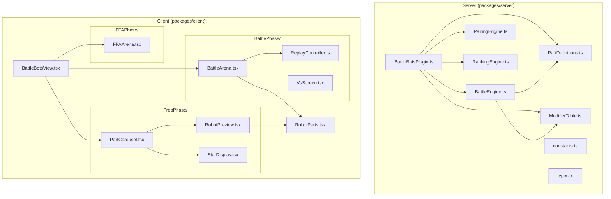

# Design Document: Battle Bots Combat Overhaul

## Overview

This design replaces the existing flat-stat combat system with a composable part-based build system, tick-interval scheduling, simultaneous snapshot resolution, and pre-computed simulation with client-side replay. The 3-round game structure (Prep → 1v1 → FFA) is preserved; what changes is how robots are built, how stats are derived, and how battles are computed and displayed.

**Key Design Decisions:**

1. **Star Budget over flat stats** — Instead of server-configurable HP/accuracy/damage values, robots derive stats from 9 stars distributed by part selection. This creates meaningful tradeoffs without host-side complexity.
2. **Tick-interval scheduling over sequential turns** — Speed stat determines attack frequency (ticks between attacks) rather than turn order, making all three stats affect combat pacing differently.
3. **Snapshot simultaneous resolution** — All attacks within a tick resolve against pre-tick HP, eliminating first-mover advantage and creating dramatic mutual-elimination moments.
4. **Guaranteed Survivor Rule over tiebreakers** — Instead of post-battle tiebreaker rolls, the engine prevents total-elimination ticks by immunizing one random robot, always producing a clear winner.
5. **Pre-computed simulation** — The full battle is computed synchronously at round start and broadcast as a complete Tick_Log. The client replays it at configurable speed. This ensures determinism and allows reconnect resume.
6. **Carousel part selector over card picker** — Players build robots by cycling through parts with immediate visual/stat feedback rather than choosing from 3 pre-generated options.

## Architecture



**Data Flow:**

1. **Prep Phase:** Client sends `{ weapon, head, body }` → Plugin validates parts → assigns name → stores Build
2. **Battle Phase:** Plugin calls `BattleEngine.simulate1v1(build1, build2)` → produces `TickLog` → broadcasts to clients
3. **Client Replay:** Client receives full `TickLog` → `ReplayController` ticks through events at `GAME_SPEED` interval → updates HP bars and displays attack events
4. **FFA Phase:** Same pattern — `BattleEngine.simulateFFA(builds[])` → `TickLog` → broadcast → client replay

## Components and Interfaces

### Server Components

#### PartDefinitions (`packages/server/src/games/battle-bots/PartDefinitions.ts`)

Constant module defining all parts and their star contributions.

```typescript
export interface StarContribution {
  damage: number   // 0-3
  accuracy: number // 0-3
  speed: number    // 0-3
}

export interface PartDefinition {
  id: string
  name: string
  stars: StarContribution
}

export const WEAPON_PARTS: Record<WeaponType, PartDefinition>
export const HEAD_PARTS: Record<HeadType, PartDefinition>
export const BODY_PARTS: Record<BodyType, PartDefinition>

/** Validates a build's star budget (must sum to 9, each stat 1-7) */
export function validateBuild(weapon: WeaponType, head: HeadType, body: BodyType): 
  { valid: true; stars: { damage: number; accuracy: number; speed: number } } | 
  { valid: false; reason: string }

/** Computes combined star distribution from three parts */
export function computeStars(weapon: WeaponType, head: HeadType, body: BodyType): 
  { damage: number; accuracy: number; speed: number }
```

#### ModifierTable (`packages/server/src/games/battle-bots/ModifierTable.ts`)

Maps star counts (1-7) to combat multipliers.

```typescript
export interface ModifierEntry {
  damageMultiplier: number    // applied to BASE_MAX_HIT
  accuracyMultiplier: number  // applied to BASE_ACCURACY, result capped at 90
  ticksPerAttack: number      // tick interval between attacks
}

export const MODIFIER_TABLE: Record<number, ModifierEntry>

// Combat base constants
export const BASE_HP = 100
export const BASE_MAX_HIT: number     // tuned for ~200 tick mean fight duration
export const BASE_ACCURACY: number    // tuned so 7 stars caps near 90%

/** Derives final combat stats from star distribution */
export function deriveCombatStats(stars: { damage: number; accuracy: number; speed: number }): {
  maxHit: number        // floor(BASE_MAX_HIT * damageMultiplier), min 1
  accuracy: number      // min(floor(BASE_ACCURACY * accuracyMultiplier), 90)
  tickInterval: number  // ticksPerAttack from table
  hp: number            // BASE_HP (constant for all robots)
}
```

#### BattleEngine (`packages/server/src/games/battle-bots/simulation/BattleEngine.ts`)

Complete rewrite of the simulation engine.

```typescript
export interface CombatRobot {
  ownerId: string
  name: string
  maxHit: number
  accuracy: number
  tickInterval: number
  currentHp: number
  maxHp: number
  stars: { damage: number; accuracy: number; speed: number }
  visual: RobotVisual
}

export interface TickEntry {
  tick: number
  attacks: AttackEvent[]
  eliminations: string[]  // ownerIds eliminated this tick
}

export interface AttackEvent {
  attackerId: string
  targetId: string
  hit: boolean
  damage: number
  targetHpAfter: number
}

export interface BattleResult {
  winnerId: string
  tickLog: TickEntry[]
}

export interface FFAResult {
  eliminationOrder: Array<{ ownerId: string; eliminatedOnTick: number }>
  survivorId: string
  tickLog: TickEntry[]
}

/** Simulate a 1v1 battle using snapshot model + guaranteed survivor rule */
export function simulate1v1(robot1: CombatRobot, robot2: CombatRobot): BattleResult

/** Simulate FFA within a bracket using snapshot model + guaranteed survivor rule */
export function simulateFFA(robots: CombatRobot[]): FFAResult
```

**Simulation Algorithm (per tick):**

1. Capture snapshot: record each living robot's HP at tick start
2. Determine attackers: robots where `tick % tickInterval === 0` and snapshot HP > 0
3. For each attacker: roll accuracy, if hit roll damage (1 to maxHit), record attack event targeting a random living opponent (FFA) or the sole opponent (1v1)
4. Sum damage per target from all attacks this tick
5. Apply damage to get tentative new HP values
6. **Guaranteed Survivor Check:** if ALL robots with snapshot HP > 0 would reach HP ≤ 0, pick one at random and negate all damage to it for this tick
7. Finalize HP values, mark eliminations
8. If one robot remains or tick reaches 1000: end simulation

#### Updated Constants (`packages/server/src/games/battle-bots/constants.ts`)

```typescript
export const BATTLE_BOTS = {
  PICK_WINDOW_MS: 60_000,
  ROUND_COUNT: 3,
  CHIPS_MULTIPLIER: 10,
  TICK_LIMIT: 1000,
  VS_SCREEN_DURATION_MS: 4000,
} as const

export const BATTLE_BOTS_SETTINGS_SCHEMA: SettingsSchema = [
  { key: "PREP_TIMER_MS", label: "Prep timer (seconds)", type: "number", defaultValue: 60, constraints: { min: 10, max: 300, step: 5 } },
  { key: "CHIPS_MULTIPLIER", label: "Chips multiplier", type: "number", defaultValue: 10, constraints: { min: 1, max: 100, step: 1 } },
  { key: "GAME_SPEED", label: "Game speed (ms per tick)", type: "number", defaultValue: 100, constraints: { min: 50, max: 250, step: 10 } },
]
```

#### Updated BattleBotsPlugin

Changes to `resolveRound`:
- **Round 1:** Receives `{ weapon: WeaponType, head: HeadType, body: BodyType }` picks instead of `{ robotTemplateId }`. Validates via `validateBuild()`, assigns robot name, computes stars, derives combat stats.
- **Round 2:** Constructs `CombatRobot` instances, calls `simulate1v1()`, stores tick log in game state, broadcasts full tick log to clients.
- **Round 3:** Same pattern with `simulateFFA()`.

The `validatePick` function changes to validate the three-part structure:

```typescript
validatePick(pick: unknown): pick is BattleBotsPick {
  if (!pick || typeof pick !== "object") return false
  const p = pick as Record<string, unknown>
  return (
    typeof p.weapon === "string" && VALID_WEAPONS.includes(p.weapon) &&
    typeof p.head === "string" && VALID_HEADS.includes(p.head) &&
    typeof p.body === "string" && VALID_BODIES.includes(p.body)
  )
}
```

### Client Components

#### PartCarousel (`packages/client/src/games/battle-bots/PrepPhase/PartCarousel.tsx`)

Replaces `RobotSelector`. Three horizontal carousel rows (weapon, head, body) with left/right arrows.

```typescript
interface PartCarouselProps {
  pickDeadlineMs: number | null
}

// Internal state:
// - selectedWeapon: WeaponType (default: first option "drill")
// - selectedHead: HeadType (default: first option "square")  
// - selectedBody: BodyType (default: first option "square")
// - locked: boolean
```

Features:
- Left/right arrows wrap around (last → first, first → last)
- "Randomize" button picks one random option per slot
- "Lock In" button submits `{ weapon, head, body }` to server
- Star totals shown as 3 rows: ⚔️ Damage: X, 🎯 Accuracy: Y, ⚡ Speed: Z
- Robot preview updates immediately on any part change using `CompositeRobot`
- Countdown timer carried over from existing design

#### ReplayController (`packages/client/src/games/battle-bots/BattlePhase/ReplayController.ts`)

Manages client-side tick playback.

```typescript
interface ReplayState {
  tickLog: TickEntry[]
  currentTickIndex: number
  gameSpeed: number        // ms per tick
  isPlaying: boolean
  isComplete: boolean
}

// Exposes:
// - start(tickLog, gameSpeed): begin playback
// - getCurrentState(): current HP values for all robots at this tick
// - onTick(callback): register tick listener for UI updates
// - jumpToTick(index): for reconnect resume
```

Uses `setInterval` at `gameSpeed` ms to advance through ticks. Each tick update fires a callback that the Arena components use to update HP bars and show attack events.

#### VsScreen (`packages/client/src/games/battle-bots/BattlePhase/VsScreen.tsx`)

Pre-combat reveal shown for ~4 seconds before replay begins.

```typescript
interface VsScreenProps {
  robots: Array<{
    name: string
    ownerName: string
    visual: RobotVisualConfig
    stars: { damage: number; accuracy: number; speed: number }
    isCurrentPlayer: boolean
  }>
  mode: "1v1" | "ffa"
  onComplete: () => void  // called after duration expires
}
```

#### Updated BattleArena

The existing `BattleArena` component is updated to:
- Accept `CombatRobot` data (with visual config and stars) instead of flat HP-only data
- Render `CompositeRobot` SVG instead of placeholder robot icon
- Show star values beneath each robot
- Display robot name + owner name in "RobotName - PlayerName" format
- Receive tick updates from `ReplayController` instead of WebSocket

## Data Models

### Updated Types (`packages/server/src/games/battle-bots/types.ts`)

```typescript
/** Player's build pick submitted during prep phase */
export interface BattleBotsPick {
  weapon: WeaponType   // "drill" | "blaster" | "bazooka"
  head: HeadType       // "square" | "rounded" | "triangular" | "hexagonal"
  body: BodyType       // "square" | "rounded" | "triangular" | "hexagonal"
}

/** A robot's complete combat-ready state */
export interface CombatRobot {
  ownerId: string
  name: string
  maxHit: number
  accuracy: number       // capped at 90
  tickInterval: number
  currentHp: number
  maxHp: number          // always BASE_HP (100)
  stars: { damage: number; accuracy: number; speed: number }
  visual: RobotVisual
}

/** A single tick in the battle log */
export interface TickEntry {
  tick: number
  attacks: AttackEvent[]
  eliminations: string[]  // ownerIds eliminated this tick
}

/** An individual attack event within a tick */
export interface AttackEvent {
  attackerId: string
  targetId: string
  hit: boolean
  damage: number          // 0 if miss
  targetHpAfter: number   // HP after damage (minimum 0)
}

/** Complete tick log payload sent to clients */
export interface TickLogPayload {
  battleId: string
  robots: Array<{
    ownerId: string
    name: string
    stars: { damage: number; accuracy: number; speed: number }
    visual: RobotVisual
    maxHp: number
  }>
  tickLog: TickEntry[]
  gameSpeed: number       // ms per tick for client playback
}

/** Updated game state */
export interface BattleBotsGameState {
  participants: string[]
  botPersonas: BotPersona[]
  builds: Record<string, CombatRobot>   // replaces selectedRobots
  pairings: BattlePairing[]
  winnersBracket: FFABracketState | null
  losersBracket: FFABracketState | null
  finalRankings: FinalRanking[]
}

/** Updated battle pairing */
export interface BattlePairing {
  id: string
  player1Id: string
  player2Id: string
  winnerId: string | null
  tickLog: TickEntry[]
}

/** FFA bracket state */
export interface FFABracketState {
  id: string              // "winners" | "losers"
  participantIds: string[]
  eliminationOrder: Array<{ ownerId: string; eliminatedOnTick: number }>
  survivorId: string | null
  tickLog: TickEntry[]
}
```

### Modifier Table Shape

```typescript
// Star count → combat modifiers
// Tuned via simulation to achieve 48-52% win rate for all 48 builds
export const MODIFIER_TABLE: Record<number, ModifierEntry> = {
  1: { damageMultiplier: 0.4, accuracyMultiplier: 0.4, ticksPerAttack: 8 },
  2: { damageMultiplier: 0.6, accuracyMultiplier: 0.6, ticksPerAttack: 6 },
  3: { damageMultiplier: 0.8, accuracyMultiplier: 0.8, ticksPerAttack: 5 },
  4: { damageMultiplier: 1.0, accuracyMultiplier: 1.0, ticksPerAttack: 4 },
  5: { damageMultiplier: 1.3, accuracyMultiplier: 1.2, ticksPerAttack: 3 },
  6: { damageMultiplier: 1.7, accuracyMultiplier: 1.4, ticksPerAttack: 2 },
  7: { damageMultiplier: 2.2, accuracyMultiplier: 1.6, ticksPerAttack: 1 },
}
// Note: Higher damage multipliers at 6-7 include overkill budget buff per Req 3.8
// BASE_MAX_HIT and BASE_ACCURACY to be finalized via simulation
```

### Part Definitions Shape

```typescript
export const WEAPON_PARTS = {
  drill:   { id: "drill",   name: "Drill",   stars: { damage: 1, accuracy: 0, speed: 2 } },
  blaster: { id: "blaster", name: "Blaster", stars: { damage: 1, accuracy: 2, speed: 0 } },
  bazooka: { id: "bazooka", name: "Bazooka", stars: { damage: 3, accuracy: 0, speed: 0 } },
}

export const HEAD_PARTS = {
  square:     { id: "square",     name: "Square",     stars: { damage: 1, accuracy: 1, speed: 1 } },
  rounded:    { id: "rounded",    name: "Rounded",    stars: { damage: 0, accuracy: 1, speed: 2 } },
  triangular: { id: "triangular", name: "Triangular", stars: { damage: 0, accuracy: 3, speed: 0 } },
  hexagonal:  { id: "hexagonal",  name: "Hexagonal",  stars: { damage: 2, accuracy: 1, speed: 0 } },
}

export const BODY_PARTS = {
  square:     { id: "square",     name: "Square",     stars: { damage: 1, accuracy: 1, speed: 1 } },
  rounded:    { id: "rounded",    name: "Rounded",    stars: { damage: 0, accuracy: 0, speed: 3 } },
  triangular: { id: "triangular", name: "Triangular", stars: { damage: 0, accuracy: 2, speed: 1 } },
  hexagonal:  { id: "hexagonal",  name: "Hexagonal",  stars: { damage: 2, accuracy: 0, speed: 1 } },
}
```


## Correctness Properties

*A property is a characteristic or behavior that should hold true across all valid executions of a system—essentially, a formal statement about what the system should do. Properties serve as the bridge between human-readable specifications and machine-verifiable correctness guarantees.*

### Property 1: Star Budget Invariant

*For any* valid combination of one Weapon_Part, one Head_Part, and one Body_Part, the sum of all star contributions (damage + accuracy + speed) from all three parts SHALL equal exactly 9.

**Validates: Requirements 1.1, 1.2**

### Property 2: Part Constraint Invariant

*For any* part definition (weapon, head, or body), its star contributions SHALL sum to exactly 3, each individual contribution SHALL be a whole number in [0, 3], and the type-specific minimum SHALL be met (weapon: damage ≥ 1, head: accuracy ≥ 1, body: speed ≥ 1).

**Validates: Requirements 1.3, 1.4, 1.5, 1.6**

### Property 3: Stat Range Invariant

*For any* valid Build (any weapon + head + body combination), each individual stat (damage, accuracy, speed) SHALL be in the range [1, 7].

**Validates: Requirements 1.7**


### Property 4: Stat Derivation Correctness

*For any* star distribution where damage, accuracy, and speed are each in [1, 7], `deriveCombatStats` SHALL produce: maxHit = max(1, floor(BASE_MAX_HIT × MODIFIER_TABLE[damage].damageMultiplier)), accuracy = min(floor(BASE_ACCURACY × MODIFIER_TABLE[accuracy].accuracyMultiplier), 90), and tickInterval = MODIFIER_TABLE[speed].ticksPerAttack. All results SHALL be positive integers.

**Validates: Requirements 3.3, 3.4, 3.5, 3.6, 5.5, 12.2, 12.4**

### Property 5: Attack Scheduling Correctness

*For any* tick T in a simulation and any robot R, robot R produces an attack on tick T if and only if (T % R.tickInterval === 0) AND R's HP at the start of tick T is greater than 0.

**Validates: Requirements 4.1, 4.4, 4.5**

### Property 6: Snapshot Resolution

*For any* tick in a simulation where multiple attacks occur, all `targetHpAfter` values in that tick's attack events SHALL be computed against the HP snapshot captured at the start of the tick (pre-tick HP minus only the individual attack's damage), NOT against cumulatively-damaged HP values.

**Validates: Requirements 4.2, 4.3**

### Property 7: Hit Determination and Damage Bounds

*For any* attack event in a simulation: if `hit` is true then `damage` SHALL be an integer in [1, attacker.maxHit], and if `hit` is false then `damage` SHALL be 0. For all attack events, `targetHpAfter` SHALL be a non-negative integer.

**Validates: Requirements 5.2, 5.3, 5.4, 5.6, 12.2**


### Property 8: Guaranteed Survivor

*For any* tick in any simulation (1v1 or FFA), it SHALL never be the case that all robots with pre-tick HP > 0 end the tick with HP ≤ 0. At least one robot SHALL survive every tick until only one robot remains.

**Validates: Requirements 6.1, 6.2, 6.3, 6.5**

### Property 9: FFA Target Validity

*For any* attack event in any FFA simulation tick, the targetId SHALL refer to a robot whose HP was > 0 at the start of that tick, and targetId SHALL NOT equal attackerId.

**Validates: Requirements 8.1, 8.3**

### Property 10: Carousel Index Wrapping

*For any* carousel slot with N options and current index I, navigating right SHALL produce index (I + 1) % N, and navigating left SHALL produce index (I - 1 + N) % N.

**Validates: Requirements 9.2**

### Property 11: Tick Sequence Integrity

*For any* TickLog produced by the Combat_Engine, the tick numbers SHALL form a contiguous sequence starting at 1 and incrementing by 1 with no gaps.

**Validates: Requirements 14.1**

### Property 12: Tick Log Serialization Round Trip

*For any* valid TickLog produced by the Combat_Engine, serializing to JSON and then deserializing SHALL produce a deeply-equal data structure.

**Validates: Requirements 14.4**


### Property 13: Elimination Event Consistency

*For any* FFA TickLog, a robot SHALL appear in a tick's `eliminations` array if and only if its HP reached 0 on that tick (after damage application and GSR), and each eliminated robot SHALL appear in exactly one tick's eliminations array.

**Validates: Requirements 14.5**

### Property 14: FFA Ranking Correctness

*For any* FFA result, rankings SHALL satisfy: (a) the survivor has rank 1, (b) robots eliminated on later ticks have higher rank (lower number) than robots eliminated on earlier ticks, and (c) robots eliminated on the same tick share the same rank.

**Validates: Requirements 17.1, 17.2, 17.3**

### Property 15: Bracket Position Mapping

*For any* final rankings with N total participants, all winners bracket entries SHALL have rank ≤ N/2 and all losers bracket entries SHALL have rank > N/2.

**Validates: Requirements 17.4**

### Property 16: Tick Entry Completeness

*For any* TickEntry in any produced TickLog, it SHALL contain a positive integer tick number and an array of AttackEvents where each event includes attackerId (string), targetId (string), hit (boolean), damage (non-negative integer), and targetHpAfter (non-negative integer).

**Validates: Requirements 7.4, 14.2**

## Error Handling

### Server-Side Errors

| Error Condition | Handling |
|---|---|
| Invalid build submission (stars don't sum to 9) | Reject pick, return validation error to client; treat as "no pick" for deadline fallback |
| Invalid part type in pick | `validatePick` returns false; player gets random build at deadline |
| Player disconnects during prep | Timer expiry auto-assigns random build |
| Simulation exceeds 1000 ticks | Terminate, select highest-HP robot as winner |
| Bot persona can't be created (odd count) | Should never fail (deterministic); log error and proceed with uneven count |
| TickLog serialization failure | Log error, re-run simulation (deterministic with same seed) |

### Client-Side Errors

| Error Condition | Handling |
|---|---|
| Lock-in network failure | Re-enable carousel controls, show error toast |
| TickLog not received (disconnect) | On reconnect, server re-sends full TickLog + current tick index |
| TickLog corrupt/incomplete | Show fallback "battle complete" state with winner only |
| Replay timer drift | Use requestAnimationFrame with timestamp tracking to correct drift |
| Missing robot visual config | Fall back to default "square/square/drill" visual |

### Validation Pipeline

1. **Client-side** — Carousel enforces valid part selections; no invalid combinations possible through UI
2. **Server-side `validatePick`** — Structural check: weapon ∈ valid weapons, head ∈ valid heads, body ∈ valid bodies
3. **Server-side `validateBuild`** — Star budget check: sum = 9, each stat in [1, 7]. This should always pass for valid parts but guards against data corruption.

## Testing Strategy

### Property-Based Tests (fast-check + vitest)

The following property-based tests map directly to the Correctness Properties above. Each test uses minimum 100 iterations.

| Property | Test Description | Generator Strategy |
|---|---|---|
| 1: Star Budget | Generate random (weapon, head, body) tuples | `fc.constantFrom(...weapons)` × `fc.constantFrom(...heads)` × `fc.constantFrom(...bodies)` |
| 2: Part Constraints | Generate all part definitions | Enumerate all parts (3 + 4 + 4 = 11) |
| 3: Stat Range | Generate random builds | Same as Property 1 |
| 4: Stat Derivation | Generate star distributions in [1,7] each summing to 9 | `fc.integer({min:1,max:7})` × 3 filtered to sum=9 |
| 5: Attack Scheduling | Generate random CombatRobot pairs + tick sequences | Random combat stats + `fc.integer({min:1,max:200})` for tick |
| 6: Snapshot Resolution | Run simulate1v1 with known configs, inspect tick log | Generate robots with specific tick intervals to force concurrent attacks |
| 7: Hit/Damage Bounds | Run simulations, inspect all attack events | Random builds → simulate → inspect all events |
| 8: Guaranteed Survivor | Run simulations with high-damage configs to force mutual KO | Builds with max damage/accuracy to create high-lethality scenarios |
| 9: FFA Target Validity | Run simulateFFA, inspect attack events | 3-6 random robots, verify target validity per tick |
| 10: Carousel Wrapping | Generate (N options, current index, direction) | `fc.integer` for N (3/4), index, and boolean for direction |
| 11: Tick Sequence | Run simulations, verify tick numbering | Random builds → simulate → check tick numbers |
| 12: Round Trip | Generate TickLogs from simulations, serialize/deserialize | Random builds → simulate → JSON round-trip |
| 13: Elimination Consistency | Run FFA simulations, cross-reference | Random FFA robots → simulate → verify |
| 14: FFA Ranking | Run FFA simulations, verify ranking rules | Random FFA brackets → simulate → check ranking order |
| 15: Bracket Position | Generate full game flows, verify final positions | Random N participants, run through full 3-round pipeline |
| 16: Tick Entry Completeness | Run simulations, validate schema | Random builds → simulate → schema check |

**PBT Library:** `fast-check` (already in devDependencies)
**Minimum iterations:** 100 per property
**Tag format:** `Feature: battle-bots-combat-overhaul, Property {N}: {title}`

### Unit Tests (vitest)

- **Part definitions**: Verify each of the 11 concrete mappings from Requirement 2
- **Modifier table structure**: Verify entries exist for 1-7 with valid values
- **Settings schema**: Verify exactly 3 fields, old fields removed
- **Build validation edge cases**: Invalid weapon type, missing fields
- **Simulation termination**: 1000-tick timeout produces winner
- **Bot persona behavior**: Auto-selects valid random build
- **ReplayController**: Advances ticks at correct interval
- **VsScreen**: Shows for correct duration, transitions automatically

### Integration Tests

- **Full game flow**: Prep → 1v1 → FFA → Rankings with 4-6 players
- **Reconnect during replay**: Verify TickLog + tick index re-sent
- **Balance simulation**: Run all 48 builds, verify 48-52% win rates (Monte Carlo)
- **Broadcast determinism**: Multiple clients receive identical TickLog bytes
