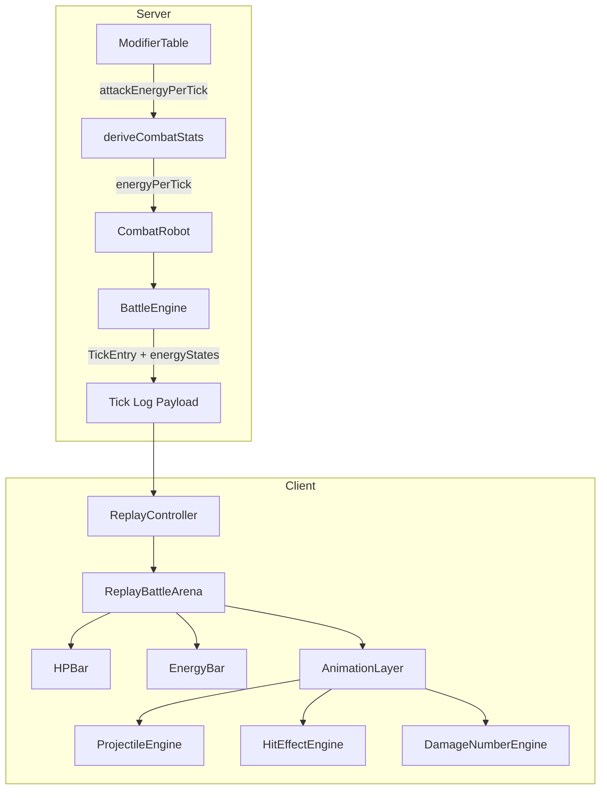
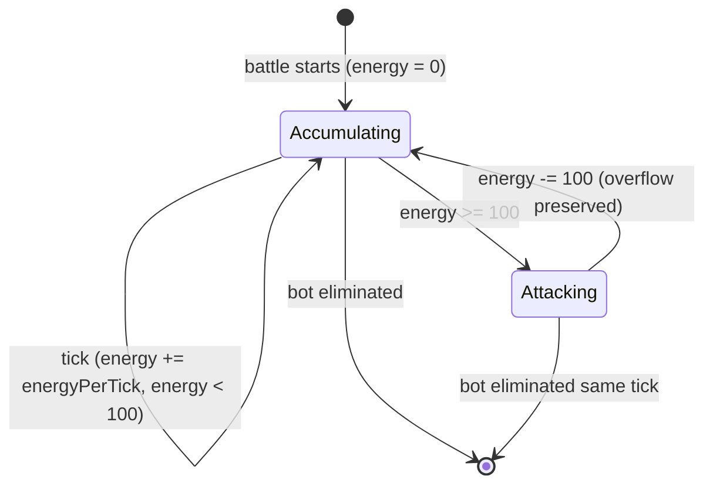

# Design Document: Battle Bots Energy Meter

## Overview

This design replaces the discrete `tick % tickInterval === 0` attack scheduling in Battle Bots with a continuous energy accumulation system. Each bot gains `energyPerTick` energy every tick; when the accumulator reaches ≥100, an attack fires and the bot keeps its overflow. This produces smooth, fractional attack-rate scaling across all 7 speed tiers instead of the current discrete jumps (attacking every 8, 6, 5, 4, 3, 2, or 1 ticks).

The change touches four layers:
1. **Data model** — `ModifierEntry`, `CombatRobot`, `TickEntry` type changes
2. **Simulation engine** — energy-based attack scheduling in `simulate1v1` and `simulateFFAInternal`
3. **Client replay** — new `EnergyBar` component and `energyStates` consumption
4. **Animation** — `ProjectileEngine` replaces `SlideEngine`

Key design decisions:
- Energy is stored as a floating-point number to preserve fractional overflow across cycles
- Overflow is capped at 99 for bots with energyPerTick ≥ 100 to prevent unbounded accumulation
- The existing snapshot-based damage model + GSR remain unchanged
- The projectile animation uses a three-phase approach (exit → delay → travel) to fit within one gameSpeed interval

## Architecture



### Data Flow

1. **Build phase**: Player allocates 9 stars across damage/accuracy/speed (1–7 each)
2. **Stat derivation**: `deriveCombatStats(stars)` reads `MODIFIER_TABLE[stars.speed].attackEnergyPerTick` → returns `energyPerTick`
3. **Simulation**: `BattleEngine` runs tick loop; each tick adds `energyPerTick` to each living bot's `currentEnergy`; bots with `currentEnergy >= 100` attack, then `currentEnergy -= 100` (capped at 99 for ≥100 energyPerTick bots)
4. **Tick log**: Each `TickEntry` includes `energyStates: Record<string, number>` with post-tick energy values for living bots
5. **Client replay**: `ReplayController` emits ticks; `ReplayBattleArena` reads `energyStates` to drive `EnergyBar` fill; `AnimationLayer` triggers `ProjectileEngine` for attack events

## Components and Interfaces

### Server Components

#### ModifierTable (modified)

```typescript
/** A single row in the modifier table for a given star count */
export interface ModifierEntry {
  damageMultiplier: number
  accuracyMultiplier: number
  attackEnergyPerTick: number  // replaces ticksPerAttack
}

export const MODIFIER_TABLE: Record<number, ModifierEntry> = {
  1: { damageMultiplier: 0.4, accuracyMultiplier: 0.4, attackEnergyPerTick: 10.5 },
  2: { damageMultiplier: 0.6, accuracyMultiplier: 0.6, attackEnergyPerTick: 15.0 },
  3: { damageMultiplier: 0.8, accuracyMultiplier: 0.8, attackEnergyPerTick: 20.0 },
  4: { damageMultiplier: 1.0, accuracyMultiplier: 1.0, attackEnergyPerTick: 25.0 },
  5: { damageMultiplier: 1.3, accuracyMultiplier: 1.2, attackEnergyPerTick: 31.5 },
  6: { damageMultiplier: 1.7, accuracyMultiplier: 1.4, attackEnergyPerTick: 37.0 },
  7: { damageMultiplier: 2.2, accuracyMultiplier: 1.6, attackEnergyPerTick: 44.2 },
}
```

Design rationale for initial energy values:
- Star 1 (10.5): attacks roughly every 9.5 ticks — slowest tier, down from every 8
- Star 4 (25.0): attacks every 4 ticks — reference tier, matches current behavior
- Star 7 (44.2): attacks roughly every 2.26 ticks — fast but not every tick
- The old star 7 attacked every single tick; now it takes ~2.26 ticks, allowing the tuning script to find a balanced set

#### deriveCombatStats (modified)

```typescript
export function deriveCombatStats(stars: {
  damage: number
  accuracy: number
  speed: number
}): {
  maxHit: number
  accuracy: number
  energyPerTick: number  // replaces tickInterval
  hp: number
} {
  const damageEntry = MODIFIER_TABLE[stars.damage]
  const accuracyEntry = MODIFIER_TABLE[stars.accuracy]
  const speedEntry = MODIFIER_TABLE[stars.speed]

  const rawMaxHit = Math.floor(BASE_MAX_HIT * damageEntry.damageMultiplier)
  const maxHit = Math.max(1, rawMaxHit)

  const rawAccuracy = Math.floor(BASE_ACCURACY * accuracyEntry.accuracyMultiplier)
  const accuracy = Math.min(rawAccuracy, 90)

  const energyPerTick = speedEntry.attackEnergyPerTick

  return { maxHit, accuracy, energyPerTick, hp: BASE_HP }
}
```

#### CombatRobot (modified)

```typescript
export interface CombatRobot {
  ownerId: string
  name: string
  maxHit: number
  accuracy: number
  energyPerTick: number   // replaces tickInterval
  currentEnergy: number   // new: energy accumulator, starts at 0
  currentHp: number
  maxHp: number
  stars: { damage: number; accuracy: number; speed: number }
  visual: RobotVisual
}
```

#### TickEntry (extended)

```typescript
export interface TickEntry {
  tick: number
  attacks: AttackEvent[]
  eliminations: string[]
  energyStates: Record<string, number>  // new: ownerId → energy after tick
}
```

#### BattleEngine — Energy-based attack loop

The core tick loop changes from modulo check to energy accumulation:

```typescript
// Inside the tick loop (both simulate1v1 and simulateFFAInternal):

// Step 2: Accumulate energy for all living bots
for (const robot of robots) {
  if (snapshot[robot.ownerId] > 0) {
    energy[robot.ownerId] += robot.energyPerTick
  }
}

// Step 3: Determine attackers — any bot with energy >= 100
const attackers = robots.filter(
  (r) => snapshot[r.ownerId] > 0 && energy[r.ownerId] >= 100
)

// After attack processing:
// Step: Subtract 100 from each attacker's energy (preserve overflow)
for (const attacker of attackers) {
  energy[attacker.ownerId] -= 100
  // Cap at 99 for bots with energyPerTick >= 100
  if (attacker.energyPerTick >= 100) {
    energy[attacker.ownerId] = Math.min(energy[attacker.ownerId], 99)
  }
}

// Record energy states for living bots at end of tick
const energyStates: Record<string, number> = {}
for (const id of livingIds) {
  if (hp[id] > 0) {
    energyStates[id] = energy[id]
  }
}

tickLog.push({ tick, attacks, eliminations, energyStates })
```

#### Legacy Adapter (modified)

```typescript
function robotInstanceToCombatRobot(robot: RobotInstance): CombatRobot {
  return {
    ownerId: robot.ownerId,
    name: robot.templateId ?? "Robot",
    maxHit: robot.damageMax,
    accuracy: robot.accuracy,
    energyPerTick: 100,    // attacks every tick (legacy behavior)
    currentEnergy: 0,
    currentHp: robot.currentHp,
    maxHp: robot.maxHp,
    stars: { damage: 3, accuracy: 3, speed: 3 },
    visual: {},
  }
}
```

#### Balance Tuning Script

A standalone Node.js script at `packages/server/src/games/battle-bots/scripts/tuneEnergyValues.ts`:

```typescript
interface TuningResult {
  stars: { damage: number; accuracy: number; speed: number }
  winRate: number
  matchesPlayed: number
  inBand: boolean
}

function tuneEnergyValues(): TuningResult[] {
  const reference = buildReferenceBot() // 3-3-3 with deterministic rolls
  const results: TuningResult[] = []

  for (const build of allBuilds()) { // 48 valid star distributions
    let wins = 0
    const TRIALS = 10_000

    for (let i = 0; i < TRIALS; i++) {
      const challenger = buildCombatRobot(build)
      const result = simulate1v1Deterministic(challenger, reference)
      if (result.winnerId === challenger.ownerId) wins++
    }

    const winRate = wins / TRIALS
    results.push({
      stars: build,
      winRate,
      matchesPlayed: TRIALS,
      inBand: winRate >= 0.48 && winRate <= 0.52,
    })
  }

  return results
}
```

The reference bot uses deterministic combat: accuracy always hits, damage = arithmetic mean of (1, maxHit). This isolates speed's effect on win rate.

### Client Components

#### EnergyBar (new)

```typescript
interface EnergyBarProps {
  currentEnergy: number  // 0–99
  maxEnergy: number      // always 100
  gameSpeed: number      // ms — used for transition duration
}

export function EnergyBar({ currentEnergy, maxEnergy, gameSpeed }: EnergyBarProps) {
  const percentage = Math.max(0, Math.min(100, (currentEnergy / maxEnergy) * 100))

  return (
    <div className="w-full">
      <div className="w-full bg-[#0f2d3d] rounded-full h-2.5 overflow-hidden border border-[#2a5a7a]">
        <div
          className="h-full rounded-full"
          style={{
            width: `${percentage}%`,
            backgroundColor: '#4fc3f7',
            transition: `width ${gameSpeed}ms linear`,
          }}
        />
      </div>
    </div>
  )
}
```

Design choices:
- Height 2.5 (h-2.5) — smaller than HPBar (h-4) to establish visual hierarchy
- Blue color (#4fc3f7) differentiates from green/gold/red HP bar
- Linear transition (not ease-out) because energy accumulates at a constant rate
- No numeric label — the bar's position relative to full communicates enough

#### ProjectileEngine (new, replaces SlideEngine)

```typescript
export interface ProjectileConfig {
  mode: '1v1' | 'ffa'
  gameSpeed: number
}

export interface ProjectilePhases {
  exitDurationMs: number    // 30% of gameSpeed
  delayMs: number           // 20% of gameSpeed
  travelDurationMs: number  // 50% of gameSpeed
}

export interface ProjectileDecision {
  shouldAnimate: boolean
  attackerOrigin: { x: number; y: number }  // start of exit phase
  attackerExit: { x: number; y: number }    // end of exit phase (leaves attacker bounds)
  targetEntry: { x: number; y: number }     // start of travel phase (150% away from target)
  targetImpact: { x: number; y: number }    // hit location on target
  phases: ProjectilePhases
  color: string
}

/**
 * Compute phase durations from gameSpeed with fast-speed clamping.
 */
export function computeProjectilePhases(gameSpeed: number): ProjectilePhases {
  const effective = gameSpeed < 150 ? gameSpeed * 0.9 : gameSpeed
  return {
    exitDurationMs: effective * 0.3,
    delayMs: effective * 0.2,
    travelDurationMs: effective * 0.5,
  }
}

/**
 * Compute projectile origin/exit for attacker.
 * 1v1: departs from center-right edge → moves rightward off bounds
 * FFA: departs from bottom center → moves downward off bounds
 */
export function computeAttackerPoints(
  attackerBounds: { x: number; y: number; width: number; height: number },
  mode: '1v1' | 'ffa'
): { origin: { x: number; y: number }; exit: { x: number; y: number } } {
  if (mode === '1v1') {
    const origin = {
      x: attackerBounds.x + attackerBounds.width,
      y: attackerBounds.y + attackerBounds.height / 2,
    }
    const exit = {
      x: origin.x + attackerBounds.width * 0.3,
      y: origin.y,
    }
    return { origin, exit }
  }
  // FFA: bottom center
  const origin = {
    x: attackerBounds.x + attackerBounds.width / 2,
    y: attackerBounds.y + attackerBounds.height,
  }
  const exit = {
    x: origin.x,
    y: origin.y + attackerBounds.height * 0.3,
  }
  return { origin, exit }
}

/**
 * Compute projectile entry point for target (150% away from target bounds).
 * 1v1: enters from left at 150% of target SVG width
 * FFA: enters from above at 150% of target SVG height
 */
export function computeTargetEntry(
  targetBounds: { x: number; y: number; width: number; height: number },
  mode: '1v1' | 'ffa'
): { x: number; y: number } {
  if (mode === '1v1') {
    return {
      x: targetBounds.x - targetBounds.width * 1.5,
      y: targetBounds.y + targetBounds.height / 2,
    }
  }
  return {
    x: targetBounds.x + targetBounds.width / 2,
    y: targetBounds.y - targetBounds.height * 1.5,
  }
}
```

#### AnimationLayer (modified)

The `AnimationLayer` component drops the `SlideEngine` import and `slideEnabled` prop. It now:
1. Receives attack events from `tickEntry`
2. For each attack, calls `ProjectileEngine` to compute phases and positions
3. Renders a `<motion.div>` projectile element animated through three keyframe phases
4. On travel phase completion, triggers the existing `buildHitEffect` and `buildDamageNumber` at the impact location

The projectile element itself is a small colored circle (8px diameter) matching the attacker's assigned color.

#### ReplayBattleArena (modified)

- Adds `energyStates` tracking via `useState<Record<string, number>>`
- Updates energy state from `tickEntry.energyStates` in the tick callback
- Passes `currentEnergy` to each `ReplayRobotFighter` card
- Renders `EnergyBar` below `HPBar` in the same `max-w-[120px] lg:max-w-[160px]` container
- On reconnect, reads `energyStates` from the reconnect tick's `TickEntry` directly (no iteration)

## Data Models

### Modified Types Summary

| Type | Field Change | Before | After |
|------|-------------|--------|-------|
| `ModifierEntry` | `ticksPerAttack` → `attackEnergyPerTick` | `number` (int, 1–8) | `number` (float, 10.5–44.2) |
| `CombatRobot` | `tickInterval` → `energyPerTick` | `number` (int) | `number` (float) |
| `CombatRobot` | new field | — | `currentEnergy: number` |
| `TickEntry` | new field | — | `energyStates: Record<string, number>` |
| `deriveCombatStats` return | `tickInterval` → `energyPerTick` | `number` | `number` |

### Energy State Lifecycle



### Tick Log Wire Format (example)

```json
{
  "tick": 5,
  "attacks": [
    { "attackerId": "p1", "targetId": "p2", "hit": true, "damage": 4, "targetHpAfter": 87 }
  ],
  "eliminations": [],
  "energyStates": { "p1": 25.0, "p2": 52.5 }
}
```


## Correctness Properties

*A property is a characteristic or behavior that should hold true across all valid executions of a system — essentially, a formal statement about what the system should do. Properties serve as the bridge between human-readable specifications and machine-verifiable correctness guarantees.*

### Property 1: Energy accumulation per tick

*For any* living CombatRobot with energyPerTick value E and current energy C, after one tick is processed, the bot's energy accumulator should equal C + E (before attack evaluation).

**Validates: Requirements 1.1, 6.2**

### Property 2: No attack below threshold

*For any* CombatRobot whose energy accumulator is below 100 after accumulation on a given tick, the Battle Engine should produce no attack event for that bot on that tick.

**Validates: Requirements 1.3**

### Property 3: Attack triggers at threshold

*For any* CombatRobot whose energy accumulator reaches or exceeds 100 after accumulation on a given tick, the Battle Engine should produce exactly one attack event for that bot on that tick.

**Validates: Requirements 2.1, 3.3**

### Property 4: Overflow preservation round-trip

*For any* CombatRobot that triggers an attack with pre-attack energy E (where E >= 100), after the attack the bot's energy should equal E - 100, and on the next tick's accumulation the bot should start from that overflow value (preserving fractional precision without rounding).

**Validates: Requirements 2.2, 3.1, 3.2, 1.5**

### Property 5: Overflow cap for high-energy bots

*For any* CombatRobot with energyPerTick >= 100, after triggering an attack the post-subtraction energy should be capped at a maximum of 99 (i.e., min(E - 100, 99)).

**Validates: Requirements 2.4**

### Property 6: Attack mechanics invariants

*For any* attack event produced by the Battle Engine, if the attack is a hit then damage should be in [1, maxHit], if the attack is a miss then damage should be 0, and the accuracy threshold used should never exceed 90. In both hit and miss cases, 100 energy should be subtracted from the attacker.

**Validates: Requirements 2.3, 2.5, 10.4**

### Property 7: Eliminated bot exclusion

*For any* CombatRobot that is eliminated (HP reaches 0) on tick T, that bot should not accumulate energy on any tick T+1, T+2, ..., and should not appear in the energyStates record for tick T or any subsequent tick.

**Validates: Requirements 3.4, 6.5, 9.2**

### Property 8: Multiple simultaneous attackers

*For any* set of CombatRobots where two or more bots cross the 100-energy threshold on the same tick, the Battle Engine should produce attack events for all of them on that tick and subtract 100 from each attacker's energy.

**Validates: Requirements 6.3**

### Property 9: EnergyStates record correctness

*For any* tick in a battle simulation, the energyStates record in the TickEntry should contain exactly the set of living bots (HP > 0 at tick end) as keys, and each value should equal that bot's energy accumulator after accumulation and any attack reset.

**Validates: Requirements 6.4, 9.1**

### Property 10: Guaranteed Survivor Rule with energy system

*For any* tick where all living bots would reach 0 HP from damage dealt, exactly one bot should survive with its pre-tick HP restored (GSR fires), regardless of whether attacks were triggered by energy accumulation.

**Validates: Requirements 10.1**

### Property 11: FFA target self-exclusion

*For any* attack event in a FFA battle, the attacker's ownerId should never equal the target's ownerId, and the target should have had HP > 0 at the start of that tick (per the snapshot).

**Validates: Requirements 10.2**

### Property 12: Tick limit termination

*For any* battle simulation that reaches 1000 ticks without a single survivor, the simulation should terminate at tick 1000, and the winner should be the bot with the highest remaining HP (or a random selection among tied bots).

**Validates: Requirements 10.3**

### Property 13: deriveCombatStats energy mapping

*For any* speed star value S in [1, 7], deriveCombatStats should return an energyPerTick value equal to MODIFIER_TABLE[S].attackEnergyPerTick.

**Validates: Requirements 5.4**

### Property 14: Legacy adapter mapping

*For any* RobotInstance passed to the legacy adapter, the resulting CombatRobot should have energyPerTick = 100 and currentEnergy = 0, ensuring exactly one attack per tick (legacy behavior preserved).

**Validates: Requirements 5.5, 10.5**

### Property 15: EnergyBar fill proportion

*For any* energy value V in [0, 99], the EnergyBar component should render a fill width equal to (V / 100) * 100 percent of the container.

**Validates: Requirements 7.2**

### Property 16: Projectile phase timing invariant

*For any* gameSpeed value G, the total projectile animation duration should equal G (if G >= 150) or G × 0.9 (if G < 150), split as 30% exit, 20% delay, and 50% travel.

**Validates: Requirements 8.2, 8.3, 8.4, 8.7, 8.8**

### Property 17: Projectile origin and entry positions

*For any* attacker bounding box and target bounding box, the projectile should originate at the attacker's center-right edge (1v1) or bottom-center edge (FFA), and the incoming projectile should enter from a distance of 150% of the target's SVG width to the left (1v1) or 150% of height above (FFA).

**Validates: Requirements 8.1, 8.3**

## Error Handling

### Server-Side

| Error Condition | Handling |
|----------------|----------|
| `energyPerTick` is 0 or negative | `deriveCombatStats` should use `Math.max(1, value)` as a floor — but this shouldn't occur since the table is a constant with validated values. Add a runtime assertion in development builds. |
| `currentEnergy` becomes negative | Should never happen mathematically (energy starts at 0, only subtraction is `-100` when energy >= 100). Add a `Math.max(0, energy)` safety clamp after subtraction. |
| Legacy `RobotInstance` with invalid stats | Existing adapter already falls back to safe defaults (maxHit from damageMax, accuracy from instance). New fields `energyPerTick: 100` and `currentEnergy: 0` are constants — no error case. |
| Missing speed star in MODIFIER_TABLE | Stars are constrained to 1–7 by the build system. If somehow out of range, default to star 4 (midpoint) with a console warning. |
| Division by zero in energy calculations | Not possible — energy arithmetic is addition and subtraction only, no division. |

### Client-Side

| Error Condition | Handling |
|----------------|----------|
| `energyStates` missing from TickEntry | Treat as empty object; all EnergyBars retain last known values. This supports backward compatibility with old tick logs that lack the field. |
| Bot ownerId not in `energyStates` | Retain last known energy value (Requirement 7.5). |
| `energyStates` value > 99 | Clamp display to 99% fill. Should not occur with correct engine but prevents visual overflow. |
| Projectile animation target DOM not found | Skip projectile animation for that attack; still trigger hit effect and damage number at estimated position (existing fallback). |
| gameSpeed of 0 | Clamp to minimum 50ms (matches existing settings schema constraint). |

## Testing Strategy

### Property-Based Testing

This feature is well-suited to property-based testing because:
- The energy accumulation logic is a pure state machine with clear input/output behavior
- The projectile timing computations are pure functions
- Universal properties hold across a large input space (all 48 build configurations × arbitrary tick counts × random combat outcomes)

**Library**: [fast-check](https://github.com/dubzzz/fast-check) (already used in the project's test infrastructure)

**Configuration**: Minimum 100 iterations per property test.

**Tag format**: `Feature: battle-bots-energy-meter, Property {N}: {title}`

Each correctness property (1–17) maps to a single property-based test.

### Unit Tests (Example-Based)

| Area | Test Cases |
|------|-----------|
| ModifierTable values | Verify exact initial values (10.5, 15.0, ..., 44.2), monotonicity, and that damageMultiplier/accuracyMultiplier are unchanged |
| EnergyBar rendering | Snapshot test at 0%, 50%, 99% fill; eliminated state styling |
| EnergyBar transition | Verify CSS transition-duration matches gameSpeed prop |
| Projectile hit triggers | Verify hit effect and damage number fire at impact point |
| SlideEngine removal | Verify AnimationLayer no longer uses SlideEngine |
| Reconnect energy init | Verify energy bars initialize from single TickEntry without iterating |

### Integration Tests

| Area | Test Cases |
|------|-----------|
| Full 1v1 simulation | Run a complete 1v1 with known seeds, verify tick log structure includes energyStates on every tick |
| Full FFA simulation | Run a 4-player FFA, verify elimination order and energy exclusion |
| Replay pipeline | Feed a tick log with energyStates into ReplayBattleArena, verify EnergyBar updates each tick |
| Balance tuning script | Run with initial values, verify all 48 builds are evaluated and results reported |

### Test Boundaries

- Energy values near threshold: 99.5 + 0.5 = 100 (should trigger), 99.4 + 0.5 = 99.9 (should not)
- Fractional precision: energyPerTick = 10.5 over 10 ticks = 105 → one attack at tick 10, overflow = 5
- High-energy bots: energyPerTick = 100 → attack every tick, energy always resets to 0 (capped at 99 then next tick adds 100 → attack → cap at 99...)
- Simultaneous elimination: all bots reach 0 HP on same tick → GSR fires
- Tick 1000 timeout: low-damage low-speed bots that can't kill each other
