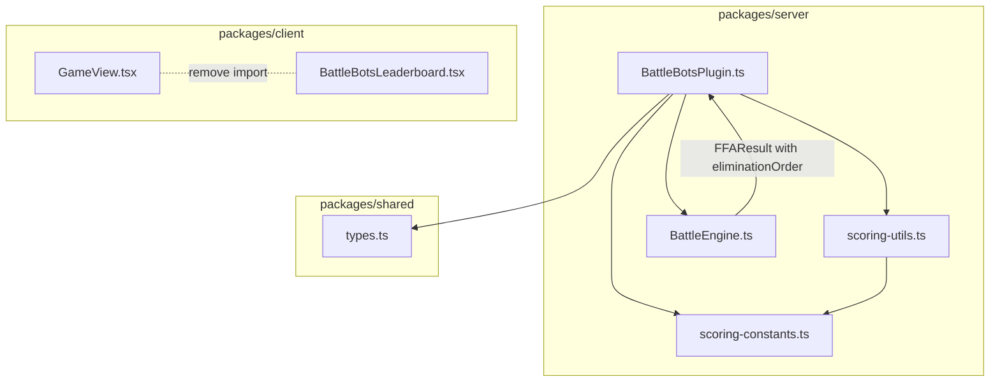

# Design Document: Battle Bots Scoring Refactor

## Overview

This design replaces the existing rank-based scoring in the Battle Bots `scoreRound` method with a survival-tick-based system. The current Round 3 (FFA) scoring uses `(totalParticipants - rank) * 10`, which produces predictable, evenly-spaced scores and frequent ties. The new system awards points based on how long each robot survived in the FFA simulation, producing unique score distributions that reduce ties.

The refactor touches three areas:
1. **Scoring logic** — new formulas in `scoreRound` for Round 2 (1v1 win bonus) and Round 3 (survival-tick scoring)
2. **Constants extraction** — scoring magic numbers moved to a dedicated constants file
3. **Component removal** — the obsolete `BattleBotsLeaderboard` client component is deleted

The Round 2 scoring already awards 25 points to winners (no change needed), so the primary logic change is in Round 3.

## Architecture



**Data Flow for FFA Scoring:**
1. `BattleEngine.simulateFFA()` returns `FFAResult` containing `eliminationOrder: Array<{ ownerId, eliminatedOnTick }>` and `survivorId`
2. `FFABracketState` stores this data in `gameState.winnersBracket` and `gameState.losersBracket`
3. `scoreRound(round: 3)` reads bracket data, computes `Total_Ticks` (the tick of the final elimination), and applies the survival formula to each eliminated player
4. The survivor receives a flat 125 points (100 survival + 25 win bonus)

## Components and Interfaces

### New File: `scoring-constants.ts`

A dedicated constants file holding all tunable scoring values. Located at:
`packages/server/src/games/battle-bots/scoring-constants.ts`

```typescript
/** Flat bonus awarded to the winner of any round */
export const WIN_BONUS = 25

/** Multiplier applied to denominator for eliminated player survival scoring.
 *  Ensures eliminated players can never match the survivor's 100 survival points. */
export const PENALTY_MULTIPLIER = 1.1

/** Maximum survival points awarded to the FFA survivor (flat, no formula) */
export const SURVIVOR_POINTS = 100
```

### Modified: `scoring-utils.ts`

Add a new pure function for computing eliminated player survival points:

```typescript
import { PENALTY_MULTIPLIER, SURVIVOR_POINTS, WIN_BONUS } from "./scoring-constants"

/**
 * Computes survival points for an eliminated FFA player.
 * Formula: ceil(eliminatedTick / (totalTicks * PENALTY_MULTIPLIER) * SURVIVOR_POINTS)
 *
 * @param eliminatedTick - The tick on which the player was eliminated
 * @param totalTicks - The tick on which the final elimination occurred (declaring the survivor)
 * @returns Survival points (integer, max 91 with default constants)
 */
export function computeEliminatedSurvivalPoints(
  eliminatedTick: number,
  totalTicks: number
): number {
  return Math.ceil((eliminatedTick / (totalTicks * PENALTY_MULTIPLIER)) * SURVIVOR_POINTS)
}

/**
 * Computes the total score for the FFA survivor.
 * Flat SURVIVOR_POINTS + WIN_BONUS.
 */
export function computeSurvivorScore(): number {
  return SURVIVOR_POINTS + WIN_BONUS
}
```

### Modified: `BattleBotsPlugin.ts` — `scoreRound` method

**Round 2 (no change needed):** Already awards `25` to winners, `0` to losers. The only change is importing the constant from `scoring-constants.ts` instead of using an inline literal.

**Round 3 (new implementation):**

```typescript
case 3: {
  const deltas: Record<string, number> = {}

  // Process both brackets (winners and losers)
  for (const bracket of [gameState.winnersBracket, gameState.losersBracket]) {
    if (!bracket) continue
    const ffaBracket = bracket as FFABracketState

    // Total_Ticks = tick of the final elimination in this bracket
    const totalTicks = ffaBracket.eliminationOrder.length > 0
      ? ffaBracket.eliminationOrder[ffaBracket.eliminationOrder.length - 1].eliminatedOnTick
      : 0

    // Score eliminated players
    for (const elimination of ffaBracket.eliminationOrder) {
      if (!botPersonaIds.has(elimination.ownerId)) {
        deltas[elimination.ownerId] = computeEliminatedSurvivalPoints(
          elimination.eliminatedOnTick,
          totalTicks
        )
      }
    }

    // Score survivor
    if (ffaBracket.survivorId && !botPersonaIds.has(ffaBracket.survivorId)) {
      deltas[ffaBracket.survivorId] = computeSurvivorScore()
    }
  }

  return { deltas: filterBotPersonasFromDeltas(deltas, botPersonaIds) }
}
```

### Removed: `BattleBotsLeaderboard.tsx`

The file `packages/client/src/games/battle-bots/BattleBotsLeaderboard.tsx` is deleted. Its import and usage in `GameView.tsx` is removed. The `showBattleBotsLeaderboard` variable (already set to `false` with a TODO comment) and associated JSX block are cleaned up.

## Data Models

### FFABracketState (existing, no changes)

```typescript
interface FFABracketState {
  id: string                // "winners" | "losers"
  participantIds: string[]
  eliminationOrder: Array<{ ownerId: string; eliminatedOnTick: number }>
  survivorId: string | null
  tickLog: TickEntry[]
}
```

The `eliminationOrder` array is ordered by elimination time. The final entry's `eliminatedOnTick` value equals `Total_Ticks` for that bracket.

### Scoring Constants (new)

| Constant | Type | Default | Description |
|----------|------|---------|-------------|
| `WIN_BONUS` | number | 25 | Flat points for winning any round |
| `PENALTY_MULTIPLIER` | number | 1.1 | Denominator multiplier for eliminated players |
| `SURVIVOR_POINTS` | number | 100 | Flat survival points for the FFA survivor |

### Score Delta Examples

For a 4-player FFA bracket lasting 50 ticks total:
- Player eliminated on tick 10: `ceil(10 / (50 * 1.1) * 100)` = `ceil(18.18)` = **19 points**
- Player eliminated on tick 30: `ceil(30 / (50 * 1.1) * 100)` = `ceil(54.54)` = **55 points**
- Player eliminated on tick 50: `ceil(50 / (50 * 1.1) * 100)` = `ceil(90.90)` = **91 points**
- Survivor: `100 + 25` = **125 points**

## Correctness Properties

*A property is a characteristic or behavior that should hold true across all valid executions of a system — essentially, a formal statement about what the system should do. Properties serve as the bridge between human-readable specifications and machine-verifiable correctness guarantees.*

### Property 1: 1v1 round winner/loser scoring

*For any* set of 1v1 pairing results with a designated winner, the scoring system SHALL produce a delta of exactly 25 for the winner and exactly 0 for the loser of each pairing.

**Validates: Requirements 1.1, 1.2**

### Property 2: Bot_Persona exclusion from all score deltas

*For any* round result containing Bot_Persona participants (identified by IDs prefixed with "bot_"), the scoring system SHALL never include a Bot_Persona ID as a key in the returned deltas record.

**Validates: Requirements 1.3, 1.4, 2.4, 3.4**

### Property 3: FFA survivor receives fixed 125 points

*For any* FFA bracket result with a non-Bot_Persona survivor, regardless of Total_Ticks or number of participants, the survivor's delta SHALL be exactly `SURVIVOR_POINTS + WIN_BONUS` (125 with default constants).

**Validates: Requirements 2.1, 2.2, 2.3**

### Property 4: FFA eliminated player formula correctness

*For any* valid (eliminatedTick, totalTicks) pair where `1 <= eliminatedTick <= totalTicks` and `totalTicks >= 1`, the function `computeEliminatedSurvivalPoints(eliminatedTick, totalTicks)` SHALL return exactly `Math.ceil((eliminatedTick / (totalTicks * 1.1)) * 100)`.

**Validates: Requirements 3.1, 3.3**

### Property 5: FFA eliminated score ceiling invariant

*For any* valid (eliminatedTick, totalTicks) pair where `1 <= eliminatedTick <= totalTicks`, the result of `computeEliminatedSurvivalPoints` SHALL never exceed 91 (with default PENALTY_MULTIPLIER of 1.1).

**Validates: Requirements 3.2**

### Property 6: New scoring output differs from legacy rank-based formula

*For any* FFA round result with 3 or more non-Bot_Persona participants, the set of score deltas produced by the survival-tick formula SHALL differ from the values that would be produced by the legacy formula `(totalParticipants - rank) * 10` for at least one participant.

**Validates: Requirements 4.1, 4.3**

## Error Handling

| Scenario | Handling |
|----------|----------|
| `totalTicks` is 0 (no eliminations in bracket) | Bracket has only 1 participant — survivor gets 125, no eliminated players to score |
| `eliminatedTick` is 0 | Should not occur (BattleEngine starts at tick 1), but formula returns `ceil(0) = 0` |
| Bracket is null | Skip scoring for that bracket (defensive check already present) |
| Bot_Persona is the survivor | No delta produced; other players still scored normally |
| Single-robot bracket (auto-win, no FFA simulation) | Survivor gets 125 points, no eliminated players |

## Testing Strategy

### Property-Based Tests (fast-check)

The project already uses `fast-check ^3.23.2` with `vitest` for property-based testing. Each correctness property above maps to a property-based test with minimum 100 iterations.

**Test file:** `packages/server/src/games/battle-bots/scoring.prop.test.ts`

**Generators needed:**
- `pairingResultArb` — generates random 1v1 pairing results with winner/loser
- `ffaBracketArb` — generates random `FFABracketState` with valid elimination orders (sorted by tick, 1 <= eliminatedTick <= totalTicks)
- `eliminationParamsArb` — generates random (eliminatedTick, totalTicks) pairs with valid bounds

**Configuration:** Each test runs with `{ numRuns: 200 }` following the project convention.

**Tag format:** Each test includes a comment: `Feature: battle-bots-scoring-refactor, Property N: <property text>`

### Unit Tests (example-based)

**Test file:** `packages/server/src/games/battle-bots/BattleBotsPlugin.scoreRound.test.ts` (update existing)

- Round 1 returns empty deltas (existing, no change)
- Round 2 winners get 25, losers get 0 (existing, adjust assertions)
- Round 3 specific examples with known elimination ticks and expected scores
- Constants file exports expected default values
- Edge case: single-robot bracket (auto-win survivor)

### Integration/Smoke Tests

- `BattleBotsLeaderboard.tsx` no longer exists (file removal verification)
- `GameView.tsx` no longer imports or renders `BattleBotsLeaderboard`
- Scoring constants are imported from the dedicated file (no inline magic numbers)
