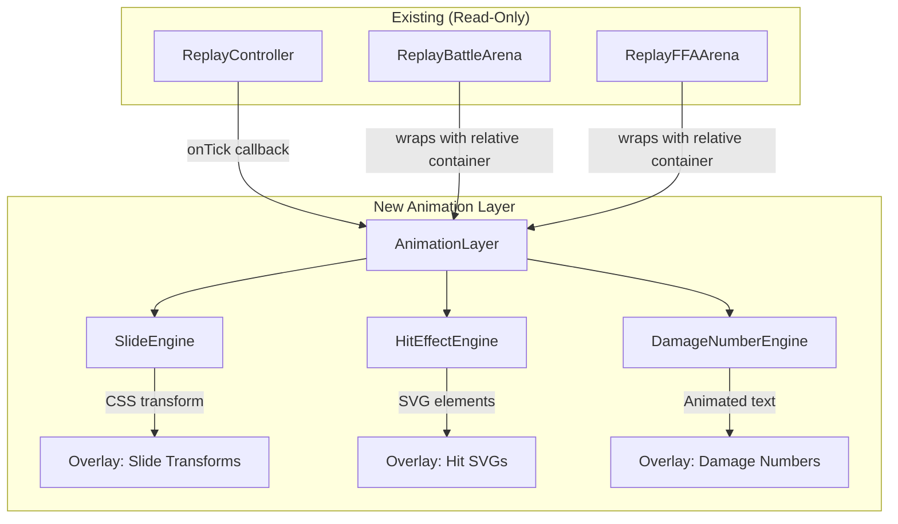

# Design Document: Battle Bots Visual Combat

## Overview

This feature adds a purely cosmetic animation overlay to the existing Battle Bots replay system. The animation layer renders attack slide movements, weapon-specific hit effect SVGs, and floating damage numbers on top of the existing `ReplayBattleArena` (1v1) and `ReplayFFAArena` (FFA) components without modifying any gameplay logic.

The layer subscribes to the same tick stream from `ReplayController` that drives HP bar updates, interprets `AttackEvent` data to produce visual effects, and self-cleans DOM elements after each animation cycle completes.

**Key Design Decisions:**
- Overlay approach using `position: absolute` + `pointer-events: none` to avoid layout interference
- CSS `transform: translateX/Y` for slide animations (GPU-composited, no reflow)
- Pure computational logic separated from rendering for testability
- Probabilistic slide triggering with configurable rate limiting
- `framer-motion` for orchestrating multi-phase animations (already in project dependencies)

## Architecture



The animation layer is composed as a sibling overlay to the existing arena content. Each arena component wraps its content in a `position: relative` container, and the `AnimationLayer` renders its effects in a `position: absolute; inset: 0` overlay div above the arena content.

### Data Flow

1. `ReplayController` fires a tick → existing arena updates HP states
2. `AnimationLayer` receives the same tick via `onTick` subscription
3. For each `AttackEvent` in the tick:
   - `SlideEngine` evaluates whether to trigger a slide for the attacker
   - `HitEffectEngine` resolves weapon type and renders Hit_SVG on target
   - `DamageNumberEngine` renders floating number if `hit === true`
4. All effects self-destruct after their configured duration

## Components and Interfaces

### AnimationLayer (React Component)

The top-level overlay component that coordinates all animation subsystems.

```typescript
interface AnimationLayerProps {
  /** Current tick's attack events */
  tickEntry: TickEntry | null
  /** Map of robot ID → current HP state (read-only) */
  hpStates: Record<string, { currentHp: number; maxHp: number; eliminated: boolean }>
  /** Robot visual configs for weapon type resolution */
  robots: Array<{
    ownerId: string
    visual: { weapon: string; head: string; body: string; color?: string }
  }>
  /** Index-based color assignments */
  robotColors: Record<string, string>
  /** Current game speed in ms */
  gameSpeed: number
  /** Whether replay is actively playing */
  isPlaying: boolean
  /** Whether replay has completed */
  isComplete: boolean
  /** Whether slide animations are enabled (default: true) */
  slideEnabled?: boolean
  /** Layout mode */
  mode: '1v1' | 'ffa'
  /** Refs to robot DOM elements for position calculations */
  robotRefs: Record<string, React.RefObject<HTMLDivElement>>
}
```

### SlideEngine (Pure Logic Module)

Handles the probabilistic triggering and offset calculation for attack slides.

```typescript
interface SlideDecision {
  shouldSlide: boolean
  direction: 'left' | 'right' | 'down'
  offsetPx: number
  durationMs: number
}

interface SlideEngineConfig {
  mode: '1v1' | 'ffa'
  slideEnabled: boolean
  gameSpeed: number
  robotWidth: number // rendered width in px
}

/** Compute slide trigger probability based on attacks per tick */
function computeSlideProbability(attacksInTick: number): number

/** Determine slide direction based on mode and position */
function computeSlideDirection(mode: '1v1' | 'ffa', position: 'left' | 'right'): 'left' | 'right' | 'down'

/** Compute slide offset within bounds */
function computeSlideOffset(robotWidth: number, mode: '1v1' | 'ffa'): number

/** Compute animation duration with clamping */
function computeAnimationDuration(gameSpeed: number): number

/** Full slide decision for a given tick */
function evaluateSlide(
  attackerId: string,
  attacksInTick: number,
  config: SlideEngineConfig,
  isEliminated: boolean,
  position?: 'left' | 'right'
): SlideDecision
```

### HitEffectEngine (Pure Logic + SVG Components)

Resolves weapon types to SVG effects and positions them on targets.

```typescript
type WeaponHitType = 'blaster' | 'bazooka' | 'drill'

interface HitEffect {
  weaponType: WeaponHitType
  color: string
  position: { x: number; y: number }
  opacity: number
  sizePct: number // percentage of target width
  durationMs: number // always 150ms
}

/** Get max size percentage for a weapon type */
function getWeaponSizeLimit(weaponType: WeaponHitType): number

/** Compute randomized position within target bounds */
function computeHitPosition(targetWidth: number, targetHeight: number, index: number): { x: number; y: number }

/** Build a hit effect descriptor from an AttackEvent */
function buildHitEffect(
  event: AttackEvent,
  attackerWeapon: WeaponHitType,
  attackerColor: string,
  targetBounds: { width: number; height: number },
  effectIndex: number
): HitEffect
```

### DamageNumberEngine (Pure Logic Module)

Computes positioning and styling for floating damage numbers.

```typescript
interface DamageNumberEffect {
  value: number
  startPosition: { x: number; y: number }
  color: string // titleText theme token
  durationMs: number
  offsetIndex: number // for stacking multiple numbers
}

/** Compute vertical offset for stacked damage numbers */
function computeDamageNumberOffset(index: number, totalInTick: number): number

/** Build damage number effect from hit event */
function buildDamageNumber(
  event: AttackEvent,
  targetBounds: { width: number; height: number },
  gameSpeed: number,
  stackIndex: number
): DamageNumberEffect | null // null if hit === false
```

### Hit SVG Components

Three weapon-specific SVG components, each accepting `color` and `size` props:

```typescript
interface HitSVGProps {
  color: string
  size: number // px
  opacity: number
}

function BlasterHitSVG(props: HitSVGProps): JSX.Element  // elongated line
function BazookaHitSVG(props: HitSVGProps): JSX.Element  // jagged starburst outline
function DrillHitSVG(props: HitSVGProps): JSX.Element    // drill icon
```

## Data Models

### Animation State (per tick)

```typescript
interface TickAnimationState {
  tickIndex: number
  slides: Map<string, SlideDecision>       // robotId → slide info
  hitEffects: HitEffect[]                   // all hit SVGs for this tick
  damageNumbers: DamageNumberEffect[]       // all floating numbers for this tick
  startTime: number                         // performance.now() when tick started
}
```

### Configuration Constants

```typescript
const ANIMATION_CONSTANTS = {
  /** Average ticks between slides for 1-attack-per-tick robot */
  SLIDE_INTERVAL_TICKS: 3,
  /** Min slide offset as fraction of robot width */
  SLIDE_MIN_OFFSET_PCT: 0.10,
  /** Max slide offset as fraction of robot width */
  SLIDE_MAX_OFFSET_PCT: 0.25,
  /** FFA max slide offset as fraction of cell dimension */
  FFA_MAX_OFFSET_PCT: 0.25,
  /** Hit SVG display duration (fixed, independent of gameSpeed) */
  HIT_SVG_DURATION_MS: 150,
  /** Opacity for miss hit effects */
  MISS_OPACITY: 0.3,
  /** Minimum pixels for damage number float distance */
  DAMAGE_FLOAT_MIN_PX: 30,
  /** Threshold below which animation duration is clamped */
  FAST_SPEED_THRESHOLD_MS: 150,
  /** Clamping factor for fast speeds */
  FAST_SPEED_CLAMP_FACTOR: 0.9,
  /** Max time after animation end to clean up DOM (ms) */
  CLEANUP_DELAY_MS: 500,
  /** Weapon size limits as fraction of target width */
  WEAPON_SIZE_LIMITS: {
    blaster: 0.20,
    bazooka: 0.30,
    drill: 0.20,
  },
} as const
```

### Weapon-to-Size Mapping

| Weapon   | Max Size (% of target width) | Visual Style             |
|----------|------------------------------|--------------------------|
| Blaster  | 20%                          | Elongated line           |
| Bazooka  | 30%                          | Jagged starburst outline |
| Drill    | 20%                          | Drill icon               |

## Correctness Properties

*A property is a characteristic or behavior that should hold true across all valid executions of a system—essentially, a formal statement about what the system should do. Properties serve as the bridge between human-readable specifications and machine-verifiable correctness guarantees.*

### Property 1: Slide trigger probability scales correctly

*For any* positive integer attack count in a tick, the computed slide trigger probability should equal `min(1, attackCount / SLIDE_INTERVAL_TICKS)`, ensuring that a robot attacking once per tick slides on average once every 3 ticks, and robots with higher attack rates slide proportionally more often.

**Validates: Requirements 1.1, 2.1**

### Property 2: Slide direction correctness

*For any* robot in 1v1 mode positioned on the left, the computed slide direction should be 'right' (toward opponent); for any robot positioned on the right, the direction should be 'left'. For any robot in FFA mode, the direction should always be 'down'.

**Validates: Requirements 1.2, 2.2**

### Property 3: Slide offset within configured bounds

*For any* positive robot rendered width in 1v1 mode, the computed slide offset should be between 10% and 25% of that width. For any positive grid cell dimension in FFA mode, the slide offset should be between 0 (exclusive) and 25% of that dimension (inclusive).

**Validates: Requirements 1.3, 2.3**

### Property 4: Eliminated robots produce no animation effects

*For any* robot with `eliminated === true`, regardless of attack count, game speed, weapon type, or mode (1v1/FFA), the animation system should produce no slide animations, no hit effects, and no damage numbers for that robot as attacker, and should not apply slide transforms to that robot.

**Validates: Requirements 1.5, 2.4, 7.3**

### Property 5: Disabled slide flag prevents all slide animations

*For any* tick data containing any number of attacks, if `slideEnabled === false`, the slide engine should produce zero slide animations for all robots, regardless of elimination state or attack count.

**Validates: Requirements 3.1, 3.2**

### Property 6: Weapon type resolution correctness

*For any* AttackEvent with `hit === true` and any robot whose visual weapon field is one of `'blaster' | 'bazooka' | 'drill'`, the hit effect engine should resolve to a Hit_SVG of the matching weapon type.

**Validates: Requirements 4.1**

### Property 7: Hit SVG size within weapon-specific bounds

*For any* weapon type and any positive target robot rendered width, the computed Hit_SVG size should not exceed the weapon's configured maximum percentage of the target width (blaster: 20%, bazooka: 30%, drill: 20%).

**Validates: Requirements 4.2, 4.3, 4.4**

### Property 8: Hit SVG colored with attacker color

*For any* AttackEvent and any attacker color from the ROBOT_COLORS palette, the resulting Hit_SVG effect should have its color field set to that attacker's assigned color.

**Validates: Requirements 4.5**

### Property 9: Hit positions within target bounding box

*For any* positive target bounding box dimensions (width, height) and any number N ≥ 1 of simultaneous attacks on that target, all N computed hit positions should have x ∈ [0, width] and y ∈ [0, height].

**Validates: Requirements 4.6, 4.9**

### Property 10: Miss events produce reduced opacity and no damage number

*For any* AttackEvent with `hit === false`, the produced hit effect should have opacity equal to 0.3, and the damage number engine should produce `null` (no damage number) for that event.

**Validates: Requirements 4.8, 5.4**

### Property 11: Damage number displays correct integer value

*For any* AttackEvent with `hit === true` and any positive integer damage value, the produced damage number effect should have its `value` field equal to the AttackEvent's `damage` field.

**Validates: Requirements 5.1**

### Property 12: Multiple damage numbers non-overlapping

*For any* N ≥ 2 simultaneous hit events on the same target robot, the computed vertical offsets for each damage number should be distinct (no two damage numbers share the same y-offset).

**Validates: Requirements 5.6**

### Property 13: Animation duration computation

*For any* positive gameSpeed value, the computed animation duration should equal `gameSpeed` when `gameSpeed >= 150`, and should equal `0.9 * gameSpeed` when `gameSpeed < 150`. This ensures effects always complete before the next tick fires.

**Validates: Requirements 6.1, 6.3, 6.4**

### Property 14: Paused state prevents all new animations

*For any* tick data, if `isPlaying === false` and `isComplete === false`, the animation layer should produce zero new animation effects (no slides, no hit SVGs, no damage numbers).

**Validates: Requirements 6.5**

## Error Handling

| Scenario | Handling |
|----------|----------|
| Missing robot ref (unmounted before tick) | Skip animation for that robot; no error thrown |
| Unknown weapon type in visual data | Default to 'drill' hit effect |
| Zero or negative gameSpeed | Clamp to minimum 10ms to prevent division by zero or infinite animations |
| AttackEvent references non-existent robotId | Skip effect; log warning in development only |
| Target bounding box has zero dimensions | Skip hit position/damage number for that target |
| Animation cleanup timer fires after component unmount | Use `useEffect` cleanup to cancel pending timeouts |
| Multiple rapid ticks at very fast speeds | Each tick's effects are independent; previous tick effects continue their lifecycle |

## Testing Strategy

### Property-Based Tests (fast-check + Vitest)

The pure logic modules (`SlideEngine`, `HitEffectEngine`, `DamageNumberEngine`) contain all computational logic separated from React rendering. These are ideal candidates for property-based testing.

**Library:** `fast-check` (already in devDependencies)
**Runner:** `vitest`
**Minimum iterations:** 100 per property

Each property test will be tagged with a comment referencing the design property:
```
// Feature: battle-bots-visual-combat, Property N: <property text>
```

**Property tests cover:**
- `computeSlideProbability` — Property 1
- `computeSlideDirection` — Property 2
- `computeSlideOffset` — Property 3
- `evaluateSlide` with eliminated flag — Properties 4, 5
- `buildHitEffect` weapon resolution — Properties 6, 7, 8
- `computeHitPosition` bounds — Property 9
- `buildHitEffect` miss behavior — Property 10
- `buildDamageNumber` value correctness — Property 11
- `computeDamageNumberOffset` distinctness — Property 12
- `computeAnimationDuration` — Property 13
- Guard condition (paused state) — Property 14

### Unit Tests (Example-Based)

- Toggle flag default value (3.1)
- In-progress animation completes when flag disabled (3.3)
- Hit SVG removal after 150ms (4.7)
- Damage number DOM cleanup after fade-out (5.5)
- Overlay uses position absolute and pointer-events: none (7.2, 7.5)
- DOM cleanup within 500ms of animation end (7.6)

### Integration Tests (React Testing Library)

- Full AnimationLayer renders without layout shifts (7.4)
- Overlay elements don't intercept pointer events (7.5)
- Animation layer reads state immutably (7.1)
- Slide animation uses CSS transform only (1.4)

### Visual Regression (Manual / Storybook)

- Hit SVG visual appearance per weapon type
- Damage number float animation smoothness
- Slide animation at various game speeds
- FFA grid animation at 3+ robots
