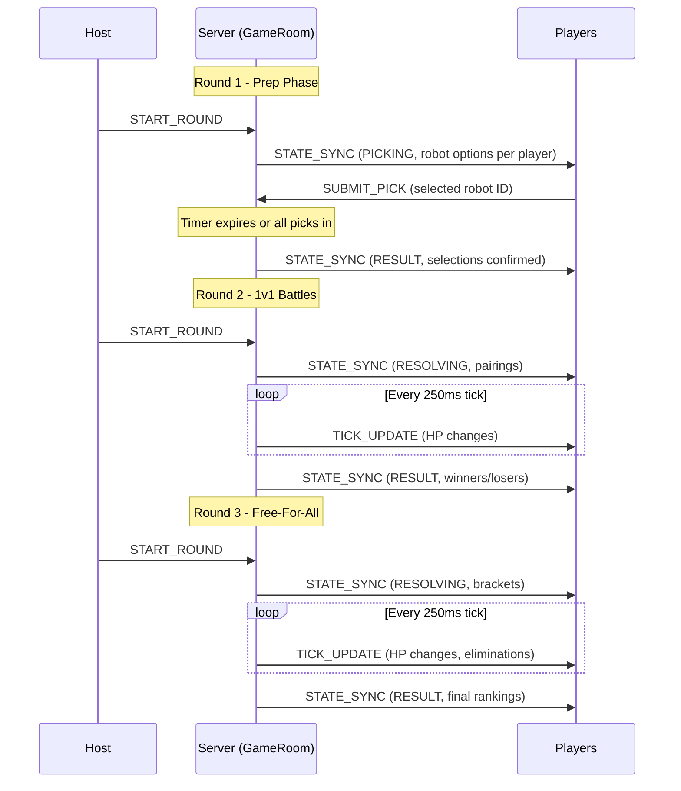

# Design Document: Battle Bots Game Plugin

## Overview

Battle Bots is a 3-round competitive game plugin where players select robot combatants, watch them fight in tick-based 1v1 battles, then compete in bracket-based free-for-all elimination rounds. The plugin implements the existing GamePlugin interface and integrates with the platform's round lifecycle (LOBBY → PICKING → RESOLVING → RESULT) and dual scoring modes.

The game is designed for extensibility — V1 ships with a single robot template (identical stats for all instances) but the data structure supports a collection of uniquely-tuned robots for future versions.

**Key design note (future consideration):** Tie-breaking within brackets is not implemented in V1 (tied eliminations share a rank). A future per-game tiebreaker system may be introduced, where each game type defines its own tiebreaker logic (e.g., extra round for Battle Bots, extra toss for Coin Toss).

---

## Architecture

### File Structure

```
packages/server/src/games/battle-bots/
├── BattleBotsPlugin.ts          # GamePlugin implementation
├── constants.ts                 # All tunable values
├── types.ts                     # Battle Bots specific types
├── simulation/
│   ├── BattleEngine.ts          # Tick-based combat simulation engine
│   ├── PairingEngine.ts         # Random pairing logic
│   └── RankingEngine.ts         # Elimination order → final ranking
└── index.ts                     # Side-effect registration

packages/client/src/games/battle-bots/
├── BattleBotsView.tsx           # Main game container (switches by round)
├── PrepPhase/
│   ├── RobotSelector.tsx        # 3-option robot selection UI
│   └── RobotCard.tsx            # Individual robot option display
├── BattlePhase/
│   ├── BattleArena.tsx          # Primary 1v1 battle display
│   ├── BattleSidebar.tsx        # Other battles HP list
│   └── HPBar.tsx                # Animated HP bar component
├── FFAPhase/
│   ├── FFAArena.tsx             # Primary FFA bracket display
│   └── FFASidebar.tsx           # Other bracket HP list
├── Results/
│   └── FinalRankings.tsx        # Final ranking display
└── assets/
    └── sprites/                 # Placeholder robot SVGs
```

### System Flow (3 Rounds)



---

## Components and Interfaces

### Server Components

| Component | Path | Responsibility |
|-----------|------|----------------|
| BattleBotsPlugin | `packages/server/src/games/battle-bots/BattleBotsPlugin.ts` | GamePlugin interface implementation; dispatches resolveRound by round number |
| BattleEngine | `packages/server/src/games/battle-bots/simulation/BattleEngine.ts` | Tick-based combat simulation for 1v1 and FFA modes |
| PairingEngine | `packages/server/src/games/battle-bots/simulation/PairingEngine.ts` | Random participant pairing for Round 2 |
| RankingEngine | `packages/server/src/games/battle-bots/simulation/RankingEngine.ts` | Elimination order to final rank mapping |
| constants.ts | `packages/server/src/games/battle-bots/constants.ts` | All tunable values and settings schema |
| types.ts | `packages/server/src/games/battle-bots/types.ts` | Battle Bots specific type definitions |

### Client Components

| Component | Path | Responsibility |
|-----------|------|----------------|
| BattleBotsView | `packages/client/src/games/battle-bots/BattleBotsView.tsx` | Root container; switches sub-view by round/phase |
| RobotSelector | `packages/client/src/games/battle-bots/PrepPhase/RobotSelector.tsx` | Round 1 robot selection UI with timer |
| RobotCard | `packages/client/src/games/battle-bots/PrepPhase/RobotCard.tsx` | Single robot option display |
| BattleArena | `packages/client/src/games/battle-bots/BattlePhase/BattleArena.tsx` | Player's own 1v1 battle view |
| BattleSidebar | `packages/client/src/games/battle-bots/BattlePhase/BattleSidebar.tsx` | Other battles HP list |
| HPBar | `packages/client/src/games/battle-bots/BattlePhase/HPBar.tsx` | Animated HP bar |
| FFAArena | `packages/client/src/games/battle-bots/FFAPhase/FFAArena.tsx` | Player's FFA bracket view |
| FFASidebar | `packages/client/src/games/battle-bots/FFAPhase/FFASidebar.tsx` | Other bracket HP summary |
| FinalRankings | `packages/client/src/games/battle-bots/Results/FinalRankings.tsx` | Final ranking table |

### Key Interfaces

- **GamePlugin<BattleBotsPick, BattleBotsRoundResult>** — the existing plugin contract this game implements
- **BattleBotsGameState** — multi-round state persisted in room's pluginState
- **BattleTickUpdate** — custom server→client message for real-time HP updates during RESOLVING

---

## Data Models

### Robot Template Collection (V1)

V1 uses a single template with settings-derived stats. The collection structure supports future expansion:

```typescript
function getRobotTemplates(settings: GameSettings): RobotTemplate[] {
  // V1: returns a single template, replicated 3 times with different visual IDs
  const hp = Number(settings.tuning.BOT_HP) || BATTLE_BOTS.BOT_HP
  const accuracy = Number(settings.tuning.ACCURACY) || BATTLE_BOTS.ACCURACY
  const damageMin = Number(settings.tuning.DAMAGE_MIN) || BATTLE_BOTS.DAMAGE_MIN
  const damageMax = Number(settings.tuning.DAMAGE_MAX) || BATTLE_BOTS.DAMAGE_MAX

  return [
    { id: "bot-alpha", name: "Iron Crusher", hp, accuracy, damageMin, damageMax, visualId: "robot-1" },
    { id: "bot-beta", name: "Steel Viper", hp, accuracy, damageMin, damageMax, visualId: "robot-2" },
    { id: "bot-gamma", name: "Chrome Fang", hp, accuracy, damageMin, damageMax, visualId: "robot-3" },
  ]
}
```

### State Lifecycle

```
Game Start → pluginState["battle-bots"] = { participants, botPersonas, robotOptions: {} ... }
Round 1 End → pluginState updated with selectedRobots
Round 2 End → pluginState updated with pairings (winners/losers categorized)
Round 3 End → pluginState updated with finalRankings
Game End → pluginState["battle-bots"] cleared
```

---

## Data Structures and Types

### Battle Bots Types

```typescript
// packages/server/src/games/battle-bots/types.ts

/** A robot template defining base stats — V1 has one, future has many */
export interface RobotTemplate {
  id: string                    // unique template identifier
  name: string                  // display name (e.g., "Iron Crusher")
  hp: number                    // base hit points
  accuracy: number              // hit chance percentage (1-100)
  damageMin: number             // minimum damage per hit
  damageMax: number             // maximum damage per hit
  visualId: string              // reference to client-side sprite/visual
}

/** A robot instance assigned to a player for a game */
export interface RobotInstance {
  templateId: string            // references RobotTemplate.id
  ownerId: string               // player ID or bot persona ID
  currentHp: number             // mutable during battle
  maxHp: number                 // for HP bar percentage display
  accuracy: number              // copied from template at creation
  damageMin: number
  damageMax: number
}

/** Robot selection options presented to a player */
export interface RobotOptions {
  playerId: string
  options: RobotTemplate[]      // exactly 3 options
}

/** A player's pick in Round 1 */
export interface BattleBotsPick {
  robotTemplateId: string       // which of the 3 options they chose
}

/** A 1v1 battle pairing */
export interface BattlePairing {
  id: string                    // unique battle ID
  player1Id: string
  player2Id: string
  robot1: RobotInstance
  robot2: RobotInstance
  winnerId: string | null       // set when battle concludes
  loserId: string | null
  tickLog: TickEvent[]          // full history for replay
}

/** A single tick event for battle log */
export interface TickEvent {
  tick: number
  attacks: AttackResult[]
}

export interface AttackResult {
  attackerId: string            // robot owner ID
  targetId: string              // target owner ID
  hit: boolean                  // whether accuracy roll succeeded
  damage: number                // 0 if miss, actual damage if hit
  targetHpAfter: number         // HP of target after this attack
}

/** FFA bracket state */
export interface FFABracket {
  id: string                    // "winners" or "losers"
  participants: RobotInstance[]
  eliminationOrder: string[]    // player IDs in order eliminated (first = eliminated first)
  tickLog: TickEvent[]
}
```

```typescript
/** Bot persona — system-generated filler player */
export interface BotPersona {
  id: string                    // prefixed with "bot_" for easy identification
  name: string                  // generated name (e.g., "MechBot-7")
  isBot: true                   // discriminator
}

/** Overall game state tracked across all 3 rounds */
export interface BattleBotsGameState {
  participants: string[]                    // all player IDs + bot persona IDs
  botPersonas: BotPersona[]                 // bot personas created for this game
  robotOptions: Record<string, RobotOptions>// per-player options in prep phase
  selectedRobots: Record<string, RobotInstance>  // final selections after Round 1
  pairings: BattlePairing[]                 // Round 2 matchups
  winnersBracket: FFABracket | null         // Round 3 winners
  losersBracket: FFABracket | null          // Round 3 losers
  finalRankings: FinalRanking[]             // computed after Round 3
}

export interface FinalRanking {
  playerId: string
  playerName: string
  rank: number
  bracket: "winners" | "losers"
  isBot: boolean
}

/** Tick update sent to clients during battles */
export interface BattleTickUpdate {
  type: "BATTLE_TICK"
  payload: {
    tick: number
    battles: BattleHPSnapshot[]
  }
}

export interface BattleHPSnapshot {
  battleId: string              // pairing ID or bracket ID
  robots: { ownerId: string; currentHp: number; eliminated: boolean }[]
}
```

---

## Constants and Settings Schema

```typescript
// packages/server/src/games/battle-bots/constants.ts

import type { SettingsSchema } from "@games-of-chance/shared"

/** All tunable values for the Battle Bots plugin */
export const BATTLE_BOTS = {
  /** Duration of the prep/pick window in milliseconds */
  PICK_WINDOW_MS: 60_000,

  /** Default robot hit points */
  BOT_HP: 100,

  /** Default accuracy percentage (1-100 scale) */
  ACCURACY: 80,

  /** Default minimum damage per hit */
  DAMAGE_MIN: 1,

  /** Default maximum damage per hit */
  DAMAGE_MAX: 10,

  /** Battle tick interval in milliseconds (server-side, not player-visible) */
  TICK_RATE_MS: 250,

  /** Fixed number of rounds for this game */
  ROUND_COUNT: 3,

  /** Number of robot options presented per player in prep phase */
  ROBOT_OPTIONS_COUNT: 3,

  /** Chips-per-position multiplier (for Chips scoring mode) */
  CHIPS_MULTIPLIER: 10,
} as const

export const BATTLE_BOTS_SETTINGS_SCHEMA: SettingsSchema = [
  {
    key: "PREP_TIMER_MS",
    label: "Prep timer (seconds)",
    type: "number",
    defaultValue: 60,
    constraints: { min: 10, max: 300, step: 5 },
  },
  {
    key: "BOT_HP",
    label: "Robot HP",
    type: "number",
    defaultValue: BATTLE_BOTS.BOT_HP,
    constraints: { min: 10, max: 500, step: 10 },
  },
  {
    key: "DAMAGE_MIN",
    label: "Min damage",
    type: "number",
    defaultValue: BATTLE_BOTS.DAMAGE_MIN,
    constraints: { min: 1, max: 50, step: 1 },
  },
  {
    key: "DAMAGE_MAX",
    label: "Max damage",
    type: "number",
    defaultValue: BATTLE_BOTS.DAMAGE_MAX,
    constraints: { min: 1, max: 100, step: 1 },
  },
  {
    key: "ACCURACY",
    label: "Accuracy %",
    type: "number",
    defaultValue: BATTLE_BOTS.ACCURACY,
    constraints: { min: 10, max: 100, step: 5 },
  },
  {
    key: "CHIPS_MULTIPLIER",
    label: "Chips multiplier",
    type: "number",
    defaultValue: BATTLE_BOTS.CHIPS_MULTIPLIER,
    constraints: { min: 1, max: 100, step: 1 },
  },
]
```

---

## Server-Side Algorithms

### Plugin Interface Implementation

The Battle Bots plugin adapts the standard GamePlugin interface to a multi-round game. The key difference from simpler games (like Coin Toss) is that `resolveRound` has different behavior depending on which of the 3 rounds is being resolved, and the plugin maintains internal game state across rounds.

```typescript
// packages/server/src/games/battle-bots/BattleBotsPlugin.ts

export const battleBotsPlugin: GamePlugin<BattleBotsPick, BattleBotsRoundResult> = {
  gameType: "battle-bots",
  settingsSchema: BATTLE_BOTS_SETTINGS_SCHEMA,
  pickWindowMs: BATTLE_BOTS.PICK_WINDOW_MS,

  validatePick(pick: unknown): pick is BattleBotsPick {
    // Check pick has robotTemplateId string field
    // Cross-reference against the player's assigned options
  },

  resolveRound(picks, settings): BattleBotsRoundResult {
    // Dispatches based on internal round counter:
    // Round 1: Finalize robot selections (assign random for missing picks)
    // Round 2: Run 1v1 battle simulation (returns when all battles complete)
    // Round 3: Run FFA simulation (returns when both brackets complete)
  },

  scoreRound(picks, result, players, settings): RoundScoreResult {
    // Round 1: No points awarded (prep only)
    // Round 2: 1 point for winners, 0 for losers
    // Round 3: Final ranking-based scoring
  },

  computeGameLeaderboard(players, gameScores): GameLeaderboardEntry[] {
    // Uses finalRankings from Round 3 to produce leaderboard
    // Bot personas excluded from leaderboard
  },
}
```

### Multi-Round State Management

Because the GamePlugin interface is stateless (each method call is independent), the Battle Bots plugin needs to persist game state across the 3 rounds. This is achieved by storing `BattleBotsGameState` on the room's live state, keyed by game type:

```typescript
// In room.ts LiveRoomState:
interface LiveRoomState {
  // ... existing fields ...
  /** Plugin-specific state for multi-round games */
  pluginState: Record<string, unknown>  // gameType → plugin state
}
```

The plugin reads/writes its state via a context object passed through the `resolveRound` and `scoreRound` calls. This keeps the GamePlugin interface generic while allowing multi-round plugins to maintain continuity.

**Alternative considered:** Making the plugin a class with instance state. Rejected because the existing architecture uses pure object plugins registered in the GameRegistry singleton, and introducing class instances would require refactoring the registry pattern.

### Battle Engine Algorithm (1v1)

```pascal
PROCEDURE simulateBattle(robot1: RobotInstance, robot2: RobotInstance, tickRateMs: number)
  tick ← 0
  WHILE robot1.currentHp > 0 AND robot2.currentHp > 0
    tick ← tick + 1
    attacks ← []

    // Robot 1 attacks Robot 2
    roll1 ← randomInt(1, 100)
    IF roll1 <= robot1.accuracy THEN
      damage1 ← randomInt(robot1.damageMin, robot1.damageMax)
      robot2.currentHp ← max(0, robot2.currentHp - damage1)
      attacks.append({ attackerId: robot1.ownerId, targetId: robot2.ownerId,
                       hit: true, damage: damage1, targetHpAfter: robot2.currentHp })
    ELSE
      attacks.append({ attackerId: robot1.ownerId, targetId: robot2.ownerId,
                       hit: false, damage: 0, targetHpAfter: robot2.currentHp })
    END IF

    // Robot 2 attacks Robot 1
    roll2 ← randomInt(1, 100)
    IF roll2 <= robot2.accuracy THEN
      damage2 ← randomInt(robot2.damageMin, robot2.damageMax)
      robot1.currentHp ← max(0, robot1.currentHp - damage2)
      attacks.append({ attackerId: robot2.ownerId, targetId: robot1.ownerId,
                       hit: true, damage: damage2, targetHpAfter: robot1.currentHp })
    ELSE
      attacks.append({ attackerId: robot2.ownerId, targetId: robot1.ownerId,
                       hit: false, damage: 0, targetHpAfter: robot1.currentHp })
    END IF

    tickLog.append({ tick, attacks })
    emitTickUpdate(tick, [robot1, robot2])
    WAIT tickRateMs
  END WHILE

  // Determine winner (if both reach 0 in same tick, attacker order wins — robot1 attacks first)
  IF robot2.currentHp <= 0 THEN
    winner ← robot1.ownerId
  ELSE
    winner ← robot2.ownerId
  END IF
  RETURN winner
END PROCEDURE
```

**Note on simultaneous KO:** If both robots reach 0 HP in the same tick, the robot that attacked first (robot1 in the pairing) is declared the winner. This is deterministic and avoids ambiguity.

### Battle Engine Algorithm (FFA)

```pascal
PROCEDURE simulateFFA(bracket: FFABracket, tickRateMs: number)
  tick ← 0
  living ← bracket.participants.filter(r => r.currentHp > 0)

  WHILE living.length > 1
    tick ← tick + 1
    attacks ← []

    // Each living robot selects a random target and attacks
    FOR EACH robot IN living
      targets ← living.filter(r => r.ownerId ≠ robot.ownerId)
      target ← randomChoice(targets)

      roll ← randomInt(1, 100)
      IF roll <= robot.accuracy THEN
        damage ← randomInt(robot.damageMin, robot.damageMax)
        target.currentHp ← max(0, target.currentHp - damage)
        attacks.append({ attackerId: robot.ownerId, targetId: target.ownerId,
                         hit: true, damage, targetHpAfter: target.currentHp })
      ELSE
        attacks.append({ attackerId: robot.ownerId, targetId: target.ownerId,
                         hit: false, damage: 0, targetHpAfter: target.currentHp })
      END IF
    END FOR

    // AFTER all attacks resolve, remove eliminated robots
    // Overkill is permitted — all hits in a tick land even if target was KO'd by earlier hit
    newlyEliminated ← living.filter(r => r.currentHp <= 0)
    FOR EACH eliminated IN newlyEliminated
      bracket.eliminationOrder.append(eliminated.ownerId)
    END FOR
    living ← living.filter(r => r.currentHp > 0)

    tickLog.append({ tick, attacks })
    emitTickUpdate(tick, bracket.participants)
    WAIT tickRateMs
  END WHILE

  // Last robot standing — append to elimination order last (highest rank)
  IF living.length = 1 THEN
    bracket.eliminationOrder.append(living[0].ownerId)
  END IF
END PROCEDURE
```

**Key FFA rules:**
1. Target selection happens at the START of each tick — each bot picks independently
2. All attacks resolve before checking for eliminations (overkill within a tick is valid)
3. Eliminated robots are removed from the target pool for the NEXT tick only
4. Multiple eliminations in the same tick receive the same rank (tied elimination)

### Pairing Engine

```pascal
PROCEDURE createPairings(participants: string[]): BattlePairing[]
  // Shuffle participants randomly
  shuffled ← shuffle(participants)
  pairings ← []

  FOR i ← 0 TO shuffled.length - 1 STEP 2
    pairing ← {
      id: generateId(),
      player1Id: shuffled[i],
      player2Id: shuffled[i + 1],
      robot1: selectedRobots[shuffled[i]],
      robot2: selectedRobots[shuffled[i + 1]],
      winnerId: null,
      loserId: null,
      tickLog: []
    }
    pairings.append(pairing)
  END FOR

  RETURN pairings
END PROCEDURE
```

### Ranking Engine

```pascal
PROCEDURE computeFinalRankings(winnersBracket: FFABracket, losersBracket: FFABracket,
                                totalParticipants: number): FinalRanking[]
  rankings ← []
  winnersCount ← winnersBracket.participants.length

  // Winners bracket: elimination order is reversed for ranking
  // Last in eliminationOrder = last standing = rank 1
  FOR i ← winnersBracket.eliminationOrder.length - 1 DOWNTO 0
    playerId ← winnersBracket.eliminationOrder[i]
    rank ← winnersCount - i  // last = rank 1, second-to-last = rank 2, etc.
    rankings.append({ playerId, rank, bracket: "winners" })
  END FOR

  // Handle tied eliminations: robots eliminated in same tick get same rank
  adjustForTies(rankings, winnersBracket)

  // Losers bracket: rankings continue from winnersCount + 1
  losersStartRank ← winnersCount + 1
  FOR i ← losersBracket.eliminationOrder.length - 1 DOWNTO 0
    playerId ← losersBracket.eliminationOrder[i]
    rank ← losersStartRank + (losersBracket.participants.length - 1 - i)
    rankings.append({ playerId, rank, bracket: "losers" })
  END FOR

  adjustForTies(rankings, losersBracket)
  RETURN rankings
END PROCEDURE
```

### Bot Persona Creation

```pascal
PROCEDURE ensureEvenParticipants(players: Player[]): BotPersona[]
  botPersonas ← []
  IF players.length IS ODD OR players.length = 1 THEN
    bot ← {
      id: "bot_" + generateShortId(),
      name: "MechBot-" + randomInt(1, 99),
      isBot: true
    }
    botPersonas.append(bot)
  END IF
  RETURN botPersonas
END PROCEDURE
```

### Tick Emission Strategy

During battle simulation (Rounds 2 and 3), the server emits tick updates as a custom message type alongside the standard STATE_SYNC pattern:

```typescript
// Custom message type for real-time tick updates
// Sent via room.broadcast() at each tick interval
const tickMessage: BattleTickUpdate = {
  type: "BATTLE_TICK",
  payload: {
    tick: currentTick,
    battles: activeBattles.map(b => ({
      battleId: b.id,
      robots: b.participants.map(r => ({
        ownerId: r.ownerId,
        currentHp: r.currentHp,
        eliminated: r.currentHp <= 0,
      })),
    })),
  },
}
room.broadcast(JSON.stringify(tickMessage))
```

The full STATE_SYNC is sent at phase transitions only (PICKING → RESOLVING → RESULT). During the RESOLVING phase, only lightweight BATTLE_TICK messages flow to minimize bandwidth.

---

## Scoring Integration

### Round 2 Scoring (Intermediate)

Round 2 uses a simple win/loss scoring model:
- Winners: +1 point to game score
- Losers: +0 points
- Bot personas: tracked for bracket placement but not included in score deltas

### Round 3 Scoring (Final)

Round 3 produces the definitive `computeGameLeaderboard` result:

```typescript
computeGameLeaderboard(players, gameScores): GameLeaderboardEntry[] {
  // Use finalRankings (not gameScores) — rankings are derived from elimination order
  // Filter out bot personas
  // Map to GameLeaderboardEntry format with rank from finalRankings
  return finalRankings
    .filter(r => !r.isBot)
    .map(r => ({
      playerId: r.playerId,
      playerName: r.playerName,
      score: totalParticipants - r.rank,  // higher rank = more "score" for display
      rank: r.rank,
    }))
}
```

### Session Scoring Integration

The platform's existing session scoring strategies handle Battle Bots automatically:

- **Grand Prix mode:** `GrandPrixStrategy.applyGameResult()` reads the `GameLeaderboardEntry[]` ranks and awards `placementPoints[rank - 1]` to each player. No special handling needed.
- **Chips mode:** The `CHIPS_MULTIPLIER` setting scales the base Grand Prix placement points. The plugin's `scoreRound` for Round 3 returns deltas calculated as `placementPoints[rank - 1] * CHIPS_MULTIPLIER`.

---

## Client-Side Design

### State Management

The client receives two message types during Battle Bots games:

1. **STATE_SYNC** — standard full state updates at phase transitions
2. **BATTLE_TICK** — lightweight HP updates during RESOLVING phase

```typescript
// Client-side handling in usePartySocket hook:
case "BATTLE_TICK":
  store.updateBattleHP(msg.payload)  // updates local battle display state
  break
```

### Component Behavior by Round

**Round 1 (Prep Phase):**
- Display 3 robot cards with visual differences (placeholder sprites)
- Countdown timer showing remaining pick time
- "Lock In" button per card
- After selection: show confirmed robot with checkmark

**Round 2 (Battle Phase):**
- Primary view: player's own 1v1 battle with animated HP bars
- Sidebar: list of other battles showing robot names + HP values
- HP bars animate smoothly between tick updates (CSS transition over 250ms)

**Round 3 (FFA Phase):**
- Primary view: player's own bracket with all combatants
- Sidebar: other bracket HP summary
- Eliminated robots shown greyed out with X overlay
- Last-standing robot gets winner animation

**Results:**
- Full final rankings table
- Bracket indicator (winners/losers) per player
- Points awarded column (varies by scoring mode)

---

## Edge Cases and Design Decisions

### Single Player Game
- 1 player + 1 Bot_Persona = 1 pairing in Round 2
- Player always wins 1v1 (they're paired with a bot)
- Winners bracket: just the player → auto-1st place
- Losers bracket: just the bot → excluded from scoring
- Result: player gets 1st place points

### Simultaneous Elimination in FFA
- Multiple robots can be eliminated in the same tick
- They all receive the same rank (tied)
- Example: 5 robots in bracket, 2 eliminated on tick 7 → both get rank 4 (4th/5th tied)
- The next elimination gets rank 3, not rank 4

### Bot Persona in Brackets
- Bot persona participates in battles normally (same stats, same RNG)
- If bot persona wins 1v1, it enters winners bracket
- Bot persona's rank position is "occupied" but no points are awarded to it
- Human players' ranks are not adjusted — the bot simply holds a position

### HP Reset Between Rounds
- All robots reset to full HP at the start of Round 3
- A robot damaged in Round 2 does NOT carry damage into Round 3
- This keeps FFA fair regardless of Round 2 battle length

### Tick Rate Visibility
- TICK_RATE_MS is a server-side constant, NOT in settingsSchema
- Clients observe the effect (updates every ~250ms) but cannot configure it
- This prevents players from creating unplayably fast or slow battles

### Attack Order in 1v1
- Robot 1 (first in pairing) always attacks first within a tick
- This creates a tiny first-mover advantage but is deterministic
- Mitigated by random pairing assignment

### Attack Order in FFA
- Robots attack in participant array order (which is randomized at bracket creation)
- All attacks resolve against current HP values (not snapshotted at tick start)
- This means earlier attackers in the array can KO targets before later attackers hit them
- However, later attackers still resolve against the already-eliminated target (overkill rule)

---

## Error Handling

| Error Condition | Response | Error Code |
|----------------|----------|------------|
| Player submits pick with invalid robotTemplateId | Reject with INVALID_PICK error | `INVALID_PICK` |
| Player submits pick not from their assigned options | Reject with INVALID_PICK error | `INVALID_PICK` |
| START_ROUND sent during RESOLVING phase | Reject with WRONG_PHASE error | `WRONG_PHASE` |
| Odd participant count after bot persona creation (should never happen) | Log error, abort game setup | `INTERNAL_ERROR` |
| Game type "battle-bots" not registered | GameRegistry throws UnknownGameTypeError | `UNKNOWN_GAME` |
| Settings have DAMAGE_MIN > DAMAGE_MAX | Reject settings update via validateSettingsUpdate | `INVALID_SETTINGS` |

Battle simulation errors are non-recoverable — if the engine enters an invalid state (e.g., infinite loop from 0 accuracy + 0 damage), the RESOLVING phase should have a safety timeout (e.g., 5 minutes) after which it transitions to RESULT with partial results.

---

## Testing Strategy

### Property-Based Tests (fast-check)

| Property | What it validates |
|----------|-------------------|
| HP Monotonicity | Robot HP never increases during a battle |
| Battle Termination | Every 1v1 and FFA terminates in finite ticks |
| Elimination Finality | Eliminated robots never attacked or targeted again |
| Damage Bounds | All damage values within [damageMin, damageMax] |
| Pairing Completeness | Every participant in exactly one pairing |
| Ranking Completeness | Every participant receives a final rank |
| Ranking Bounds | All ranks within [1, participantCount] |
| Bot Scoring Exclusion | Bot persona IDs never in score deltas or leaderboard |

### Integration Tests

| Test Scenario | Players | Expected Outcome |
|--------------|---------|-----------------|
| Standard 4-player game | 4 | 2 pairings, 2 winners + 2 losers, ranks 1-4 |
| Solo player | 1 | Bot persona created, player wins 1v1, gets 1st |
| Odd player count | 3 | Bot persona added, 2 pairings, correct brackets |
| Settings override | 4 | Custom HP/damage/accuracy applied to robots |

### Unit Tests

- validatePick accepts valid picks, rejects invalid
- Bot persona creation logic (odd/even/single player)
- Ranking engine tie handling
- Settings schema validation (min/max constraints)

---

## Correctness Properties

### Property 1: Participant Count Invariant
After prep phase, `participants.length` is always even (bot persona added if needed). For any input player count N ≥ 1, the resulting participant list has length N (if even) or N+1 (if odd).
**Validates: Requirements 3.4, 3.5, 11.5**

### Property 2: Pairing Completeness
Every participant appears in exactly one pairing; `pairings.length * 2 = participants.length`. No participant is left unpaired or appears in multiple pairings.
**Validates: Requirements 4.1, 4.2**

### Property 3: Bracket Partition
`winnersBracket.participants.length + losersBracket.participants.length = participants.length`. Every participant ends up in exactly one bracket after Round 2.
**Validates: Requirements 7.1, 6.3**

### Property 4: HP Monotonicity
Within a battle, a robot's HP is monotonically non-increasing (can only decrease or stay the same). For all ticks t1 < t2: `hp(t2) <= hp(t1)`.
**Validates: Requirements 5.4, 7.4**

### Property 5: Elimination Finality
Once a robot is eliminated (HP ≤ 0), it never appears as an attacker or target in subsequent ticks. The eliminated set only grows, never shrinks.
**Validates: Requirements 7.5**

### Property 6: Ranking Completeness
`finalRankings.length = participants.length`. Every participant (including bot personas) receives exactly one rank entry.
**Validates: Requirements 8.1, 8.2, 8.3**

### Property 7: Ranking Bounds
All ranks are between 1 and participants.length (inclusive). No rank is outside this range.
**Validates: Requirements 8.1, 8.2, 8.3**

### Property 8: Battle Termination
Every battle eventually terminates (at least one robot reaches 0 HP) given non-zero damage range and non-zero accuracy. The expected maximum ticks is bounded by `ceil(HP / damageMin)` divided by accuracy probability.
**Validates: Requirements 5.5, 7.7**

### Property 9: Bot Exclusion from Scoring
Bot persona IDs (prefixed with "bot_") never appear in `RoundScoreResult.deltas` keys or `GameLeaderboardEntry[]` entries.
**Validates: Requirements 11.3, 11.4**

### Property 10: Round Count Fixed
The game always plays exactly 3 rounds; `roundCount = 3` is enforced by the plugin regardless of host settings.
**Validates: Requirements 1.3, 12.1**
