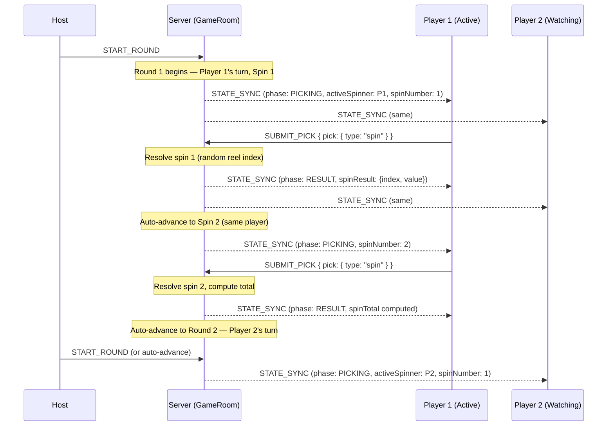
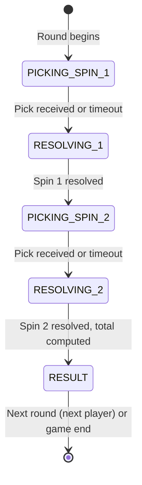
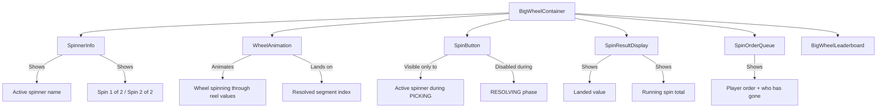

# Design Document: Big Wheel

## Overview

Big Wheel is a turn-based game plugin inspired by The Price Is Right's Showcase Showdown wheel. Unlike the existing coin-toss plugin (where all players pick simultaneously each round), Big Wheel is sequential: players take turns spinning a wheel twice each, with all other players watching live. The two spin values are summed to produce a final score, and a leaderboard ranks everyone at the end.

**Key architectural difference from Coin Toss**: Big Wheel uses a "one round per player" model. Each "round" in the server's round lifecycle corresponds to a single player's turn (two spins). The total number of rounds equals the number of players. The plugin manages an internal turn queue and spin counter via `pluginState`.

**Integration approach**: The Big Wheel plugin implements the existing `GamePlugin` interface and registers in the `GameRegistry`. The server's existing round lifecycle (PICKING → RESOLVING → RESULT → PICKING …) maps naturally to a single player's turn:
- PICKING = waiting for the active spinner to submit their "spin" pick
- RESOLVING = server resolves the spin (random index selection)
- RESULT = spin result displayed; server auto-advances to next spin or next player

The plugin uses the server's `pluginState` record to persist turn-based state across rounds.

---

## Architecture

### Turn-Based Round Mapping



### Big Wheel State Machine (within a single player's turn)



### Plugin State Flow

```mermaid
graph TD
    A[Game Launch] --> B[Determine Spin Order from Session Leaderboard]
    B --> C[Store spinOrder, currentTurnIndex=0, spinResults={} in pluginState]
    C --> D[Round N begins: active spinner = spinOrder[currentTurnIndex]]
    D --> E{Spin 1 or 2?}
    E -->|Spin 1| F[PICKING phase — wait for spin pick]
    E -->|Spin 2| F
    F --> G[Resolve: random reel index → value]
    G --> H{Both spins done?}
    H -->|No| F
    H -->|Yes| I[Compute spinTotal, store in pluginState]
    I --> J{More players?}
    J -->|Yes| K[Increment currentTurnIndex, next round]
    J -->|No| L[Game ends — produce final leaderboard]
```

---

## Components and Interfaces

### Server-Side: BigWheelPlugin

```typescript
// packages/server/src/games/big-wheel/BigWheelPlugin.ts

import type { GamePlugin } from "../GamePlugin"
import type {
  Player,
  GameLeaderboardEntry,
  RoundScoreResult,
  GameSettings,
  SettingsSchema,
} from "@games-of-chance/shared"

// ── Types ──────────────────────────────────────────────────────────────────

/** The only valid pick for Big Wheel — a spin action */
interface BigWheelPick {
  type: "spin"
}

/** Result of a single spin resolution */
interface BigWheelSpinResult {
  spinnerPlayerId: string
  spinNumber: 1 | 2
  reelIndex: number
  value: number
  spinTotal: number | null  // null after spin 1, computed after spin 2
}

/** Persisted across rounds in pluginState */
interface BigWheelPluginState {
  spinOrder: string[]                        // player IDs in spin order
  currentTurnIndex: number                   // index into spinOrder
  spinResults: Record<string, number[]>      // playerId → [spin1Value, spin2Value?]
  currentSpinNumber: 1 | 2                   // which spin the active player is on
  reelStrip: number[]                        // active reel strip for this game
  disconnectedPlayers: Set<string>           // players who disconnected during game
}

export const bigWheelPlugin: GamePlugin<BigWheelPick, BigWheelSpinResult>
```

### Server-Side: Constants

```typescript
// packages/server/src/games/big-wheel/constants.ts

import type { SettingsSchema } from "@games-of-chance/shared"

export const BIG_WHEEL = {
  /** Duration of the pick window in milliseconds (per spin) */
  PICK_WINDOW_MS: 15_000,

  /** Default reel strip — 20 values from 5 to 100 in increments of 5 */
  DEFAULT_REEL_STRIP: [5, 10, 15, 20, 25, 30, 35, 40, 45, 50, 55, 60, 65, 70, 75, 80, 85, 90, 95, 100],

  /** Minimum reel strip length */
  REEL_STRIP_MIN_LENGTH: 2,

  /** Maximum reel strip length */
  REEL_STRIP_MAX_LENGTH: 100,

  /** Minimum reel strip value */
  REEL_VALUE_MIN: 1,

  /** Maximum reel strip value */
  REEL_VALUE_MAX: 10_000,

  /** Number of spins per player turn */
  SPINS_PER_TURN: 2,
} as const

export const BIG_WHEEL_SETTINGS_SCHEMA: SettingsSchema = [
  {
    key: "REEL_STRIP",
    label: "Wheel values (comma-separated)",
    type: "number",  // Will be handled as array in tuning
    defaultValue: 0, // Placeholder — actual default handled in plugin logic
    constraints: { min: BIG_WHEEL.REEL_STRIP_MIN_LENGTH, max: BIG_WHEEL.REEL_STRIP_MAX_LENGTH },
  },
]
```

### Server-Side: Plugin Implementation (Key Methods)

```typescript
// BigWheelPlugin.ts — key method signatures

export const bigWheelPlugin: GamePlugin<BigWheelPick, BigWheelSpinResult> = {
  gameType: "big-wheel",
  settingsSchema: BIG_WHEEL_SETTINGS_SCHEMA,
  pickWindowMs: BIG_WHEEL.PICK_WINDOW_MS,

  validatePick(pick: unknown): pick is BigWheelPick {
    // Validates { type: "spin" } structure
  },

  resolveRound(picks: Record<string, BigWheelPick>, settings: GameSettings): BigWheelSpinResult {
    // 1. Read pluginState to determine activeSpinner and spinNumber
    // 2. Select uniformly random index from reelStrip
    // 3. Return { spinnerPlayerId, spinNumber, reelIndex, value, spinTotal }
  },

  scoreRound(
    picks: Record<string, BigWheelPick>,
    result: BigWheelSpinResult,
    players: Player[],
    settings: GameSettings
  ): RoundScoreResult {
    // Only produce score deltas after spin 2 (when spinTotal is computed)
    // Return { deltas: { [playerId]: spinTotal } } for the completed turn
    // Return { deltas: {} } after spin 1 (no score yet)
  },

  computeGameLeaderboard(
    players: Player[],
    gameScores: Record<string, number>
  ): GameLeaderboardEntry[] {
    // Sort by score descending
    // Break ties by session rank (lower rank number wins)
    // If still tied, random tiebreak
  },
}
```

### Shared Types (additions to @games-of-chance/shared)

```typescript
// Added to packages/shared/src/types.ts

/** Big Wheel pick — the only action is to trigger a spin */
export interface BigWheelPick {
  type: "spin"
}

/** Big Wheel spin result — sent as round result in STATE_SYNC */
export interface BigWheelSpinResult {
  spinnerPlayerId: string
  spinNumber: 1 | 2
  reelIndex: number
  value: number
  spinTotal: number | null  // null until both spins complete
}

/** Big Wheel game state included in STATE_SYNC for client rendering */
export interface BigWheelGameState {
  spinOrder: string[]
  currentTurnIndex: number
  currentSpinNumber: 1 | 2
  activeSpinnerId: string
  spinResults: Record<string, number[]>  // playerId → [spin1, spin2?]
  reelStrip: number[]
}
```

### Client-Side: Visual Design — Wheel Appearance

The wheel's visual design is inspired by The Price Is Right Showcase Showdown wheel. Reference image: https://i.etsystatic.com/38904143/r/il/8a3dbc/5453637154/il_fullxfull.5453637154_8qv0.jpg

#### Key Visual Characteristics

| Attribute | Specification |
|-----------|--------------|
| Shape | Large circular wheel, vertically oriented, rendered as an SVG/Canvas circle |
| Segments | Equal-sized wedge slices radiating from center, one per Reel_Strip value |
| Segment colors | Alternating bold colors (red, yellow, green, blue, orange) cycling through the segments — high contrast carnival palette |
| Segment labels | Large, white bold numeric text centered in each wedge (the reel strip value) |
| Segment borders | Thin dark/black divider lines between each wedge |
| Outer rim | Thick metallic/silver border ring around the wheel perimeter with raised pegs/bumpers between segments |
| Center hub | Circular metallic center cap (silver/chrome look) with a decorative logo or game title |
| Pointer/flapper | A fixed triangular pointer at the top of the wheel frame that indicates the winning segment — visually mimics the rubber flapper that clicks over the pegs |
| Frame | A sturdy metallic frame/stand behind the wheel suggesting a physical mounted wheel |
| Overall feel | Bright, glossy, game-show aesthetic — saturated colors, metallic accents, bold typography |

#### Animation Behavior

- On spin: wheel rotates with realistic deceleration (ease-out cubic), pegs "click" past the flapper
- Landing: wheel settles so the winning segment aligns directly behind the pointer
- Duration: 3–5 seconds spin animation depending on randomized initial velocity
- Sound cues (future): clicking sound as segments pass the flapper, landing "ding"

#### Layout

```
┌─────────────────────────────────────┐
│         [Active Spinner Name]        │
│           Spin 1 of 2               │
│                                     │
│              ▼ (pointer)            │
│         ┌───────────┐              │
│        /   75 │ 80   \             │
│       / 70    │    85  \           │
│      │  65    ●    90   │          │
│       \ 60    │    95  /           │
│        \  55  │ 100  /             │
│         └───────────┘              │
│                                     │
│         [ SPIN! button ]            │
│                                     │
│    Spin 1: 75  |  Total: 75        │
│                                     │
│  ─── Spin Order ───                │
│  ✓ Player1  → Player2  ○ Player3   │
└─────────────────────────────────────┘
```

### Client-Side: Component Architecture

```
packages/client/src/games/big-wheel/
├── assets/
│   ├── sprites/
│   │   └── wheel-segment.svg
│   └── animations/
│       └── spinVariants.ts
├── BigWheelContainer.tsx       # Main container — phase routing
├── WheelAnimation.tsx          # Animated wheel component (Framer Motion / CSS transforms)
├── WheelSegment.tsx            # Individual wedge slice (color, label, border)
├── WheelPointer.tsx            # Fixed triangular flapper/pointer at top
├── SpinButton.tsx              # Active spinner's "SPIN!" button
├── SpinnerInfo.tsx             # Shows active spinner name + spin count
├── SpinResultDisplay.tsx       # Shows landed value + running total
├── SpinOrderQueue.tsx          # Shows upcoming spinner order
└── BigWheelLeaderboard.tsx     # Final rankings display
```

### Client Component Responsibilities



---

## Data Models

### Plugin State (persisted in `pluginState` record on server)

```typescript
interface BigWheelPluginState {
  /** Ordered list of player IDs determining spin sequence */
  spinOrder: string[]
  /** Current index in spinOrder (0-based) */
  currentTurnIndex: number
  /** Each player's spin values collected so far */
  spinResults: Record<string, number[]>
  /** Which spin (1 or 2) the current active player is on */
  currentSpinNumber: 1 | 2
  /** The reel strip in use for this game instance */
  reelStrip: number[]
  /** Players who disconnected — their turns are skipped */
  disconnectedPlayers: string[]
}
```

### Round Result Payload (sent in STATE_SYNC)

```typescript
interface BigWheelRoundResult {
  /** The spin result for this specific round */
  spin: BigWheelSpinResult
  /** Full game state for client rendering */
  gameState: BigWheelGameState
}
```

### Spin Order Determination Algorithm

```pascal
PROCEDURE determineSpinOrder(players, sessionLeaderboard)
  // Sort players by session leaderboard rank (ascending — rank 1 first)
  ranked ← players sorted by sessionLeaderboard rank ASC
  
  // Group players with the same rank
  groups ← groupBy(ranked, rank)
  
  // Within each tied group, shuffle randomly
  FOR EACH group IN groups
    shuffle(group)  // Fisher-Yates
  END FOR
  
  // Flatten groups back into ordered list
  RETURN flatten(groups)
END PROCEDURE
```

### Reel Strip Validation

```pascal
PROCEDURE validateReelStrip(strip)
  IF strip.length < 2 OR strip.length > 100 THEN
    RETURN { valid: false, error: "Reel strip must have 2–100 values" }
  END IF
  
  FOR EACH value IN strip
    IF NOT isInteger(value) OR value < 1 OR value > 10000 THEN
      RETURN { valid: false, error: "All values must be integers between 1 and 10,000" }
    END IF
  END FOR
  
  RETURN { valid: true }
END PROCEDURE
```

### Score Computation

```pascal
PROCEDURE computeSpinTotal(spinResults, playerId)
  spins ← spinResults[playerId]
  IF spins.length ≠ 2 THEN
    RETURN 0  // Incomplete turn (disconnection)
  END IF
  RETURN spins[0] + spins[1]
END PROCEDURE
```

### Leaderboard Tiebreaking

```pascal
PROCEDURE computeGameLeaderboard(players, gameScores, sessionLeaderboard)
  entries ← players.map(p => { playerId: p.id, score: gameScores[p.id] ?? 0 })
  
  // Sort by score DESC, then by session rank ASC (lower rank = better)
  entries.sort((a, b) =>
    IF b.score ≠ a.score THEN b.score - a.score
    ELSE sessionRank(a) - sessionRank(b)  // lower rank wins
  )
  
  // For players with same score AND same session rank, randomize
  // Assign sequential ranks (tied players at same score+rank get same rank)
  RETURN assignRanks(entries)
END PROCEDURE
```

---

## Correctness Properties

*A property is a characteristic or behavior that should hold true across all valid executions of a system — essentially, a formal statement about what the system should do. Properties serve as the bridge between human-readable specifications and machine-verifiable correctness guarantees.*

### Property 1: Spin result round-trip consistency

*For any* valid reel strip and any spin resolution, the returned index SHALL be in the range [0, reelStrip.length - 1], and the returned value SHALL equal `reelStrip[returnedIndex]`. This holds regardless of whether the spin was triggered manually or auto-resolved by timeout.

**Validates: Requirements 4.3, 4.6, 5.1, 5.2, 5.3, 5.4**

### Property 2: Spin total is the arithmetic sum of two spin values

*For any* two values drawn from a valid reel strip, the computed spinTotal SHALL equal their arithmetic sum (value1 + value2).

**Validates: Requirements 4.5, 6.1**

### Property 3: Reel strip validation

*For any* candidate reel strip array, the validator SHALL accept it if and only if it has between 2 and 100 elements (inclusive) and every element is a positive integer in [1, 10000]. If rejected, the previously valid reel strip SHALL remain unchanged.

**Validates: Requirements 2.3, 2.4, 2.5**

### Property 4: Pick validation

*For any* value, validatePick SHALL return true if and only if the value is an object with a `type` field strictly equal to `"spin"`. All other values SHALL be rejected.

**Validates: Requirements 8.1, 8.3, 8.4**

### Property 5: Leaderboard ordering invariant

*For any* set of connected players with game scores, the game leaderboard SHALL be sorted by score descending, with ties broken by session leaderboard rank ascending (lower rank number first). Only connected players SHALL appear in the leaderboard.

**Validates: Requirements 7.1, 7.2, 7.4**

### Property 6: Spin order respects session rank

*For any* set of connected players with session leaderboard rankings, the determined spin order SHALL contain exactly all connected player IDs (set equality), and for any two players A and B where A has a strictly lower session rank number than B, A SHALL appear before B in the spin order.

**Validates: Requirements 3.1, 3.2, 3.3, 3.4**

### Property 7: Disconnected player's skipped turn produces zero score

*For any* player whose turn is skipped due to disconnection, their spinTotal SHALL be 0 and the RoundScoreResult deltas for that player SHALL be 0.

**Validates: Requirements 12.2, 12.3**

### Property 8: Score delta equals spin total

*For any* player completing a turn (both spins resolved), the RoundScoreResult deltas record SHALL map the player's ID to exactly their spinTotal value. Accumulating all such deltas across turns SHALL produce the correct cumulative game score.

**Validates: Requirements 6.2, 6.3**

---

## Error Handling

### Pick Rejection Scenarios

| Scenario | Error Code | Behavior |
|----------|-----------|----------|
| Non-active spinner submits pick | `NOT_ACTIVE_SPINNER` | Reject, send ERROR, no state change |
| Invalid pick format (not `{ type: "spin" }`) | `INVALID_PICK` | Reject, send ERROR, no state change |
| Pick during wrong phase | `WRONG_PHASE` | Reject, send ERROR (handled by room.ts) |
| Pick after deadline | `DEADLINE_PASSED` | Auto-resolve triggered (handled by room.ts) |

### Reel Strip Validation Errors

| Scenario | Error Code | Behavior |
|----------|-----------|----------|
| Too few values (< 2) | `INVALID_SETTINGS` | Reject update, retain previous strip |
| Too many values (> 100) | `INVALID_SETTINGS` | Reject update, retain previous strip |
| Non-integer value | `INVALID_SETTINGS` | Reject update, retain previous strip |
| Value out of range (< 1 or > 10000) | `INVALID_SETTINGS` | Reject update, retain previous strip |

### Disconnection Handling

| Scenario | Behavior |
|----------|----------|
| Active spinner disconnects mid-turn | Auto-resolve remaining spins with random indices |
| Active spinner disconnects before any spin | Auto-resolve both spins with random indices |
| Non-active player disconnects | Skip their turn when reached; assign score 0 |
| All players disconnect | Game effectively ends (no audience) |

### Timeout Handling

When the active spinner doesn't submit a pick within `pickWindowMs` (15 seconds):
1. The deadline timer fires
2. Server auto-resolves the spin using a random reel strip index
3. Normal spin resolution flow continues (broadcast result, advance to next spin or next player)

---

## Testing Strategy

### Property-Based Tests (using fast-check)

Each correctness property maps to a dedicated property-based test with minimum 100 iterations:

1. **Feature: big-wheel, Property 1: Spin result round-trip consistency** — Generate random valid reel strips, resolve spins, verify index is in bounds AND `reelStrip[index] === value`.
2. **Feature: big-wheel, Property 2: Spin total arithmetic** — Generate pairs of random positive integers (representing reel values), verify `total === v1 + v2`.
3. **Feature: big-wheel, Property 3: Reel strip validation** — Generate arbitrary arrays (varying lengths 0–200, values including negatives/floats/out-of-range), verify validator accepts iff length in [2,100] and all values are integers in [1,10000].
4. **Feature: big-wheel, Property 4: Pick validation** — Generate arbitrary JSON values (objects, primitives, arrays, nulls), verify only `{ type: "spin" }` passes.
5. **Feature: big-wheel, Property 5: Leaderboard ordering invariant** — Generate random score maps and session ranks for connected players, verify descending sort by score with session rank tiebreaker, and only connected players included.
6. **Feature: big-wheel, Property 6: Spin order respects session rank** — Generate random player sets with session ranks, verify output contains all players and ordering respects rank.
7. **Feature: big-wheel, Property 7: Disconnected player zero score** — Generate game states with some disconnected players, verify their spinTotal is 0.
8. **Feature: big-wheel, Property 8: Score delta equals spin total** — Generate sequences of completed turns (pairs of reel values), verify deltas equal spin totals and cumulative scores are correct.

**Configuration**: Each test runs minimum 100 iterations via `fast-check`. Tag format: `Feature: big-wheel, Property {N}: {title}`.

### Unit Tests (example-based)

- Specific reel strip: default 20-value strip, verify known index → value mapping
- Pick acceptance: `{ type: "spin" }` accepted, `{ type: "foo" }` rejected, `null` rejected
- Two-player game: verify turn order, both spins resolve, totals computed, leaderboard correct
- Timeout scenario: verify auto-resolve produces valid result
- Active spinner guard: verify non-active player's pick is rejected
- Disconnection mid-turn: verify remaining spins auto-resolve
- Tie-breaking: two players same score, verify session rank tiebreaker applied

### Integration Tests

- Full game flow: 3 players, all spin manually, game ends with correct leaderboard
- Mixed disconnection: one player disconnects, game completes normally
- Settings update: host changes reel strip mid-lobby, next game uses new strip
- Bot integration: bots auto-spin when it's their turn

