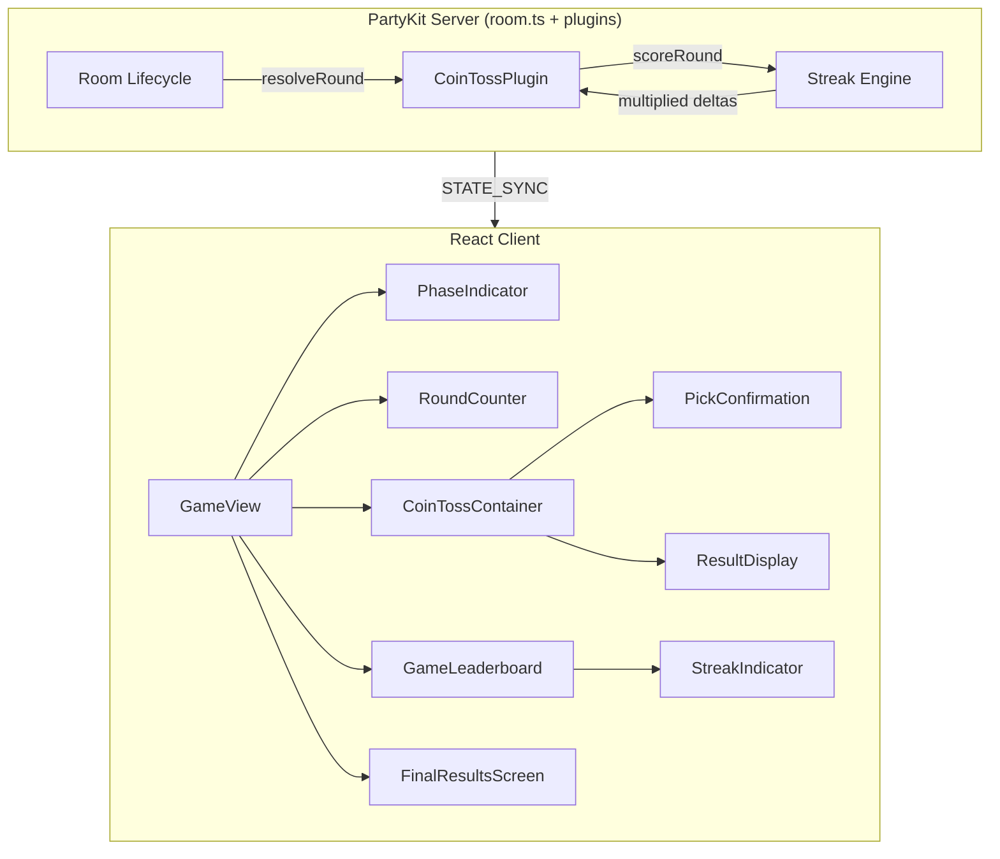
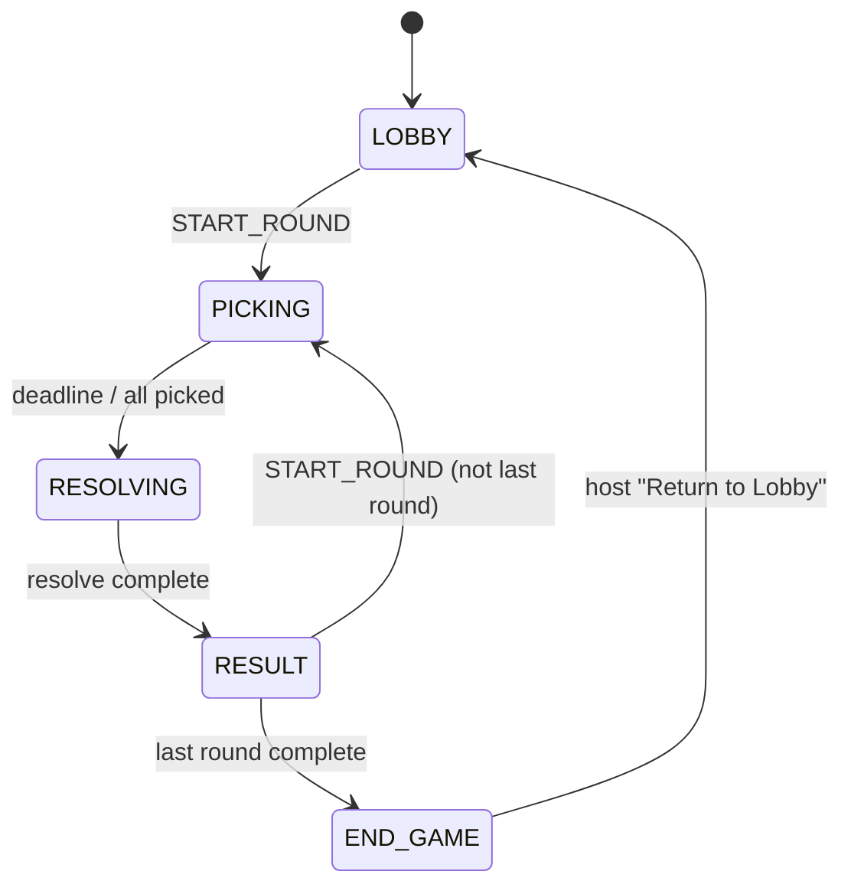

# Design Document: Coin Toss Gameplay Enhancements

## Overview

This design introduces gameplay enhancements to the Coin Toss game that improve visual feedback, add strategic depth through streak-based scoring, and provide a satisfying end-of-game experience. The enhancements span both the PartyKit server (streak tracking, END_GAME phase, multiplier scoring) and the React client (phase indicator, pick confirmation, round counter, result prominence, final results screen, streak indicators).

Two components are **plugin-agnostic** and live in the core game engine:
- **Game Phase Indicator** — renders based on `round.phase` from any game plugin
- **Final Results Screen / END_GAME phase** — a new phase in the room lifecycle available to all game types

The remaining components are **coin-toss-specific** and live in the coin-toss plugin and its client-side game folder.

### Key Design Decisions

1. **END_GAME as a new RoundPhase** — Rather than adding a separate state machine, we extend the existing `RoundPhase` union type with `"END_GAME"`. This preserves the single-phase-per-room invariant and integrates naturally with the existing broadcast mechanism.

2. **Streak state in `pluginState`** — Streak counters are stored in the server's `pluginState` map (already exists for multi-round game state). This keeps the core `LiveRoomState` interface unchanged and allows each game plugin to manage its own streak semantics.

3. **Streak data in the broadcast payload** — Streak status per player is included in the `gameLeaderboard` entries (extended with optional streak fields). This avoids a new message type and ensures streak indicators update atomically with score changes.

4. **Multiplier tiers are fixed (1x/2x/3x)** — The requirements define exactly three multiplier levels. We implement these as a simple lookup rather than a configurable formula, keeping the scoring logic predictable and testable.

## Architecture



### Phase State Machine (Extended)



## Components and Interfaces

### Server-Side Components

#### 1. Extended RoundPhase Type (shared package)

```typescript
// packages/shared/src/types.ts
export type RoundPhase = "LOBBY" | "PICKING" | "RESOLVING" | "RESULT" | "END_GAME"
```

#### 2. Streak Engine (coin-toss plugin)

A pure function module within the coin-toss plugin that:
- Accepts current streak state + round picks + result
- Returns updated streak state + multiplied score deltas

```typescript
// packages/server/src/games/coin-toss/StreakEngine.ts
export interface StreakState {
  /** Consecutive correct guesses per player (resets on wrong) */
  correctStreaks: Record<string, number>
  /** Consecutive incorrect guesses per player (resets on correct) */
  wrongStreaks: Record<string, number>
}

export interface StreakScoringResult {
  /** Score deltas after multiplier applied */
  deltas: Record<string, number>
  /** Updated streak state after this round */
  nextStreakState: StreakState
  /** Per-player multiplier that was applied (for UI display) */
  appliedMultipliers: Record<string, number>
}

export function computeStreakScoring(
  picks: Record<string, CoinTossPick>,
  result: CoinTossResult,
  currentStreak: StreakState,
  basePoints: number
): StreakScoringResult
```

**Multiplier Logic:**
| Streak Counter (before this round) | Multiplier |
|-------------------------------------|-----------|
| 0 (first correct or coming off wrong) | 1x |
| 1 (second consecutive correct) | 2x |
| 2+ (third+ consecutive correct) | 3x |

#### 3. Extended GameLeaderboardEntry (shared package)

```typescript
// Addition to GameLeaderboardEntry
export interface GameLeaderboardEntry {
  playerId: string
  playerName: string
  score: number
  rank: number
  /** Current correct streak length (0 = no streak) */
  streak?: number
  /** Current wrong streak length (0 = no streak) */
  coldStreak?: number
  /** Multiplier applied in the most recent round (for UI display) */
  lastMultiplier?: number
}
```

#### 4. END_GAME Phase Handling (room.ts — plugin-agnostic)

The `autoEndGame()` and `handleEndGame()` methods are modified:
- Instead of immediately resetting to LOBBY, they transition to `END_GAME` phase
- A new `RETURN_TO_LOBBY` client message type triggers the actual lobby reset
- The host-only "Return to Lobby" button sends this message

```typescript
// New client message
| { type: "RETURN_TO_LOBBY"; payload?: never }
```

### Client-Side Components

#### 5. PhaseIndicator (plugin-agnostic, `components/game/`)

A small component that reads `round.phase` from the store and renders phase-specific text and styling. Lives in the shared game components directory.

```typescript
// packages/client/src/components/game/PhaseIndicator.tsx
interface PhaseIndicatorProps {
  phase: RoundPhase
}
```

Renders:
- PICKING → "Pick a Side" with picking-phase style
- RESOLVING → "Flipping..." with resolving-phase style  
- RESULT → "Results" with result-phase style

#### 6. PickConfirmation (coin-toss-specific)

Replaces `PickLockIndicator` in the CoinTossContainer. Shows the specific pick made.

```typescript
// packages/client/src/games/coin-toss/PickConfirmation.tsx
interface PickConfirmationProps {
  side: "HEADS" | "TAILS"
}
```

Visible during:
- PICKING (after pick submitted) — replaces PickWidget
- RESOLVING — alongside coin flip animation

Hidden during:
- RESULT — replaced by ResultDisplay

#### 7. RoundCounter (coin-toss-specific display, data from store)

```typescript
// packages/client/src/games/coin-toss/RoundCounter.tsx
interface RoundCounterProps {
  currentRound: number
  totalRounds: number
}
```

#### 8. Enhanced ResultDisplay (coin-toss-specific)

The existing `ResultDisplay` is enhanced to:
- Render the current player's result at the top with larger/bold text
- Show a visual separator
- Render other players below in smaller text
- Display multiplier badges next to scores when applicable

#### 9. FinalResultsScreen (plugin-agnostic, `components/game/`)

Displayed when phase is `END_GAME`. Shows final standings with podium layout.

```typescript
// packages/client/src/components/game/FinalResultsScreen.tsx
```

Layout:
- Top 3 in podium arrangement: 2nd (left) — 1st (center, elevated) — 3rd (right)
- Remaining players in ranked list below
- "Return to Lobby" button (host-only)

#### 10. StreakIndicator (coin-toss-specific, inline in leaderboard)

A small inline element rendered between player name and score in `GameLeaderboard`.

| Condition | Display |
|-----------|---------|
| 2 consecutive correct (streak=1) | 🔥 |
| 3+ consecutive correct (streak≥2) | 🔥🔥 |
| 2 consecutive wrong (coldStreak=2) | 🧊 |
| 3+ consecutive wrong (coldStreak≥3) | 🧊🧊 |
| Otherwise | (nothing) |

## Data Models

### Server-Side State Extensions

#### Streak State (stored in `pluginState`)

```typescript
// Key: "coinToss:streaks" in pluginState
interface CoinTossPluginState {
  streaks: StreakState
}
```

The streak state is:
- Initialized to empty maps when a new game starts
- Updated after each round's scoring
- Reset when END_GAME → LOBBY transition occurs
- Included in the `gameLeaderboard` broadcast via `streak` and `coldStreak` fields

#### Extended RoundState (no structural change)

The existing `RoundState` requires no structural changes. The phase field already accepts any `RoundPhase` value, so adding `"END_GAME"` to the union is sufficient.

#### Extended RoomState Broadcast

The broadcast payload (`RoomState`) already includes `gameLeaderboard: GameLeaderboardEntry[]`. By adding optional `streak`, `coldStreak`, and `lastMultiplier` fields to `GameLeaderboardEntry`, clients receive streak data without any new message types.

### Client-Side State

The `useGameStore` needs minimal changes:
- `pickSubmitted` already tracks whether a pick was made (used by PickConfirmation)
- The current pick value needs to be stored for PickConfirmation text (add `currentPick: unknown | null`)
- No new store fields needed for phase indicator or final results (derived from `roomState`)

```typescript
// Addition to GameStore interface
currentPick: unknown | null  // stores the pick value for PickConfirmation display
```

### Message Protocol Changes

| Message | Direction | Purpose |
|---------|-----------|---------|
| `RETURN_TO_LOBBY` | Client → Server | Host triggers transition from END_GAME to LOBBY |

The existing `STATE_SYNC` broadcast carries all new data (streak in leaderboard entries, END_GAME phase) without additional message types.


## Correctness Properties

*A property is a characteristic or behavior that should hold true across all valid executions of a system — essentially, a formal statement about what the system should do. Properties serve as the bridge between human-readable specifications and machine-verifiable correctness guarantees.*

### Property 1: Round Counter Format

*For any* valid round number X (1 ≤ X ≤ Y) and total rounds Y (1 ≤ Y ≤ 100), the round counter display function SHALL produce a string matching the exact format "Round X of Y".

**Validates: Requirements 3.1**

### Property 2: Current Player Result Ordering

*For any* non-empty list of player results and any valid current player ID present in that list, the result ordering function SHALL place the current player's entry at index 0 of the output list while preserving the relative order of all other players.

**Validates: Requirements 4.1**

### Property 3: Last Round Triggers END_GAME

*For any* configured total round count N (N ≥ 1), when the round number equals N and the RESULT phase completes, the game server SHALL transition to END_GAME phase rather than LOBBY.

**Validates: Requirements 5.1**

### Property 4: Podium Layout Ordering

*For any* game leaderboard with 3 or more entries sorted by rank, the podium extraction function SHALL return rank 1 in the center position, rank 2 in the left position, and rank 3 in the right position, with all remaining players (rank 4+) in ascending rank order below the podium.

**Validates: Requirements 5.3, 5.4**

### Property 5: Return to Lobby Resets State

*For any* game in END_GAME phase with arbitrary player scores and streak states, when the RETURN_TO_LOBBY transition is triggered, the resulting state SHALL have phase equal to "LOBBY", all game scores equal to 0, and all streak counters (correct and wrong) equal to 0.

**Validates: Requirements 5.6**

### Property 6: Streak Counter Tracking

*For any* player and any sequence of round outcomes (correct/incorrect), the streak counters SHALL satisfy:
- After a correct guess: correctStreak increments by 1, wrongStreak resets to 0
- After an incorrect guess: wrongStreak increments by 1, correctStreak resets to 0

This invariant holds regardless of the player's prior streak state.

**Validates: Requirements 6.1, 7.1**

### Property 7: Multiplier Scoring Formula

*For any* player with a correct guess, the points awarded SHALL equal `basePoints * multiplier` where:
- multiplier = 1 when correctStreak (before this round) is 0
- multiplier = 2 when correctStreak (before this round) is 1
- multiplier = 3 when correctStreak (before this round) is ≥ 2

And for any player with an incorrect guess, the points awarded SHALL be 0 regardless of streak state.

**Validates: Requirements 6.2, 6.3, 6.4, 6.5, 6.6**

### Property 8: New Game Streak Reset

*For any* set of players entering a new game (first round begins), all correctStreak and wrongStreak counters SHALL be initialized to 0.

**Validates: Requirements 6.7**

### Property 9: Streak Indicator Mapping

*For any* player with correctStreak `c` and wrongStreak `w`, the streak indicator function SHALL return:
- No indicator when c ≤ 0 and w ≤ 1
- "🔥" when c = 1 (exactly 2 consecutive correct total)
- "🔥🔥" when c ≥ 2 (3+ consecutive correct total)
- "🧊" when w = 2 (exactly 2 consecutive wrong)
- "🧊🧊" when w ≥ 3 (3+ consecutive wrong)
- No indicator when c = 0 and w ≤ 1

Note: correctStreak and wrongStreak are mutually exclusive (one is always 0 when the other is positive).

**Validates: Requirements 7.2, 7.3, 7.4, 7.5, 7.6**

## Error Handling

### Server-Side Error Cases

| Scenario | Error Code | Behavior |
|----------|-----------|----------|
| Non-host sends RETURN_TO_LOBBY | `NOT_HOST` | Reject with error, no state change |
| RETURN_TO_LOBBY sent outside END_GAME phase | `WRONG_PHASE` | Reject with error, no state change |
| Player submits pick during END_GAME | `WRONG_PHASE` | Reject — picks only accepted during PICKING |
| START_ROUND sent during END_GAME | `WRONG_PHASE` | Reject — must return to lobby first |

### Client-Side Graceful Degradation

| Scenario | Behavior |
|----------|----------|
| `streak`/`coldStreak` fields missing from leaderboard entry | Render no streak indicator (backward-compatible) |
| Phase value unrecognized by PhaseIndicator | Render nothing (hidden component) |
| Fewer than 3 players on FinalResultsScreen | Show available players without empty podium positions |
| Current player not in result list | Render all players without prominence (no crash) |

### Streak Engine Edge Cases

- **Player disconnects mid-game**: Streak state is preserved. If they miss a round (no pick recorded), they receive a random pick (existing behavior) which may break or continue their streak.
- **Player joins mid-game**: Streak counters initialize to 0 for that player.
- **All players have same score at END_GAME**: Podium shows all as rank 1 (tied — uses existing rank-with-ties logic from `computeGameLeaderboard`).

## Testing Strategy

### Property-Based Tests (Vitest + fast-check)

The project uses Vitest as its test runner. Property-based tests will use the `fast-check` library.

Each property test runs a **minimum of 100 iterations** with randomized inputs.

**Tag format:** `Feature: coin-toss-gameplay-enhancements, Property {N}: {description}`

| Property | Test Target | Generator Strategy |
|----------|-------------|-------------------|
| 1: Round Counter Format | `formatRoundCounter(current, total)` | Arbitrary integers 1–100 for both, constrained `current ≤ total` |
| 2: Current Player Result Ordering | `orderResults(results, currentPlayerId)` | Array of 2–10 player results, random currentPlayerId from array |
| 3: Last Round END_GAME | `autoEndGame()` state transition | Random totalRounds 1–20, simulate reaching final round |
| 4: Podium Layout Ordering | `extractPodium(leaderboard)` | Random leaderboards of 3–10 entries with valid ranks |
| 5: Return to Lobby Reset | `handleReturnToLobby()` | Random END_GAME states with scores 0–1000 and streaks 0–10 |
| 6: Streak Counter Tracking | `computeStreakScoring()` | Random sequences of 1–20 correct/incorrect outcomes |
| 7: Multiplier Scoring | `computeStreakScoring()` | Random basePoints (1–100) × random streak values (0–20) |
| 8: New Game Streak Reset | Game initialization | Random player sets of 2–10 players with pre-existing streaks |
| 9: Streak Indicator Mapping | `getStreakIndicator(correct, wrong)` | Random correctStreak (0–20) × wrongStreak (0–20) with mutual exclusion constraint |

### Unit Tests (Vitest)

- PhaseIndicator renders correct text for each phase (3 tests)
- PickConfirmation shows correct "You chose X" text (2 tests)
- PickConfirmation visibility across phase transitions (3 tests)
- RoundCounter positioning in DOM (1 test)
- ResultDisplay current player styling (CSS classes) (2 tests)
- FinalResultsScreen host-only button visibility (2 tests)
- StreakIndicator renders between name and score (1 test)
- Server rejects RETURN_TO_LOBBY from non-host (1 test)
- Server rejects RETURN_TO_LOBBY outside END_GAME (1 test)

### Integration Tests

- Full round lifecycle with streak scoring: play 3 rounds, verify multipliers applied correctly
- END_GAME → RETURN_TO_LOBBY → LOBBY full flow with score reset verification
- Streak broadcast: resolve a round and verify gameLeaderboard entries include streak data (Requirements 7.7)
