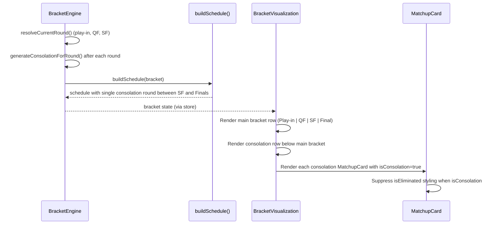

# Design Document: Consolation Bracket Visualization Fixes

## Overview

This design addresses four interrelated bugs in the consolation bracket system for the Playcaller tournament game. The fixes consolidate all consolation matchups into a single round between semifinals and finals, correct placement label computation, restructure the UI to render consolation as a separate row, and prevent eliminated-player styling from incorrectly dimming active consolation participants.

## Main Algorithm/Workflow



## Core Interfaces/Types

```typescript
// No new types needed — existing types are sufficient.
// Key existing types used:
// - ConsolationRound { roundIndex, matchups, resolved, sourceRoundIndex, placementStart }
// - GameRoundSchedule { mainBracketRoundIndex, consolationRoundIndices[], description }
// - Bracket { rounds, consolationRounds, schedule, ... }

// New prop addition to MatchupCard:
interface MatchupCardProps {
  matchup: Matchup
  resolved: boolean
  getPlayerDisplay: (playerId: string) => string
  isEliminated: (playerId: string) => boolean
  isConsolation?: boolean // NEW: suppresses eliminated styling for consolation players
}

// New prop addition to PlayerSlot:
interface PlayerSlotProps {
  playerId: string
  display: string
  isWinner: boolean
  isLoser: boolean
  isEliminated: boolean
  isConsolation?: boolean // NEW: when true, ignore isEliminated for styling
}
```

## Key Functions with Formal Specifications

### Function 1: buildSchedule() — Simplified

```typescript
export function buildSchedule(bracket: Bracket): GameRoundSchedule[]
```

**Preconditions:**
- `bracket.rounds` has at least 2 entries (at minimum: one round + finals)
- `bracket.totalRounds` matches `bracket.rounds.length`

**Postconditions:**
- Returns a schedule where ALL consolation round indices appear in exactly ONE schedule entry
- That single consolation entry has `mainBracketRoundIndex === null`
- The consolation entry is positioned immediately before the finals entry
- The finals entry is always last with `mainBracketRoundIndex === totalRounds - 1`
- Schedule order: [main rounds 0..finalsIndex-1] → [consolation round] → [finals]
- If no consolation rounds exist, no consolation entry is inserted

**Loop Invariants:** N/A

### Function 2: getConsolationLabel()

```typescript
function getConsolationLabel(cRound: ConsolationRound): string
```

**Preconditions:**
- `cRound.placementStart >= 3` (minimum is 3rd/4th place)
- `cRound.matchups.length >= 1`

**Postconditions:**
- Returns a label like "9th/10th", "5th/6th", "3rd/4th", or "5th-8th Final"
- For single matchups: returns `"{ordinal(placementStart)}/{ordinal(placementStart+1)}"`
- For 2-matchup rounds (mini-bracket semis): returns `"{ordinal(ps)}-{ordinal(ps+3)} SF"`
- For mini-bracket finals: uses placementStart directly

**Loop Invariants:** N/A

### Function 3: ConsolationRow component

```typescript
function ConsolationRow({
  bracket,
  getPlayerDisplay,
  isEliminated,
}: ConsolationRowProps): JSX.Element
```

**Preconditions:**
- `bracket.consolationRounds` may be empty (render nothing) or contain 1+ rounds

**Postconditions:**
- Renders a horizontal row labeled "Consolation" on the left
- Each consolation round renders as a MatchupCard with correct label above it
- All MatchupCards in this row receive `isConsolation={true}`
- Cards with unassigned players (playerA === "") show "TBD"
- Resolved cards show winner/loser styling (but NOT eliminated styling)
- Column alignment: each consolation round renders under the main-bracket column at index `totalRounds - 1 - floor((placementStart - 3) / 2)`
- Multiple consolation matchups mapping to the same column stack vertically
- For 10 players: 9th/10th→col 0, 7th/8th→col 1, 5th/6th→col 2, 3rd/4th→col 3

### Function 4: PlayerSlot (modified styling logic)

```typescript
function PlayerSlot({ playerId, display, isWinner, isLoser, isEliminated, isConsolation }: PlayerSlotProps): JSX.Element
```

**Preconditions:**
- All string props are defined (may be empty for TBD slots)

**Postconditions:**
- When `isConsolation === true`: the `isEliminated` flag is ignored for styling
- When `isConsolation === true` and `isLoser === true`: dimmed/line-through styling applies (consolation loser)
- When `isConsolation === false` or undefined: existing behavior (isEliminated causes dimmed styling)
- Winner styling always applies regardless of isConsolation flag

## Algorithmic Pseudocode

### Simplified buildSchedule Algorithm

```typescript
export function buildSchedule(bracket: Bracket): GameRoundSchedule[] {
  const schedule: GameRoundSchedule[] = []
  const finalsRoundIndex = bracket.totalRounds - 1

  // 1. Add all main-bracket rounds EXCEPT finals
  for (let r = 0; r < finalsRoundIndex; r++) {
    schedule.push({
      mainBracketRoundIndex: r,
      consolationRoundIndices: [],  // No concurrent consolation anymore
      description: getRoundDescription(r, bracket.totalRounds),
    })
  }

  // 2. Insert single consolation round (ALL consolation indices) before finals
  if (bracket.consolationRounds.length > 0) {
    const allConsolationIndices = bracket.consolationRounds.map((_, idx) => idx)
    schedule.push({
      mainBracketRoundIndex: null,
      consolationRoundIndices: allConsolationIndices,
      description: "Consolation",
    })
  }

  // 3. Finals round (always last, always alone)
  schedule.push({
    mainBracketRoundIndex: finalsRoundIndex,
    consolationRoundIndices: [],
    description: "Finals",
  })

  return schedule
}
```

### ConsolationRow Rendering Logic

```typescript
function ConsolationRow({ bracket, getPlayerDisplay, isEliminated }: ConsolationRowProps) {
  // Map each consolation round to its visual column index based on placement position
  // Formula: columnIndex = totalRounds - 1 - floor((placementStart - 3) / 2)
  // This gives: 3rd/4th → rightmost (finals col), 9th/10th → leftmost
  const byColumn = useMemo(() => {
    const map = new Map<number, ConsolationRound[]>()
    for (const cRound of bracket.consolationRounds) {
      const col = bracket.totalRounds - 1 - Math.floor((cRound.placementStart - 3) / 2)
      if (!map.has(col)) map.set(col, [])
      map.get(col)!.push(cRound)
    }
    return map
  }, [bracket.consolationRounds, bracket.totalRounds])

  if (bracket.consolationRounds.length === 0) return null

  return (
    <div className="flex items-start gap-4 px-2 pt-4 border-t border-[#f5c542]/20 mt-2">
      {/* Columns aligned with main bracket */}
      <div className="flex min-w-max gap-4">
        {bracket.rounds.map((round) => {
          const consolationRounds = byColumn.get(round.roundIndex) ?? []
          return (
            <div key={round.roundIndex} className="w-44 flex flex-col items-center gap-2">
              {consolationRounds.length === 0 ? (
                <div className="w-full" /> {/* Empty placeholder for alignment */}
              ) : (
                consolationRounds.map((cRound) => (
                  <div key={cRound.roundIndex} className="flex flex-col items-center gap-1">
                    <div className="text-[#f5c542]/70 text-[10px] font-semibold uppercase">
                      {getConsolationLabel(cRound)}
                    </div>
                    {cRound.matchups.map((matchup) => (
                      <MatchupCard
                        key={matchup.matchupId}
                        matchup={matchup}
                        resolved={cRound.resolved}
                        getPlayerDisplay={getPlayerDisplay}
                        isEliminated={isEliminated}
                        isConsolation={true}
                      />
                    ))}
                  </div>
                ))
              )}
            </div>
          )
        })}
      </div>
    </div>
  )
}
```

### Label Derivation Logic

```typescript
function getConsolationLabel(cRound: ConsolationRound): string {
  const ps = cRound.placementStart
  if (cRound.matchups.length === 2) {
    // Mini-bracket semi-finals: "5th-8th SF"
    return `${ordinal(ps)}-${ordinal(ps + 3)} SF`
  }
  if (cRound.matchups.length === 1) {
    // Single matchup: "9th/10th", "5th/6th", "3rd/4th"
    return `${ordinal(ps)}/${ordinal(ps + 1)}`
  }
  return `${ordinal(ps)}+ Consolation`
}
```

### PlayerSlot Styling Fix

```typescript
function PlayerSlot({ playerId, display, isWinner, isLoser, isEliminated, isConsolation }: PlayerSlotProps) {
  const isTBD = !playerId

  let stateClasses = "text-[#f0f0f0]"
  if (isTBD) {
    stateClasses = "text-[#3a9a4a] italic"
  } else if (isWinner) {
    stateClasses = "text-[#f5c542] font-bold bg-[#2a7a3a]/30 border-l-4 border-[#f5c542]"
  } else if (isLoser || (!isConsolation && isEliminated)) {
    // Only apply eliminated styling when NOT in consolation context
    stateClasses = "text-[#3a9a4a]/50 line-through opacity-50"
  }

  return <div className={`px-3 py-2 text-sm truncate ${stateClasses}`}>{display}</div>
}
```

## Example Usage

```typescript
// Example: 10-player bracket schedule output
// buildSchedule produces:
// [
//   { mainBracketRoundIndex: 0, consolationRoundIndices: [], description: "Play-in" },
//   { mainBracketRoundIndex: 1, consolationRoundIndices: [], description: "Quarterfinals" },
//   { mainBracketRoundIndex: 2, consolationRoundIndices: [], description: "Semifinals" },
//   { mainBracketRoundIndex: null, consolationRoundIndices: [0,1,2,3], description: "Consolation" },
//   { mainBracketRoundIndex: 3, consolationRoundIndices: [], description: "Finals" },
// ]

// Example: BracketVisualization layout for 10-player bracket (4 columns)
// <div className="bracket-container">
//   {/* Main bracket row */}
//   <div className="main-bracket-row">
//     <RoundColumn round={playIn} />     ← column 0
//     <RoundColumn round={qf} />         ← column 1
//     <RoundColumn round={sf} />         ← column 2
//     <RoundColumn round={finals} />     ← column 3
//   </div>
//   {/* Consolation row — columns aligned by placement position */}
//   <ConsolationRow>
//     column 0: 9th/10th (placementStart=9)
//     column 1: 7th/8th (placementStart=7)
//     column 2: 5th/6th (placementStart=5)
//     column 3: 3rd/4th (placementStart=3)
//   </ConsolationRow>
// </div>
//
// For 8-player bracket (3 columns: QF, SF, Final):
//   column 0: 7th/8th (placementStart=7)
//   column 1: 5th/6th (placementStart=5)
//   column 2: 3rd/4th (placementStart=3)

// Example: Consolation player NOT shown as eliminated
// Player "Alice" lost in QF → eliminated[Alice] = 1
// In consolation matchup: isEliminated("Alice") returns true
// But MatchupCard has isConsolation={true}, so PlayerSlot ignores isEliminated
// Alice appears with normal styling until her consolation game resolves
```

## Correctness Properties

*A property is a characteristic or behavior that should hold true across all valid executions of a system — essentially, a formal statement about what the system should do. Properties serve as the bridge between human-readable specifications and machine-verifiable correctness guarantees.*

### Property 1: Schedule consolidates all consolation into one entry

*For any* bracket with one or more consolation rounds, `buildSchedule()` shall produce exactly one schedule entry with `mainBracketRoundIndex === null`, and that entry's `consolationRoundIndices` shall contain every index from 0 to `bracket.consolationRounds.length - 1`. No schedule entry with a non-null `mainBracketRoundIndex` shall have any consolation indices.

**Validates: Requirements 1.1, 1.3**

### Property 2: Schedule ordering is main-rounds then consolation then finals

*For any* bracket, the schedule produced by `buildSchedule()` shall have all non-null `mainBracketRoundIndex` entries in strictly increasing order at the beginning, followed by the consolation entry (if any), followed by a finals entry with `mainBracketRoundIndex === totalRounds - 1` as the last element.

**Validates: Requirements 1.2, 1.5**

### Property 3: Single-matchup consolation label format

*For any* ConsolationRound with exactly one matchup and a given `placementStart` value `ps`, `getConsolationLabel()` shall return `"{ordinal(ps)}/{ordinal(ps+1)}"`.

**Validates: Requirements 2.1, 2.3**

### Property 4: Multi-matchup consolation label format

*For any* ConsolationRound with exactly two matchups and a given `placementStart` value `ps`, `getConsolationLabel()` shall return `"{ordinal(ps)}-{ordinal(ps+3)} SF"`.

**Validates: Requirement 2.2**

### Property 5: Consolation row column alignment

*For any* consolation round with `placementStart` value `ps`, that round's matchups SHALL be rendered in the consolation row at column index `totalRounds - 1 - floor((ps - 3) / 2)`, aligning visually with the corresponding main-bracket column.

**Validates: Requirements 3.5, 3.6**

### Property 6: isConsolation controls elimination styling

*For any* player who is eliminated from the main bracket, when rendered in a PlayerSlot with `isConsolation === true`, the eliminated styling (dimmed/line-through) shall NOT be applied. When the same player is rendered with `isConsolation === false` or undefined, the eliminated styling SHALL be applied.

**Validates: Requirements 4.1, 4.4**

### Property 7: Resolved consolation applies correct winner/loser styling

*For any* resolved consolation matchup, the winning player's PlayerSlot shall have winner styling (gold highlight) and the losing player's PlayerSlot shall have loser styling (dimmed/line-through), regardless of their main-bracket elimination status.

**Validates: Requirements 4.2, 4.3**
