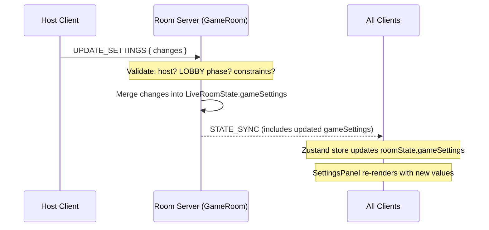
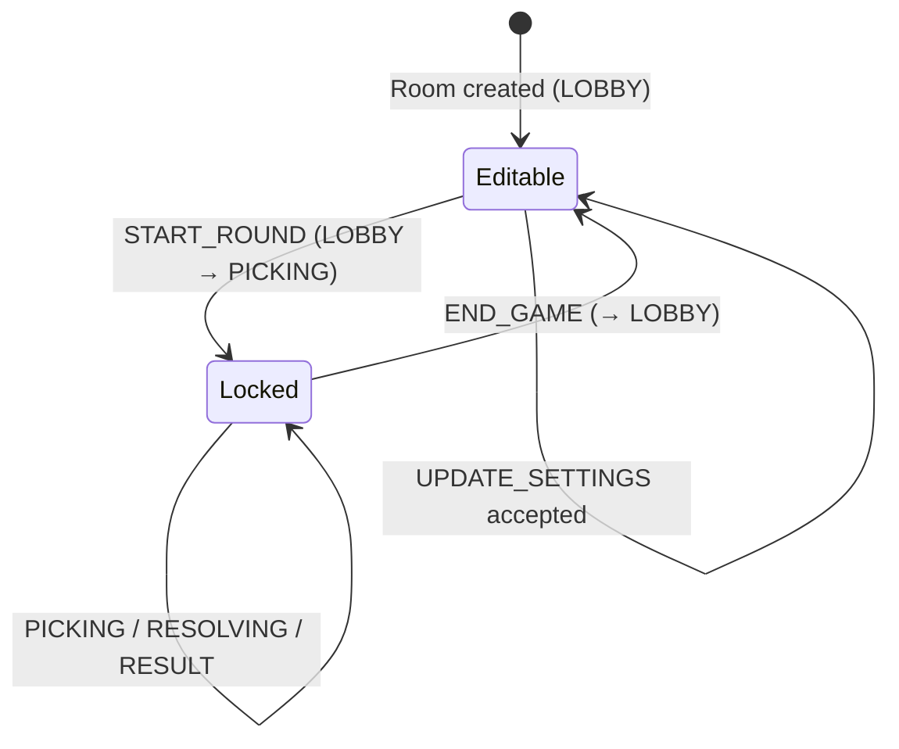
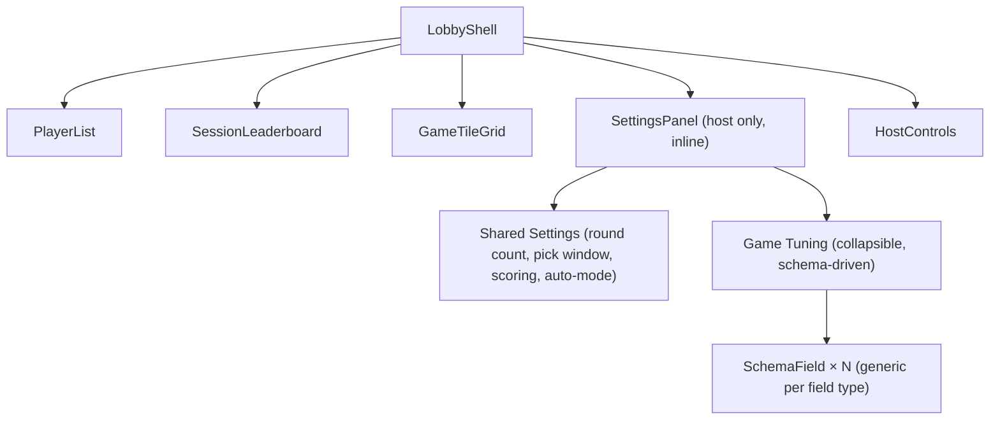

# Design Document: Game Settings

## Overview

The Game Settings feature adds a pre-game configuration system that lets the host adjust game rules (round count, pick window duration, scoring mode, auto-mode, and per-game tuning constants) from the lobby. Each `GamePlugin` declares an optional `settingsSchema` describing its configurable fields. The client renders a generic `SettingsPanel` from this schema — no per-game UI code needed. Settings are part of `LiveRoomState`, broadcast to all clients via `STATE_SYNC`, locked during active game phases, and persist between games within a room session.

**Key design decisions:**
- Schema-driven: plugins declare what's configurable; the UI renders it generically
- Settings lock: once LOBBY → PICKING, settings are frozen until END_GAME
- Partial reset on game type change: shared settings (round count, scoring mode, auto-mode) survive; game-specific tuning resets to new plugin defaults
- Mobile-first: single-column layout, 44px tap targets, inline in lobby (no route change)
- Leverages existing broadcast pattern (STATE_SYNC) and Zustand store for client state

---

## Architecture

### Settings Data Flow



### Settings Lock Lifecycle



### Component Integration in Lobby



---

## Components and Interfaces

### SettingsSchema (shared types)

```typescript
// packages/shared/src/types.ts (additions)

/** A single configurable field in a game plugin's settings schema */
export interface SettingsFieldSchema {
  /** Unique key — must match the constant name in the plugin's constants file */
  key: string
  /** Human-readable label for the UI */
  label: string
  /** Field type determines which input control is rendered */
  type: "number" | "boolean" | "select"
  /** Default value (matches the plugin constant's value) */
  defaultValue: number | boolean | string
  /** Validation constraints (type-specific) */
  constraints?: {
    min?: number
    max?: number
    step?: number
    /** For "select" type only */
    options?: { label: string; value: string }[]
  }
}

/** The full settings schema a plugin may declare */
export type SettingsSchema = SettingsFieldSchema[]

/** Resolved game settings — defaults merged with host overrides */
export interface GameSettings {
  /** Number of rounds per game */
  roundCount: number
  /** Duration of the pick window in milliseconds */
  pickWindowMs: number
  /** Game-specific tuning constants (keyed by constant name) */
  tuning: Record<string, number | boolean | string>
}
```

### Updated GamePlugin Interface

```typescript
// packages/server/src/games/GamePlugin.ts (additions)

import type { SettingsSchema } from "@games-of-chance/shared"

export interface GamePlugin<TPick = unknown, TResult = unknown> {
  gameType: GameType

  /** Optional schema describing configurable fields for this game */
  settingsSchema?: SettingsSchema

  validatePick(pick: unknown): pick is TPick

  /**
   * resolveRound now receives the active game settings so plugins
   * can use configured tuning values instead of hardcoded constants.
   */
  resolveRound(picks: Record<string, TPick>, settings: GameSettings): TResult

  /**
   * scoreRound now receives the active game settings.
   */
  scoreRound(
    picks: Record<string, TPick>,
    result: TResult,
    players: Player[],
    settings: GameSettings
  ): RoundScoreResult

  computeGameLeaderboard(
    players: Player[],
    gameScores: Record<string, number>
  ): GameLeaderboardEntry[]

  pickWindowMs: number
}
```

### Updated RoomState (broadcast payload)

```typescript
// packages/shared/src/types.ts (modification to RoomState)

export interface RoomState {
  room: RoomConfig
  players: Player[]
  round: RoundState
  gameLeaderboard: GameLeaderboardEntry[]
  sessionLeaderboard: SessionLeaderboardEntry[]
  /** Resolved game settings — shared + game-specific tuning */
  gameSettings: GameSettings
  /** Whether settings are currently locked (active game in progress) */
  settingsLocked: boolean
}
```

### New ClientMessage: UPDATE_SETTINGS

```typescript
// Addition to ClientMessage union in packages/shared/src/types.ts

| { type: "UPDATE_SETTINGS"; payload: { changes: Partial<GameSettings> } }
```

The `changes` payload uses `Partial<GameSettings>` — only the fields being changed are included. The server merges into the existing settings.

### CoinToss SettingsSchema Example

```typescript
// packages/server/src/games/coin-toss/constants.ts (addition)

import type { SettingsSchema } from "@games-of-chance/shared"

export const COIN_TOSS_SETTINGS_SCHEMA: SettingsSchema = [
  {
    key: "CORRECT_GUESS_CHIPS",
    label: "Points per correct guess",
    type: "number",
    defaultValue: COIN_TOSS.CORRECT_GUESS_CHIPS,
    constraints: { min: 1, max: 100, step: 1 },
  },
  {
    key: "STREAK_MULTIPLIER",
    label: "Streak multiplier",
    type: "number",
    defaultValue: COIN_TOSS.STREAK_MULTIPLIER,
    constraints: { min: 1, max: 10, step: 0.5 },
  },
  {
    key: "STREAK_THRESHOLD",
    label: "Streak threshold",
    type: "number",
    defaultValue: COIN_TOSS.STREAK_THRESHOLD,
    constraints: { min: 2, max: 10, step: 1 },
  },
]
```

### Updated LiveRoomState (server-side)

```typescript
// packages/server/src/room.ts (modification)

interface LiveRoomState {
  config: RoomConfig
  players: Record<string, Player>
  round: RoundState
  gameScores: Record<string, number>
  gameLeaderboard: GameLeaderboardEntry[]
  sessionScores: Record<string, number>
  sessionGamesPlayed: Record<string, number>
  sessionLeaderboard: SessionLeaderboardEntry[]
  /** Resolved game settings (shared + tuning) */
  gameSettings: GameSettings
  /** Whether settings are locked (game in progress) */
  settingsLocked: boolean
}
```

### SettingsPanel Component (client)

```typescript
// packages/client/src/components/lobby/SettingsPanel.tsx

interface SettingsPanelProps {
  /** No props — reads everything from Zustand store */
}

/**
 * Schema-driven settings panel rendered inline in the lobby.
 * Only rendered for the host. Displays read-only with lock
 * indicator when settingsLocked is true.
 */
export default function SettingsPanel(): JSX.Element | null
```

### SchemaField Component (client)

```typescript
// packages/client/src/components/lobby/SchemaField.tsx

interface SchemaFieldProps {
  field: SettingsFieldSchema
  value: number | boolean | string
  onChange: (key: string, value: number | boolean | string) => void
  disabled: boolean
}

/**
 * Generic field renderer:
 * - "number" → <input type="number"> with min/max/step
 * - "boolean" → toggle switch
 * - "select" → <select> dropdown
 */
export default function SchemaField(props: SchemaFieldProps): JSX.Element
```

---

## Data Models

### GameSettings Resolution Algorithm

When a room is created or game type changes, `GameSettings` is built by:

```
1. Read the active GamePlugin from registry
2. Set roundCount = plugin.constants.MAX_ROUNDS (or existing if game type unchanged)
3. Set pickWindowMs = plugin.pickWindowMs (or existing if game type unchanged)
4. For each field in plugin.settingsSchema:
     tuning[field.key] = field.defaultValue
5. Merge any existing shared settings (round count, scoring mode, auto-mode)
   if this is a game type change (retain shared, reset tuning)
```

### Settings Validation (server-side)

```typescript
// packages/server/src/settings/validateSettings.ts

/**
 * Validates a partial settings update against the active plugin's schema.
 * Returns { valid: true, sanitized: Partial<GameSettings> } or { valid: false, error: string }
 */
export function validateSettingsUpdate(
  changes: Partial<GameSettings>,
  currentSettings: GameSettings,
  schema: SettingsSchema | undefined
): { valid: true; sanitized: Partial<GameSettings> } | { valid: false; error: string }
```

Validation rules:
- `roundCount`: clamp to [1, 50], must be integer
- `pickWindowMs`: clamp to [3000, 60000], must be integer
- `tuning[key]`: look up field in schema, validate against constraints (min/max/step for number, options list for select, boolean for boolean)
- Unknown keys are ignored (not stored)

### Zustand Store Additions

```typescript
// packages/client/src/store/useGameStore.ts (additions to GameStore interface)

export interface GameStore {
  // ... existing fields ...

  // Settings actions (host only)
  updateSettings: (changes: Partial<GameSettings>) => void
}
```

The `updateSettings` action sends an `UPDATE_SETTINGS` message via the socket. Optimistic update is NOT used — we wait for the STATE_SYNC round-trip to update local state, keeping the server as single source of truth.

### Server Message Handler

```typescript
// In room.ts onMessage switch:

case "UPDATE_SETTINGS":
  this.handleUpdateSettings(sender, msg.payload)
  break
```

```typescript
private handleUpdateSettings(
  sender: Party.Connection,
  payload: { changes: Partial<GameSettings> }
) {
  // Auth: only host
  const hostId = this.getHostId()
  const senderId = this.getPlayerIdByConnectionId(sender.id)
  if (senderId !== hostId) {
    this.sendError(sender, "NOT_HOST", "Only the host can update settings")
    return
  }

  // Lock guard: reject during active game
  if (this.state.settingsLocked) {
    this.sendError(sender, "SETTINGS_LOCKED", "Settings cannot be changed during an active game")
    return
  }

  // Validate and sanitize
  const plugin = registry.lookup(this.state.config.gameType)
  const result = validateSettingsUpdate(
    payload.changes,
    this.state.gameSettings,
    plugin.settingsSchema
  )

  if (!result.valid) {
    this.sendError(sender, "INVALID_SETTINGS", result.error)
    return
  }

  // Merge sanitized changes into gameSettings
  this.state.gameSettings = {
    ...this.state.gameSettings,
    ...result.sanitized,
    tuning: {
      ...this.state.gameSettings.tuning,
      ...(result.sanitized.tuning ?? {}),
    },
  }

  // Sync scoring mode back to RoomConfig for compatibility
  if (payload.changes.roundCount !== undefined || payload.changes.pickWindowMs !== undefined) {
    // These live on gameSettings, not RoomConfig — no sync needed
  }

  this.broadcastState()
}
```

### Settings Lock Integration

In `beginRound()`:
```typescript
this.state.settingsLocked = true
```

In `handleEndGame()` / `autoEndGame()`:
```typescript
this.state.settingsLocked = false
```

### Game Type Change Handling

When the host selects a different game type from GameTileGrid (existing flow), the server resets tuning:

```typescript
private handleGameTypeChange(newGameType: GameType) {
  const plugin = registry.lookup(newGameType)
  
  // Reset game-specific tuning to new plugin defaults
  const newTuning: Record<string, number | boolean | string> = {}
  if (plugin.settingsSchema) {
    for (const field of plugin.settingsSchema) {
      newTuning[field.key] = field.defaultValue
    }
  }

  // Retain shared settings, reset tuning and pickWindowMs
  this.state.gameSettings = {
    roundCount: this.state.gameSettings.roundCount,  // retained
    pickWindowMs: plugin.pickWindowMs,               // reset to new plugin default
    tuning: newTuning,                               // reset to new plugin defaults
  }

  this.state.config.gameType = newGameType
  this.broadcastState()
}
```

---

## Correctness Properties

*A property is a characteristic or behavior that should hold true across all valid executions of a system — essentially, a formal statement about what the system should do. Properties serve as the bridge between human-readable specifications and machine-verifiable correctness guarantees.*

### Property 1: Settings update stores valid values

*For any* valid settings field and *for any* value within that field's defined constraints, sending an UPDATE_SETTINGS message from the host during LOBBY phase should result in Game_Settings reflecting the new value.

**Validates: Requirements 2.2, 3.2, 4.2, 5.3, 6.2**

### Property 2: Range validation rejects out-of-bounds values

*For any* numeric settings field (roundCount, pickWindowMs, auto-mode interval, or tuning constant) and *for any* value outside the field's [min, max] constraints, the server should reject the update or clamp to the nearest valid value, never storing an out-of-range value in Game_Settings.

**Validates: Requirements 2.3, 3.3, 5.4, 11.3, 11.4**

### Property 3: Configured pick window is used at runtime

*For any* configured pickWindowMs value within [3000, 60000], when a round starts, the server should set `pickDeadlineMs = now() + gameSettings.pickWindowMs` — never using the hardcoded plugin constant.

**Validates: Requirements 3.5**

### Property 4: Configured tuning constants are used in scoring

*For any* valid tuning constant value (e.g., CORRECT_GUESS_CHIPS ∈ [1, 100]) stored in Game_Settings, when a round resolves, the plugin's scoreRound should use the configured value from Game_Settings to compute deltas.

**Validates: Requirements 6.3**

### Property 5: Settings locked during active game

*For any* room in an active phase (PICKING, RESOLVING, or RESULT) and *for any* UPDATE_SETTINGS message, the server should reject the message with error code "SETTINGS_LOCKED" and leave Game_Settings unchanged.

**Validates: Requirements 7.1, 7.3**

### Property 6: Settings unlocked after game end

*For any* Game_Settings state, after END_GAME transitions the room to LOBBY phase, a subsequent UPDATE_SETTINGS message from the host with valid changes should be accepted and stored.

**Validates: Requirements 7.4, 9.1**

### Property 7: Non-host settings rejection

*For any* UPDATE_SETTINGS message sent by a connection whose player role is "player" (non-host), the server should reject it with error code "NOT_HOST" regardless of room phase or payload content.

**Validates: Requirements 8.2**

### Property 8: Settings persist across game sessions

*For any* Game_Settings configuration, after a game ends (END_GAME → LOBBY) and a new round is started without settings changes, the server should apply the previously configured Game_Settings values (roundCount, pickWindowMs, tuning) to the new game.

**Validates: Requirements 9.1, 9.2**

### Property 9: Game type change resets tuning, retains shared

*For any* two distinct game types A and B, when the host switches from game type A to game type B in the lobby, the resulting Game_Settings should have: (a) roundCount unchanged from before the switch, (b) pickWindowMs set to game B's plugin default, (c) tuning keys and values matching game B's schema defaults.

**Validates: Requirements 9.3**

### Property 10: Settings broadcast on every change

*For any* valid settings update accepted by the server, a STATE_SYNC message containing the updated Game_Settings should be broadcast to all connected clients.

**Validates: Requirements 10.1, 10.3**

### Property 11: Schema-driven field type rendering

*For any* SettingsSchema containing N fields with types from {"number", "boolean", "select"}, the SettingsPanel should render exactly N input controls where each control's type matches its schema field type (number → numeric input, boolean → toggle, select → dropdown).

**Validates: Requirements 6.1, 11.1**

### Property 12: Client-side clamping to valid range

*For any* numeric schema field with constraints {min, max} and *for any* user-entered value V outside [min, max], the SettingsPanel should clamp to min (if V < min) or max (if V > max) and never submit the out-of-range value.

**Validates: Requirements 11.3, 11.4**

---

## Error Handling

| Scenario | Error Code | Handling |
|----------|-----------|----------|
| Non-host sends UPDATE_SETTINGS | `NOT_HOST` | Reject, send error to sender |
| UPDATE_SETTINGS during active game | `SETTINGS_LOCKED` | Reject, send error to sender |
| Value outside constraints | `INVALID_SETTINGS` | Reject with description of violation |
| Unknown tuning key (not in schema) | — | Silently ignored (not stored) |
| Plugin has no settingsSchema | — | No game-specific tuning available; shared settings still work |
| Client-side validation failure | — | Clamp to nearest valid value, show inline message; never sends invalid payload |

**Graceful degradation:**
- If a plugin is registered without `settingsSchema`, the settings panel only shows shared settings (round count, pick window, scoring mode, auto-mode). No errors.
- If Game_Settings somehow references a tuning key not in the current plugin's schema (e.g., stale data from previous game type), the server ignores the key and the plugin falls back to its hardcoded constant default.

---

## Testing Strategy

### Property-Based Tests (fast-check)

Property-based testing is appropriate here because:
- Settings validation involves a large input space (numeric ranges, field types, combinations)
- Lock/unlock behavior must hold universally across all phases and settings combinations
- The settings merge logic has many edge cases (partial updates, game type switches)

**Library:** [fast-check](https://github.com/dubzzz/fast-check) (TypeScript PBT library)
**Configuration:** Minimum 100 iterations per property test
**Tag format:** `Feature: game-settings, Property {N}: {description}`

Tests to implement as property-based:
1. `validateSettingsUpdate` accepts all in-range values and rejects/clamps out-of-range values
2. `handleUpdateSettings` locks correctly across all active phases
3. `handleUpdateSettings` rejects non-host regardless of phase/payload
4. Game type change preserves shared settings for any valid starting configuration
5. Settings persist across END_GAME → START_ROUND cycles
6. Schema rendering produces correct control types for any valid schema

### Unit Tests (Vitest)

- Default settings resolution from plugin constants
- Specific scenario: coin-toss settings schema matches COIN_TOSS constant keys
- SettingsPanel render: host vs player role visibility
- SettingsPanel render: locked state shows read-only with indicator
- Integration: UPDATE_SETTINGS → STATE_SYNC broadcast round-trip
- Auto-mode interval input revealed only when toggle is enabled
- Collapsible "Game Tuning" section with correct heading

### Integration Tests

- Full flow: host configures settings → starts game → scoring uses configured values → end game → settings retained
- New player join receives current settings in initial STATE_SYNC
- Game type change mid-lobby resets tuning but not shared settings
