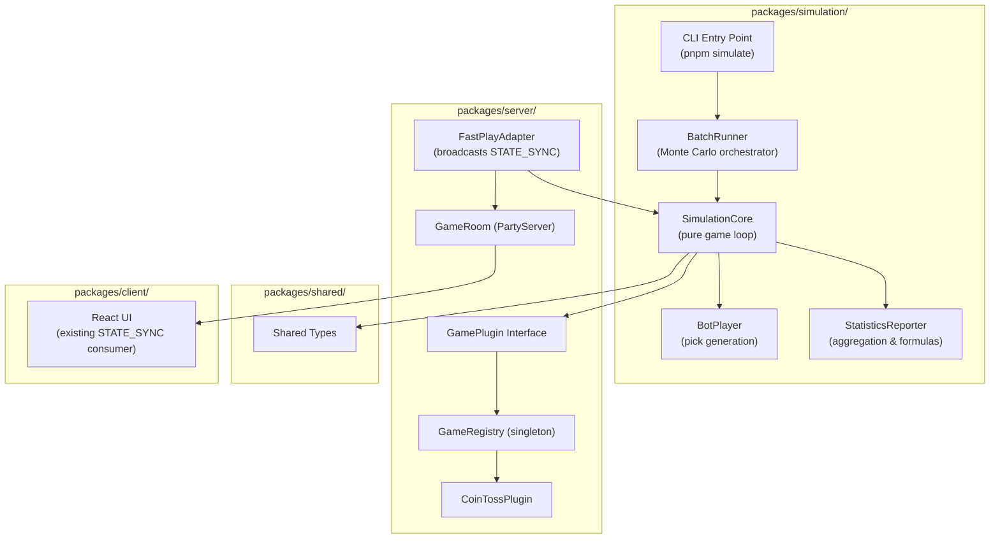
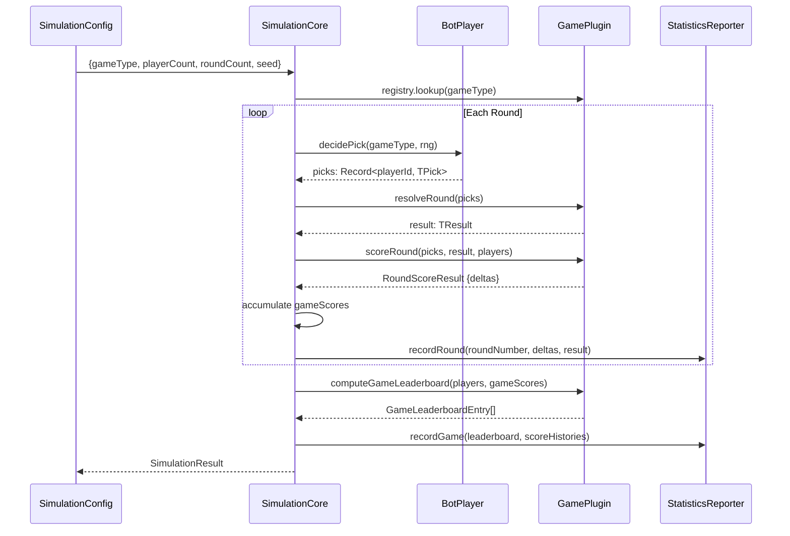

# Design Document: Game Simulation Engine

## Overview

The Game Simulation Engine is a headless game execution layer that exercises the existing `GamePlugin` interface without any WebSocket, PartyKit, or network dependencies. It serves two consumer modes:

1. **Admin UI Fast-Play Mode** — The host triggers a simulation from the lobby; the server runs bot-driven rounds at ~500ms intervals, broadcasting `STATE_SYNC` messages to connected clients using the same rendering path as live games.
2. **CLI Monte Carlo Mode** — A standalone CLI tool (`pnpm simulate`) runs millions of games in a tight loop, collecting statistical metrics and printing results to stdout.

Both modes share a single **Simulation Core** that owns the game loop, delegates pick generation to **Bot Players**, and feeds results to a **Statistics Reporter**.

**Key Design Decisions:**
- The simulation package lives at `packages/simulation/` as its own workspace package, with a peer dependency on `@games-of-chance/server` (for GamePlugin/GameRegistry) and `@games-of-chance/shared` (for types).
- The core loop is a pure synchronous function for maximum throughput in Monte Carlo mode. The Fast-Play adapter wraps it with async timing.
- Randomness is injectable via a seeded PRNG interface so simulations are deterministic and reproducible.

---

## Architecture

### High-Level System Diagram



### Package Placement Rationale

The simulation lives in its own `packages/simulation/` workspace package rather than inside `packages/server/` because:
1. The CLI tool needs its own entry point and `bin` field — mixing this into the PartyKit server package would complicate bundling.
2. The simulation has no runtime dependency on PartyKit — only on the GamePlugin implementations.
3. Separation enables independent test runs and cleaner dependency graphs.
4. The Fast-Play adapter lives in `packages/server/` since it needs access to the PartyServer broadcast API, and imports simulation logic from `@games-of-chance/simulation`.

### Data Flow



---

## Components and Interfaces

### SimulationConfig

```typescript
// packages/simulation/src/types.ts

import type { GameType } from "@games-of-chance/shared"

export interface SimulationConfig {
  /** Registered game type to simulate */
  gameType: GameType
  /** Number of bot players per game */
  playerCount: number
  /** Rounds per game */
  roundCount: number
  /** Number of complete games to simulate (1 for fast-play, 1M for Monte Carlo) */
  gameCount: number
  /** Optional seed for deterministic PRNG — omit for true randomness */
  seed?: number
}
```

### Seeded PRNG Interface

```typescript
// packages/simulation/src/rng.ts

/**
 * Minimal PRNG interface — returns a float in [0, 1).
 * Implementations: SeededRng (deterministic) and SystemRng (Math.random wrapper).
 */
export interface Rng {
  /** Returns next pseudo-random float in [0, 1) */
  next(): number
  /** Returns a random integer in [0, max) */
  nextInt(max: number): number
}

/**
 * xoshiro128** seeded PRNG — fast, small state, good distribution.
 * Deterministic for a given seed.
 */
export class SeededRng implements Rng {
  private state: Uint32Array

  constructor(seed: number) {
    // Initialize state from seed using splitmix32
    this.state = new Uint32Array(4)
    this.state[0] = seed >>> 0
    this.state[1] = (seed + 0x9e3779b9) >>> 0
    this.state[2] = (seed + 0x9e3779b9 * 2) >>> 0
    this.state[3] = (seed + 0x9e3779b9 * 3) >>> 0
  }

  next(): number {
    // xoshiro128** algorithm
    const s = this.state
    const result = Math.imul(s[1] * 5, 7) >>> 0
    const t = s[1] << 9
    s[2] ^= s[0]
    s[3] ^= s[1]
    s[1] ^= s[2]
    s[0] ^= s[3]
    s[2] ^= t
    s[3] = (s[3] << 11) | (s[3] >>> 21)
    return (result >>> 0) / 4294967296
  }

  nextInt(max: number): number {
    return Math.floor(this.next() * max)
  }
}

/**
 * Wrapper around Math.random() for non-deterministic runs.
 */
export class SystemRng implements Rng {
  next(): number {
    return Math.random()
  }

  nextInt(max: number): number {
    return Math.floor(Math.random() * max)
  }
}

/**
 * Factory: creates the appropriate RNG from config.
 */
export function createRng(seed?: number): Rng {
  return seed !== undefined ? new SeededRng(seed) : new SystemRng()
}
```

### PickGenerator Interface

```typescript
// packages/simulation/src/pick-generator.ts

import type { Rng } from "./rng"
import type { GameType } from "@games-of-chance/shared"

/**
 * Generates a valid random pick for a given game type.
 * Each game type registers its own generator.
 */
export interface PickGenerator<TPick = unknown> {
  gameType: GameType
  /** Generate a random valid pick using the provided RNG */
  generatePick(rng: Rng): TPick
}

/**
 * Registry mapping game types to their pick generators.
 */
export class PickGeneratorRegistry {
  private generators = new Map<GameType, PickGenerator>()

  register(generator: PickGenerator): void {
    this.generators.set(generator.gameType, generator)
  }

  lookup(gameType: GameType): PickGenerator {
    const gen = this.generators.get(gameType)
    if (!gen) throw new Error(`No PickGenerator registered for gameType: ${gameType}`)
    return gen
  }
}

export const pickGeneratorRegistry = new PickGeneratorRegistry()
```

### CoinToss PickGenerator

```typescript
// packages/simulation/src/pick-generators/coin-toss.ts

import type { CoinTossPick, CoinSide } from "@games-of-chance/shared"
import type { Rng } from "../rng"
import type { PickGenerator } from "../pick-generator"
import { pickGeneratorRegistry } from "../pick-generator"

const SIDES: CoinSide[] = ["HEADS", "TAILS"]

export const coinTossPickGenerator: PickGenerator<CoinTossPick> = {
  gameType: "coin-toss",
  generatePick(rng: Rng): CoinTossPick {
    return { side: SIDES[rng.nextInt(SIDES.length)] }
  },
}

pickGeneratorRegistry.register(coinTossPickGenerator)
```

### BotPlayer

```typescript
// packages/simulation/src/bot.ts

import type { GameType, Player } from "@games-of-chance/shared"
import type { Rng } from "./rng"
import type { PickGenerator } from "./pick-generator"

/**
 * Decision-making interface for bot players.
 * "Random" is the default; additional personas can be added.
 */
export interface BotDecisionMaker {
  persona: string
  decidePick(generator: PickGenerator, rng: Rng): unknown
}

/**
 * Random bot — picks uniformly at random from valid options.
 * Stateless: each decision is independent.
 */
export class RandomBot implements BotDecisionMaker {
  persona = "Random"

  decidePick(generator: PickGenerator, rng: Rng): unknown {
    return generator.generatePick(rng)
  }
}

/**
 * Creates an array of simulated Player objects for a game.
 */
export function createBotPlayers(count: number): Player[] {
  return Array.from({ length: count }, (_, i) => ({
    id: `bot-${i}`,
    name: `Bot ${i + 1}`,
    role: "player" as const,
    connected: true,
    connectionId: `bot-${i}`,
  }))
}
```

### SimulationCore

```typescript
// packages/simulation/src/core.ts

import type { GameLeaderboardEntry, Player, RoundScoreResult } from "@games-of-chance/shared"
import type { GamePlugin } from "@games-of-chance/server/games/GamePlugin"
import type { SimulationConfig } from "./types"
import type { Rng } from "./rng"
import type { PickGenerator } from "./pick-generator"
import type { BotDecisionMaker } from "./bot"

export interface RoundRecord {
  roundNumber: number
  picks: Record<string, unknown>
  result: unknown
  deltas: Record<string, number>
  cumulativeScores: Record<string, number>
}

export interface GameResult {
  gameIndex: number
  rounds: RoundRecord[]
  leaderboard: GameLeaderboardEntry[]
  finalScores: Record<string, number>
}

/**
 * Runs a single complete game — pure synchronous function.
 * No I/O, no timers, no side effects beyond RNG state advancement.
 */
export function simulateGame(
  plugin: GamePlugin,
  players: Player[],
  roundCount: number,
  bot: BotDecisionMaker,
  pickGenerator: PickGenerator,
  rng: Rng,
  gameIndex: number,
  onRound?: (round: RoundRecord) => void
): GameResult {
  const gameScores: Record<string, number> = {}
  for (const p of players) gameScores[p.id] = 0

  const rounds: RoundRecord[] = []

  for (let r = 1; r <= roundCount; r++) {
    // Generate picks for all bots
    const picks: Record<string, unknown> = {}
    for (const p of players) {
      picks[p.id] = bot.decidePick(pickGenerator, rng)
    }

    // Resolve round via plugin
    const result = plugin.resolveRound(picks)

    // Score round via plugin
    const scoreResult: RoundScoreResult = plugin.scoreRound(picks, result, players)

    // Accumulate scores
    for (const [playerId, delta] of Object.entries(scoreResult.deltas)) {
      gameScores[playerId] = (gameScores[playerId] ?? 0) + delta
    }

    const record: RoundRecord = {
      roundNumber: r,
      picks,
      result,
      deltas: scoreResult.deltas,
      cumulativeScores: { ...gameScores },
    }

    rounds.push(record)
    onRound?.(record)
  }

  // Compute final leaderboard
  const leaderboard = plugin.computeGameLeaderboard(players, gameScores)

  return { gameIndex, rounds, leaderboard, finalScores: { ...gameScores } }
}
```

### BatchRunner (Monte Carlo Orchestrator)

```typescript
// packages/simulation/src/batch-runner.ts

import type { SimulationConfig } from "./types"
import type { GameResult } from "./core"
import { simulateGame } from "./core"
import { createBotPlayers, RandomBot } from "./bot"
import { createRng } from "./rng"
import { pickGeneratorRegistry } from "./pick-generator"
import { registry as gameRegistry } from "@games-of-chance/server/games/GameRegistry"

export interface BatchResult {
  config: SimulationConfig
  games: GameResult[]
  elapsedMs: number
}

/**
 * Runs a batch of games for Monte Carlo analysis.
 * Optimized for throughput: reuses player array, single RNG instance.
 */
export function runBatch(
  config: SimulationConfig,
  onProgress?: (completed: number, total: number) => void
): BatchResult {
  const plugin = gameRegistry.lookup(config.gameType)
  const pickGenerator = pickGeneratorRegistry.lookup(config.gameType)
  const players = createBotPlayers(config.playerCount)
  const rng = createRng(config.seed)
  const bot = new RandomBot()

  const games: GameResult[] = []
  const start = performance.now()

  for (let i = 0; i < config.gameCount; i++) {
    const result = simulateGame(
      plugin, players, config.roundCount, bot, pickGenerator, rng, i
    )
    games.push(result)

    // Progress callback every 1000 games
    if (onProgress && (i + 1) % 1000 === 0) {
      onProgress(i + 1, config.gameCount)
    }
  }

  const elapsedMs = performance.now() - start
  return { config, games, elapsedMs }
}
```

### FastPlayAdapter (Server-Side)

```typescript
// packages/server/src/simulation/FastPlayAdapter.ts

import type { Party } from "@cloudflare/partykit/server"
import type { RoomState, Player, GameLeaderboardEntry } from "@games-of-chance/shared"
import { simulateGame, type RoundRecord } from "@games-of-chance/simulation"
import { registry } from "../games/GameRegistry"
import { pickGeneratorRegistry } from "@games-of-chance/simulation"
import { createBotPlayers, RandomBot } from "@games-of-chance/simulation"
import { createRng } from "@games-of-chance/simulation"

/**
 * Runs a simulation game on the server, broadcasting STATE_SYNC
 * at configurable intervals so clients render using existing UI.
 */
export class FastPlayAdapter {
  private aborted = false
  private timerId: ReturnType<typeof setTimeout> | null = null

  constructor(
    private party: Party,
    private roundIntervalMs: number = 500
  ) {}

  async run(gameType: string, playerCount: number, roundCount: number, seed?: number): Promise<void> {
    const plugin = registry.lookup(gameType)
    const pickGenerator = pickGeneratorRegistry.lookup(gameType)
    const players = createBotPlayers(playerCount)
    const rng = createRng(seed)
    const bot = new RandomBot()

    // Run rounds with delay between each
    const gameScores: Record<string, number> = {}
    for (const p of players) gameScores[p.id] = 0

    for (let r = 1; r <= roundCount && !this.aborted; r++) {
      // Generate picks, resolve, score (synchronous)
      const picks: Record<string, unknown> = {}
      for (const p of players) picks[p.id] = bot.decidePick(pickGenerator, rng)

      const result = plugin.resolveRound(picks)
      const scoreResult = plugin.scoreRound(picks, result, players)

      for (const [id, delta] of Object.entries(scoreResult.deltas)) {
        gameScores[id] = (gameScores[id] ?? 0) + delta
      }

      const leaderboard = plugin.computeGameLeaderboard(players, gameScores)

      // Broadcast STATE_SYNC with simulation state
      this.broadcastSimState(players, r, roundCount, result, leaderboard, gameScores)

      // Wait before next round
      await this.delay(this.roundIntervalMs)
    }

    // Final broadcast with RESULT phase
    if (!this.aborted) {
      const leaderboard = plugin.computeGameLeaderboard(players, gameScores)
      this.broadcastFinalState(players, roundCount, leaderboard, gameScores)
    }
  }

  abort(): void {
    this.aborted = true
    if (this.timerId) clearTimeout(this.timerId)
  }

  private delay(ms: number): Promise<void> {
    return new Promise(resolve => {
      this.timerId = setTimeout(resolve, ms)
    })
  }

  private broadcastSimState(/*...*/): void {
    // Construct RoomState matching existing STATE_SYNC shape
    // with a `simulation: true` marker in metadata
    // this.party.broadcast(JSON.stringify({ type: "STATE_SYNC", payload: state }))
  }

  private broadcastFinalState(/*...*/): void {
    // Similar to above but with phase: "RESULT"
  }
}
```

### Statistics Reporter

```typescript
// packages/simulation/src/statistics.ts

import type { GameResult } from "./core"
import type { GameLeaderboardEntry } from "@games-of-chance/shared"

export interface BatchStatistics {
  playerCount: number
  gameCount: number
  roundCount: number

  // Score distribution
  meanScore: number
  stdDevScore: number
  minScore: number
  maxScore: number
  maxMinRatio: number

  // Inequality
  giniCoefficient: number

  // Win rates (playerPosition → rank → count)
  winRateDistribution: number[][]

  // Snowball detection
  earlyLeadCorrelation: number  // Pearson correlation: score at round 3 vs final rank

  // Streak analysis (per player position)
  maxConsecutiveWins: number[]
  maxConsecutiveLosses: number[]

  // Per-round variance
  scoreVarianceByRound: number[]
}

export class StatisticsReporter {
  /**
   * Compute all statistics from a batch of game results.
   */
  compute(games: GameResult[], playerCount: number): BatchStatistics {
    // Implementation details below
  }

  /**
   * Gini coefficient: 0 = perfect equality, 1 = maximum inequality.
   * Formula: G = (2 * Σ(i * y_i)) / (n * Σ(y_i)) - (n+1)/n
   * where y_i are sorted scores and n = number of values.
   */
  computeGini(scores: number[]): number {
    const sorted = [...scores].sort((a, b) => a - b)
    const n = sorted.length
    if (n === 0) return 0
    const sum = sorted.reduce((acc, v) => acc + v, 0)
    if (sum === 0) return 0

    let weightedSum = 0
    for (let i = 0; i < n; i++) {
      weightedSum += (i + 1) * sorted[i]
    }
    return (2 * weightedSum) / (n * sum) - (n + 1) / n
  }

  /**
   * Pearson correlation between two arrays.
   * Used for snowball detection (early score vs final rank).
   */
  computeCorrelation(x: number[], y: number[]): number {
    const n = x.length
    if (n === 0) return 0
    const meanX = x.reduce((a, b) => a + b, 0) / n
    const meanY = y.reduce((a, b) => a + b, 0) / n

    let numerator = 0
    let denomX = 0
    let denomY = 0
    for (let i = 0; i < n; i++) {
      const dx = x[i] - meanX
      const dy = y[i] - meanY
      numerator += dx * dy
      denomX += dx * dx
      denomY += dy * dy
    }

    const denom = Math.sqrt(denomX * denomY)
    return denom === 0 ? 0 : numerator / denom
  }
}
```

### CLI Entry Point

```typescript
// packages/simulation/src/cli.ts

import { parseArgs } from "node:util"
import { runBatch } from "./batch-runner"
import { StatisticsReporter } from "./statistics"

// Import pick generators (side effect: registers them)
import "./pick-generators/coin-toss"

const { values } = parseArgs({
  options: {
    game: { type: "string", short: "g", default: "coin-toss" },
    players: { type: "string", short: "p", default: "4" },
    rounds: { type: "string", short: "r", default: "10" },
    games: { type: "string", short: "n", default: "10000" },
    seed: { type: "string", short: "s" },
  },
})

const config = {
  gameType: values.game!,
  playerCount: parseInt(values.players!, 10),
  roundCount: parseInt(values.rounds!, 10),
  gameCount: parseInt(values.games!, 10),
  seed: values.seed ? parseInt(values.seed, 10) : undefined,
}

console.log(`Simulating ${config.gameCount} games of "${config.gameType}"`)
console.log(`  Players: ${config.playerCount}, Rounds/game: ${config.roundCount}`)
if (config.seed !== undefined) console.log(`  Seed: ${config.seed}`)
console.log()

const result = runBatch(config, (completed, total) => {
  process.stdout.write(`\r  Progress: ${completed}/${total} games (${((completed/total)*100).toFixed(1)}%)`)
})
console.log(`\r  Completed ${config.gameCount} games in ${result.elapsedMs.toFixed(0)}ms`)
console.log()

const reporter = new StatisticsReporter()
const stats = reporter.compute(result.games, config.playerCount)

// Output formatted table
console.log("── Results ──────────────────────────────────")
console.log(`  Mean score:        ${stats.meanScore.toFixed(2)}`)
console.log(`  Std deviation:     ${stats.stdDevScore.toFixed(2)}`)
console.log(`  Score range:       ${stats.minScore} – ${stats.maxScore}`)
console.log(`  Max/Min ratio:     ${stats.maxMinRatio.toFixed(2)}`)
console.log(`  Gini coefficient:  ${stats.giniCoefficient.toFixed(4)}`)
console.log(`  Snowball corr:     ${stats.earlyLeadCorrelation.toFixed(4)}`)
console.log()
console.log("── Streak Analysis ─────────────────────────")
console.log(`  Max consecutive wins:   ${Math.max(...stats.maxConsecutiveWins)}`)
console.log(`  Max consecutive losses: ${Math.max(...stats.maxConsecutiveLosses)}`)
```

---

## Data Models

### SimulationConfig

| Field        | Type       | Description                                     |
|-------------|------------|-------------------------------------------------|
| gameType    | GameType   | Registered game type key                        |
| playerCount | number     | Bot players per game (2–100)                    |
| roundCount  | number     | Rounds per game (1–10,000)                      |
| gameCount   | number     | Total games to simulate (1–10,000,000)          |
| seed        | number?    | Optional PRNG seed for deterministic replay     |

### RoundRecord

| Field            | Type                        | Description                                    |
|------------------|-----------------------------|------------------------------------------------|
| roundNumber      | number                      | 1-indexed round within the game                |
| picks            | Record<string, unknown>     | playerId → game-specific pick                  |
| result           | unknown                     | Game-specific round result from resolveRound   |
| deltas           | Record<string, number>      | playerId → score delta this round              |
| cumulativeScores | Record<string, number>      | playerId → running total after this round      |

### GameResult

| Field       | Type                        | Description                                    |
|-------------|-----------------------------|------------------------------------------------|
| gameIndex   | number                      | 0-indexed position in the batch                |
| rounds      | RoundRecord[]               | Full round history                             |
| leaderboard | GameLeaderboardEntry[]      | Final ranked leaderboard from plugin           |
| finalScores | Record<string, number>      | playerId → final cumulative score              |

### BatchResult

| Field     | Type             | Description                                   |
|-----------|------------------|-----------------------------------------------|
| config    | SimulationConfig | The configuration used for this batch         |
| games     | GameResult[]     | All game results (may be summarized for 1M+)  |
| elapsedMs | number           | Wall-clock time for the entire batch          |

### BatchStatistics

| Field                  | Type        | Description                                              |
|------------------------|-------------|----------------------------------------------------------|
| playerCount            | number      | Players per game                                         |
| gameCount              | number      | Total games in batch                                     |
| roundCount             | number      | Rounds per game                                          |
| meanScore              | number      | Average final score across all players and games         |
| stdDevScore            | number      | Standard deviation of final scores                       |
| minScore               | number      | Lowest final score observed                              |
| maxScore               | number      | Highest final score observed                             |
| maxMinRatio            | number      | max/min ratio (∞ if min=0)                               |
| giniCoefficient        | number      | Gini coefficient of final scores [0,1]                   |
| winRateDistribution    | number[][]  | [playerPosition][rank] → count of times finished there   |
| earlyLeadCorrelation   | number      | Pearson r between early score and final rank [-1,1]      |
| maxConsecutiveWins     | number[]    | Per player position: longest win streak                  |
| maxConsecutiveLosses   | number[]    | Per player position: longest loss streak                 |
| scoreVarianceByRound   | number[]    | Per round index: variance of deltas across all games     |


---

## Correctness Properties

*A property is a characteristic or behavior that should hold true across all valid executions of a system — essentially, a formal statement about what the system should do. Properties serve as the bridge between human-readable specifications and machine-verifiable correctness guarantees.*

### Property 1: Score Accumulation Invariant

*For any* valid simulation config, game type, and random seed, after running a complete game of R rounds, the final cumulative score for each player SHALL equal the sum of that player's round deltas across all R rounds.

**Validates: Requirements 1.1, 1.6**

### Property 2: Seed Determinism

*For any* seed value and simulation config, running the simulation twice with the same seed and config SHALL produce identical game results (same picks, same round results, same final scores, same leaderboard).

**Validates: Requirements 1.4**

### Property 3: Game Result Completeness

*For any* completed game simulation with R rounds and P players, the returned GameResult SHALL contain exactly R RoundRecords, a non-empty leaderboard with P entries, and finalScores for all P players.

**Validates: Requirements 1.7**

### Property 4: Bot Picks Always Valid

*For any* registered game type with an associated PickGenerator, every pick produced by a BotDecisionMaker SHALL pass the corresponding GamePlugin's validatePick method.

**Validates: Requirements 2.1, 2.2**

### Property 5: Random Bot Uniform Distribution

*For any* game type with K valid pick options, generating N picks (N ≥ 1000) with a RandomBot SHALL produce a distribution where each option's count is within 3 standard deviations of N/K (chi-squared test at p < 0.01).

**Validates: Requirements 2.3**

### Property 6: Gini Coefficient Mathematical Properties

*For any* array of non-negative scores: (a) if all scores are identical, Gini SHALL equal 0; (b) Gini SHALL always be in the range [0, 1]; (c) Gini SHALL be invariant under uniform scalar multiplication (Gini(k*x) = Gini(x) for k > 0).

**Validates: Requirements 5.2**

### Property 7: Win-Rate Distribution Conservation

*For any* batch of G games with P players, the win-rate distribution matrix SHALL satisfy: for each player position p, the sum of winRateDistribution[p][rank] across all ranks SHALL equal G.

**Validates: Requirements 5.4**

### Property 8: Statistical Output Bounds

*For any* batch of game results: (a) the Pearson early-lead correlation SHALL be in [-1, 1]; (b) maximum consecutive wins per player position SHALL be in [0, roundCount]; (c) maximum consecutive losses per player position SHALL be in [0, roundCount].

**Validates: Requirements 5.5, 5.6**

### Property 9: Variance Non-Negativity and Mean Correctness

*For any* array of numeric scores: (a) computed variance SHALL be ≥ 0; (b) computed mean SHALL equal the arithmetic mean (sum / count); (c) standard deviation SHALL equal the square root of variance.

**Validates: Requirements 5.1, 5.7**

### Property 10: Generic Game Type Support

*For any* game plugin registered in the GameRegistry with a corresponding PickGenerator registered in the PickGeneratorRegistry, the SimulationCore SHALL successfully execute a complete game without game-type-specific branching or errors.

**Validates: Requirements 6.4**

---

## Error Handling

### SimulationCore Errors

| Error Condition | Behavior | Recovery |
|----------------|----------|----------|
| Unknown game type in config | Throw `UnknownGameTypeError` with the game type string | Caller catches and displays message |
| No PickGenerator for game type | Throw `MissingPickGeneratorError` with game type | Register generator before simulation |
| Invalid playerCount (< 2) | Throw `InvalidConfigError` | Validate config before calling core |
| Invalid roundCount (< 1) | Throw `InvalidConfigError` | Validate config before calling core |
| Plugin.resolveRound throws | Propagate error with game context (round number, picks) | Bug in plugin — fix plugin |
| Plugin.scoreRound throws | Propagate error with game context | Bug in plugin — fix plugin |

### FastPlayAdapter Errors

| Error Condition | Behavior | Recovery |
|----------------|----------|----------|
| Abort called during simulation | Sets `aborted = true`, clears timer, stops loop | Partial results broadcast in final state |
| Plugin error during fast-play | Abort simulation, broadcast ERROR to clients | Host sees error, can retry |
| Party broadcast fails | Log error, continue simulation (best effort) | Clients may miss a round |

### CLI Errors

| Error Condition | Behavior | Recovery |
|----------------|----------|----------|
| Invalid CLI arguments | Print usage message, exit code 1 | User corrects arguments |
| Game type not registered | Print error naming the type, exit code 1 | User provides valid game type |
| Performance timeout (optional) | Print warning if batch exceeds expected time | Reduce game count or optimize |

### Error Type Definitions

```typescript
// packages/simulation/src/errors.ts

export class UnknownGameTypeError extends Error {
  constructor(public readonly gameType: string) {
    super(`Unknown game type "${gameType}" — not registered in GameRegistry`)
    this.name = "UnknownGameTypeError"
  }
}

export class MissingPickGeneratorError extends Error {
  constructor(public readonly gameType: string) {
    super(`No PickGenerator registered for game type "${gameType}"`)
    this.name = "MissingPickGeneratorError"
  }
}

export class InvalidConfigError extends Error {
  constructor(message: string) {
    super(message)
    this.name = "InvalidConfigError"
  }
}
```

---

## Testing Strategy

### Property-Based Tests (Vitest + fast-check)

The simulation engine is highly amenable to property-based testing because it consists of pure functions with clear input/output behavior over large input spaces.

**Library**: `fast-check` with Vitest  
**Configuration**: Minimum 100 iterations per property test  
**Tag format**: `// Feature: game-simulation, Property N: <property text>`

Each correctness property maps to a single property-based test:

| Property | Test File | What it generates |
|----------|-----------|-------------------|
| P1: Score Accumulation | `core.property.test.ts` | Random configs (players 2–20, rounds 1–100) |
| P2: Seed Determinism | `core.property.test.ts` | Random seeds, various configs |
| P3: Result Completeness | `core.property.test.ts` | Random valid configs |
| P4: Bot Picks Valid | `bot.property.test.ts` | Random RNG states, all registered game types |
| P5: Uniform Distribution | `bot.property.test.ts` | Random seeds, large sample sizes |
| P6: Gini Properties | `statistics.property.test.ts` | Random non-negative number arrays |
| P7: Win-Rate Conservation | `statistics.property.test.ts` | Random batches of game results |
| P8: Statistical Bounds | `statistics.property.test.ts` | Random game result batches |
| P9: Variance/Mean Correctness | `statistics.property.test.ts` | Random numeric arrays |
| P10: Generic Game Support | `core.property.test.ts` | Mock plugins with random behaviors |

### Unit Tests (Vitest)

Example-based tests for specific scenarios and edge cases:

- **Config validation**: Invalid player counts, missing game types, boundary values
- **CLI argument parsing**: All argument combinations, missing args, invalid values
- **CoinToss PickGenerator**: Produces only "HEADS" or "TAILS"
- **Error paths**: Unknown game type error includes type name, missing generator error
- **FastPlayAdapter abort**: Partial results preserved on abort
- **Output formatting**: CLI output contains all expected stat fields

### Integration Tests

- **FastPlayAdapter + PartyKit**: Broadcasts correct STATE_SYNC shape at correct intervals
- **CLI end-to-end**: `pnpm simulate` with known seed produces expected output
- **Performance benchmark**: 1M coin-toss games completes in < 60s

### Performance Testing

The Monte Carlo hot loop is profiled for:
- **Object allocation**: Minimize per-round allocations (reuse score accumulators)
- **RNG throughput**: xoshiro128** generates ~500M numbers/second
- **Memory**: GameResult storage for 1M games — if memory is an issue, switch to streaming statistics (compute on-the-fly without storing all game results)

**Optimization strategy for 1M games**: In Monte Carlo mode, the BatchRunner can optionally skip storing full `RoundRecord[]` arrays and instead feed results directly to the StatisticsReporter in a streaming fashion, reducing memory from O(games × rounds) to O(players).
