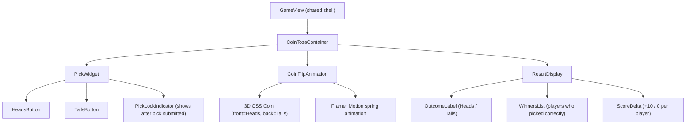
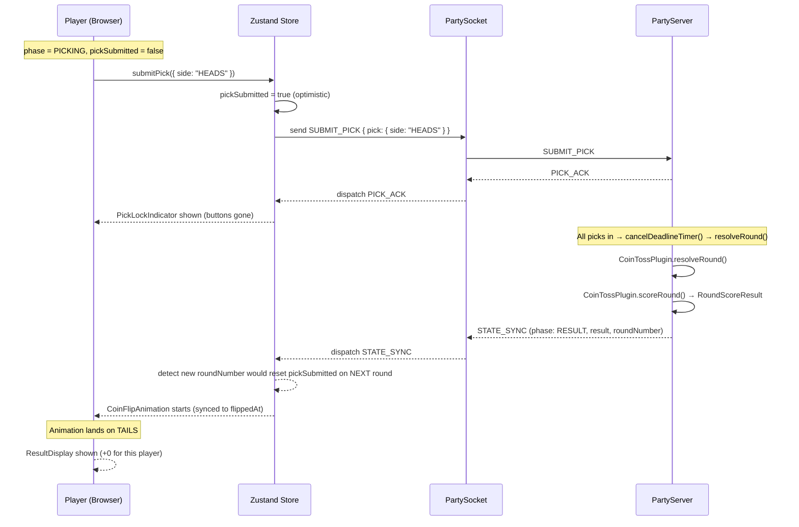

# Design Document: Coin Toss Game

> This document covers the coin-toss-specific design.
> For the shared room engine, GamePlugin interface, networking, and state management, see the
> [base architecture design](../design.md).

## Overview

The coin toss game is the reference implementation of the `GamePlugin` contract. Up to 10 players join a shared room, each picks Heads or Tails, and the host (Emcee) triggers a flip. A live 3D coin flip animation plays on every client simultaneously, revealing the result. Players who picked correctly earn points (10 chips per correct guess). The host can run rounds manually or enable auto-timer mode.

---

## Coin Toss Types

```typescript
// packages/shared/src/games/coin-toss/types.ts

type CoinSide = "HEADS" | "TAILS"

interface CoinTossPick {
  side: CoinSide
}

interface CoinTossResult {
  outcome: CoinSide
  flippedAt: number  // Unix ms timestamp — used to sync animation start
}
```

---

## Tuning Constants

All tunable scoring, timing, and balance values are extracted into a dedicated constants file. Changing game balance is a single-file edit — no logic digging required.

```typescript
// packages/server/src/games/coin-toss/constants.ts

/** All tunable values for the Coin Toss plugin */
export const COIN_TOSS = {
  /** Points awarded per correct guess */
  CORRECT_GUESS_CHIPS: 10,

  /** Duration of the pick window in milliseconds */
  PICK_WINDOW_MS: 10_000,

  /** Multiplier applied for consecutive correct guesses (future) */
  STREAK_MULTIPLIER: 2,

  /** Number of consecutive correct guesses needed to trigger streak bonus (future) */
  STREAK_THRESHOLD: 3,

  /** Maximum multiplier cap (future) */
  MAX_MULTIPLIER: 5,
} as const
```

---

## CoinTossPlugin Implementation

```typescript
// packages/server/src/games/coin-toss/CoinTossPlugin.ts
import type { GamePlugin, RoundScoreResult } from "../GamePlugin"
import type { CoinTossPick, CoinTossResult, Player, GameLeaderboardEntry } from "@games-of-chance/shared"
import { COIN_TOSS } from "./constants"

export const CoinTossPlugin: GamePlugin<CoinTossPick, CoinTossResult> = {
  gameType: "coin-toss",
  pickWindowMs: COIN_TOSS.PICK_WINDOW_MS,

  validatePick(pick: unknown): pick is CoinTossPick {
    return (
      typeof pick === "object" &&
      pick !== null &&
      "side" in pick &&
      ((pick as any).side === "HEADS" || (pick as any).side === "TAILS")
    )
  },

  resolveRound(_picks: Record<string, CoinTossPick>): CoinTossResult {
    // Outcome is independent of picks — fair coin, server-side randomness
    const outcome: CoinSide = Math.random() < 0.5 ? "HEADS" : "TAILS"
    return { outcome, flippedAt: Date.now() }
  },

  scoreRound(
    picks: Record<string, CoinTossPick>,
    result: CoinTossResult,
    players: Player[]
  ): RoundScoreResult {
    const deltas: Record<string, number> = {}
    for (const player of players) {
      if (!player.connected) continue
      const pick = picks[player.id]
      deltas[player.id] = pick?.side === result.outcome ? COIN_TOSS.CORRECT_GUESS_CHIPS : 0
    }
    // No modifiers for MVP — streak/combo support designed for future use
    return { deltas }
  },

  computeGameLeaderboard(
    players: Player[],
    gameScores: Record<string, number>
  ): GameLeaderboardEntry[] {
    const entries = players
      .filter(p => p.connected)
      .map(p => ({
        playerId: p.id,
        playerName: p.name,
        score: gameScores[p.id] ?? 0,
        rank: 0,
      }))
      .sort((a, b) => b.score - a.score)

    // Assign ranks (tied players get equal rank)
    let currentRank = 1
    for (let i = 0; i < entries.length; i++) {
      if (i > 0 && entries[i].score < entries[i - 1].score) {
        currentRank = i + 1
      }
      entries[i].rank = currentRank
    }

    return entries
  },
}
```

### Key Invariants for CoinTossPlugin

- `resolveRound` result is independent of submitted picks (fair flip — cannot be influenced)
- `validatePick` accepts only `"HEADS"` or `"TAILS"` — no other values pass
- `scoreRound` returns a `RoundScoreResult` with `deltas` awarding `CHIPS_PER_CORRECT_GUESS` (10) for a correct pick and 0 for incorrect or missing
- A player who did not submit a pick scores 0 (no penalty, no bonus)
- The plugin is scoring-model-agnostic: it reports raw deltas. In Chips mode, 10 is added directly to balance. In GrandPrix mode, only the relative ordering matters for rank.

---

## Coin Toss Component Tree



### Component Responsibilities

#### `CoinTossContainer`
- Reads `roomState.round` from Zustand store
- Renders `PickWidget` during `PICKING` phase AND `pickSubmitted === false`
- Renders `PickLockIndicator` during `PICKING` phase AND `pickSubmitted === true`
- Renders `CoinFlipAnimation` during `RESOLVING` and `RESULT` phases
- Renders `ResultDisplay` once animation completes

#### `PickWidget`
- Displays Heads and Tails buttons (large tap targets, min 64px height)
- **Phase guard**: Only rendered when `phase === "PICKING"` AND `pickSubmitted === false`
- Shows a countdown timer tied to `pickDeadlineMs`
- Sends `SUBMIT_PICK { pick: { side } }` on button click
- Sets `pickSubmitted = true` in store immediately (optimistic)

#### `CoinFlipAnimation`
- Receives `result.outcome` and `result.flippedAt` from `RoundState`
- Uses `result.flippedAt` to synchronize animation start across all clients
- 3D CSS `rotateY` transform with Framer Motion spring physics
- Lands on Heads face or Tails face based on `outcome`
- Fires an `onAnimationComplete` callback to trigger `ResultDisplay`

#### `ResultDisplay`
- Shows outcome prominently (Heads / Tails)
- Lists players who guessed correctly
- Shows +10 / 0 score delta per player
- Shows optional `ScoreModifier` labels if present (future: streak indicators)
- Fades in after `CoinFlipAnimation` completes

---

## Sequence: Coin Toss Round (Client Perspective)



---

## Coin-Toss-Specific Pseudocode

### Pick Validation

```pascal
FUNCTION validateCoinPick(pick)
  INPUT: pick (any value)
  OUTPUT: boolean

  IF pick IS NOT object OR pick IS NULL THEN
    RETURN false
  END IF
  IF pick.side ∉ { "HEADS", "TAILS" } THEN
    RETURN false
  END IF
  RETURN true
END FUNCTION
```

### Round Resolution

```pascal
FUNCTION resolveCoinRound(picks)
  INPUT: picks (Record<playerId, CoinTossPick>)
  OUTPUT: CoinTossResult

  // Outcome is independent of picks — fair coin
  rand ← random() in [0.0, 1.0)
  outcome ← IF rand < 0.5 THEN "HEADS" ELSE "TAILS"
  RETURN { outcome: outcome, flippedAt: now() }
END FUNCTION
```

### Score Calculation (Returns RoundScoreResult)

```pascal
FUNCTION scoreCoinRound(picks, result, players)
  INPUT: picks, result, players
  OUTPUT: RoundScoreResult { deltas: Record<playerId, number> }

  CONSTANT CHIPS_PER_CORRECT = 10
  deltas ← {}
  FOR EACH player IN connectedPlayers(players)
    pick ← picks[player.id]
    IF pick IS NOT NULL AND pick.side = result.outcome THEN
      deltas[player.id] ← CHIPS_PER_CORRECT
    ELSE
      deltas[player.id] ← 0
    END IF
  END FOR
  RETURN { deltas: deltas }
END FUNCTION
```

---

## Animation Synchronization

All clients receive `result.flippedAt` in the `STATE_SYNC` message. The animation start is offset from `flippedAt` so every client begins the flip at the same wall-clock moment, regardless of when they process the message:

```pascal
PROCEDURE startAnimation(result)
  delay ← max(0, result.flippedAt - now())
  wait(delay)
  beginCoinFlipAnimation(result.outcome)
END PROCEDURE
```

If a client reconnects mid-round and receives a `RESULT` state with a past `flippedAt`, `delay` is 0 and the animation plays immediately, landing directly on the result face.

---

## Correctness Properties (Coin Toss)

*A property is a characteristic or behavior that should hold true across all valid executions of a system.*

### Property CT-1: Fair Coin

*For any* set of submitted picks, `CoinTossPlugin.resolveRound` outcome is uniformly distributed over `{"HEADS", "TAILS"}` and is not influenced by the content or distribution of those picks.

**Validates: Requirements 12.3**

---

### Property CT-2: Scoring Per Player

*For any* `(picks, result, players)` triple, `CoinTossPlugin.scoreRound` returns a `RoundScoreResult` where `deltas[playerId]` equals `CHIPS_PER_CORRECT_GUESS` (10) for each connected player whose pick matches the outcome, and 0 for all others (including players who did not pick).

**Validates: Requirements 12.5**

---

### Property CT-3: Validation Exclusivity

*For any* value, `CoinTossPlugin.validatePick` returns `true` if and only if the value is an object with `side` equal to `"HEADS"` or `"TAILS"`. All other values return `false`.

**Validates: Requirements 11.6**

---

### Property CT-4: No Pick Mutation

*For any* player who has received a `PICK_ACK` in the current round, the stored pick for that player cannot change for the remainder of that round.

**Validates: Requirements 11.5**

---

### Property CT-5: Score Floor

*For any* coin toss round, no connected player receives a negative score delta in `RoundScoreResult.deltas`.

**Validates: Requirements 12.5**

---

### Property CT-6: Score Ceiling

*For any* coin toss round, no connected player receives a delta greater than `CHIPS_PER_CORRECT_GUESS` (10) in `RoundScoreResult.deltas`.

**Validates: Requirements 12.5**

---

## Property-Based Test Examples (fast-check)

```typescript
import fc from "fast-check"
import { CoinTossPlugin } from "../CoinTossPlugin"
import type { Player } from "@games-of-chance/shared"
import { COIN_TOSS } from "../constants"

const coinSideArb = fc.constantFrom("HEADS" as const, "TAILS" as const)
const coinPickArb = coinSideArb.map(side => ({ side }))

const playerArb = fc.record({
  id: fc.string({ minLength: 1 }),
  name: fc.string({ minLength: 1 }),
  role: fc.constantFrom("host" as const, "player" as const),
  connected: fc.constant(true),
  connectionId: fc.string({ minLength: 1 }).map(s => s as string | null),
})

// Property 1: resolveRound always returns a valid CoinSide
fc.assert(fc.property(
  fc.dictionary(fc.string(), coinPickArb),
  (picks) => {
    const result = CoinTossPlugin.resolveRound(picks)
    return result.outcome === "HEADS" || result.outcome === "TAILS"
  }
))

// Property 2: scoreRound deltas are always 0 or COIN_TOSS.CORRECT_GUESS_CHIPS
fc.assert(fc.property(
  fc.dictionary(fc.string(), coinPickArb),
  coinSideArb.map(outcome => ({ outcome, flippedAt: Date.now() })),
  fc.array(playerArb, { minLength: 1, maxLength: 10 }),
  (picks, result, players) => {
    const scoreResult = CoinTossPlugin.scoreRound(picks, result, players as Player[])
    return Object.values(scoreResult.deltas).every(
      delta => delta === 0 || delta === COIN_TOSS.CORRECT_GUESS_CHIPS
    )
  }
))

// Property 3: validatePick accepts only HEADS or TAILS
fc.assert(fc.property(
  fc.anything(),
  (pick) => {
    const valid = CoinTossPlugin.validatePick(pick)
    if (valid) {
      return (pick as any).side === "HEADS" || (pick as any).side === "TAILS"
    }
    return true
  }
))

// Property 4: correct pickers always score COIN_TOSS.CORRECT_GUESS_CHIPS, incorrect always 0
fc.assert(fc.property(
  coinSideArb,
  coinSideArb,
  fc.string({ minLength: 1 }),
  (pickedSide, outcome, playerId) => {
    const picks = { [playerId]: { side: pickedSide } }
    const result = { outcome, flippedAt: Date.now() }
    const players: Player[] = [{
      id: playerId, connected: true, name: "P",
      role: "player", connectionId: playerId
    }]
    const scoreResult = CoinTossPlugin.scoreRound(picks, result, players)
    const expected = pickedSide === outcome ? COIN_TOSS.CORRECT_GUESS_CHIPS : 0
    return scoreResult.deltas[playerId] === expected
  }
))

// Property 5: disconnected players never appear in deltas
fc.assert(fc.property(
  fc.dictionary(fc.string(), coinPickArb),
  coinSideArb.map(outcome => ({ outcome, flippedAt: Date.now() })),
  (picks, result) => {
    const disconnectedPlayer: Player = {
      id: "dc-player", name: "DC", role: "player",
      connected: false, connectionId: null
    }
    const scoreResult = CoinTossPlugin.scoreRound(picks, result, [disconnectedPlayer])
    return !("dc-player" in scoreResult.deltas)
  }
))
```

---

## Error Cases (Coin Toss Specific)

| Condition | Server Response | Notes |
|---|---|---|
| Pick value is not `"HEADS"` or `"TAILS"` | `ERROR { INVALID_PICK }` | e.g. `"EDGE"`, `null`, `42` all rejected |
| Pick submitted after deadline | `ERROR { DEADLINE_PASSED }` | Standard core error; no coin-toss-specific behaviour |
| Pick submitted twice in same round | Second pick silently ignored (first pick is immutable once ACK'd) | Core pick immutability rule |
| Pick submitted outside PICKING phase | `ERROR { WRONG_PHASE }` | Client phase guard should prevent this |

---

## Mobile Layout Notes

- Heads and Tails buttons are large tap targets (min 64px height), full-width on mobile
- Coin animation is centered, sized to 40vmin so it fits portrait and landscape
- Result display stacks vertically: outcome label → winner list → score deltas
- Leaderboard slides up from the bottom as a bottom sheet on mobile

---

## Scoring Mode Interaction

The CoinTossPlugin reports raw deltas of 10 per correct guess. The session layer interprets these based on `ScoringMode`:

| Mode | What happens with deltas |
|---|---|
| **Chips** | 10 chips added directly to each correct player's session balance per round |
| **GrandPrix** | Deltas accumulate as game score; only the final rank ordering matters when game ends → placement points awarded from table |

The plugin does NOT need to know which mode is active. It always reports the same `RoundScoreResult`.
