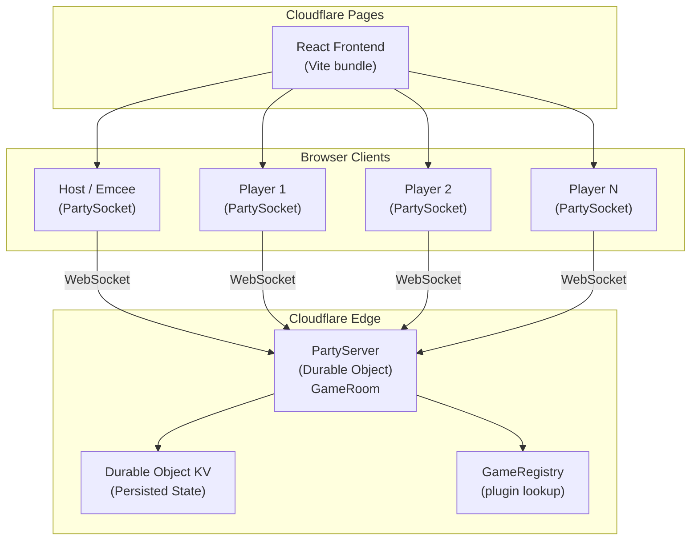
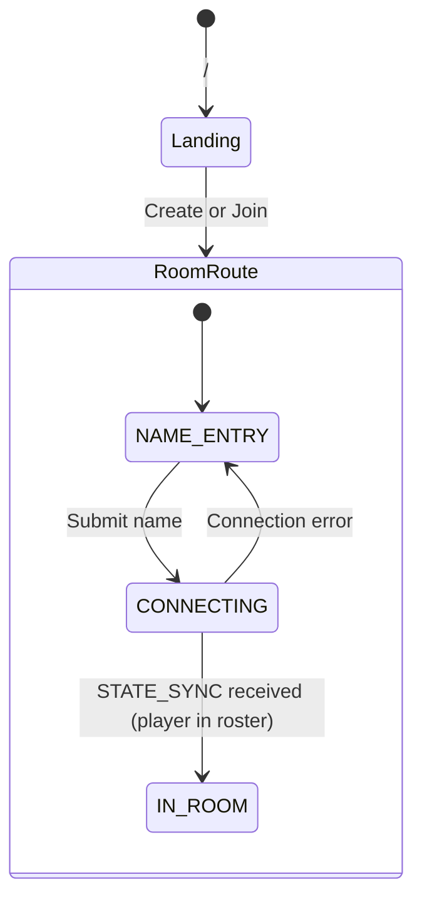
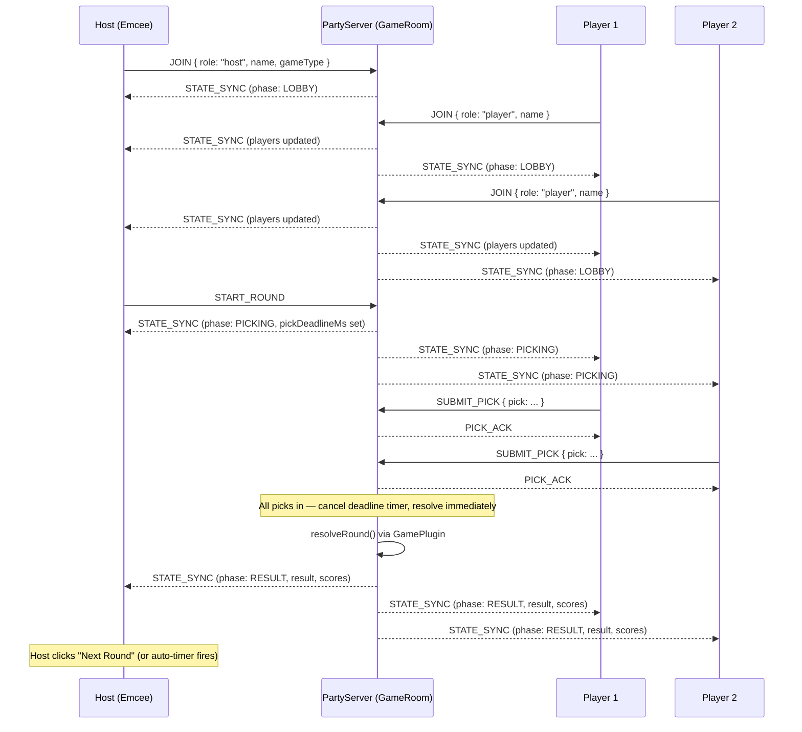
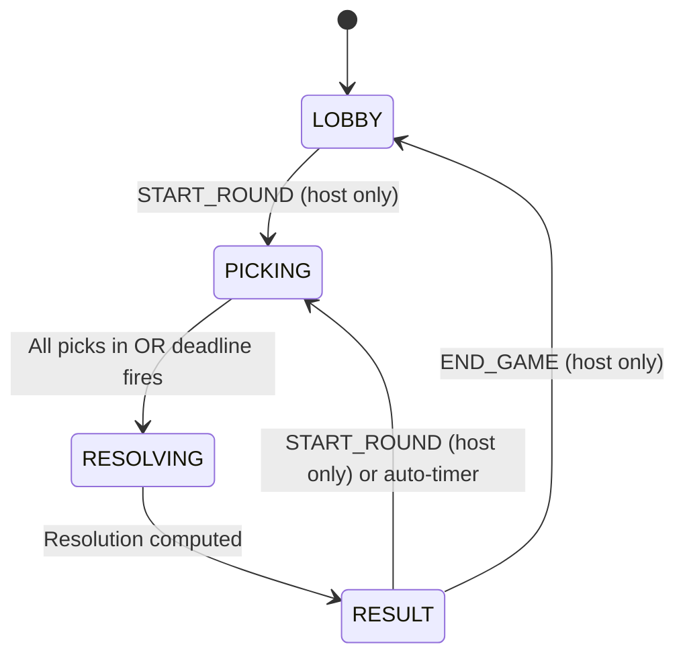
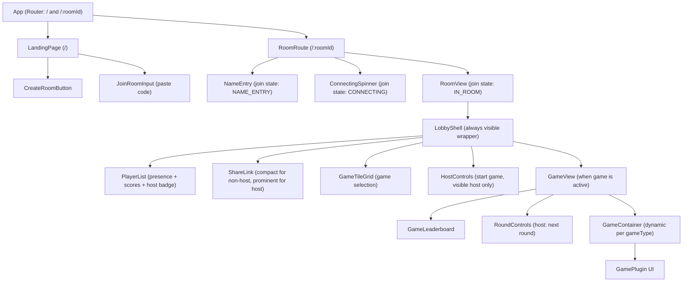

# Design Document: Games of Chance — Live Multiplayer Web Suite

## Overview

A suite of live multiplayer, browser-based games of chance built for mobile-first responsive play. Players join a shared room, make their picks, and watch a live animated result on a shared game board. The architecture is intentionally extensible so additional games (coin toss, dice, roulette, card draws, etc.) can be added without structural changes.

The system is designed around a room/session model with real-time state synchronization via `@cloudflare/partykit`. A designated room host (Emcee) controls the game flow — manually triggering rounds or enabling an auto-timer mode. All connected players see the same game state in real time.

**Dual scoring modes** are supported at the session level: **GrandPrix** (rank-based placement points) and **Chips** (raw score accumulation). The host selects the mode at room creation. Game plugins remain scoring-model-agnostic — they report raw deltas, and the session layer interprets them.

Each game's detailed design is documented in its own file:
`.kiro/specs/games-of-chance/{game-name}/design.md`

See the [Coin Toss design](./coin-toss/design.md) as the reference implementation.

---

## Lessons from First Implementation Attempt

The following bugs drove the architectural changes in this revision:

1. **Join flow infinite loop** — players got stuck cycling on "enter name" screen due to route-based navigation. Fixed by making join a single-route state machine.
2. **Round resolution fired randomly** — timer and "all picks in" could both trigger `resolveRound`. Fixed by making `resolveRound` idempotent with explicit timer cancellation.
3. **"Start Round" visible during active rounds** — client didn't enforce phase guards. Fixed by mandating client-side phase mirroring.
4. **No landing page** — users landed directly in room creation. Fixed by adding a `/` landing route.
5. **Share link too prominent for non-hosts** — Fixed by making share link compact for non-hosts.
6. **Used old `partykit` APIs** — Fixed by specifying `@cloudflare/partykit` with `PartyServer` class pattern exclusively.

---

## Tech Stack

### Frontend: React + TypeScript + Vite

- **React 18** with TypeScript — component-driven, mobile-first UI
- **Vite** — fast HMR, small bundles, tree-shakes unused game plugins
- **Zustand** — lightweight client state for local UI state
- **Framer Motion** — animation library for game-specific visual effects
- **Tailwind CSS** — responsive utility-first styling

### Backend: @cloudflare/partykit

- **`@cloudflare/partykit`** — PartyServer runtime built on Cloudflare Durable Objects
- Each `PartyServer` instance holds a room's live state in memory and broadcasts updates via WebSocket
- `this.party.storage` (Durable Object KV) for leaderboard and session persistence — no separate database needed
- **`partysocket`** — companion client package providing `PartySocket`, a WebSocket wrapper with automatic reconnection

> **CRITICAL**: Always use `@cloudflare/partykit` and `partysocket`. The old `partykit` package is defunct and must NOT be used.

### Hosting: Cloudflare Pages + @cloudflare/partykit

- **Cloudflare Pages** for the React frontend (CDN-distributed, generous free tier)
- **`@cloudflare/partykit`** for the backend (`npx partykit deploy` deploys the PartyServer)
- `partykit.json` is used for deployment configuration

---

## Animation & Asset Pipeline

### Philosophy

Each game plugin has its own visual identity expressed through 2D animations. The pipeline is designed for **placeholder assets that can be easily swapped** — generated SVGs or simple canvas-based animations that are visually interesting but replaceable with polished art later.

### Asset Structure

Each game plugin maintains its own assets folder in the client package:

```
packages/client/src/games/{game-name}/
├── assets/
│   ├── sprites/           # SVG files or exported sprite sheets
│   │   ├── coin-heads.svg
│   │   ├── coin-tails.svg
│   │   └── coin-edge.svg
│   ├── animations/        # Framer Motion variant definitions (declarative)
│   │   └── flipVariants.ts
│   └── sounds/            # (future) audio clips per game event
│       └── .gitkeep
├── CoinFlipAnimation.tsx  # Component that composes sprites + motion variants
└── ...
```

### Animation Architecture

Animations are structured as **composable layers** to keep them swappable:

1. **Sprites** (static assets): SVG files or simple React components that render a visual element. These are the "what" — the coin face, the dice, the card.

2. **Motion Variants** (declarative animation config): Framer Motion `variants` objects that define "how" things move. Stored as plain TypeScript objects in `animations/` files.

3. **Animation Components** (composition): React components that combine sprites with motion variants. The component handles timing and state transitions; the visual and motion are imported.

```typescript
// packages/client/src/games/coin-toss/assets/animations/flipVariants.ts

import type { Variants } from "framer-motion"

/** Coin flip animation variants — swap these to change the feel */
export const coinFlipVariants: Variants = {
  idle: { rotateY: 0, scale: 1 },
  flipping: {
    rotateY: [0, 360, 720, 1080, 1440],
    scale: [1, 1.1, 1, 1.1, 1],
    transition: { duration: 1.8, ease: "easeOut" },
  },
  landed: {
    rotateY: 0,  // or 180 for tails
    scale: 1,
    transition: { type: "spring", stiffness: 300, damping: 20 },
  },
}
```

### Placeholder Asset Guidelines

For MVP, assets are generated/hand-drawn SVGs that are **functional and visually clear** but not final art:

- **Coin**: Simple circular SVG with distinct "H" and "T" faces, subtle gradient, drop shadow
- **Dice** (future): Flat-design dice face SVGs with rounded corners
- **Cards** (future): Minimalist card back + face SVGs

**Swap pattern**: To upgrade an asset, replace the SVG file in `assets/sprites/` and optionally tweak the motion variants. No logic changes needed.

### Animation Timing Contract

Each game plugin's animation component must expose:
- `onAnimationComplete` callback — fired when the reveal animation finishes (so the UI can transition to ResultDisplay)
- `duration` (derived from motion variants) — used for skip logic on reconnect

If `flippedAt` is in the past when a client receives state (reconnect scenario), the animation skips to the final frame immediately.

---

## Architecture

### High-Level System Diagram



### Client-Side Route & Join Flow (Single-Route State Machine)

The join flow is a **single-route state machine** to prevent the infinite navigation loop from the first implementation:

- `/` → Landing page with "Create Room" and "Join Room" (paste code) options
- `/:roomId` → Single component that transitions through internal states:
  - `NAME_ENTRY` → Show name input form
  - `CONNECTING` → Show loading spinner, attempting WebSocket connection
  - `IN_ROOM` → Show lobby/game view (permanent once STATE_SYNC received with player in roster)

**NO route changes occur after entering `/:roomId`**. All transitions are component-internal state changes.



---

### Room Lifecycle



### Server-Side Phase State Machine



**Valid phases**: `LOBBY`, `PICKING`, `RESOLVING`, `RESULT`

There is NO `BETWEEN_ROUNDS` phase. The transition from RESULT goes directly back to PICKING (next round) or LOBBY (game ended).

---

### Component Architecture



### Lobby Design (The Social Hub)

The lobby is the primary social experience and is always the shell around game play:

- **Player list**: Shows each player with:
  - Host badge (crown icon) for the host
  - Connection status indicator (green dot = connected, grey = disconnected)
  - Current session score
- **Share link**: 
  - **Host**: Prominent share card with room URL and copy button (only in initial lobby before first game)
  - **Non-host**: Small copy icon button in the corner — unobtrusive
- **Game tiles**: Board-game-cover style cards in a mobile-friendly grid
  - Coin Toss: Active, playable
  - Others: "Coming Soon" placeholder tiles with lock/dimmed overlay
- **Host controls**: "Start Game" button (launches selected game tile) — visible only to host
- **Session scores**: Displayed on player list entries (0 for all at start)

---

## Components and Interfaces

### Shared TypeScript Types

```typescript
// packages/shared/src/types.ts

type GameType = string  // e.g. "coin-toss", "dice-roll" — extensible registry

type ScoringMode = "grand-prix" | "chips"

interface RoomConfig {
  roomId: string
  gameType: GameType
  maxPlayers: number
  scoringMode: ScoringMode          // selected by host at room creation
  autoMode: boolean
  autoRoundIntervalMs: number
  placementPoints: number[]         // GrandPrix mode only: index 0 = 1st place points, etc.
                                    // default: [10, 5, 3, 1, 1, 1, 1, 0, 0, 0]
}

interface Player {
  id: string                        // original connection ID (stable identity)
  name: string
  role: "host" | "player"
  connected: boolean
  connectionId: string | null       // current active connection ID (may differ from id after re-link)
                                    // Post-MVP: host-assisted reconnection changes this
}

type RoundPhase =
  | "LOBBY"
  | "PICKING"
  | "RESOLVING"
  | "RESULT"

// NOTE: No BETWEEN_ROUNDS phase. RESULT transitions directly to PICKING or LOBBY.

interface RoundState {
  phase: RoundPhase
  roundNumber: number
  pickDeadlineMs: number | null
  picks: Record<string, unknown>    // playerId → game-specific pick (opaque to core)
  result: unknown | null            // game-specific result (opaque to core)
  resolvedAt: number | null
  timerId: number | null            // server-side only: reference to deadline timer for cancellation
}

// ── Scoring ────────────────────────────────────────────────────────────────

interface RoundScoreResult {
  deltas: Record<string, number>          // playerId → raw score earned this round
  modifiers?: Record<string, ScoreModifier[]>  // optional per-player modifiers for UI
}

interface ScoreModifier {
  type: string        // e.g. "streak", "combo", "bonus"
  label: string       // e.g. "3x Streak!"
  multiplier?: number
}

// ── Session Scoring Strategy ───────────────────────────────────────────────

interface SessionUpdate {
  sessionScores: Record<string, number>    // updated session totals
  sessionLeaderboard: SessionLeaderboardEntry[]
}

interface SessionScoringStrategy {
  mode: ScoringMode
  applyGameResult(
    players: Player[],
    gameLeaderboard: GameLeaderboardEntry[],
    rawScores: Record<string, number>
  ): SessionUpdate
}

// GrandPrix: ignores rawScores, orders by gameLeaderboard rank, awards placementPoints
// Chips: ignores gameLeaderboard rank, takes rawScores directly and adds to balance

// ── Two-tier leaderboard ───────────────────────────────────────────────────

/**
 * Game leaderboard: tracks score within a single game instance.
 * Owned and populated by the GamePlugin. Resets when a new game starts.
 */
interface GameLeaderboardEntry {
  playerId: string
  playerName: string
  score: number
  rank: number
}

/**
 * Session leaderboard: tracks cumulative points across all games.
 * In GrandPrix mode: placement points from rank table.
 * In Chips mode: raw score accumulation.
 */
interface SessionLeaderboardEntry {
  playerId: string
  playerName: string
  sessionPoints: number
  gamesPlayed: number
  rank: number
}

interface RoomState {
  room: RoomConfig
  players: Player[]
  round: RoundState
  gameLeaderboard: GameLeaderboardEntry[]
  sessionLeaderboard: SessionLeaderboardEntry[]
}

type ClientMessage =
  | { type: "JOIN";          payload: { name: string; role: "host" | "player" } }
  | { type: "SUBMIT_PICK";   payload: { pick: unknown } }
  | { type: "START_ROUND";   payload?: never }
  | { type: "END_GAME";      payload?: never }
  | { type: "SET_AUTO_MODE"; payload: { enabled: boolean; intervalMs: number } }
  | { type: "KICK_PLAYER";   payload: { playerId: string } }
  | { type: "LINK_PLAYER";   payload: { oldPlayerId: string; newConnectionId: string } }  // post-MVP

type ServerMessage =
  | { type: "STATE_SYNC"; payload: RoomState }
  | { type: "PICK_ACK";   payload: { playerId: string } }
  | { type: "ERROR";      payload: { code: string; message: string } }
```

### GamePlugin Interface

```typescript
// packages/server/src/games/GamePlugin.ts

interface GamePlugin<TPick = unknown, TResult = unknown> {
  gameType: GameType

  /** Validate a player's pick before accepting it */
  validatePick(pick: unknown): pick is TPick

  /** Compute the round result server-side */
  resolveRound(picks: Record<string, TPick>): TResult

  /**
   * Determine which players scored this round and by how much.
   * Returns RoundScoreResult with raw deltas and optional modifiers.
   * Game plugins are scoring-model-agnostic — they report raw deltas.
   * The session layer interprets them based on ScoringMode.
   */
  scoreRound(
    picks: Record<string, TPick>,
    result: TResult,
    players: Player[]
  ): RoundScoreResult

  /**
   * Produce the final ranked game leaderboard when the host ends the game.
   * Used by GrandPrix mode to determine placement points.
   * In Chips mode, rank is informational only.
   */
  computeGameLeaderboard(
    players: Player[],
    gameScores: Record<string, number>
  ): GameLeaderboardEntry[]

  /** How long the pick window stays open (ms) */
  pickWindowMs: number
}
```

### Game Plugin Tuning Constants

Each game plugin MUST extract all tunable scoring, timing, and balance values into a dedicated constants file. This makes balancing each game (and comparing games against each other) a simple file edit rather than a code dig.

**Convention**: `packages/server/src/games/{game-name}/constants.ts`

```typescript
// packages/server/src/games/coin-toss/constants.ts

/** All tunable values for the Coin Toss plugin */
export const COIN_TOSS = {
  /** Points awarded per correct guess */
  CORRECT_GUESS_CHIPS: 10,

  /** Duration of the pick window in milliseconds */
  PICK_WINDOW_MS: 10_000,

  /** Multiplier applied for consecutive correct guesses (future) */
  STREAK_MULTIPLIER: 2,

  /** Number of consecutive correct guesses needed to trigger streak bonus (future) */
  STREAK_THRESHOLD: 3,

  /** Maximum multiplier cap (future) */
  MAX_MULTIPLIER: 5,
} as const
```

**Rules for constants files**:
1. All numeric tuning values live in `constants.ts` — NEVER inline magic numbers in plugin logic
2. Constants are exported as a single `as const` object named after the game (UPPER_SNAKE_CASE)
3. Each value has a JSDoc comment explaining what it controls
4. The plugin implementation imports from its own constants file
5. Future modifiers (streak, combo) are included with `(future)` annotation — values are defined but not yet consumed by logic until implemented

**Example usage in plugin**:
```typescript
// packages/server/src/games/coin-toss/CoinTossPlugin.ts
import { COIN_TOSS } from "./constants"

// ...
pickWindowMs: COIN_TOSS.PICK_WINDOW_MS,
// ...
deltas[player.id] = pick?.side === result.outcome ? COIN_TOSS.CORRECT_GUESS_CHIPS : 0
```

This pattern scales to any game plugin:
```typescript
// packages/server/src/games/dice-roll/constants.ts (future example)
export const DICE_ROLL = {
  EXACT_MATCH_CHIPS: 50,
  ADJACENT_MATCH_CHIPS: 10,
  PICK_WINDOW_MS: 15_000,
  NUM_DICE: 2,
  STREAK_MULTIPLIER: 1.5,
  STREAK_THRESHOLD: 2,
} as const
```

### Session Scoring Strategies

```typescript
// packages/server/src/scoring/SessionScoringStrategy.ts

class GrandPrixStrategy implements SessionScoringStrategy {
  mode = "grand-prix" as const

  applyGameResult(
    players: Player[],
    gameLeaderboard: GameLeaderboardEntry[],
    _rawScores: Record<string, number>  // ignored in GrandPrix
  ): SessionUpdate {
    // Order players by gameLeaderboard rank
    // Award placementPoints[rank - 1] to each player
    // Return updated session totals
  }
}

class ChipsStrategy implements SessionScoringStrategy {
  mode = "chips" as const

  applyGameResult(
    players: Player[],
    _gameLeaderboard: GameLeaderboardEntry[],  // rank is informational only
    rawScores: Record<string, number>
  ): SessionUpdate {
    // Take rawScores directly and add to each player's session balance
    // Return updated session totals
  }
}
```

### GameRegistry

```typescript
// packages/server/src/games/GameRegistry.ts

class GameRegistry {
  private plugins = new Map<GameType, GamePlugin>()

  register(plugin: GamePlugin): void {
    this.plugins.set(plugin.gameType, plugin)
  }

  lookup(gameType: GameType): GamePlugin {
    const plugin = this.plugins.get(gameType)
    if (!plugin) throw new Error(`Unknown gameType: ${gameType}`)
    return plugin
  }

  list(): GameType[] {
    return Array.from(this.plugins.keys())
  }
}

export const registry = new GameRegistry()
```

### PartyServer Room Class

```typescript
// packages/server/src/room.ts
import type { Party, PartyServer, PartyConnection } from "@cloudflare/partykit/server"

export default class GameRoom implements PartyServer {
  readonly party: Party
  private state: LiveRoomState
  private deadlineTimerId: ReturnType<typeof setTimeout> | null = null

  constructor(party: Party) {
    this.party = party
  }

  async onStart() {
    // Load persisted state from this.party.storage on cold start
  }

  async onConnect(connection: PartyConnection) {
    // Send current STATE_SYNC to newly connected client
  }

  async onMessage(message: string, sender: PartyConnection) {
    const msg: ClientMessage = JSON.parse(message)
    await this.handleMessage(sender, msg)
  }

  async onClose(connection: PartyConnection) {
    // Mark player disconnected
    // Check if host needs promotion
    // Check if all remaining connected players have picked (unblock round)
  }

  private cancelDeadlineTimer() {
    if (this.deadlineTimerId !== null) {
      clearTimeout(this.deadlineTimerId)
      this.deadlineTimerId = null
    }
  }

  private scheduleResolve(delayMs: number) {
    this.cancelDeadlineTimer()  // always cancel before setting new timer
    this.deadlineTimerId = setTimeout(() => this.resolveRound(), delayMs)
  }

  private broadcastState() {
    const payload: ServerMessage = { type: "STATE_SYNC", payload: this.getPublicState() }
    this.party.broadcast(JSON.stringify(payload))
  }
}
```

> **CRITICAL**: `scheduleResolve` always cancels the previous timer before setting a new one. When all picks are in and `resolveRound` triggers early, the deadline timer is explicitly cancelled via `cancelDeadlineTimer()`. This prevents the double-fire bug from the first implementation.

### Client-Side State (Zustand Store)

```typescript
// packages/client/src/store/useGameStore.ts

type JoinState = "NAME_ENTRY" | "CONNECTING" | "IN_ROOM"

interface ClientStore {
  // Join flow state (single-route state machine)
  joinState: JoinState
  setJoinState: (state: JoinState) => void

  // Identity
  roomId: string | null
  playerId: string | null
  playerName: string | null
  role: "host" | "player" | null

  // Connection
  connectionStatus: "connecting" | "connected" | "disconnected" | "error"

  // Server state mirror
  roomState: RoomState | null

  // Client-side pick tracking (prevents double-submission)
  pickSubmitted: boolean
  currentRoundNumber: number | null

  // Actions
  connect: (roomId: string, name: string, role: "host" | "player") => void
  submitPick: (pick: unknown) => void
  startRound: () => void
  setAutoMode: (enabled: boolean, intervalMs: number) => void

  // Internal
  _onStateSync: (state: RoomState) => void
  _resetPickOnNewRound: (roundNumber: number) => void
}
```

**Client-side phase guards** (enforced in components):
- "Start Round" button: rendered ONLY when `phase === "LOBBY" || phase === "RESULT"` AND `role === "host"`
- Pick buttons: rendered ONLY when `phase === "PICKING"` AND `!pickSubmitted`
- `pickSubmitted` is set to `true` on send, blocks re-submission
- `pickSubmitted` resets when `roundNumber` changes (new round detected in STATE_SYNC)

### Client: PartySocket Connection

```typescript
// packages/client/src/hooks/usePartySocket.ts
import PartySocket from "partysocket"

const socket = new PartySocket({
  host: PARTYKIT_HOST,  // e.g. "my-app.username.partykit.dev"
  room: roomId,
})

socket.addEventListener("message", (event) => {
  const msg: ServerMessage = JSON.parse(event.data)
  switch (msg.type) {
    case "STATE_SYNC":
      store._onStateSync(msg.payload)
      // If player is in roster and joinState !== "IN_ROOM", transition permanently
      if (store.joinState !== "IN_ROOM" && isPlayerInRoster(msg.payload, store.playerId)) {
        store.setJoinState("IN_ROOM")
      }
      // Reset pick tracking on new round
      if (msg.payload.round.roundNumber !== store.currentRoundNumber) {
        store._resetPickOnNewRound(msg.payload.round.roundNumber)
      }
      break
    case "PICK_ACK":
      // pickSubmitted already set optimistically on send
      break
    case "ERROR":
      handleError(msg.payload)
      break
  }
})
```

---

## Server-Side Algorithms

### Message Dispatch

```pascal
PROCEDURE handleMessage(connection, message)
  SWITCH message.type
    CASE "JOIN":
      IF count(state.players) >= state.room.maxPlayers THEN
        sendError(connection, "ROOM_FULL")
        RETURN
      END IF
      player ← createPlayer(connection.id, message.payload)
      // If first player to join OR explicit host role, assign as host
      IF count(state.players) = 0 THEN
        player.role ← "host"
      ELSE IF message.payload.role = "host" AND noCurrentHost() THEN
        player.role ← "host"
      ELSE
        player.role ← "player"  // demote duplicate host attempts
      END IF
      state.players.add(player)
      broadcastState()

    CASE "SUBMIT_PICK":
      IF state.round.phase ≠ "PICKING" THEN
        sendError(connection, "WRONG_PHASE")
        RETURN
      END IF
      IF currentTime() > state.round.pickDeadlineMs THEN
        sendError(connection, "DEADLINE_PASSED")
        RETURN
      END IF
      IF state.round.picks[connection.id] IS NOT NULL THEN
        // Pick already recorded — ignore silently (immutability)
        RETURN
      END IF
      IF NOT plugin.validatePick(message.payload.pick) THEN
        sendError(connection, "INVALID_PICK")
        RETURN
      END IF
      state.round.picks[connection.id] ← message.payload.pick
      sendPickAck(connection)
      IF allConnectedPlayersHavePicked() THEN
        cancelDeadlineTimer()          // CRITICAL: cancel timer before early resolve
        scheduleResolve(0)             // resolve immediately
      END IF

    CASE "START_ROUND":
      IF connection.id ≠ hostId(state) THEN
        sendError(connection, "NOT_HOST")
        RETURN
      END IF
      IF state.round.phase ∉ {"LOBBY", "RESULT"} THEN
        sendError(connection, "WRONG_PHASE")
        RETURN
      END IF
      beginRound()

    CASE "END_GAME":
      IF connection.id ≠ hostId(state) THEN
        sendError(connection, "NOT_HOST")
        RETURN
      END IF
      endGame()

    CASE "SET_AUTO_MODE":
      IF connection.id ≠ hostId(state) THEN
        sendError(connection, "NOT_HOST")
        RETURN
      END IF
      state.room.autoMode ← message.payload.enabled
      state.room.autoRoundIntervalMs ← message.payload.intervalMs
      broadcastState()

    CASE "KICK_PLAYER":
      IF connection.id ≠ hostId(state) THEN
        sendError(connection, "NOT_HOST")
        RETURN
      END IF
      removePlayer(message.payload.playerId)
      broadcastState()
  END SWITCH
END PROCEDURE
```

### Round State Machine

```pascal
PROCEDURE beginRound()
  cancelDeadlineTimer()  // safety: cancel any lingering timer
  state.round ← {
    phase: "PICKING",
    roundNumber: state.round.roundNumber + 1,
    picks: {},
    result: null,
    pickDeadlineMs: now() + plugin.pickWindowMs,
    resolvedAt: null
  }
  broadcastState()
  scheduleResolve(plugin.pickWindowMs)  // sets deadline timer
END PROCEDURE

PROCEDURE resolveRound()
  // IDEMPOTENCY GUARD: Only resolves if currently PICKING
  // Both timer expiry and "all picks in" may call this — only the first takes effect
  IF state.round.phase ≠ "PICKING" THEN
    RETURN  // no-op: already resolved or wrong phase
  END IF

  cancelDeadlineTimer()  // ensure timer is cleared regardless of trigger source
  state.round.phase ← "RESOLVING"
  broadcastState()

  result ← plugin.resolveRound(state.round.picks)
  scoreResult ← plugin.scoreRound(state.round.picks, result, state.players)

  FOR EACH (playerId, delta) IN scoreResult.deltas
    state.gameScores[playerId] += delta
  END FOR

  state.round ← { ...state.round, phase: "RESULT", result, resolvedAt: now() }
  state.gameLeaderboard ← plugin.computeGameLeaderboard(state.players, state.gameScores)
  broadcastState()

  IF state.room.autoMode THEN
    scheduleNextRound(state.room.autoRoundIntervalMs)
  END IF
END PROCEDURE

PROCEDURE endGame()
  // Called by host — transitions from active game back to lobby
  IF state.round.phase ∉ {"RESULT", "LOBBY"} THEN
    RETURN  // cannot end mid-round
  END IF

  cancelDeadlineTimer()

  // Apply session scoring based on mode
  strategy ← getScoringStrategy(state.room.scoringMode)
  update ← strategy.applyGameResult(state.players, state.gameLeaderboard, state.gameScores)
  state.sessionScores ← update.sessionScores
  state.sessionLeaderboard ← update.sessionLeaderboard

  // Reset game state for next game
  state.gameScores ← {}
  state.gameLeaderboard ← []
  state.round ← { phase: "LOBBY", roundNumber: 0, picks: {}, result: null,
                   pickDeadlineMs: null, resolvedAt: null }
  broadcastState()
END PROCEDURE

PROCEDURE onClose(connection)
  player ← findPlayer(connection.id)
  IF player IS NULL THEN RETURN END IF

  player.connected ← false
  player.connectionId ← null

  // Host promotion: if disconnected player was host, promote first connected player
  IF player.role = "host" THEN
    candidate ← firstConnectedPlayer(state.players)
    IF candidate IS NOT NULL THEN
      candidate.role ← "host"
    END IF
  END IF

  // Unblock round: if all remaining connected players have picked, resolve early
  IF state.round.phase = "PICKING" AND allConnectedPlayersHavePicked() THEN
    cancelDeadlineTimer()
    scheduleResolve(0)
  END IF

  broadcastState()
END PROCEDURE
```

---

## Formal Specifications (Core)

### `resolveRound`
- **Pre**: `phase = "PICKING"`, plugin registered for `gameType`
- **Post**: phase transitions `PICKING → RESOLVING → RESULT`; every player in `picks` gets game-score delta ≥ 0; `gameLeaderboard` recomputed by plugin; deadline timer is cancelled
- **Idempotency**: If `phase ≠ "PICKING"`, no-op — no state mutation, no broadcast

### `beginRound`
- **Pre**: `phase ∈ {"LOBBY", "RESULT"}`, caller is host
- **Post**: phase = `"PICKING"`, `roundNumber` incremented, `picks` empty, `pickDeadlineMs` set, deadline timer scheduled

### `endGame`
- **Pre**: `phase ∈ {"RESULT", "LOBBY"}` (game not mid-round)
- **Post**: session scoring applied via selected strategy; `gameScores` and `gameLeaderboard` reset; phase = `"LOBBY"`

### `handleMessage`
- **Pre**: `connection.id` is a connected player; `message` is a valid `ClientMessage`
- **Post**: mutations only if all guards pass; guard failures send `ERROR` to sender only; every successful mutation calls `broadcastState()`

### `cancelDeadlineTimer`
- **Pre**: none (safe to call at any time)
- **Post**: if a timer exists, it is cleared and will not fire; `deadlineTimerId` is null

---

## Data Models

### Server-Side In-Memory State

```typescript
// Lives in the PartyServer instance (in memory during a session)
interface LiveRoomState {
  config: RoomConfig
  players: Record<string, Player>
  round: RoundState

  // Game-scoped (reset each time a new game starts)
  gameScores: Record<string, number>        // playerId → score within current game
  gameLeaderboard: GameLeaderboardEntry[]   // plugin-computed, updated each round

  // Session-scoped (accumulates across all games in this room)
  sessionScores: Record<string, number>           // playerId → session points total
  sessionGamesPlayed: Record<string, number>      // playerId → games participated in
  sessionLeaderboard: SessionLeaderboardEntry[]   // updated when a game ends

  // Timer management
  deadlineTimerId: ReturnType<typeof setTimeout> | null
}
```

### Persisted Room State (Durable Object KV — post-MVP)

```typescript
interface PersistedRoomState {
  config: RoomConfig
  players: Record<string, Player>
  currentRound: RoundState
  gameScores: Record<string, number>
  sessionScores: Record<string, number>
  sessionGamesPlayed: Record<string, number>
  history: GameHistoryEntry[]
  createdAt: number
  lastActivityAt: number
}

interface GameHistoryEntry {
  gameType: GameType
  finalGameLeaderboard: GameLeaderboardEntry[]
  pointsAwarded: Record<string, number>  // what was awarded via session strategy
  endedAt: number
}
```

---

## Error Handling

| Condition | Server Response | Client Recovery |
|---|---|---|
| WebSocket drop | — | Exponential backoff reconnect (500ms→1s→2s→4s→max 30s); on reconnect server sends full `STATE_SYNC` |
| Room full | `ERROR { ROOM_FULL }` | Show "Room is full" with retry option |
| Deadline missed | `ERROR { DEADLINE_PASSED }` | Show "You missed the window" |
| Host disconnects | Room pauses; auto-timer suspended | Host has 60s to reconnect; else first connected player promoted |
| Invalid pick | `ERROR { INVALID_PICK }` | Client-side validation prevents this; server rejects silently |
| Unknown gameType | `ERROR { UNKNOWN_GAME_TYPE }` | Show error; cannot start rounds |
| Wrong phase | `ERROR { WRONG_PHASE }` | Client UI prevents this via phase guards; server rejects silently |
| Not host | `ERROR { NOT_HOST }` | Client UI prevents this via role check; server rejects silently |
| Duplicate pick (same round) | Silently ignored | `pickSubmitted` flag prevents client re-send |

---

## Security Considerations

- **Room IDs**: Unguessable (UUID v4 or high-entropy alphanumeric). No login system required.
- **Host role**: Assigned server-side. If a second "host" attempts to join, they are demoted to "player".
- **Input validation**: All `ClientMessage` payloads validated server-side via `plugin.validatePick()` and message type guards.
- **Rate limiting**: One pick per player per round, enforced server-side (immutability after first pick).
- **No PII**: Player names are ephemeral display strings. No accounts, no email.
- **CORS**: REST endpoints (room creation) restrict `Origin` to the Pages domain.
- **Timer safety**: Timer IDs tracked and explicitly cleared to prevent stale callbacks from mutating state.

---

## Correctness Properties

*A property is a characteristic or behavior that should hold true across all valid executions of a system — essentially, a formal statement about what the system should do.*

### Property 1: Single Active Round

*For any* room state, at most one round is active at any given time (i.e., `phase ∈ {PICKING, RESOLVING}` is true for at most one round simultaneously).

**Validates: Requirements 9.1, 12.1**

---

### Property 2: Pick Immutability

*For any* player who has received a `PICK_ACK` for the current round, subsequent `SUBMIT_PICK` messages from that player SHALL leave the stored pick unchanged.

**Validates: Requirements 11.5**

---

### Property 3: Host Uniqueness

*For any* sequence of player joins and disconnects, exactly one connected player holds the `"host"` role at any time (when the room is non-empty).

**Validates: Requirements 4.1, 4.2, 4.3**

---

### Property 4: Game Score Monotonicity

*For any* sequence of rounds with any outcomes, no player's game-scope score (`gameScores[playerId]`) ever decreases between rounds within a single game.

**Validates: Requirements 14.1**

---

### Property 5: Game Leaderboard Rank-1 Consistency

*For any* array of game leaderboard entries, the player assigned rank 1 always holds the maximum (or tied-maximum) game score.

**Validates: Requirements 14.2**

---

### Property 6: Phase Ordering

*For any* room, phase transitions follow only the permitted DAG: `LOBBY → PICKING → RESOLVING → RESULT → PICKING | LOBBY`. No other phase transition is valid.

**Validates: Requirements 9.1, 9.4, 12.1**

---

### Property 7: Broadcast Atomicity

*For any* state mutation that triggers a broadcast, all connected clients receive an identical `STATE_SYNC` payload for that state version — no client receives a different or stale version.

**Validates: Requirements 5.2, 9.2, 13.1**

---

### Property 8: Authorization Guards

*For any* non-host player, sending `START_ROUND` or `END_GAME` SHALL return `ERROR { code: "NOT_HOST" }` to the sender only, with no change to room state.

**Validates: Requirements 9.3, 17.4**

---

### Property 9: Pick Window Enforcement

*For any* `SUBMIT_PICK` message received when `currentTime > pickDeadlineMs`, the PartyServer SHALL return `ERROR { code: "DEADLINE_PASSED" }` and SHALL NOT record the pick.

**Validates: Requirements 10.3**

---

### Property 10: Disconnection Safety

*For any* room in `PICKING` phase where all remaining connected players have submitted picks, a player disconnecting SHALL NOT block round resolution.

**Validates: Requirements 24.1**

---

### Property 11: Game Leaderboard Connected-Players Only

*For any* player roster containing a mix of `connected: true` and `connected: false` players, the computed game leaderboard SHALL contain entries only for `connected: true` players.

**Validates: Requirements 14.4**

---

### Property 12: Leaderboard Tie Rank Equality

*For any* two players with identical scores in either leaderboard, they SHALL be assigned equal rank values.

**Validates: Requirements 14.3, 20.4**

---

### Property 13: Phase Guard — SUBMIT_PICK Outside PICKING

*For any* `SUBMIT_PICK` message received when `phase ≠ "PICKING"`, the PartyServer SHALL return `ERROR { code: "WRONG_PHASE" }` and SHALL NOT record the pick.

**Validates: Requirements 10.3, 11.7**

---

### Property 14: resolveRound Idempotency

*For any* call to `resolveRound` when `phase ≠ "PICKING"`, the room state SHALL remain unchanged (no score updates, no phase transition, no broadcast). This ensures both timer-expiry and "all-picks-in" can fire without conflict.

**Validates: Requirements 12.6**

---

### Property 15: State Resync on Connect

*For any* room state at the time a client connects (or reconnects), the PartyServer SHALL immediately send a `STATE_SYNC` containing the complete current `RoomState` to that client.

**Validates: Requirements 8.2, 21.3**

---

### Property 16: Reconnection Backoff Sequence

*For any* sequence of reconnection attempts after a WebSocket drop, the delay between attempts SHALL follow exponential backoff starting at 500 ms, doubling each attempt, capped at 30 000 ms.

**Validates: Requirements 21.2**

---

### Property 17: Room_ID Uniqueness

*For any* two independently generated Room_IDs, they SHALL NOT be equal (collisions are statistically negligible with UUID v4 entropy of ≥ 128 bits).

**Validates: Requirements 2.2, 2.3**

---

### Property 18: Leaderboard Entry Completeness

*For any* leaderboard entry, the rendered output SHALL contain the player's name, cumulative score, and rank.

**Validates: Requirements 14.5, 20.2**

---

### Property 19: Session Points Monotonicity

*For any* sequence of completed games, no player's `sessionPoints` ever decreases (in both GrandPrix and Chips modes, scores are additive).

**Validates: Requirements 20.3**

---

### Property 20: Placement Points Isolation (GrandPrix Mode)

*For any* game that ends in GrandPrix mode, the session leaderboard update SHALL be derived exclusively from the final `gameLeaderboard` rankings and the `placementPoints` table — never from game-specific raw scores directly.

**Validates: Requirements 19.4**

---

### Property 21: Chips Mode Direct Accumulation

*For any* game that ends in Chips mode, the session score update SHALL equal the sum of all raw `scoreRound` deltas reported by the plugin for that game — no rank-based transformation applied.

**Validates: Requirements 19.5**

---

### Property 22: Timer Cancellation on Early Resolve

*For any* round where all connected players submit picks before the deadline, the deadline timer SHALL be explicitly cancelled before `resolveRound` executes. No stale timer callback shall mutate state.

**Validates: Requirements 10.4**

---

### Property 23: Client Join State Non-Regression

*For any* client that has transitioned to `IN_ROOM` state (received STATE_SYNC with self in roster), the client SHALL NOT transition back to `NAME_ENTRY` or `CONNECTING` within the same browser session.

**Validates: Requirements 3.4, 3.6**

---

### Property 24: Client-Side Phase Guard Enforcement

*For any* client render cycle, the "Start Round" button SHALL be rendered if and only if `phase ∈ {"LOBBY", "RESULT"}` AND `role === "host"`. Pick buttons SHALL be rendered if and only if `phase === "PICKING"` AND `pickSubmitted === false`.

**Validates: Requirements 16.1, 16.2, 16.4**

---

## Performance Considerations

- **Current scale**: 10 players/room — trivial for a single Durable Object process.
- **Broadcast cost**: Full state broadcast on every change. Acceptable at 10 players; switch to delta/patch at 100+.
- **Bundle size**: Target <150KB gzipped initial bundle. Vite tree-shakes unused game plugins on the client.
- **Scaling**: `PartyServer` creates one Durable Object per `roomId` — rooms scale horizontally automatically.
- **Timer precision**: setTimeout in Durable Objects has sufficient precision for 10s pick windows. No drift concern at this scale.

---

## Testing Strategy

### Unit Tests (Vitest)
- Room message dispatch: phase guards, auth guards, pick deadline enforcement
- Timer cancellation: verify deadline timer cleared on early resolve
- resolveRound idempotency: call twice in same phase, second is no-op
- `computeLeaderboard`: sort order, rank assignment, disconnected player exclusion
- `SessionScoringStrategy`: GrandPrix applies placement table, Chips applies raw scores
- `GameRegistry`: plugin registration, lookup, unknown gameType errors
- Game-specific tests live in each game's own test file

### Property-Based Tests (fast-check)
- Leaderboard rank 1 always has max score (for any array of players)
- Score monotonicity: no player score decreases after any round
- Phase invariant: after `resolveRound`, phase is never `"PICKING"`
- resolveRound idempotency: calling when phase ≠ PICKING produces no state change
- Session scoring: GrandPrix and Chips both produce monotonically increasing session scores
- Game-specific properties are documented in each game's design file

### E2E Tests (Playwright)
- Full room lifecycle: landing → create → join → lobby → game → leaderboard
- Join flow: no navigation loop, single-route state machine
- Host manual start and auto-mode timer
- Player reconnect mid-game recovers full state
- Room full rejection
- Simultaneous picks from multiple tabs
- Client phase guards: buttons appear/disappear correctly per phase

### WebSocket Protocol Tests (@cloudflare/partykit test utilities)
- In-memory `PartyServer` for testing without a real network

---

## Implementation Milestones

Implementation MUST follow these milestones sequentially. Each milestone should be tested and validated before proceeding to the next.

### Milestone 1: Runnable Lobby (No Game Play)

**Goal**: A working lobby where players can join, see each other, and the host has controls — but no game rounds yet.

- Monorepo scaffold (packages/shared, packages/client, packages/server)
- Shared types package with all types defined above
- PartyServer with JOIN/disconnect/host-promotion logic ONLY (phase stays in LOBBY)
- Client: Landing page (`/`) with "Create Room" and "Join Room"
- Client: Room route (`/:roomId`) with single-route join state machine (NAME_ENTRY → CONNECTING → IN_ROOM)
- Lobby shows: player list with host badge, session scores (all zeros), connection status indicator
- Compact share link (prominent for host on first visit, small icon for others)
- Game tile grid with "Coin Toss" tile (active) and placeholder "Coming Soon" tiles
- Host "Start Game" button (disabled until Milestone 2)
- **STOP**: Test and validate lobby flow. Confirm no navigation loop. Confirm multiple players can join.

### Milestone 2: First Game Plugin (Coin Toss)

**Goal**: Full round lifecycle with the coin toss game.

- PICKING → RESOLVING → RESULT phase transitions
- CoinTossPlugin implementation (validatePick, resolveRound, scoreRound)
- Deadline timer with explicit cancellation on early resolve
- resolveRound idempotency guard
- Client game UI within the lobby shell (GameView renders inside LobbyShell)
- Pick widget (Heads/Tails buttons) with pickSubmitted client guard
- Coin flip animation (3D CSS with Framer Motion)
- Result display with score deltas
- Game leaderboard (within-game scores)
- Host "Next Round" / "End Game" controls
- Client-side phase guards (buttons only shown in correct phases)
- Auto-mode timer (host toggle)

### Milestone 3: Polish and Session Scoring

**Goal**: Complete the experience with session scoring, reconnection, and polish.

- Session scoring fully wired: GrandPrix strategy and Chips strategy
- Host selects scoring mode at room creation
- Session leaderboard display on player list
- Host-assisted reconnection (LINK_PLAYER message) — post-MVP
- Animations and transitions (round start countdown, result reveal)
- Round limits / game-end flow
- Persistence to Durable Object KV — post-MVP
- Advanced score modifiers (streak display) — post-MVP

---

## Project Structure

```
games-of-chance/
├── packages/
│   ├── shared/
│   │   └── src/
│   │       ├── types.ts               # Core types (RoomState, messages, Player, etc.)
│   │       ├── scoring.ts             # ScoringMode, SessionScoringStrategy, RoundScoreResult
│   │       └── games/
│   │           └── coin-toss/
│   │               └── types.ts       # CoinTossPick, CoinTossResult
│   ├── client/
│   │   └── src/
│   │       ├── App.tsx                # Router: / and /:roomId
│   │       ├── pages/
│   │       │   ├── LandingPage.tsx    # Create Room / Join Room
│   │       │   └── RoomPage.tsx       # Single-route state machine (NAME_ENTRY → IN_ROOM)
│   │       ├── components/
│   │       │   ├── lobby/
│   │       │   │   ├── LobbyShell.tsx     # Always-visible wrapper
│   │       │   │   ├── PlayerList.tsx     # Players + host badge + scores + status
│   │       │   │   ├── ShareLink.tsx      # Compact/prominent based on role
│   │       │   │   ├── GameTileGrid.tsx   # Game selection tiles
│   │       │   │   └── HostControls.tsx   # Start Game / End Game
│   │       │   ├── game/
│   │       │   │   ├── GameView.tsx       # Active game shell
│   │       │   │   ├── GameLeaderboard.tsx
│   │       │   │   └── RoundControls.tsx  # Next Round (host)
│   │       │   └── shared/
│   │       │       ├── ConnectionStatus.tsx
│   │       │       └── ErrorBanner.tsx
│   │       ├── games/
│   │       │   └── coin-toss/
│   │       │       ├── CoinTossContainer.tsx
│   │       │       ├── PickWidget.tsx
│   │       │       ├── CoinFlipAnimation.tsx
│   │       │       ├── ResultDisplay.tsx
│   │       │       └── assets/
│   │       │           ├── sprites/           # SVG assets (swappable)
│   │       │           │   ├── coin-heads.svg
│   │       │           │   ├── coin-tails.svg
│   │       │           │   └── coin-edge.svg
│   │       │           └── animations/
│   │       │               └── flipVariants.ts  # Framer Motion variant definitions
│   │       ├── store/
│   │       │   └── useGameStore.ts
│   │       └── hooks/
│   │           └── usePartySocket.ts
│   └── server/
│       └── src/
│           ├── room.ts                # PartyServer main class (GameRoom)
│           ├── scoring/
│           │   ├── SessionScoringStrategy.ts
│           │   ├── GrandPrixStrategy.ts
│           │   └── ChipsStrategy.ts
│           └── games/
│               ├── GamePlugin.ts      # Interface
│               ├── GameRegistry.ts    # Registry + lookup
│               └── coin-toss/
│                   ├── constants.ts   # ← TUNING: all balance/timing values here
│                   └── CoinTossPlugin.ts
├── .kiro/
│   └── specs/
│       └── games-of-chance/
│           ├── design.md              # This file — core architecture
│           ├── requirements.md
│           ├── tasks.md
│           └── coin-toss/
│               └── design.md          # Coin-toss-specific design
├── partykit.json
├── package.json
└── tsconfig.json
```

---

## Dependencies

### Frontend

| Package | Version | Purpose |
|---|---|---|
| `react` | `^18.3` | UI framework |
| `react-dom` | `^18.3` | DOM rendering |
| `react-router-dom` | `^6.26` | Client-side routing (/ and /:roomId) |
| `typescript` | `^5.5` | Type safety |
| `vite` | `^5.4` | Build tool |
| `tailwindcss` | `^3.4` | Responsive styling |
| `framer-motion` | `^11` | Animation library |
| `zustand` | `^4.5` | Client state management |
| `partysocket` | `^1.0` | PartySocket WebSocket client |

### Backend

| Package | Version | Purpose |
|---|---|---|
| `@cloudflare/partykit` | `^0.0.x` | PartyServer runtime (Cloudflare Durable Objects) |

### Dev / Testing

| Package | Version | Purpose |
|---|---|---|
| `vitest` | `^1.6` | Unit test runner |
| `fast-check` | `^3.20` | Property-based testing |
| `@playwright/test` | `^1.46` | E2E browser testing |

---

## Host-Assisted Reconnection (Post-MVP)

When a player disconnects and a new connection joins (possibly with a different connection ID or name), the host can "link" the new connection to the old player entry to preserve scores:

```typescript
// Host sends:
{ type: "LINK_PLAYER", payload: { oldPlayerId: "abc123", newConnectionId: "xyz789" } }

// Server:
// 1. Finds player with id === oldPlayerId
// 2. Sets player.connectionId = newConnectionId
// 3. Sets player.connected = true
// 4. Broadcasts updated STATE_SYNC
```

The `Player.connectionId` field supports this: `id` is the stable identity (original connection), while `connectionId` tracks the current active connection. After linking, messages from `newConnectionId` are attributed to the original player.

**Implementation note**: This is designed into the types from day one but NOT implemented in Milestones 1-2. The host UI for linking players ships in Milestone 3.

---

## Future Architecture Considerations

### Plugin-Owned State Machines

The current room engine owns the round-based state machine (`LOBBY → PICKING → RESOLVING → RESULT`). This works well for all games of chance likely to be built in the near term — coin toss, dice, roulette, card draws — which are all naturally discrete and round-shaped.

If a future game doesn't fit the round model (e.g. a continuous real-time game, a persistent betting pool, or a game with player-driven pacing), the architecture would benefit from inverting this ownership: the core room engine would manage only connection-level state, and each plugin would own its own state machine entirely.

The layering would look like:

```
Core Room Engine
  └── manages: connections, player roster, host role, persistence, broadcast
  └── session state: WAITING | ACTIVE | ENDED

  GamePlugin (base contract)
    └── onSessionStart(), onSessionEnd()
    └── onMessage(connection, message) → delegates all game messages to plugin
    └── getState() → opaque game state merged into broadcast

  RoundBasedPlugin (extends GamePlugin — a "game class")
    └── owns: LOBBY → PICKING → RESOLVING → RESULT state machine
    └── owns: validatePick(), resolveRound(), scoreRound(), auto-mode timer

  CoinTossPlugin (extends RoundBasedPlugin)
    └── coin-specific logic only
```

**Trigger for this refactor**: when a concrete non-round-based game is added to scope.

### Game Classes

| Class | State Machine | Example Games |
|---|---|---|
| `RoundBasedPlugin` | LOBBY → PICKING → RESOLVING → RESULT | Coin toss, dice roll, roulette |
| `RealTimePlugin` _(future)_ | Plugin-defined, continuous | Reaction games, live auctions |
| `TurnBasedPlugin` _(future)_ | Player-ordered turns | Card games, board games |
