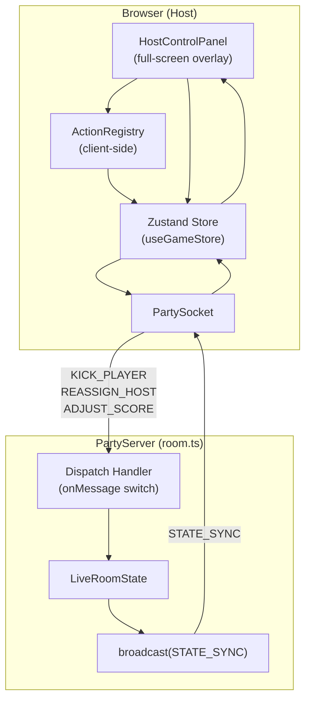
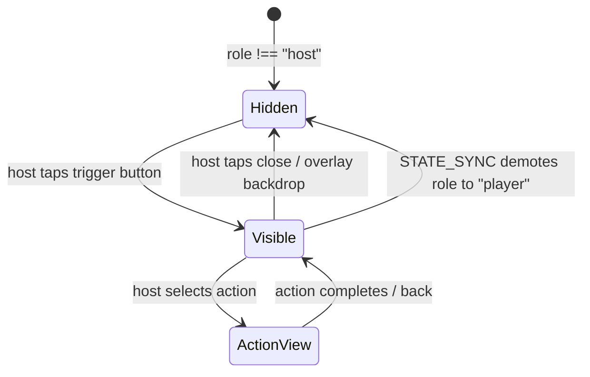

# Design Document: Host Control Panel

## Overview

The Host Control Panel is a full-screen overlay component that gives the room host centralized administration capabilities across all game phases. It surfaces actions — kick player, reassign host, adjust score — through a client-side Action Registry pattern, making the panel extensible without modifying the scaffold component.

The design follows the existing architecture: Zustand store for client state, PartySocket for messaging, server-side auth guards with STATE_SYNC broadcast. Two new server message types (`REASSIGN_HOST`, `ADJUST_SCORE`) are added alongside the existing `KICK_PLAYER` handler, all following the same dispatch/auth pattern in `room.ts`.

Key design choices:
- **Full-screen overlay** (not a route or drawer) — keeps game state visible underneath on dismiss
- **Action Registry** — self-registering actions keep the panel scaffold decoupled from specific features
- **Adjustment_Log in STATE_SYNC** — all clients see score adjustments for transparency
- **Auto-close on demotion** — when host role is reassigned away, the panel closes reactively via Zustand selector

---

## Architecture

### System Context Diagram



### Panel Lifecycle



---

## Components and Interfaces

### New Shared Types

These additions go in `packages/shared/src/types.ts`:

```typescript
// ── Score Adjustment Log ─────────────────────────────────────────────────

export interface AdjustmentLogEntry {
  id: string                    // unique ID (uuid or timestamp-based)
  targetPlayerId: string
  delta: number                 // positive or negative integer
  scoreType: "game" | "session"
  reason: string                // empty string if no reason provided
  timestamp: number             // Date.now() on server
  performedBy: string           // host player ID at time of adjustment
}

// ── Extended RoomState ───────────────────────────────────────────────────

// Add to existing RoomState interface:
// adjustmentLog: AdjustmentLogEntry[]

// ── New Client Messages ──────────────────────────────────────────────────

// Add to ClientMessage union:
// | { type: "REASSIGN_HOST"; payload: { targetPlayerId: string } }
// | { type: "ADJUST_SCORE"; payload: { targetPlayerId: string; delta: number; scoreType: "game" | "session"; reason?: string } }
```

### Action Registry (Client-Side)

```typescript
// packages/client/src/host-panel/ActionRegistry.ts

import type { ReactNode } from "react"
import type { RoomState } from "@games-of-chance/shared"

export interface HostAction {
  id: string
  label: string
  icon: () => ReactNode
  /** Return true if this action should be available given current state */
  isAvailable: (roomState: RoomState, currentPlayerId: string) => boolean
  /** Render the action's execution UI (target picker, confirmation, etc.) */
  component: () => ReactNode
}

class ActionRegistry {
  private actions: Map<string, HostAction> = new Map()
  private insertionOrder: string[] = []

  register(action: HostAction): void {
    if (!this.actions.has(action.id)) {
      this.insertionOrder.push(action.id)
    }
    this.actions.set(action.id, action) // overwrites on duplicate id
  }

  getAll(): HostAction[] {
    return this.insertionOrder
      .filter((id) => this.actions.has(id))
      .map((id) => this.actions.get(id)!)
  }

  get(id: string): HostAction | undefined {
    return this.actions.get(id)
  }
}

export const actionRegistry = new ActionRegistry()
```

### Action Registrations (Self-Registering Modules)

```typescript
// packages/client/src/host-panel/actions/kickPlayer.ts
import { actionRegistry } from "../ActionRegistry"
import KickPlayerIcon from "./icons/KickPlayerIcon"
import KickPlayerView from "./views/KickPlayerView"

actionRegistry.register({
  id: "kick-player",
  label: "Kick Player",
  icon: KickPlayerIcon,
  isAvailable: (roomState, currentPlayerId) => {
    // Available when there are connected non-host players to kick
    return roomState.players.some(
      (p) => p.id !== currentPlayerId && p.connected && p.role !== "host"
    )
  },
  component: KickPlayerView,
})
```

```typescript
// packages/client/src/host-panel/actions/reassignHost.ts
import { actionRegistry } from "../ActionRegistry"
import ReassignHostIcon from "./icons/ReassignHostIcon"
import ReassignHostView from "./views/ReassignHostView"

actionRegistry.register({
  id: "reassign-host",
  label: "Reassign Host",
  icon: ReassignHostIcon,
  isAvailable: (roomState, currentPlayerId) => {
    // Available when there are connected non-host players
    return roomState.players.some(
      (p) => p.id !== currentPlayerId && p.connected && p.role !== "host"
    )
  },
  component: ReassignHostView,
})
```

```typescript
// packages/client/src/host-panel/actions/adjustScore.ts
import { actionRegistry } from "../ActionRegistry"
import AdjustScoreIcon from "./icons/AdjustScoreIcon"
import AdjustScoreView from "./views/AdjustScoreView"

actionRegistry.register({
  id: "adjust-score",
  label: "Adjust Score",
  icon: AdjustScoreIcon,
  isAvailable: (roomState) => {
    // Available when there is at least one player in the room
    return roomState.players.length > 0
  },
  component: AdjustScoreView,
})
```

### HostControlPanel Component

```typescript
// packages/client/src/host-panel/HostControlPanel.tsx

import { useState } from "react"
import { useGameStore } from "../store/useGameStore"
import { actionRegistry, type HostAction } from "./ActionRegistry"

export default function HostControlPanel() {
  const role = useGameStore((s) => s.role)
  const roomState = useGameStore((s) => s.roomState)
  const playerId = useGameStore((s) => s.playerId)
  const [isOpen, setIsOpen] = useState(false)
  const [activeAction, setActiveAction] = useState<string | null>(null)

  // Auto-close when demoted from host
  // (handled reactively — if role !== "host", panel cannot stay open)
  if (role !== "host") {
    if (isOpen) setIsOpen(false)
    return null // no trigger rendered for non-hosts
  }

  if (!isOpen) {
    // Render only the trigger button (persistent across all phases)
    return (
      <button
        type="button"
        onClick={() => setIsOpen(true)}
        className="fixed bottom-4 right-4 z-40 flex h-12 w-12 items-center justify-center rounded-full bg-gray-800 text-white shadow-lg"
        aria-label="Open Host Control Panel"
      >
        ⚙️
      </button>
    )
  }

  const actions = actionRegistry.getAll()
  const ActiveComponent = activeAction
    ? actionRegistry.get(activeAction)?.component
    : null

  return (
    <div className="fixed inset-0 z-50 flex flex-col bg-white">
      {/* Header */}
      <header className="flex items-center justify-between border-b px-4 py-3">
        <h2 className="text-lg font-bold">Host Controls</h2>
        <button
          type="button"
          onClick={() => { setIsOpen(false); setActiveAction(null) }}
          className="text-2xl text-gray-500"
          aria-label="Close"
        >
          ×
        </button>
      </header>

      {/* Action list or active action view */}
      <div className="flex-1 overflow-y-auto p-4">
        {ActiveComponent ? (
          <div>
            <button
              type="button"
              onClick={() => setActiveAction(null)}
              className="mb-4 text-sm text-blue-600"
            >
              ← Back
            </button>
            <ActiveComponent />
          </div>
        ) : (
          <ul className="space-y-3">
            {actions.map((action) => {
              const available = roomState && playerId
                ? action.isAvailable(roomState, playerId)
                : false
              return (
                <li key={action.id}>
                  <button
                    type="button"
                    disabled={!available}
                    onClick={() => setActiveAction(action.id)}
                    className={`flex w-full items-center gap-3 rounded-lg border px-4 py-3 text-left ${
                      available
                        ? "border-gray-200 bg-white hover:bg-gray-50"
                        : "border-gray-100 bg-gray-50 opacity-50"
                    }`}
                  >
                    <span className="text-xl">{action.icon()}</span>
                    <span className="font-medium">{action.label}</span>
                  </button>
                </li>
              )
            })}
          </ul>
        )}
      </div>
    </div>
  )
}
```

### Panel Trigger Placement

The `HostControlPanel` component is rendered inside `LobbyShell` (always-visible wrapper) so it's present at every phase:

```typescript
// In LobbyShell.tsx — add:
import HostControlPanel from "../host-panel/HostControlPanel"

// Render at the bottom of the component tree (inside the shell):
<HostControlPanel />
```

### Server Handlers

New handlers added to `room.ts` following the existing pattern:

```typescript
// In the onMessage switch statement, add:
case "REASSIGN_HOST":
  this.handleReassignHost(sender, msg.payload)
  break
case "ADJUST_SCORE":
  this.handleAdjustScore(sender, msg.payload)
  break
```

```typescript
private handleReassignHost(
  sender: Party.Connection,
  payload: { targetPlayerId: string }
) {
  // Authorization: only host
  const hostId = this.getHostId()
  const senderId = this.getPlayerIdByConnectionId(sender.id)
  if (senderId !== hostId) {
    this.sendError(sender, "NOT_HOST", "Only the host can reassign the host role")
    return
  }

  // Validate target exists and is connected
  const target = this.state.players[payload.targetPlayerId]
  if (!target || !target.connected) {
    this.sendError(sender, "INVALID_TARGET", "Target player is not connected")
    return
  }

  // Swap roles
  const currentHost = Object.values(this.state.players).find(p => p.role === "host")
  if (currentHost) currentHost.role = "player"
  target.role = "host"

  this.broadcastState()
}

private handleAdjustScore(
  sender: Party.Connection,
  payload: { targetPlayerId: string; delta: number; scoreType: "game" | "session"; reason?: string }
) {
  // Authorization: only host
  const hostId = this.getHostId()
  const senderId = this.getPlayerIdByConnectionId(sender.id)
  if (senderId !== hostId) {
    this.sendError(sender, "NOT_HOST", "Only the host can adjust scores")
    return
  }

  // Validate target exists
  const target = this.state.players[payload.targetPlayerId]
  if (!target) {
    this.sendError(sender, "INVALID_TARGET", "Target player not found")
    return
  }

  // Apply delta
  if (payload.scoreType === "game") {
    this.state.gameScores[payload.targetPlayerId] =
      (this.state.gameScores[payload.targetPlayerId] ?? 0) + payload.delta
  } else {
    this.state.sessionScores[payload.targetPlayerId] =
      (this.state.sessionScores[payload.targetPlayerId] ?? 0) + payload.delta
    // Rebuild session leaderboard
    this.state.sessionLeaderboard = this.computeSessionLeaderboard()
  }

  // Append to adjustment log
  const entry: AdjustmentLogEntry = {
    id: crypto.randomUUID(),
    targetPlayerId: payload.targetPlayerId,
    delta: payload.delta,
    scoreType: payload.scoreType,
    reason: payload.reason ?? "",
    timestamp: Date.now(),
    performedBy: senderId!,
  }
  this.state.adjustmentLog.push(entry)

  // Rebuild game leaderboard if game score changed
  if (payload.scoreType === "game") {
    const plugin = registry.lookup(this.state.config.gameType)
    this.state.gameLeaderboard = plugin.computeGameLeaderboard(
      Object.values(this.state.players),
      this.state.gameScores
    )
  }

  this.broadcastState()
}
```

### Updated KICK_PLAYER Handler

The existing `KICK_PLAYER` handler in the `onMessage` switch currently responds with `"UNSUPPORTED"` for unrecognized types. The implementation needs to add a case for it (it's defined in the `ClientMessage` type but the current `room.ts` doesn't have a dedicated handler — it falls through to default). The handler:

```typescript
private handleKickPlayer(
  sender: Party.Connection,
  payload: { playerId: string }
) {
  // Authorization: only host
  const hostId = this.getHostId()
  const senderId = this.getPlayerIdByConnectionId(sender.id)
  if (senderId !== hostId) {
    this.sendError(sender, "NOT_HOST", "Only the host can kick players")
    return
  }

  // Validate target exists and is not the host
  const target = this.state.players[payload.playerId]
  if (!target) {
    this.sendError(sender, "INVALID_TARGET", "Player not found")
    return
  }
  if (target.role === "host") {
    this.sendError(sender, "INVALID_TARGET", "Cannot kick the host")
    return
  }

  // Remove player from state
  delete this.state.players[payload.playerId]

  // Close their WebSocket connection if connected
  if (target.connectionId) {
    const conn = [...this.room.getConnections()].find(
      (c) => c.id === target.connectionId
    )
    conn?.close(4001, "Kicked by host")
  }

  // During PICKING: re-evaluate if all remaining connected players have picked
  if (
    this.state.round.phase === "PICKING" &&
    this.allConnectedPlayersHavePicked()
  ) {
    this.cancelDeadlineTimer()
    this.broadcastState()
    this.scheduleResolve(0)
    return
  }

  this.broadcastState()
}
```

---

## Data Models

### Extended LiveRoomState (Server)

```typescript
interface LiveRoomState {
  config: RoomConfig
  players: Record<string, Player>
  round: RoundState
  gameScores: Record<string, number>
  gameLeaderboard: GameLeaderboardEntry[]
  sessionScores: Record<string, number>
  sessionGamesPlayed: Record<string, number>
  sessionLeaderboard: SessionLeaderboardEntry[]
  adjustmentLog: AdjustmentLogEntry[]  // NEW — appended on each ADJUST_SCORE
}
```

### Extended RoomState (Client-Facing, in STATE_SYNC)

```typescript
export interface RoomState {
  room: RoomConfig
  players: Player[]
  round: RoundState
  gameLeaderboard: GameLeaderboardEntry[]
  sessionLeaderboard: SessionLeaderboardEntry[]
  adjustmentLog: AdjustmentLogEntry[]  // NEW — included in every STATE_SYNC
}
```

### Extended ClientMessage Union

```typescript
export type ClientMessage =
  | { type: "JOIN"; payload: { name: string; role: "host" | "player"; clientId: string; scoringMode?: ScoringMode } }
  | { type: "SUBMIT_PICK"; payload: { pick: unknown } }
  | { type: "START_ROUND"; payload?: never }
  | { type: "END_GAME"; payload?: never }
  | { type: "SKIP_ANIMATION"; payload?: never }
  | { type: "SET_AUTO_MODE"; payload: { enabled: boolean; intervalMs: number } }
  | { type: "KICK_PLAYER"; payload: { playerId: string } }
  | { type: "REASSIGN_HOST"; payload: { targetPlayerId: string } }          // NEW
  | { type: "ADJUST_SCORE"; payload: { targetPlayerId: string; delta: number; scoreType: "game" | "session"; reason?: string } }  // NEW
  | { type: "LINK_PLAYER"; payload: { oldPlayerId: string; newConnectionId: string } }
  | { type: "START_SIMULATION"; payload: { playerCount?: number; roundCount?: number; seed?: number } }
  | { type: "STOP_SIMULATION"; payload?: never }
```

### File Structure

```
packages/client/src/host-panel/
├── ActionRegistry.ts              # Registry class + HostAction interface
├── HostControlPanel.tsx           # Full-screen overlay scaffold
├── actions/
│   ├── kickPlayer.ts              # Self-registering kick action
│   ├── reassignHost.ts            # Self-registering reassign action
│   ├── adjustScore.ts             # Self-registering adjust score action
│   ├── icons/
│   │   ├── KickPlayerIcon.tsx
│   │   ├── ReassignHostIcon.tsx
│   │   └── AdjustScoreIcon.tsx
│   └── views/
│       ├── KickPlayerView.tsx     # Target picker + confirm for kick
│       ├── ReassignHostView.tsx   # Target picker + confirm for reassign
│       └── AdjustScoreView.tsx    # Target + delta + type + reason form
└── ScoreAdjustmentNotification.tsx  # Toast/banner for all clients
```

---

## Correctness Properties

*A property is a characteristic or behavior that should hold true across all valid executions of a system — essentially, a formal statement about what the system should do. Properties serve as the bridge between human-readable specifications and machine-verifiable correctness guarantees.*

### Property 1: Panel visibility is role-gated

*For any* player in any game phase, the host control panel trigger is rendered if and only if the player's role is "host".

**Validates: Requirements 1.1, 1.2**

### Property 2: Host-control authorization

*For any* host-control message type (KICK_PLAYER, REASSIGN_HOST, ADJUST_SCORE) and any sender whose role is not "host", the server shall reject the message with a NOT_HOST error and not mutate room state.

**Validates: Requirements 2.5, 3.4, 4.6, 6.1, 6.2**

### Property 3: Kick removes player from state

*For any* room with N players (N > 1) and any connected non-host target player, after a valid KICK_PLAYER message is processed, the target player shall not appear in the players list and the player count shall be N - 1.

**Validates: Requirements 2.2**

### Property 4: Kick/Reassign target filtering

*For any* room state, the set of valid targets for kick and reassign actions shall be exactly the set of players who are connected AND whose role is not "host".

**Validates: Requirements 2.6, 3.6**

### Property 5: Kick during PICKING triggers early resolution

*For any* room in PICKING phase, if the kicked player had not submitted a pick and all remaining connected players have submitted picks, the round shall transition to RESOLVING.

**Validates: Requirements 2.7**

### Property 6: Reassign host swaps roles

*For any* room with a host and any connected non-host target player, after a valid REASSIGN_HOST message, the target player's role shall be "host" and the previous host's role shall be "player", with exactly one host in the room.

**Validates: Requirements 3.2**

### Property 7: Reassign rejects disconnected target

*For any* REASSIGN_HOST message where the target player is not connected, the server shall reject with INVALID_TARGET error and not mutate any roles.

**Validates: Requirements 3.5**

### Property 8: Score adjustment applies delta correctly

*For any* player, any integer delta (positive or negative), and any score type ("game" or "session"), after a valid ADJUST_SCORE message, the target player's specified score shall equal the previous value plus the delta.

**Validates: Requirements 4.3**

### Property 9: Adjustment log grows monotonically

*For any* valid ADJUST_SCORE operation, the adjustment log length shall increase by exactly one, and the new entry shall contain the correct target player ID, delta, score type, timestamp, and reason.

**Validates: Requirements 4.4**

### Property 10: Action Registry maintains ordered unique entries

*For any* sequence of action registrations, the registry shall preserve insertion order and enforce unique identifiers (duplicate IDs overwrite the previous entry without duplicating the slot).

**Validates: Requirements 5.1, 5.4, 5.6**

### Property 11: Registry-driven rendering

*For any* set of actions registered in the Action Registry, the panel shall render exactly those actions whose `isAvailable` predicate returns true for the current room state.

**Validates: Requirements 5.2, 5.3, 5.5**

---

## Error Handling

| Scenario | Error Code | Message | Handler |
|----------|-----------|---------|---------|
| Non-host sends host-control message | `NOT_HOST` | "Only the host can {action}" | All host handlers |
| Kick/Reassign target not found | `INVALID_TARGET` | "Target player not found" | handleKickPlayer, handleReassignHost |
| Kick/Reassign target not connected | `INVALID_TARGET` | "Target player is not connected" | handleReassignHost |
| Kick self (host) | `INVALID_TARGET` | "Cannot kick the host" | handleKickPlayer |
| ADJUST_SCORE with non-integer delta | `INVALID_PAYLOAD` | "Delta must be an integer" | handleAdjustScore |
| ADJUST_SCORE target not in room | `INVALID_TARGET` | "Target player not found" | handleAdjustScore |

Errors follow the existing pattern: `ServerMessage = { type: "ERROR", payload: { code, message } }` sent only to the sender connection.

Client-side handling:
- Errors surface as a brief toast notification in the panel
- Panel does not close on error — allows the host to retry
- State is never optimistically mutated on the client; all changes come from STATE_SYNC

---

## Testing Strategy

### Unit Tests (Example-Based)

- **Panel trigger rendering**: Verify trigger renders for host, hidden for non-host
- **Panel open/close**: Verify overlay appears/disappears, state unchanged after close
- **Action views**: Verify each action view renders correct targets and confirmation UI
- **Message payloads**: Verify correct `ClientMessage` shape is sent for each action
- **Auto-close on demotion**: Verify panel closes when role changes from host to player
- **Notification display**: Verify score adjustment notification renders for all clients

### Property-Based Tests

Property-based testing applies well to this feature because the server handlers are pure-ish functions (input message + state → new state + output messages) with a large input space (varying room compositions, player states, delta values).

**Library**: [fast-check](https://github.com/dubzzz/fast-check) (already idiomatic for TypeScript projects)

**Configuration**: Minimum 100 iterations per property test.

**Tag format**: `Feature: host-control-panel, Property {N}: {title}`

Properties to implement as PBT:
1. **Property 2** — Authorization: generate random non-host senders + all message types
2. **Property 3** — Kick removes player: generate rooms with 2-10 players, random targets
3. **Property 5** — Kick during PICKING: generate rooms in PICKING with various pick states
4. **Property 6** — Reassign swaps roles: generate rooms with various player compositions
5. **Property 7** — Reassign rejects disconnected: generate rooms with disconnected targets
6. **Property 8** — Score delta: generate random deltas (-1000 to +1000), all score types, all players
7. **Property 9** — Adjustment log: generate sequences of adjustments, verify log growth
8. **Property 10** — Registry ordering: generate random action registration sequences
9. **Property 11** — Registry rendering: generate room states + registered actions, verify filtered output

### Integration Tests

- **WebSocket close on kick**: Start server, connect players, kick one, verify connection closed
- **STATE_SYNC broadcast**: Verify all connected clients receive updated state after each host action
- **End-to-end flow**: Host opens panel → kicks player → panel updates target list → reassigns host → panel closes

### Edge Cases

- Host kicks last remaining player (room has only host left after kick)
- Host adjusts score for a player who then gets kicked (log entry persists)
- Rapid successive ADJUST_SCORE messages (verify all deltas apply correctly)
- REASSIGN_HOST when target disconnects between selection and confirmation
- KICK_PLAYER during RESOLVING phase (player is removed but round resolution is not affected)
