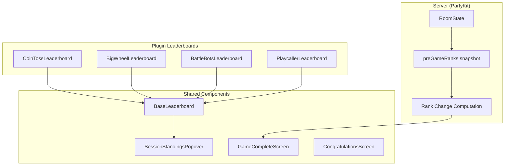

# Design Document: Leaderboard Standardization

## Overview

This design unifies the four per-game leaderboard implementations (CoinToss, BigWheel, BattleBots via generic GameLeaderboard, and Playcaller's inline session standings) into a single shared `BaseLeaderboard` component with a slot-based extension system. The redesign also introduces:

- A **compact variant** for space-constrained views (Playcaller header dropdown)
- A **Session Standings Popover** that floats over content without layout shift
- **Risers/Fallers** rank change indicators computed server-side via pre-game snapshots
- A redesigned **Game Complete Screen** that replaces the current `FinalResultsScreen` podium with a ranked session standings list showing rank changes
- A preserved **Congratulations Screen** (podium) shown only after the final tournament game

The architecture follows the existing plugin pattern: each game wraps `BaseLeaderboard` with its own slot content, keeping game-specific rendering decoupled from shared layout logic.

## Architecture



### Component Hierarchy

```mermaid
graph LR
    subgraph "BaseLeaderboard Props"
        E[entries: GameLeaderboardEntry[]]
        CP[currentPlayerId: string]
        V[variant: 'default' | 'compact']
        RR[renderRow?: fn]
        RH[renderHeader?: fn]
    end
    
    subgraph "Render Tree"
        Container[motion.div container]
        HeaderSlot[Header Slot area]
        List[ul - player list]
        Row[li - player row]
        RankBadge[Rank Badge]
        NameArea[Name + Streak]
        RowSlot[Row Slot area]
        Score[Score column]
    end

    Container --> HeaderSlot
    Container --> List
    List --> Row
    Row --> RankBadge
    Row --> NameArea
    Row --> RowSlot
    Row --> Score
```

## Components and Interfaces

### BaseLeaderboard Component

**Location:** `packages/client/src/components/game/BaseLeaderboard.tsx`

```typescript
import type { GameLeaderboardEntry } from "@games-of-chance/shared"
import type { ReactNode } from "react"

export interface BaseLeaderboardProps {
  /** Ordered array of player entries (sorted by rank) */
  entries: GameLeaderboardEntry[]
  /** Current user's player ID for highlight */
  currentPlayerId: string | null
  /** Layout variant */
  variant?: "default" | "compact"
  /** Row-level slot: renders custom content between name area and score */
  renderRow?: (entry: GameLeaderboardEntry) => ReactNode
  /** Header slot: renders custom content above the player list */
  renderHeader?: (entries: GameLeaderboardEntry[]) => ReactNode
}
```

**Rendering logic:**
1. If `entries` is empty, return `null`.
2. Wrap in a `motion.div` with the container entrance animation (skip in compact variant).
3. If `renderHeader` is provided, call it with the full entries array and render above the list.
4. Render a `<ul>` with `<motion.li layoutId={entry.playerId}>` for each entry.
5. Each row: `[RankBadge] [Name + (you) + streak] [RowSlot?] [Score]`
6. Score column uses `tabular-nums` and is always right-aligned via `ml-auto shrink-0`.
7. In compact variant: suppress row slot content, reduce padding/font sizes, skip entrance animation but keep layout animations.

**Animation details:**
- Entrance: `opacity: 0→1, y: 8→0`, duration 300ms, easeOut (default only)
- Rank reorder: `layout` prop on each `<motion.li>`, transition duration 400ms
- Layout ID: `entry.playerId` ensures framer-motion tracks identity across reorders

**Theming:**
- Container: `theme.card`
- Row: `theme.listItem`
- Current player ring: `ring-1 ring-[${theme.accentText color}]` (derived from theme — we'll add a `currentPlayerRing` token to `ThemeDefinition`)
- Rank 1 badge: gold styling via theme (e.g., `bg-[#f5c542] text-[#111111]`)
- Rank 2 badge: silver styling
- Rank 3 badge: bronze styling
- Rank 4+ badge: neutral (`bg-[#1b5e2a] text-[#f0f0f0]` in retro-casino)

### SessionStandingsPopover Component

**Location:** `packages/client/src/components/game/SessionStandingsPopover.tsx`

```typescript
export interface SessionStandingsPopoverProps {
  /** Popover trigger button content (icon or label) */
  trigger: ReactNode
}
```

**Behavior:**
- Renders a trigger button that toggles a floating panel (CSS `position: absolute` + portal or Radix-style positioning).
- The panel shows session leaderboard entries sorted by `sessionPoints` descending, ties broken by humans-before-bots.
- Each entry shows: rank, connection dot (green/gray), bot icon (🤖 for bots), player name, host badge, session score.
- Scores are gated behind `useDeferredRevealValue` — show stale values until `roundAnimationDone` is true or phase is PICKING/LOBBY/END_GAME.
- Closes on outside click or Escape key press, returning focus to the trigger.
- Internal scroll if content exceeds viewport height (`max-h-[70vh] overflow-y-auto`).
- Defaults to closed on each phase transition away from LOBBY (managed via `useEffect` on phase).

### GameCompleteScreen Component

**Location:** `packages/client/src/components/game/GameCompleteScreen.tsx`

Replaces the current `FinalResultsScreen` for the standard END_GAME phase (non-finale games).

```typescript
export interface GameCompleteScreenProps {
  // Reads from useGameStore — no external props needed
}
```

**Display:**
- Heading: "Game complete!"
- Subtext: "Updated standings"
- Session leaderboard as ranked list (not podium) showing: rank, player name, session points, riser/faller indicator.
- Riser: green `↑N` for rank improvement
- Faller: red `↓N` for rank decline
- No indicator: unchanged rank or first game of session
- "Return to Lobby" button — host only

**Decision logic in GameView:**
- `phase === "END_GAME"` + `isFinale` flag (from `tournamentProgress`) → `CongratulationsScreen` (podium)
- `phase === "END_GAME"` + NOT finale → `GameCompleteScreen` (ranked list with risers/fallers)
- `progressionMode === "endless"` → always `GameCompleteScreen` (no finale exists)

### CongratulationsScreen Component

**Location:** `packages/client/src/components/game/CongratulationsScreen.tsx`

Retains the existing podium layout from the current `FinalResultsScreen`. Shown only when `END_TOURNAMENT` phase is reached (playcaller isFinale game completes).

### Plugin Leaderboard Wrappers

Each game creates a thin wrapper around `BaseLeaderboard`:

#### CoinTossLeaderboard (migrated)
```typescript
// packages/client/src/games/coin-toss/CoinTossLeaderboard.tsx
<BaseLeaderboard
  entries={leaderboard}
  currentPlayerId={playerId}
  renderHeader={(entries) => <TossSequenceRow tossHistory={tossHistory} />}
  renderRow={(entry) => (
    <CoinTossRowSlot entry={entry} tossHistory={tossHistory} />
  )}
/>
```

Row slot contains: pick accuracy tokens (green/red H/T), streak indicator, +delta label.

#### BigWheelLeaderboard (migrated)
```typescript
// packages/client/src/games/big-wheel/BigWheelLeaderboard.tsx
<BaseLeaderboard
  entries={leaderboard}
  currentPlayerId={currentPlayerId}
  renderRow={(entry) => (
    <BigWheelRowSlot
      entry={entry}
      spinResults={spinResults}
      activeSpinnerId={activeSpinnerId}
      nextSpinnerId={nextSpinnerId}
      currentTurnIndex={currentTurnIndex}
      spinOrder={spinOrder}
    />
  )}
/>
```

Row slot contains: spin result badges (+N), turn-order indicator (▶/◆/✓), status label.

#### BattleBotsLeaderboard (migrated)
```typescript
// packages/client/src/games/battle-bots/BattleBotsLeaderboard.tsx
<BaseLeaderboard
  entries={leaderboard}
  currentPlayerId={currentPlayerId}
  // No renderRow or renderHeader — base rendering only
/>
```

#### PlaycallerLeaderboard (migrated)
```typescript
// In PlaycallerHeader dropdown
<BaseLeaderboard
  entries={sessionEntries}  // SessionLeaderboardEntry mapped to GameLeaderboardEntry shape
  currentPlayerId={playerId}
  variant="compact"
/>
```

### Risers/Fallers Server-Side Logic

**Location:** `packages/server/src/room.ts` (within existing room class)

```typescript
// Added to LiveRoomState interface
interface LiveRoomState {
  // ... existing fields ...
  /** Pre-game rank snapshot for risers/fallers computation */
  preGameRanks: Record<string, number>
}
```

**Snapshot timing:**
- Captured when `handleStartRound` transitions from LOBBY to PICKING (first round of a new game).
- On first game of session (session leaderboard empty): all players assigned rank 1.
- Stored in `LiveRoomState.preGameRanks` and included in the `RoomState` payload sent to clients.

**Rank change computation:**
- After session scores update in `autoEndGame`/`finalizeBigWheelGame`/`handleEndGame`: compute `rankChange = preGameRank - postGameRank` for each player.
- Positive = improved (riser), negative = worsened (faller), zero = unchanged.
- Players with no entry in `preGameRanks` (joined mid-session) get no indicator.

**RoomState addition (shared types):**
```typescript
export interface RoomState {
  // ... existing fields ...
  /** Pre-game session ranks — used by Game Complete Screen for risers/fallers */
  preGameRanks: Record<string, number>
}
```

## Data Models

### Extended ThemeDefinition

Add a `currentPlayerRing` token to `ThemeDefinition`:

```typescript
export interface ThemeDefinition {
  // ... existing fields ...
  /** Ring class applied to the current player's row */
  currentPlayerRing: string
  /** Rank badge styles for top 3 */
  rankBadge1: string  // e.g., "bg-[#f5c542] text-[#111111]"
  rankBadge2: string  // e.g., "bg-[#c0c0c0] text-[#111111]"
  rankBadge3: string  // e.g., "bg-[#cd7f32] text-[#111111]"
  rankBadgeDefault: string  // e.g., "bg-[#1b5e2a] text-[#f0f0f0]"
}
```

### PreGameRanks in RoomState

```typescript
// packages/shared/src/types.ts — added to RoomState
export interface RoomState {
  // ... existing fields ...
  /** Pre-game session rank snapshot for risers/fallers display. Key = playerId, value = rank before game started. */
  preGameRanks: Record<string, number>
}
```

### Rank Change Utility

```typescript
// packages/client/src/utils/rankChange.ts
export interface RankChange {
  playerId: string
  delta: number  // positive = improved, negative = worsened, 0 = unchanged
}

/**
 * Compute rank changes by comparing pre-game snapshot ranks to current session ranks.
 * Returns positive delta for risers, negative for fallers, 0 for unchanged.
 */
export function computeRankChanges(
  preGameRanks: Record<string, number>,
  currentSessionLeaderboard: SessionLeaderboardEntry[]
): Record<string, number> {
  const changes: Record<string, number> = {}
  for (const entry of currentSessionLeaderboard) {
    const preRank = preGameRanks[entry.playerId]
    if (preRank === undefined) {
      changes[entry.playerId] = 0  // joined mid-session, no indicator
    } else {
      changes[entry.playerId] = preRank - entry.rank  // positive = improved
    }
  }
  return changes
}
```


## Correctness Properties

*A property is a characteristic or behavior that should hold true across all valid executions of a system — essentially, a formal statement about what the system should do. Properties serve as the bridge between human-readable specifications and machine-verifiable correctness guarantees.*

### Property 1: Entry rendering completeness

*For any* non-empty array of `GameLeaderboardEntry` objects and any valid `currentPlayerId`, the rendered output of `BaseLeaderboard` SHALL contain exactly one row per entry, and each row SHALL contain the entry's rank number, player name, and score value.

**Validates: Requirements 1.1**

### Property 2: Current player identification

*For any* non-empty array of `GameLeaderboardEntry` objects where one entry's `playerId` matches the provided `currentPlayerId`, that row SHALL have both the themed ring highlight class applied AND the "(you)" text indicator present, and no other row SHALL have either marker.

**Validates: Requirements 1.2, 1.3**

### Property 3: Rank badge tier styling

*For any* `GameLeaderboardEntry`, if `rank` is 1 then the badge SHALL use the `rankBadge1` theme token, if `rank` is 2 then `rankBadge2`, if `rank` is 3 then `rankBadge3`, and if `rank` is greater than 3 then `rankBadgeDefault`. No entry SHALL ever display a badge style that does not match its rank tier.

**Validates: Requirements 1.4, 1.5**

### Property 4: Slot rendering contract

*For any* non-empty array of entries: (a) when a `renderRow` prop is provided, the returned content SHALL appear within every player row; (b) when a `renderHeader` prop is provided, the returned content SHALL appear before the player list; (c) when neither prop is provided, no slot content SHALL appear and only base fields (rank, name, score) SHALL be rendered.

**Validates: Requirements 1.10, 1.11, 2.1, 2.2, 2.3, 2.4**

### Property 5: Compact variant behavior

*For any* non-empty array of entries rendered with `variant="compact"`: (a) each row SHALL have compact padding (py-1) and text size (text-[11px]); (b) rank badges SHALL be 16×16px (h-4 w-4); (c) each row SHALL still contain rank, name (truncated with ellipsis if needed), and score; (d) row-level slot content SHALL NOT be rendered even when a `renderRow` prop is provided.

**Validates: Requirements 3.1, 3.2, 3.3, 3.4**

### Property 6: Session popover entry completeness

*For any* set of session leaderboard entries containing a mix of connected/disconnected, human/bot, and host/non-host players, the rendered `SessionStandingsPopover` SHALL display for each entry: the rank number, a connection indicator (green for connected, gray for disconnected), a bot icon (for bot players only), the player name, a host badge (for host role only), and the session score.

**Validates: Requirements 4.3**

### Property 7: Pre-game snapshot captures current ranks

*For any* set of players with existing session leaderboard ranks at the moment a new game starts, the `preGameRanks` field SHALL contain an entry for every player whose `playerId` exists in the session leaderboard, and each entry's value SHALL equal that player's session rank at snapshot time. On the first game of a session (empty session leaderboard), all players SHALL be assigned rank 1.

**Validates: Requirements 5.1, 5.8**

### Property 8: Rank change computation correctness

*For any* `preGameRanks` mapping and any post-game `SessionLeaderboardEntry[]`, the computed rank change for each player SHALL equal `preGameRanks[playerId] - postGameRank`. If a player has no entry in `preGameRanks` (joined mid-session), their rank change SHALL be 0. Positive values indicate improvement (riser), negative values indicate decline (faller), and zero indicates no change.

**Validates: Requirements 5.2, 5.3, 5.4, 5.5, 5.9**

## Error Handling

### Empty States
- **Empty entries array**: `BaseLeaderboard` returns `null` — no DOM rendered.
- **Empty session leaderboard**: `SessionStandingsPopover` shows "No standings yet" placeholder text.
- **Missing player in preGameRanks**: Player gets `rankChange = 0` (no indicator displayed).

### Edge Cases
- **Single player**: BaseLeaderboard renders one row; rank badges still apply (rank 1 = first place badge).
- **All players same score/rank**: Multiple entries may share rank 1. Badge styling applies per `rank` field value as computed by the server.
- **Player disconnects mid-game**: Pre-game snapshot retains their rank; they still appear on Game Complete Screen if they have a session entry.
- **Name overflow**: CSS `truncate` class handles any name length without layout breakage.
- **Slot content overflow**: Row slot wraps to a second line below the name; score column alignment is maintained via flex layout.

### Popover Edge Cases
- **Viewport overflow**: Popover content scrolls internally (`max-h-[70vh] overflow-y-auto`).
- **Rapid toggle**: Debounce not needed — React state transitions are synchronous and idempotent.
- **Focus management**: On close (click-outside or Escape), focus returns to trigger button via `ref.focus()`.

### Server-Side Robustness
- **preGameRanks persistence**: Stored in `LiveRoomState` (in-memory). If server restarts mid-game, ranks reset — acceptable since the game state also resets.
- **Race condition on game start**: Snapshot is captured atomically within `handleStartRound` before any picks are processed.

## Testing Strategy

### Unit Tests (Example-Based)

Unit tests cover specific examples, edge cases, and integration points:

- **BaseLeaderboard**: Empty entries → null, entrance animation props, truncate class on names, tabular-nums on scores, theme token application
- **SessionStandingsPopover**: Toggle visibility on click, close on Escape, close on outside click, focus return, deferred reveal gating, internal scroll class
- **GameCompleteScreen**: Heading/subtext text content, host-only button visibility, routing decision (END_TOURNAMENT → Congratulations, END_GAME → GameComplete, endless mode)
- **Plugin wrappers**: Each plugin renders BaseLeaderboard with correct slot content (CoinToss toss sequence, BigWheel spin badges, BattleBots no slots, Playcaller compact)

### Property-Based Tests

Property-based tests verify universal properties across randomly generated inputs. Each test runs a minimum of 100 iterations.

**Library:** `fast-check` (already available via the project's vitest setup)

**Test configuration:**
```typescript
fc.assert(fc.property(...), { numRuns: 100 })
```

**Tests to implement:**

1. **Feature: leaderboard-standardization, Property 1: Entry rendering completeness**
   - Generator: `fc.array(arbGameLeaderboardEntry(), { minLength: 1, maxLength: 20 })`
   - Assert: rendered row count === entries.length; each row contains rank, name, score

2. **Feature: leaderboard-standardization, Property 2: Current player identification**
   - Generator: entries array + `fc.constantFrom(...entries.map(e => e.playerId))`
   - Assert: exactly one row has ring + "(you)", matching currentPlayerId

3. **Feature: leaderboard-standardization, Property 3: Rank badge tier styling**
   - Generator: entries with `rank` in range [1, 20]
   - Assert: badge class matches rank tier (1/2/3/default)

4. **Feature: leaderboard-standardization, Property 4: Slot rendering contract**
   - Generator: entries + boolean flags for renderRow/renderHeader presence
   - Assert: slot content present iff prop provided; base fields always present

5. **Feature: leaderboard-standardization, Property 5: Compact variant behavior**
   - Generator: entries + renderRow function
   - Assert: compact padding/size classes, slot content suppressed, base fields present

6. **Feature: leaderboard-standardization, Property 6: Session popover entry completeness**
   - Generator: session entries with random connected/bot/host flags
   - Assert: all required fields rendered per entry

7. **Feature: leaderboard-standardization, Property 7: Pre-game snapshot captures current ranks**
   - Generator: random player arrays with session ranks
   - Assert: snapshot contains all players with correct ranks; first-game → all rank 1

8. **Feature: leaderboard-standardization, Property 8: Rank change computation correctness**
   - Generator: `Record<string, number>` (preGameRanks) + `SessionLeaderboardEntry[]` (post-game)
   - Assert: `computeRankChanges` returns `preRank - postRank` for known players, 0 for unknown

### Integration Tests

- **Plugin migration smoke tests**: Each migrated plugin leaderboard renders without errors and produces equivalent visual output to the original (snapshot comparison during migration).
- **Server pre-game snapshot**: PartyKit room integration test — start game, verify `preGameRanks` in STATE_SYNC payload.
- **End-to-end rank changes**: Start session → play game → end game → verify rank change data in STATE_SYNC matches expected computation.

### Migration Verification

Each plugin migration follows a phased approach:
1. Create new wrapper component using `BaseLeaderboard` + slot content
2. Run existing integration/snapshot tests against new component
3. Visual comparison in dev mode (side-by-side with old component)
4. Remove old component after verification
