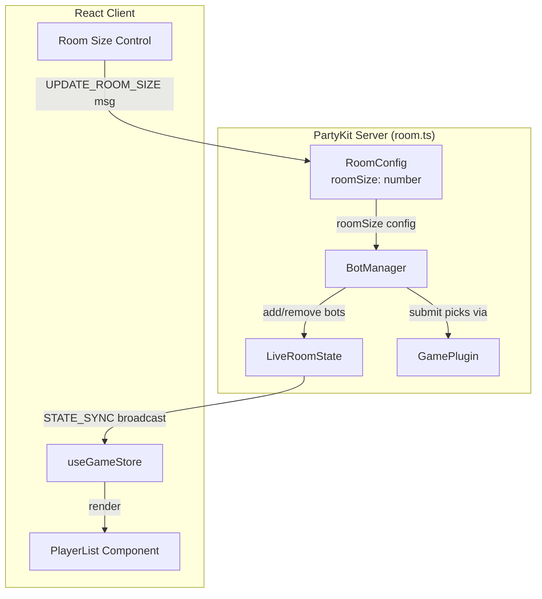
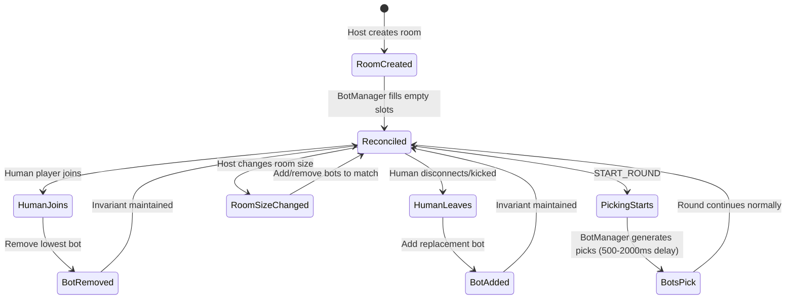

# Design Document: Lobby Bot Personas

## Overview

This feature introduces server-managed lobby bots that automatically fill empty player slots in a game room. The system maintains a room size invariant: the total count of human players + bots always equals the host-configured room size. Bots make random choices during the PICKING phase, participate in scoring identically to human players, and are seamlessly swapped in/out as humans join or leave.

The design integrates with the existing PartyKit server (`room.ts`), the shared type system (`@games-of-chance/shared`), and the React client. Bots are purely server-side entities — they have no WebSocket connections — and their picks are submitted through the same server-side processing pipeline used for human players.

## Architecture



### Key Architectural Decisions

1. **Bots are server-side only** — No WebSocket connections for bots. The `BotManager` directly manipulates the `LiveRoomState.players` record and submits picks by writing to `round.picks`. This avoids connection overhead and race conditions.

2. **Bot IDs use a `bot:` prefix** — Bot player IDs follow the format `bot:{name}` (e.g., `bot:alpha`). This makes bots trivially distinguishable from human players (who use UUIDs) without needing an additional `isBot` field on the `Player` type.

3. **BotManager as a class member of GameRoom** — The `BotManager` is instantiated and held by the `GameRoom` class, similar to `FastPlayAdapter`. It reacts to room lifecycle events (join, leave, kick, room size change) to maintain the invariant.

4. **Room size replaces maxPlayers** — The existing `RoomConfig.maxPlayers` field is repurposed as the room size target. When bots are enabled, this value represents the total slot count (humans + bots) rather than a hard cap on human connections.

5. **Bot picks use existing plugin validation** — Bot picks are generated per-game-type using the plugin's valid options, then submitted through `state.round.picks[botId] = pick`. They pass through the same `scoreRound` and `computeGameLeaderboard` logic as human picks.

## Components and Interfaces

### BotManager (Server-side)

```typescript
// packages/server/src/bots/BotManager.ts

interface BotPersona {
  id: string        // e.g., "bot:alpha"
  name: string      // e.g., "[BOT] Alpha"
}

const BOT_NAMES = ["Alpha", "Bravo", "Charlie", "Delta", "Echo", 
                   "Foxtrot", "Golf", "Hotel", "India"]

class BotManager {
  private bots: Map<string, BotPersona> = new Map()
  
  /** 
   * Reconcile bot count to match target room size.
   * Adds or removes bots so that humans + bots === roomSize.
   */
  reconcile(
    players: Record<string, Player>, 
    roomSize: number
  ): { added: BotPersona[]; removed: string[] }

  /**
   * Remove the lowest-numbered bot to make room for a human.
   * Returns the removed bot's ID, or null if no bots exist.
   */
  removeLowestBot(players: Record<string, Player>): string | null

  /**
   * Generate random picks for all bots in the room.
   * Returns a map of botId → pick.
   */
  generatePicks(
    gameType: string, 
    settings: GameSettings
  ): Record<string, unknown>

  /** Get all current bot IDs */
  getBotIds(): string[]

  /** Check if a player ID belongs to a bot */
  isBot(playerId: string): boolean
}
```

### Room Size Control (Client-side)

```typescript
// packages/client/src/components/lobby/RoomSizeControl.tsx

interface RoomSizeControlProps {
  currentSize: number
  minSize: 2
  maxSize: 10
  disabled: boolean  // true when settings are locked (game in progress)
  onSizeChange: (newSize: number) => void
}
```

### Updated Shared Types

```typescript
// Additions to @games-of-chance/shared types.ts

// Player type gets an optional `isBot` flag for client-side rendering hints
// Actually: we identify bots by their ID prefix "bot:" instead of a new field.
// No changes needed to the Player interface.

// New client message type for room size changes
| { type: "UPDATE_ROOM_SIZE"; payload: { roomSize: number } }
```

### Updated ClientMessage Union

```typescript
// Addition to ClientMessage in shared/src/types.ts
| { type: "UPDATE_ROOM_SIZE"; payload: { roomSize: number } }
```

### Server Integration Points

The `GameRoom` class gains:
- A `private botManager: BotManager` field, initialized in `onStart()`
- A `handleUpdateRoomSize()` message handler
- Calls to `botManager.reconcile()` after join, disconnect, kick, and room size changes
- Calls to `botManager.generatePicks()` at the start of the PICKING phase (with a short delay up to 2 seconds)
- Removal of bot scores from leaderboards when bots are removed

## Data Models

### RoomConfig Extension

```typescript
interface RoomConfig {
  // ... existing fields ...
  roomSize: number  // 2–10, default 4. Total slots (humans + bots).
}
```

The existing `maxPlayers` field is retained for backward compatibility but `roomSize` becomes the canonical source of truth for the slot count when lobby bots are active.

### Bot Player Representation

Bots are stored as regular `Player` entries in `LiveRoomState.players`:

```typescript
// A bot player in the state
{
  id: "bot:alpha",
  name: "[BOT] Alpha",
  role: "player",       // Bots are never host
  connected: true,      // Always "connected" (server-managed)
  connectionId: null    // No actual WebSocket connection
}
```

### Bot Pick Timing

Bot picks are submitted with a random delay between 500ms and 2000ms after PICKING phase begins. This prevents all bots from appearing to pick simultaneously and makes the experience feel more natural.

### State Lifecycle




## Correctness Properties

*A property is a characteristic or behavior that should hold true across all valid executions of a system — essentially, a formal statement about what the system should do. Properties serve as the bridge between human-readable specifications and machine-verifiable correctness guarantees.*

### Property 1: Room Size Invariant

*For any* configured room size (2–10) and *for any* sequence of player join, disconnect, and kick operations, the total count of entities (human players + lobby bots) in the player roster SHALL always equal the configured room size.

**Validates: Requirements 2.1, 2.4, 4.1, 4.2, 8.1, 8.2**

### Property 2: Bot Identity Correctness

*For any* lobby bot created by the BotManager, its player ID SHALL start with the prefix `bot:` and be unique across all players in the room, AND its display name SHALL start with the prefix `[BOT] `.

**Validates: Requirements 2.2, 2.3**

### Property 3: Slot Ordering on Human Join

*For any* room with N bots and a human joining, the bot removed SHALL be the one occupying the lowest-numbered slot, and the human SHALL be assigned to that slot position in sequential order after the host.

**Validates: Requirements 3.1, 3.2**

### Property 4: Bot Picks Are Valid

*For any* game type and *for any* lobby bot in the room, when the PICKING phase begins, the BotManager SHALL produce a pick for each bot that passes the active game plugin's `validatePick` function.

**Validates: Requirements 5.1, 5.2, 5.3**

### Property 5: Bot Scoring Equality

*For any* resolved round containing both human players and lobby bots, the scoring logic SHALL produce score deltas for all bots AND bots SHALL appear in both the game leaderboard and session leaderboard with scores computed by the same `scoreRound` function used for humans.

**Validates: Requirements 6.1, 6.2, 6.3**

### Property 6: Bot Removal Cleans Leaderboards

*For any* lobby bot that is removed from the room (due to a human joining), the bot's entries SHALL be absent from both the game leaderboard and the session leaderboard after removal.

**Validates: Requirements 3.4, 6.4**

### Property 7: Room Size Validation

*For any* value submitted as a room size update, the server SHALL accept the value if and only if it is an integer in the range [2, 10] inclusive, rejecting all other values.

**Validates: Requirements 1.4**

### Property 8: Room Size Change Preserves Humans

*For any* room with H human players and *for any* valid room size change (where new size ≥ H), all H human players SHALL remain in the roster unchanged, and only bot count SHALL be adjusted to satisfy the invariant.

**Validates: Requirements 8.3**

### Property 9: Room Size Reduction Rejection

*For any* room with H human players and *for any* attempted room size value less than H, the server SHALL reject the change with a descriptive error and leave the room state unchanged.

**Validates: Requirements 8.4**

### Property 10: Player Roster Ordering

*For any* player roster containing both human players and lobby bots, when rendered as a list, all human players SHALL appear before all lobby bots.

**Validates: Requirements 7.3**

### Property 11: Replacement Bot Zero Score

*For any* lobby bot created to replace a departed human player during an active game, the bot's initial game score SHALL be zero.

**Validates: Requirements 4.3**

## Error Handling

| Scenario | Error Code | Message | Recovery |
|----------|-----------|---------|----------|
| Room size value is not an integer 2–10 | `INVALID_ROOM_SIZE` | "Room size must be an integer between 2 and 10" | Reject, keep current size |
| Room size reduced below human count | `ROOM_SIZE_TOO_SMALL` | "Cannot reduce room size below the number of human players ({count})" | Reject, keep current size |
| Human joins when room is full (no bots) | `ROOM_FULL` | "Room is at maximum capacity" | Reject join (existing behavior) |
| Non-host attempts room size change | `NOT_HOST` | "Only the host can change room size" | Reject |
| Room size change during active game | `SETTINGS_LOCKED` | "Cannot change room size during an active game" | Reject |
| Host disconnects, no humans remain | N/A (no error) | N/A | Suspend game progression, retain bots |

### Edge Cases

- **All humans leave**: Bots remain in room, game suspends. When a human reconnects, they claim the host role and gameplay can resume.
- **Room size changed to exactly the human count**: All bots are removed, room is fully human.
- **Bot pick generation fails**: Fallback to a random valid pick from the plugin's option space. Log warning server-side.
- **Rapid join/leave**: The `reconcile()` method is idempotent and called synchronously after each state change, preventing race conditions.

## Testing Strategy

### Property-Based Tests (fast-check + Vitest)

The project already uses `fast-check` (v3.23.2) with Vitest for property-based testing. Each correctness property maps to a single property-based test with a minimum of 100 iterations.

**Test file**: `packages/server/src/__tests__/lobbyBotPersonas.property.test.ts`

Each test is tagged with the format:
```
Feature: lobby-bot-personas, Property {N}: {property_text}
```

**Key generators needed:**
- `arbRoomSize()` — integer 2–10
- `arbOperationSequence(roomSize)` — random sequence of join/disconnect/kick operations
- `arbGameType()` — one of "coin-toss" | "battle-bots"
- `arbHumanCount(roomSize)` — integer 1–roomSize (at least 1 for host)

### Unit Tests (Example-Based)

- Room size defaults to 4
- Room size control renders with min=2, max=10
- Bot names follow the naming pattern (Alpha, Bravo, Charlie...)
- PlayerList renders 🤖 icon for bot entries
- Bot picks are submitted within the timing window (fake timers)
- `STATE_SYNC` payload includes bot players correctly

### Integration Tests

- Full round lifecycle with mixed humans and bots (join → PICKING → RESOLVING → RESULT → END_GAME)
- Host reconnection after disconnect with bots preserved
- Simulation adapter interaction with bots

### Test Configuration

- Property tests: minimum 100 iterations each
- Use `vi.useFakeTimers()` for timing-sensitive tests (bot pick delay)
- Reuse existing test helpers from `packages/server/src/__tests__/helpers.ts`
