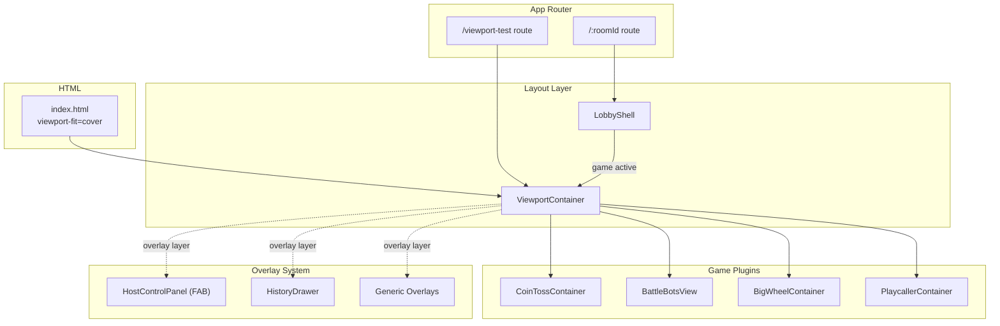
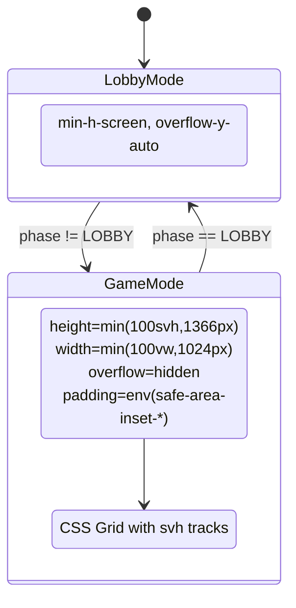

# Design Document: Mobile Viewport Containment

## Overview

This design introduces a systematic viewport containment layer that guarantees all game UIs fit within the visible mobile viewport without scrolling or clipping. The approach replaces the current ad-hoc `100dvh` usage (present only in the playcaller branch of `LobbyShell`) with a unified `100svh`-based container that accounts for browser chrome, notches, and home indicators via CSS `env(safe-area-inset-*)` values.

The implementation follows a phased strategy:
1. **Foundation**: Create a reusable `ViewportContainer` component and update the HTML meta tag
2. **Validation**: Build a standalone `/viewport-test` route to prove containment on real devices
3. **Migration**: Wrap all game plugins in the container via `LobbyShell` layout switching
4. **Polish**: Refine overlay containment, host controls positioning, typography scaling, and large-screen capping

### Key Design Decisions

- **`100svh` over `100dvh`**: The "small viewport height" represents the minimum guaranteed visible area (browser chrome fully shown). This prevents the layout from jumping when mobile address bars appear/disappear — the UI never exceeds available space.
- **CSS Grid with `svh`-based tracks**: Distributes vertical space proportionally among game sections (header, game area, controls) without fixed pixel heights that break on different devices.
- **Progressive enhancement with fallbacks**: `100vh` declared before `100svh` ensures older browsers still get overflow-hidden behavior even without svh support.
- **Single React component boundary**: A `ViewportContainer` component wraps game content, making containment easy to apply and test in isolation.

## Architecture



### Layout Flow



## Components and Interfaces

### ViewportContainer

The foundational layout primitive that enforces viewport containment.

```typescript
interface ViewportContainerProps {
  children: React.ReactNode
  /** Optional className for additional styling */
  className?: string
  /** Grid template rows in svh units. Default: "auto 1fr auto" */
  gridRows?: string
}
```

**CSS applied by ViewportContainer:**
```css
.viewport-container {
  /* Fallback for older browsers */
  height: 100vh;
  /* Modern: smallest guaranteed viewport */
  height: 100svh;
  /* Cap for large screens */
  height: min(100svh, 1366px);
  
  width: 100vw;
  width: min(100vw, 1024px);
  
  overflow: hidden;
  
  /* Safe area insets */
  padding-top: env(safe-area-inset-top, 0px);
  padding-bottom: env(safe-area-inset-bottom, 0px);
  padding-left: env(safe-area-inset-left, 0px);
  padding-right: env(safe-area-inset-right, 0px);
  
  /* Grid layout for children */
  display: grid;
  grid-template-rows: auto 1fr auto;
  
  /* Centering on large screens */
  margin: 0 auto;
  
  /* Prevent any internal scroll bounce */
  overscroll-behavior: none;
}

/* Large-screen background fill */
@media (min-width: 1025px), (min-height: 1367px) {
  .viewport-container {
    /* Center both axes when capped */
    position: absolute;
    top: 50%;
    left: 50%;
    transform: translate(-50%, -50%);
  }
}
```

### ViewportTestPage

Standalone route component for `/viewport-test`.

```typescript
interface DiagnosticInfo {
  viewportHeight: number
  safeAreaTop: number
  safeAreaBottom: number
  safeAreaLeft: number
  safeAreaRight: number
  scrollDetected: boolean
  containmentViolation: boolean
}
```

### OverlayContainer

A wrapper for popovers, drawers, and modals that enforces viewport-bounded positioning.

```typescript
interface OverlayContainerProps {
  children: React.ReactNode
  /** Maximum height as percentage of viewport. Default: 60 */
  maxHeightPercent?: number
  /** Minimum clearance from viewport edges in px. Default: 8 */
  edgeClearance?: number
  /** Whether to auto-reposition when clipped */
  autoReposition?: boolean
}
```

### GameGridLayout

Per-game-plugin grid configuration specifying how vertical space is distributed.

```typescript
interface GameGridConfig {
  /** CSS grid-template-rows value using svh units */
  rows: string
  /** Minimum viewport height before enabling scroll fallback */
  minHeight: number
}

const GAME_GRID_CONFIGS: Record<string, GameGridConfig> = {
  "coin-toss": {
    rows: "auto minmax(40svh, 1fr) auto",
    minHeight: 600,
  },
  "battle-bots": {
    rows: "auto minmax(40svh, 1fr) auto",
    minHeight: 600,
  },
  "big-wheel": {
    rows: "auto minmax(45svh, 1fr) auto",
    minHeight: 600,
  },
  "playcaller": {
    rows: "auto minmax(40svh, 1fr) auto",
    minHeight: 600,
  },
}
```

### ResponsiveText

Utility component for viewport/container-relative typography.

```typescript
interface ResponsiveTextProps {
  children: React.ReactNode
  /** Minimum font size in px. Default: 14 */
  minSize?: number
  /** Maximum font size in px. Default: 24 */
  maxSize?: number
  /** Whether to truncate with ellipsis on overflow. Default: false */
  truncate?: boolean
  className?: string
}
```

## Data Models

This feature is entirely client-side CSS/layout work. No new server-side data models are introduced.

### Configuration Constants

```typescript
/** ViewportContainer dimension caps */
export const VIEWPORT_MAX_WIDTH = 1024  // px — iPad Pro portrait width
export const VIEWPORT_MAX_HEIGHT = 1366 // px — iPad Pro portrait height

/** Overlay constraints */
export const OVERLAY_MAX_HEIGHT_PERCENT = 60
export const OVERLAY_EDGE_CLEARANCE = 8 // px

/** Scroll fallback threshold */
export const MIN_VIEWPORT_HEIGHT = 600 // px

/** Diagnostic update debounce */
export const DIAGNOSTIC_UPDATE_MS = 200
```

### CSS Custom Properties (set on :root)

```css
:root {
  --safe-area-top: env(safe-area-inset-top, 0px);
  --safe-area-bottom: env(safe-area-inset-bottom, 0px);
  --safe-area-left: env(safe-area-inset-left, 0px);
  --safe-area-right: env(safe-area-inset-right, 0px);
  --viewport-max-w: 1024px;
  --viewport-max-h: 1366px;
}
```

## Correctness Properties

*A property is a characteristic or behavior that should hold true across all valid executions of a system — essentially, a formal statement about what the system should do. Properties serve as the bridge between human-readable specifications and machine-verifiable correctness guarantees.*

### Property 1: Containment violation detection

*For any* pair of values (scrollHeight, clientHeight) representing a container's dimensions, the containment violation detector SHALL return `true` if and only if scrollHeight > clientHeight.

**Validates: Requirements 2.6**

### Property 2: Grid configuration allocates sufficient primary area

*For any* game type registered in the GAME_GRID_CONFIGS, the grid row configuration SHALL allocate at least 40% of the available viewport height (40svh) to the primary game area track.

**Validates: Requirements 3.5**

### Property 3: Overflow mode determined by viewport height threshold

*For any* viewport height value (positive integer), the ViewportContainer overflow behavior SHALL be `auto` (scrollable) when height < 600px and `hidden` (no-scroll) when height >= 600px.

**Validates: Requirements 3.6**

### Property 4: Overlay bounded height with internal scroll

*For any* viewport height and any overlay content height, the overlay's rendered max-height SHALL not exceed 60% of the viewport height, AND if the content height exceeds that max-height, the overlay SHALL enable internal vertical scrolling (overflow-y: auto).

**Validates: Requirements 5.1, 5.2**

### Property 5: Overlay edge containment with auto-reposition

*For any* overlay dimensions (width, height), any anchor position within the viewport, and any safe-area inset values, the computed overlay position SHALL keep all four edges at least 8px inside the safe-area bounds. If the default position (below/rightward) would violate this constraint, the overlay SHALL reposition to the opposite direction.

**Validates: Requirements 5.3, 5.5**

### Property 6: Fluid typography clamping

*For any* viewport width (positive integer), the computed font size for spectator matchup card text SHALL equal exactly 14px when viewport width ≤ 375px, exactly 24px when viewport width ≥ 1280px, and a linearly interpolated value between 14px and 24px for viewport widths between 375px and 1280px.

**Validates: Requirements 6.1, 6.3**

### Property 7: ViewportContainer applied to all game types

*For any* game type in the set {coin-toss, battle-bots, big-wheel, playcaller}, when the game phase is not LOBBY and not END_TOURNAMENT, the LobbyShell SHALL render a ViewportContainer wrapping the game content.

**Validates: Requirements 7.3**

### Property 8: CSS fallback ordering

*For any* rendered ViewportContainer, the CSS height declarations SHALL contain the `100vh` fallback value declared before (earlier in source order than) the `100svh` modern value, ensuring browsers that don't understand `svh` use the `vh` fallback.

**Validates: Requirements 9.1**

## Error Handling

### Containment Violations

- **Detection**: The ViewportContainer monitors `scrollHeight` vs `clientHeight` via a ResizeObserver. If content overflows, a development-mode warning is displayed (red border + diagnostic text).
- **Recovery**: In production, `overflow: hidden` ensures no scrollbar appears even if content exceeds bounds. The content is clipped rather than scrolled.
- **Sub-600px fallback**: When viewport height is below 600px, the container switches to `overflow: auto` to prevent interactive elements from being unreachable.

### Safe Area Fallback

- **Missing env() support**: All `env()` calls include `0px` fallback values. If the browser doesn't support CSS environment variables, padding resolves to 0 — the same as a device without notches.
- **Missing viewport-fit=cover**: Without this meta attribute, `env()` values resolve to 0. The layout still works (overflow: hidden + vh/svh height) but without notch avoidance.

### Overlay Positioning Edge Cases

- **Viewport too small for overlay**: If 60% of viewport height is less than the overlay's minimum content height (e.g., a single list item), the overlay renders at minimum content height and enables scroll.
- **Anchor near corner**: When the anchor is near a viewport corner, the auto-reposition logic tries all four directions (down, up, left, right) before settling on the direction with maximum available space.
- **Rapid resize during overlay open**: Overlay position recalculates on `resize` events with a 200ms debounce to avoid layout thrashing.

### Browser Compatibility

- **No svh support**: The `100vh` fallback is declared first in the cascade. Browsers ignoring `svh` use `vh`, which may be slightly taller than the visible area on mobile (address bar overlap) but still prevents scrolling via `overflow: hidden`.
- **No CSS Grid support**: Not a concern for the target browser matrix (last 3 versions of major mobile browsers all support CSS Grid).

## Testing Strategy

### Unit Tests (Vitest + Testing Library)

Unit tests cover specific examples, edge cases, and integration points:

- **ViewportContainer rendering**: Verify correct CSS classes and styles are applied
- **Test harness structure**: Verify `/viewport-test` renders expected diagnostic elements
- **LobbyShell phase transitions**: Verify layout switches correctly between lobby and game modes
- **Host controls isolation**: Verify FAB doesn't affect layout flow
- **Overlay rendering**: Verify HistoryDrawer and other overlays respect max-height
- **Typography**: Verify truncation CSS is applied to long names

### Property-Based Tests (Vitest + fast-check)

Property tests validate universal correctness properties across generated inputs. Each test runs a minimum of 100 iterations.

**Library**: `fast-check` (already in devDependencies)

**Test configuration**:
- Minimum 100 iterations per property
- Each test tagged with: `Feature: mobile-viewport-containment, Property {N}: {title}`

**Properties to implement**:
1. Containment violation detection (pure function: scrollHeight, clientHeight → boolean)
2. Grid config validation (data structure: all configs allocate ≥ 40% primary area)
3. Overflow mode threshold (pure function: viewportHeight → overflow mode)
4. Overlay bounded height with scroll (pure function: viewportHeight, contentHeight → max-height + overflow)
5. Overlay edge containment (pure function: anchor, dimensions, viewport, safeArea → position)
6. Fluid typography clamping (pure function: viewportWidth → fontSize)
7. ViewportContainer applied for all game types (rendering property across game type set)
8. CSS fallback ordering (string property: vh appears before svh in output)

### Integration Tests

- **Per-game containment**: Render each game plugin at 600px viewport height, verify no overflow
- **Cross-browser fallback**: Verify layout works with vh-only (simulated by removing svh)
- **Resize handling**: Trigger viewport resize events, verify diagnostics update within 200ms

### Manual Testing Checklist

The `/viewport-test` route enables manual validation on real devices:
- iPhone SE (375×667) — smallest target
- iPhone 15 Pro (393×852) — notch + dynamic island
- Pixel 7 (412×915) — Android reference
- iPad Pro 12.9" (1024×1366) — max bounds cap
- Samsung Galaxy S24 (360×780) — Samsung Internet

