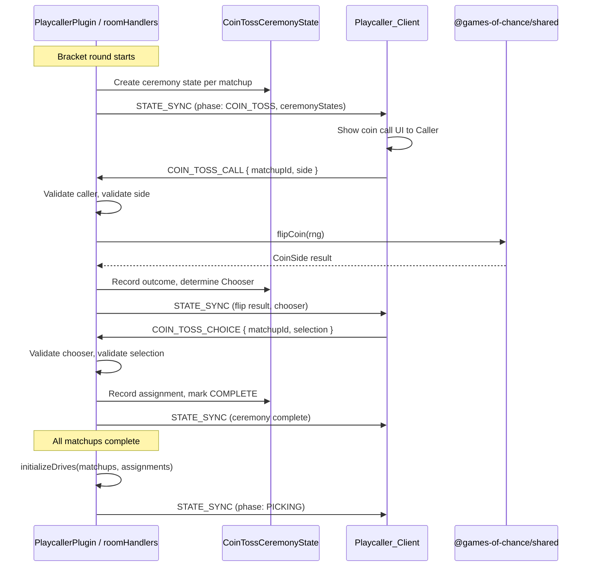
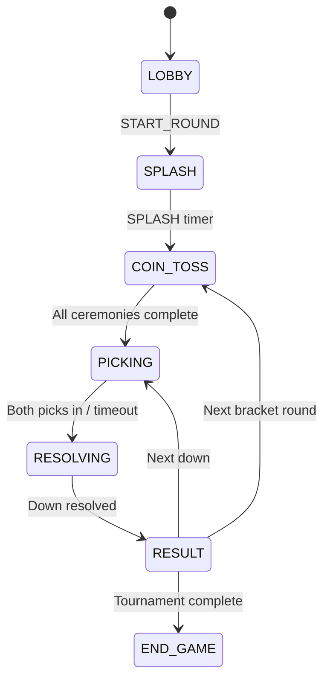
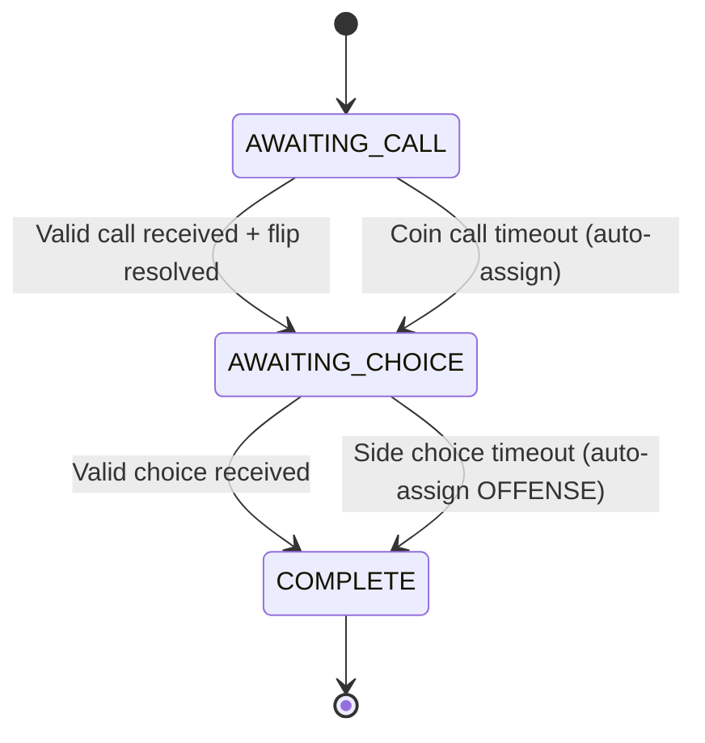

# Design Document: Playcaller Coin Toss Ceremony

## Overview

This design adds a coin toss ceremony phase to the Playcaller tournament game. The ceremony occurs after the VS/SPLASH screen and before the first PICKING phase of each bracket round. It determines offense/defense assignments for each matchup through a structured flow: the higher-seeded player calls heads or tails, the server resolves the flip, and the winner chooses their side.

The implementation reuses the existing `CoinSide` type from `@games-of-chance/shared` and extracts a shared coin flip utility that both the standalone coin-toss game and Playcaller can invoke. The ceremony integrates with the existing bracket/drive lifecycle, bot management, and timeout infrastructure.

### Key Design Decisions

1. **Per-matchup state machine** — Each matchup in a bracket round has its own ceremony state (AWAITING_CALL → AWAITING_CHOICE → COMPLETE), allowing matchups to proceed independently.
2. **Shared flip utility** — The `flipCoin(rng?)` function is extracted into `@games-of-chance/shared` so both CoinTossPlugin and Playcaller use identical threshold logic.
3. **Seed-based role assignment** — `playerA` (higher seed in the Matchup) is always the Caller, matching real football conventions.
4. **Drive initialization override** — `initializeDrives` gains an optional `assignments` parameter to accept explicit offense/defense mappings from the coin toss results.

---

## Architecture



### Phase Flow



### Per-Matchup Ceremony State Machine



---

## Components and Interfaces

### New Shared Utility: `flipCoin`

**Location:** `packages/shared/src/games/coin-toss/flipCoin.ts`

```typescript
import type { CoinSide } from "./types"

export type RngFunction = () => number

/**
 * Resolves a coin flip using the provided RNG function.
 * Returns "HEADS" when rng() < 0.5, "TAILS" otherwise.
 * Defaults to Math.random when no RNG is provided.
 */
export function flipCoin(rng: RngFunction = Math.random): CoinSide {
  return rng() < 0.5 ? "HEADS" : "TAILS"
}
```

### New Server Module: `CoinTossCeremony`

**Location:** `packages/server/src/games/playcaller/coinTossCeremony.ts`

Responsibilities:
- Manages per-matchup ceremony state
- Validates incoming COIN_TOSS_CALL and COIN_TOSS_CHOICE messages
- Resolves flips using the shared `flipCoin` utility
- Determines Caller/Chooser/Waiter roles
- Records offense/defense assignments
- Handles timeout auto-resolution

```typescript
// Core ceremony management functions
export function createCeremonyStates(matchups: Matchup[]): Record<string, CoinTossCeremonyMatchupState>
export function handleCoinCall(state: CoinTossCeremonyMatchupState, playerId: string, side: CoinSide, rng?: RngFunction): CoinCallResult
export function handleSideChoice(state: CoinTossCeremonyMatchupState, playerId: string, selection: SideSelection): SideChoiceResult
export function autoResolveCoinCall(state: CoinTossCeremonyMatchupState, rng?: RngFunction): CoinTossCeremonyMatchupState
export function autoResolveSideChoice(state: CoinTossCeremonyMatchupState): CoinTossCeremonyMatchupState
export function allCeremoniesComplete(states: Record<string, CoinTossCeremonyMatchupState>): boolean
export function getAssignments(states: Record<string, CoinTossCeremonyMatchupState>): Record<string, { offense: string; defense: string }>
```

### Modified: `PlaycallerPlugin.initializeDrives`

Updated signature:

```typescript
export function initializeDrives(
  matchups: Matchup[],
  assignments?: Record<string, { offense: string; defense: string }>
): Record<string, DriveState>
```

When `assignments` is provided, uses explicit offense/defense mappings instead of `Math.random()`. The offense player receives `seedA = 2` and defense receives `seedB = 1` to satisfy `createDriveState`'s "higher seed = offense" convention.

### Modified: `roomHandlers.ts`

New exported handlers:
```typescript
export function handleCoinTossCall(ctx: PlaycallerRoomContext, sender: Connection, payload: { matchupId: string; side: string }): void
export function handleCoinTossChoice(ctx: PlaycallerRoomContext, sender: Connection, payload: { matchupId: string; selection: string }): void
export function beginCoinTossPhase(ctx: PlaycallerRoomContext): void
export function resolveCoinTossTimeout(ctx: PlaycallerRoomContext): void
export function scheduleCoinTossBotActions(ctx: PlaycallerRoomContext): void
```

### New Client Messages

Added to the `ClientMessage` union in `@games-of-chance/shared`:

```typescript
| { type: "COIN_TOSS_CALL"; payload: { matchupId: string; side: CoinSide } }
| { type: "COIN_TOSS_CHOICE"; payload: { matchupId: string; selection: SideSelection } }
```

### New Shared Types

Added to `@games-of-chance/shared`:

```typescript
/** Side selection for the coin toss ceremony */
export type SideSelection = "OFFENSE" | "DEFENSE"

/** Per-matchup coin toss ceremony step */
export type CeremonyStep = "AWAITING_CALL" | "AWAITING_CHOICE" | "COMPLETE"

/** Per-matchup ceremony state broadcast to clients */
export interface CoinTossCeremonyMatchupState {
  matchupId: string
  step: CeremonyStep
  callerId: string        // higher-seeded player (always playerA)
  waiterId: string        // lower-seeded player (always playerB)
  calledSide: CoinSide | null
  flipOutcome: CoinSide | null
  flippedAt: number | null
  chooserId: string | null
  sideSelection: SideSelection | null
  coinCallDeadlineMs: number | null
  sideChoiceDeadlineMs: number | null
}

/** Extended PlaycallerGameState with ceremony data */
export interface PlaycallerGameState {
  bracket: Bracket
  spectators: string[]
  activeCompetitors: string[]
  driveStates?: Record<string, DriveState> | null
  /** Coin toss ceremony states — present during COIN_TOSS phase */
  ceremonyStates?: Record<string, CoinTossCeremonyMatchupState> | null
}
```

### Updated RoundPhase

```typescript
export type RoundPhase = "LOBBY" | "SPLASH" | "COIN_TOSS" | "PICKING" | "RESOLVING" | "RESULT" | "END_GAME" | "END_TOURNAMENT"
```

---

## Data Models

### CoinTossCeremonyMatchupState

| Field | Type | Description |
|-------|------|-------------|
| matchupId | string | Unique matchup identifier from the bracket |
| step | CeremonyStep | Current ceremony step for this matchup |
| callerId | string | Player ID of the Caller (playerA, higher seed) |
| waiterId | string | Player ID of the Waiter/opponent (playerB, lower seed) |
| calledSide | CoinSide \| null | The side called by the Caller, null until submitted |
| flipOutcome | CoinSide \| null | Server-resolved flip result, null until flipped |
| flippedAt | number \| null | Epoch ms timestamp of flip resolution |
| chooserId | string \| null | Player ID of the toss winner who chooses side |
| sideSelection | SideSelection \| null | The chosen side (OFFENSE/DEFENSE) |
| coinCallDeadlineMs | number \| null | Deadline for coin call submission |
| sideChoiceDeadlineMs | number \| null | Deadline for side choice submission |

### Module-Level State

```typescript
/** Per-matchup ceremony states for the current bracket round */
let ceremonyStates: Record<string, CoinTossCeremonyMatchupState> | null = null

/** Per-matchup timeout timer IDs for cleanup */
let ceremonyTimers: Record<string, ReturnType<typeof setTimeout>> = {}

/** Per-matchup bot action timer IDs */
let botCeremonyTimers: ReturnType<typeof setTimeout>[] = []
```

### Constants

```typescript
export const COIN_TOSS_CEREMONY = {
  /** Per-matchup coin call timeout (ms) */
  COIN_CALL_TIMEOUT_MS: 20_000,
  /** Per-matchup side choice timeout (ms) */
  SIDE_CHOICE_TIMEOUT_MS: 20_000,
  /** Global phase timeout — all pending ceremonies auto-resolved (ms) */
  PHASE_TIMEOUT_MS: 10_000,
  /** Delay between ceremony completion and PICKING phase start (ms) */
  TRANSITION_DELAY_MS: 500,
  /** Bot action delay range (ms) */
  BOT_DELAY_MIN_MS: 1_500,
  BOT_DELAY_MAX_MS: 3_500,
} as const
```

---

## Correctness Properties

*A property is a characteristic or behavior that should hold true across all valid executions of a system — essentially, a formal statement about what the system should do. Properties serve as the bridge between human-readable specifications and machine-verifiable correctness guarantees.*

### Property 1: Coin Call Validation

*For any* string value submitted as a coin call from the designated Caller, the system SHALL accept the call if and only if the value is "HEADS" or "TAILS"; all other values SHALL be rejected with an "INVALID_COIN_SIDE" error and the ceremony state SHALL remain unchanged.

**Validates: Requirements 2.4, 2.5**

### Property 2: Caller Designation

*For any* matchup in a bracket round, the designated Caller SHALL always be playerA (the higher-seeded player), regardless of the number of players, bracket structure, or round index.

**Validates: Requirements 2.1**

### Property 3: Non-Caller Rejection

*For any* player who is not the designated Caller for a matchup, a COIN_TOSS_CALL message from that player SHALL be rejected with an "INVALID_CALLER" error and the ceremony state SHALL remain unchanged.

**Validates: Requirements 2.6**

### Property 4: Duplicate Call Rejection

*For any* matchup where the Caller has already submitted a valid coin call, any subsequent COIN_TOSS_CALL from the same Caller SHALL be rejected with a "DUPLICATE_CALL" error and the original call value SHALL be retained.

**Validates: Requirements 2.7**

### Property 5: Flip Resolution Threshold

*For any* RNG value in [0, 1), the shared `flipCoin` utility SHALL return "HEADS" when the value is less than 0.5 and "TAILS" when the value is greater than or equal to 0.5.

**Validates: Requirements 3.1, 9.2**

### Property 6: Chooser Designation

*For any* coin toss ceremony where the Caller submits a call and the flip is resolved, the Chooser SHALL be the Caller when the flip outcome matches the call, and the Chooser SHALL be the Waiter (playerB) when the flip outcome does not match the call.

**Validates: Requirements 3.3, 3.4**

### Property 7: Post-Resolution Idempotence

*For any* matchup whose coin flip has already been resolved, subsequent COIN_TOSS_CALL messages SHALL be ignored and the existing flip result, chooser designation, and ceremony state SHALL remain unchanged.

**Validates: Requirements 3.5**

### Property 8: Side Selection Role Assignment

*For any* valid side selection from the designated Chooser, when "OFFENSE" is selected the Chooser SHALL be assigned as the offense player and the Waiter as defense; when "DEFENSE" is selected the Chooser SHALL be assigned as the defense player and the Waiter as offense.

**Validates: Requirements 4.3, 4.5, 4.6**

### Property 9: Waiter Choice Rejection

*For any* player who is not the designated Chooser for a matchup, a COIN_TOSS_CHOICE message from that player SHALL be rejected with an "INVALID_CHOOSER" error and the ceremony state SHALL remain unchanged.

**Validates: Requirements 4.4**

### Property 10: Invalid Selection Rejection

*For any* string value submitted as a side selection that is not "OFFENSE" or "DEFENSE", the system SHALL reject the message with an "INVALID_SELECTION" error and the matchup state SHALL remain unchanged.

**Validates: Requirements 4.7**

### Property 11: Drive Initialization Respects Explicit Assignments

*For any* set of matchups with explicit offense/defense assignments passed to `initializeDrives`, the resulting DriveState for each matchup SHALL have `offensePlayerId` equal to the designated offense player and `defensePlayerId` equal to the designated defense player.

**Validates: Requirements 5.2**

### Property 12: Timeout Auto-Assigns Valid CoinSide

*For any* coin call timeout event, the auto-assigned coin call SHALL always be a valid CoinSide value ("HEADS" or "TAILS").

**Validates: Requirements 7.2**

### Property 13: Bot Coin Call Validity

*For any* matchup where a bot is the Caller, the bot's auto-submitted coin call SHALL always be a valid CoinSide value ("HEADS" or "TAILS").

**Validates: Requirements 10.1**

---

## Error Handling

| Error Code | Trigger | Response |
|------------|---------|----------|
| WRONG_PHASE | PLAY_SELECTION received during COIN_TOSS phase | Reject with error, no state change |
| INVALID_COIN_SIDE | COIN_TOSS_CALL with value ≠ "HEADS"/"TAILS" | Reject with error, no state change |
| INVALID_CALLER | COIN_TOSS_CALL from non-Caller player | Reject with error, no state change |
| DUPLICATE_CALL | COIN_TOSS_CALL from Caller who already called | Reject with error, retain original |
| INVALID_CHOOSER | COIN_TOSS_CHOICE from non-Chooser player | Reject with error, no state change |
| INVALID_SELECTION | COIN_TOSS_CHOICE with value ≠ "OFFENSE"/"DEFENSE" | Reject with error, no state change |
| INVALID_MATCHUP | Message references non-existent matchupId | Reject with error, no state change |

### Timeout Recovery

- **Per-matchup coin call timeout (20s):** Auto-assigns random "HEADS" or "TAILS" for the Caller, proceeds to flip resolution.
- **Per-matchup side choice timeout (20s):** Auto-assigns "OFFENSE" to the Chooser, proceeds to drive initialization.
- **Global phase timeout (10s):** Auto-resolves ALL pending ceremonies with random values, transitions to PICKING phase. This is a safety net in case individual timers fail.

### Bot Timer Cancellation

When a global or per-matchup timeout fires before a bot's scheduled delay elapses, the pending bot timer is cancelled. The timeout handler takes precedence to avoid double-resolution.

---

## Testing Strategy

### Unit Tests (Example-Based)

- Phase transitions: SPLASH → COIN_TOSS → PICKING flow
- SKIP_GAMEPLAY bypass: coin toss skipped, random assignment used
- Timeout scenarios: verify auto-resolution on timer expiry
- Bot-as-Chooser always selects OFFENSE
- Spectator state includes ceremony data without interactive controls
- STATE_SYNC broadcasts include ceremony state during COIN_TOSS phase
- Global 10s phase timeout resolves all pending ceremonies
- Bot timer cancellation when timeout fires first

### Property-Based Tests (fast-check)

The project uses **fast-check** with **vitest** for property-based testing. Each property test runs a minimum of 100 iterations.

Properties to implement:
1. **Coin call validation** — Generate random strings, verify only HEADS/TAILS accepted
2. **Caller designation** — Generate random matchups, verify playerA is always Caller
3. **Non-Caller rejection** — Generate random non-Caller players, verify rejection
4. **Duplicate call rejection** — Submit call then re-submit, verify idempotence
5. **Flip resolution threshold** — Generate RNG values in [0, 1), verify threshold logic
6. **Chooser designation** — Generate calls and outcomes, verify correct Chooser
7. **Post-resolution idempotence** — Resolve then re-submit, verify no change
8. **Side selection role assignment** — Generate choices, verify offense/defense mapping
9. **Waiter choice rejection** — Generate non-Chooser attempts, verify rejection
10. **Invalid selection rejection** — Generate invalid strings, verify rejection
11. **Drive initialization assignments** — Generate explicit mappings, verify DriveState
12. **Timeout auto-assigns valid CoinSide** — Trigger timeouts, verify valid output
13. **Bot coin call validity** — Generate bot scenarios, verify valid CoinSide

**Tag format:** `Feature: playcaller-coin-toss, Property {number}: {title}`

### Integration Tests

- Full ceremony flow: call → flip → choice → drive initialization
- Multi-matchup ceremony with staggered completions
- Bot-vs-bot matchup completes without client interaction
- Mixed bot/human matchup with bot auto-submitting
