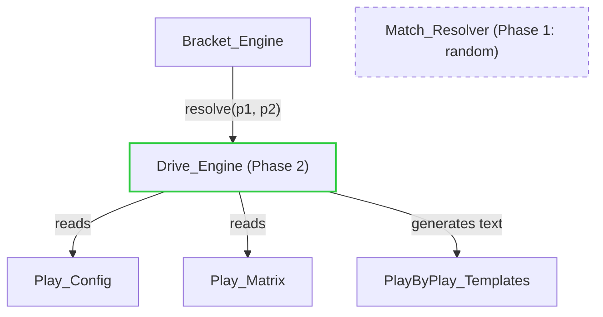
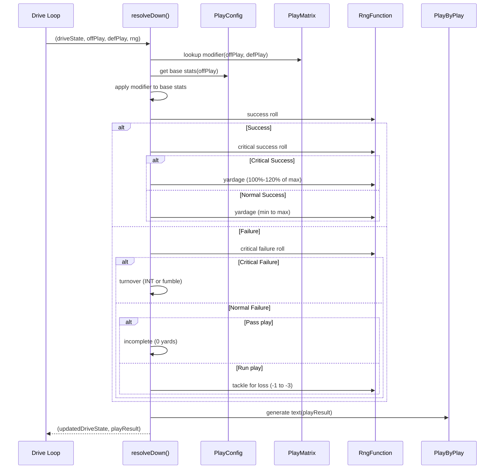
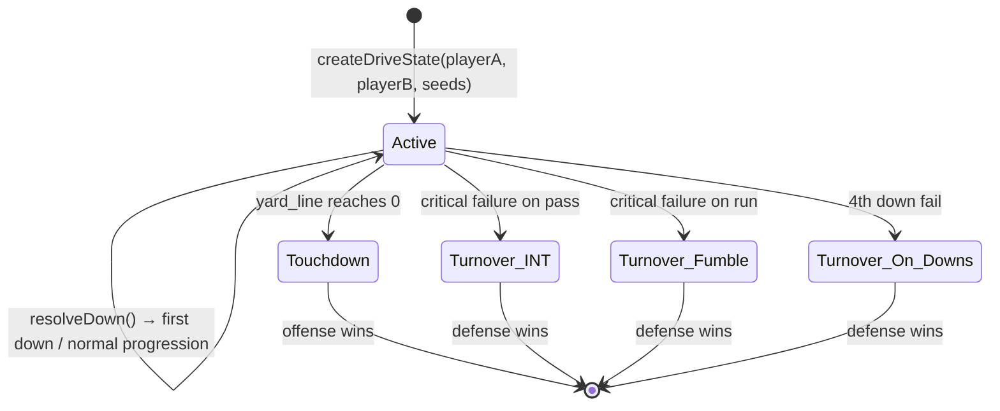

# Design Document: Playcaller Drive Engine

## Overview

The Playcaller Drive Engine is the Phase 2 Match_Resolver replacement for the Playcaller Tournament. Instead of resolving matchups by coin-flip, the engine runs an interactive football drive where one player calls offensive plays and the other calls defensive plays. Outcomes are determined by a D&D-style multi-step roll system influenced by the matchup between the chosen plays.

The engine is a **pure functional module** — it accepts a Drive_State plus play selections and an RNG function, and returns an updated Drive_State plus a Play_Result. No I/O, no mutation, no global state. This enables deterministic replay, property-based testing, and seamless integration with the existing bracket system.

Key design decisions:
- **Injectable RNG** — all randomness flows through a single `RngFunction` parameter, enabling deterministic testing and replay
- **Config-driven balance** — all play stats and defensive modifiers live in a single `PlayConfig` + `PlayMatrix` object that can be swapped without touching engine logic
- **Template-based play-by-play** — flavor text is generated from outcome templates, structured as a replaceable module for future LLM commentary
- **Stateless resolution** — each `resolveDown` call is a pure function; the drive loop is composed externally by calling it repeatedly
- **Axis-based matchup system** — plays are classified along Run/Pass × Safe/Aggressive axes, and defensive modifiers reward correct scheming (matching axis) while punishing incorrect reads

---

## Architecture

### Module Placement



The Drive_Engine replaces the `randomResolver` as the `MatchResolver` implementation. It lives at `packages/server/src/games/playcaller/drive/` as a sub-module of the playcaller game.

### Resolution Flow (Single Down)



### Drive Lifecycle



---

## Components and Interfaces

### File Structure

```
packages/server/src/games/playcaller/drive/
├── types.ts          # All Drive_Engine TypeScript interfaces
├── config.ts         # PlayConfig + PlayMatrix (balance data)
├── engine.ts         # Core pure functions (createDriveState, resolveDown, isDriveComplete)
├── playByPlay.ts     # Template-based text generation
└── index.ts          # Public API re-exports
```

### `drive/types.ts`

```typescript
/** Axis classification for plays */
export type PlayAxis = "run" | "pass"
export type PlayStyle = "safe" | "aggressive"

/** Offensive play identifier */
export type OffensivePlayId = "run-safe" | "run-aggressive" | "pass-safe" | "pass-aggressive"

/** Defensive play identifier */
export type DefensivePlayId = "run-safe" | "run-aggressive" | "pass-safe" | "pass-aggressive"

/** Base stats for an offensive play */
export interface OffensivePlayStats {
  id: OffensivePlayId
  name: string
  axis: PlayAxis
  style: PlayStyle
  successRate: number          // 0-1
  yardageRange: { min: number; max: number }
  criticalSuccessChance: number // 0-1
  criticalFailureChance: number // 0-1
}

/** Modifier applied by a defensive play to an offensive play's stats */
export interface DefensiveModifier {
  successRateMod: number       // additive, -1 to 1
  yardageMinMod: number        // additive integer
  yardageMaxMod: number        // additive integer
  critSuccessMod: number       // additive, -1 to 1
  critFailureMod: number       // additive, -1 to 1
}

/** Defensive play definition */
export interface DefensivePlayDef {
  id: DefensivePlayId
  name: string
  axis: PlayAxis
  style: PlayStyle
}

/** Complete play configuration */
export interface PlayConfig {
  offensivePlays: Record<OffensivePlayId, OffensivePlayStats>
  defensivePlays: Record<DefensivePlayId, DefensivePlayDef>
}

/** 4×4 matrix of defensive modifiers keyed by "offId:defId" */
export type PlayMatrix = Record<`${OffensivePlayId}:${DefensivePlayId}`, DefensiveModifier>

/** Injectable RNG function — returns a value in [0, 1) */
export type RngFunction = () => number

/** Outcome type for a single play */
export type PlayOutcome =
  | "success"
  | "critical_success"
  | "incomplete_pass"
  | "tackle_for_loss"
  | "interception"
  | "fumble"

/** Result of resolving a single down */
export interface PlayResult {
  outcome: PlayOutcome
  yardsGained: number
  playByPlayText: string
  offensivePlay: OffensivePlayId
  defensivePlay: DefensivePlayId
}

/** A single entry in the play history */
export interface PlayHistoryEntry {
  down: number
  yardsToGo: number
  yardLine: number
  offensivePlay: OffensivePlayId
  defensivePlay: DefensivePlayId
  result: PlayResult
  resultingYardLine: number
}

/** How the drive ended */
export type DriveEndingType = "touchdown" | "interception" | "fumble" | "turnover_on_downs"

/** Completion status of a finished drive */
export interface DriveCompletion {
  winner: string               // player ID
  loser: string                // player ID
  endingType: DriveEndingType
  finalState: DriveState
}

/** Complete drive state */
export interface DriveState {
  offensePlayerId: string
  defensePlayerId: string
  yardLine: number             // yards to end zone (0 = TD)
  down: number                 // 1-4
  yardsToGo: number            // yards needed for first down
  playHistory: PlayHistoryEntry[]
  isComplete: boolean
  completion: DriveCompletion | null
}
```

### `drive/engine.ts`

```typescript
import type {
  DriveState, DriveCompletion, PlayResult, PlayHistoryEntry,
  OffensivePlayId, DefensivePlayId, RngFunction,
  PlayConfig, PlayMatrix, OffensivePlayStats, DefensiveModifier
} from "./types"

/**
 * Creates initial drive state. Higher seed = offense.
 */
export function createDriveState(
  playerA: string,
  playerB: string,
  seedA: number,
  seedB: number
): DriveState

/**
 * Resolves a single down. Pure function — no side effects.
 * Returns updated DriveState and the PlayResult for this down.
 */
export function resolveDown(
  state: DriveState,
  offensivePlay: OffensivePlayId,
  defensivePlay: DefensivePlayId,
  rng: RngFunction,
  config: PlayConfig,
  matrix: PlayMatrix
): { state: DriveState; result: PlayResult }

/**
 * Checks if a drive is complete and returns completion info.
 */
export function isDriveComplete(state: DriveState): boolean

/**
 * Returns the completion status of a finished drive.
 * Throws if drive is not complete.
 */
export function getDriveCompletion(state: DriveState): DriveCompletion

/**
 * Selects a random play from the available options (for timeout default).
 */
export function selectRandomPlay(
  plays: OffensivePlayId[] | DefensivePlayId[],
  rng: RngFunction
): OffensivePlayId | DefensivePlayId
```

### `drive/config.ts`

```typescript
import type { PlayConfig, PlayMatrix } from "./types"

/**
 * Default play configuration — all balance values in one place.
 * 
 * Design rationale for base stats:
 * - Safe plays: higher success rate, lower yardage ceiling
 * - Aggressive plays: lower success rate, higher yardage ceiling
 * - Run plays: small consistent gains on failure (tackle for loss)
 * - Pass plays: binary success/fail, higher turnover risk
 */
export const DEFAULT_PLAY_CONFIG: PlayConfig = {
  offensivePlays: {
    "run-safe": {
      id: "run-safe",
      name: "Inside Run",
      axis: "run",
      style: "safe",
      successRate: 0.70,
      yardageRange: { min: 2, max: 5 },
      criticalSuccessChance: 0.08,
      criticalFailureChance: 0.05,
    },
    "run-aggressive": {
      id: "run-aggressive",
      name: "Outside Run",
      axis: "run",
      style: "aggressive",
      successRate: 0.55,
      yardageRange: { min: 3, max: 10 },
      criticalSuccessChance: 0.12,
      criticalFailureChance: 0.08,
    },
    "pass-safe": {
      id: "pass-safe",
      name: "Short Pass",
      axis: "pass",
      style: "safe",
      successRate: 0.65,
      yardageRange: { min: 3, max: 7 },
      criticalSuccessChance: 0.06,
      criticalFailureChance: 0.06,
    },
    "pass-aggressive": {
      id: "pass-aggressive",
      name: "Deep Pass",
      axis: "pass",
      style: "aggressive",
      successRate: 0.45,
      yardageRange: { min: 5, max: 15 },
      criticalSuccessChance: 0.15,
      criticalFailureChance: 0.12,
    },
  },
  defensivePlays: {
    "run-safe": { id: "run-safe", name: "Run Contain", axis: "run", style: "safe" },
    "run-aggressive": { id: "run-aggressive", name: "Blitz", axis: "run", style: "aggressive" },
    "pass-safe": { id: "pass-safe", name: "Zone Coverage", axis: "pass", style: "safe" },
    "pass-aggressive": { id: "pass-aggressive", name: "Man Press", axis: "pass", style: "aggressive" },
  },
}

/**
 * Default play matrix — defines how each defensive play modifies each offensive play.
 * 
 * Matching axis (e.g. run defense vs run offense): shrinks variance, moderate success penalty
 * Mismatched axis (e.g. run defense vs pass offense): expands variance, slight success boost
 * Aggressive defense vs aggressive offense (same axis): high risk/reward for both sides
 */
export const DEFAULT_PLAY_MATRIX: PlayMatrix = { /* ... 16 entries ... */ }
```

### `drive/playByPlay.ts`

```typescript
import type { PlayResult, PlayOutcome } from "./types"

/** Template map: outcome → array of template strings with {yards} placeholder */
export type PlayByPlayTemplates = Record<PlayOutcome, string[]>

/**
 * Generates play-by-play text from a play result.
 * Deterministic: template selection is based on play details, not RNG.
 */
export function generatePlayByPlay(
  result: Omit<PlayResult, "playByPlayText">,
  templates?: PlayByPlayTemplates
): string

/** Default templates */
export const DEFAULT_TEMPLATES: PlayByPlayTemplates
```

### Integration with Bracket_Engine

The Drive_Engine exposes a `MatchResolver`-compatible function:

```typescript
import type { MatchResolver } from "@games-of-chance/shared"
import type { RngFunction, PlayConfig, PlayMatrix } from "./types"

/**
 * Creates a MatchResolver that runs a full drive to determine the winner.
 * This is the Phase 2 replacement for randomResolver.
 * 
 * In the interactive version (future), the bracket engine will call this
 * resolver with play selections gathered from the players each down.
 * For now, it can operate in "auto" mode with random play selection for testing.
 */
export function createDriveResolver(
  rng: RngFunction,
  config: PlayConfig,
  matrix: PlayMatrix
): MatchResolver
```

---

## Data Models

### Drive State Lifecycle

```
Initial State:
{
  offensePlayerId: "player-1",   // higher seed
  defensePlayerId: "player-2",   // lower seed
  yardLine: 25,                  // start at opponent's 25
  down: 1,
  yardsToGo: 10,
  playHistory: [],
  isComplete: false,
  completion: null
}

After a 6-yard run on 1st down:
{
  ...
  yardLine: 19,                  // 25 - 6
  down: 2,
  yardsToGo: 4,                  // 10 - 6
  playHistory: [
    {
      down: 1,
      yardsToGo: 10,
      yardLine: 25,
      offensivePlay: "run-safe",
      defensivePlay: "pass-safe",
      result: { outcome: "success", yardsGained: 6, ... },
      resultingYardLine: 19
    }
  ],
  isComplete: false,
  completion: null
}

After a touchdown:
{
  ...
  yardLine: 0,
  isComplete: true,
  completion: {
    winner: "player-1",
    loser: "player-2",
    endingType: "touchdown",
    finalState: { ... }
  }
}
```

### Play Matrix Structure (4×4)

The matrix is keyed by `"offensiveId:defensiveId"` string for O(1) lookup:

| Offense ↓ \ Defense → | Run-Safe | Run-Aggressive | Pass-Safe | Pass-Aggressive |
|------------------------|----------|----------------|-----------|-----------------|
| **Run-Safe**           | Matched: shrink variance | Matched-Aggressive: high risk | Mismatched: slight boost | Mismatched: expand range |
| **Run-Aggressive**     | Matched: contain | Matched-Aggressive: coin flip | Mismatched: boost | Mismatched: big expand |
| **Pass-Safe**          | Mismatched: expand | Mismatched: boost | Matched: shrink | Matched-Aggressive: risk |
| **Pass-Aggressive**    | Mismatched: big expand | Mismatched: boost | Matched: contain | Matched-Aggressive: high risk |

Design philosophy:
- **Correct scheme (matching axis)**: reduces offensive success_rate by 0.05–0.15, shrinks yardage range (raises min, lowers max), increases crit_failure chance
- **Incorrect scheme (mismatched axis)**: increases offensive success_rate by 0.05, expands yardage range (lowers min, raises max), increases crit_success chance
- **Aggressive vs Aggressive (same axis)**: extreme modifiers in both directions — higher crit_success AND higher crit_failure

### Modified Stats Clamping Rules

After applying defensive modifiers to base stats:
- `successRate` clamped to [0.05, 0.95] — never guaranteed success or failure
- `yardageRange.min` clamped to [0, yardageRange.max] — min cannot exceed max
- `yardageRange.max` clamped to [1, 25] — at least 1 yard possible, max 25 (the field length)
- `criticalSuccessChance` clamped to [0, 0.30] — max 30% crit success
- `criticalFailureChance` clamped to [0, 0.30] — max 30% crit failure

### Yardage Computation

| Outcome | Yardage Formula |
|---------|----------------|
| Critical Success | `max + rng() * (max * 0.20)` → rounded, yields 100-120% of modified max |
| Normal Success | `min + rng() * (max - min)` → rounded, yields [min, max] |
| Incomplete Pass | 0 (always) |
| Tackle for Loss | `-(1 + rng() * 2)` → rounded, yields [-1, -3] |
| Interception | 0 (drive ends immediately) |
| Fumble | 0 (drive ends immediately) |

---

## Correctness Properties

*A property is a characteristic or behavior that should hold true across all valid executions of a system — essentially, a formal statement about what the system should do. Properties serve as the bridge between human-readable specifications and machine-verifiable correctness guarantees.*

### Property 1: Initial state correctness

*For any* two player IDs and seed values where seedA ≠ seedB, `createDriveState` SHALL produce a DriveState with yardLine = 25, down = 1, yardsToGo = 10, an empty playHistory, the higher-seeded player assigned as offense, and the lower-seeded player assigned as defense.

**Validates: Requirements 1.1, 1.2, 1.3**

### Property 2: Success roll threshold

*For any* offensive/defensive play combination and config, when the first RNG value is less than the modified success rate the play SHALL result in a successful outcome (success or critical_success), and when the first RNG value is greater than or equal to the modified success rate the play SHALL result in a failure outcome (incomplete_pass, tackle_for_loss, interception, or fumble).

**Validates: Requirements 5.1**

### Property 3: Critical success yardage bounds

*For any* play that results in a critical success, the yards gained SHALL be between 100% and 120% (inclusive, rounded) of the modified maximum yardage for that play combination.

**Validates: Requirements 5.2, 5.3**

### Property 4: Normal success yardage bounds

*For any* play that results in a normal success (not critical), the yards gained SHALL be within the modified yardage range [min, max] for that play combination.

**Validates: Requirements 5.4**

### Property 5: Critical failure resolves by axis

*For any* play that results in a critical failure, the outcome SHALL be "interception" if the offensive play has axis "pass", and "fumble" if the offensive play has axis "run". In both cases the drive SHALL immediately complete with the defense player as winner.

**Validates: Requirements 5.5, 5.6, 5.7, 7.2, 7.3**

### Property 6: Failed pass yields zero yards

*For any* pass play where the success roll fails and critical failure does not occur, the yards gained SHALL be exactly 0 and the outcome SHALL be "incomplete_pass".

**Validates: Requirements 5.8**

### Property 7: Failed run yields tackle-for-loss yardage

*For any* run play where the success roll fails and critical failure does not occur, the yards gained SHALL be between -3 and -1 (inclusive) and the outcome SHALL be "tackle_for_loss".

**Validates: Requirements 5.9, 13.1**

### Property 8: Pure function determinism

*For any* DriveState, play selections, config, and matrix, calling resolveDown twice with identical inputs and the same RNG sequence SHALL produce identical outputs, and the original input DriveState SHALL not be mutated.

**Validates: Requirements 5.10, 10.2, 10.3**

### Property 9: First-down reset logic

*For any* DriveState where the yards gained on a play meets or exceeds yardsToGo (and the drive does not end), the resulting state SHALL have down = 1 and yardsToGo = min(10, newYardLine).

**Validates: Requirements 6.1, 6.6**

### Property 10: Down progression on insufficient gain

*For any* DriveState with down < 4 where yards gained is less than yardsToGo (and no turnover occurs), the resulting state SHALL have down incremented by exactly 1 and yardsToGo reduced by the yards gained.

**Validates: Requirements 6.2**

### Property 11: Turnover on downs

*For any* DriveState with down = 4 where the play does not gain enough yards to meet yardsToGo and no critical failure occurs, the drive SHALL end as a Turnover_On_Downs with the defense player as winner.

**Validates: Requirements 6.3, 7.4**

### Property 12: Yard line update and clamping

*For any* resolved down, the resulting yardLine SHALL equal max(0, min(99, previousYardLine - yardsGained)). The yard line is never negative (touchdown cannot overshoot) and never exceeds 99 (cannot be pushed back beyond own 1-yard line).

**Validates: Requirements 6.4, 6.5, 13.2, 13.3**

### Property 13: Touchdown detection

*For any* DriveState where the yardLine reaches 0 after applying yards gained, the drive SHALL end with the offense player as winner and endingType = "touchdown".

**Validates: Requirements 7.1**

### Property 14: Play history append invariant

*For any* resolveDown call on a non-complete drive, the resulting playHistory SHALL have exactly one more entry than the input, the new entry SHALL be the last element, and it SHALL contain the correct down, yardsToGo, yardLine, offensive/defensive play selections, result, and resulting yard line.

**Validates: Requirements 11.1, 11.2, 11.3**

### Property 15: Play-by-play text correctness

*For any* resolved down, the playByPlayText SHALL be a non-empty string, SHALL be deterministic for the same PlayResult inputs, and when the outcome involves non-zero yardage the text SHALL contain the absolute yardage value.

**Validates: Requirements 8.1, 8.3, 8.4**

### Property 16: Matching axis reduces offensive range

*For any* offensive-defensive play combination where both plays share the same axis (run vs run, pass vs pass), the Defensive_Modifier SHALL result in a smaller yardage range (max - min after modification) compared to the base yardage range, or a reduced success rate relative to base.

**Validates: Requirements 4.7, 9.4**

### Property 17: Mismatching axis expands offensive range

*For any* offensive-defensive play combination where the plays have different axes (run vs pass, pass vs run), the Defensive_Modifier SHALL result in an expanded yardage range or improved success rate relative to the matched-axis case for that same offensive play.

**Validates: Requirements 4.8**

### Property 18: Random play selection validity

*For any* RNG function output, `selectRandomPlay` SHALL return exactly one of the valid play IDs from the provided play list.

**Validates: Requirements 2.5**

### Property 19: Statistical balance — uniform random play selection

*For any* seeded RNG, when both players select plays uniformly at random across 1000+ simulated drives, the offensive win rate SHALL be between 45% and 55%.

**Validates: Requirements 9.1**

### Property 20: Statistical balance — average yardage per play

*For any* seeded RNG, when drives are simulated with uniform random play selection, the average yards gained per play (across all offensive plays equally weighted) SHALL be between 2.5 and 3.5 yards regardless of which defensive play is selected.

**Validates: Requirements 9.3**

---

## Error Handling

### Input Validation

| Scenario | Behavior |
|----------|----------|
| Invalid OffensivePlayId passed to resolveDown | Throw `InvalidPlayError` with message identifying the bad play |
| Invalid DefensivePlayId passed to resolveDown | Throw `InvalidPlayError` with message identifying the bad play |
| resolveDown called on a completed drive | Throw `DriveCompleteError` — drive cannot be advanced further |
| createDriveState with same player for both sides | Throw `InvalidPlayerError` — offense and defense must be different |
| createDriveState with equal seeds | Throw `InvalidSeedError` — seeds must differ to determine offense/defense |
| PlayConfig missing an offensive play entry | TypeScript compile error (enforced by Record type) |
| PlayMatrix missing a combination entry | TypeScript compile error (enforced by template literal key type) |

### Edge Cases

- **Yard line exactly at 10 after first-down conversion**: yardsToGo = 10 (standard first-and-10)
- **Yard line at 5 after first-down conversion**: yardsToGo = 5 (first-and-goal)
- **Yard line at 1 after first-down conversion**: yardsToGo = 1 (first-and-goal from the 1)
- **Critical success yardage exceeds remaining yard line**: yardLine clamped to 0, results in touchdown
- **Tackle-for-loss at yardLine = 98**: yardLine becomes min(99, 98 + |loss|), clamped at 99
- **First play of the drive is a critical failure**: drive ends after 1 play — history has 1 entry, completion is set
- **All 4 downs are incomplete passes**: 4th down results in turnover on downs (0 yards gained < yardsToGo of 10)
- **RNG function that always returns 0.0**: deterministic worst case — all plays succeed with minimum yardage (since 0 < any positive success rate)
- **RNG function that always returns 0.99**: deterministic worst case — all plays fail (0.99 > most success rates), frequent critical failures

### Clamping Summary

All modified stats are clamped to prevent degenerate behavior:

| Stat | Min | Max | Rationale |
|------|-----|-----|-----------|
| Success Rate | 0.05 | 0.95 | Never guaranteed outcome |
| Yardage Min | 0 | modified Max | Cannot exceed max |
| Yardage Max | 1 | 25 | At least 1 yard, max field length |
| Critical Success Chance | 0 | 0.30 | Cap at 30% |
| Critical Failure Chance | 0 | 0.30 | Cap at 30% |
| Yard Line | 0 | 99 | Touchdown floor, 1-yard-line ceiling |

---

## Testing Strategy

### Property-Based Tests (PBT)

Property-based testing is highly appropriate for this feature. The Drive_Engine is a pure functional module with clear input/output behavior, the input space is large (4 offensive × 4 defensive plays × continuous RNG values × varying drive states), and universal invariants must hold across all configurations.

**Library**: `fast-check` (already used in the simulation package, compatible with Vitest)

**Configuration**:
- Minimum 100 iterations per property test
- Statistical balance tests (Properties 19, 20) require 1000+ simulated drives per iteration
- Each test references its design property in a tag comment
- Tag format: **Feature: playcaller-drive-engine, Property {N}: {title}**

**Generators needed**:
- `Arbitrary<OffensivePlayId>` — one of the 4 offensive play IDs
- `Arbitrary<DefensivePlayId>` — one of the 4 defensive play IDs
- `Arbitrary<DriveState>` — valid mid-drive states (yardLine 1-99, down 1-4, valid yardsToGo)
- `Arbitrary<RngFunction>` — deterministic RNG from a seed (using SeededRng from simulation package)
- `Arbitrary<PlayConfig>` — valid configs with stats in legal ranges (for config-parametric tests)
- `Arbitrary<number>` — raw RNG values in [0, 1) for testing roll thresholds

**Property tests to implement** (one per correctness property, 20 total):
1. Initial state correctness
2. Success roll threshold
3. Critical success yardage bounds
4. Normal success yardage bounds
5. Critical failure resolves by axis
6. Failed pass yields zero yards
7. Failed run yields tackle-for-loss
8. Pure function determinism
9. First-down reset logic
10. Down progression on insufficient gain
11. Turnover on downs
12. Yard line update and clamping
13. Touchdown detection
14. Play history append invariant
15. Play-by-play text correctness
16. Matching axis reduces offensive range
17. Mismatching axis expands offensive range
18. Random play selection validity
19. Statistical balance — uniform random
20. Statistical balance — average yardage

### Unit Tests (Example-Based)

- Config validation: DEFAULT_PLAY_CONFIG has exactly 4 offensive and 4 defensive plays
- Config validation: DEFAULT_PLAY_MATRIX has exactly 16 entries
- Config validation: all base stats are within declared ranges
- createDriveState with seedA=1, seedB=2 assigns playerA as offense
- createDriveState with seedA=2, seedB=1 assigns playerB as offense
- resolveDown with controlled RNG (always 0.5) produces expected outcomes for known configs
- A complete drive scenario: 3 successful plays → touchdown
- A complete drive scenario: 4 incomplete passes → turnover on downs
- A complete drive scenario: critical failure on first play → immediate turnover
- generatePlayByPlay produces correct text for each outcome type
- selectRandomPlay returns valid IDs for all 4 RNG quadrants
- Error cases: invalid play ID, completed drive, same player both sides

### Integration Tests

- Drive_Engine as MatchResolver: createDriveResolver resolves a matchup and returns one of the two player IDs
- Full bracket with Drive_Engine: run a 4-player bracket using drive resolution, verify champion is determined
- Deterministic replay: run the same drive with the same seed twice, verify identical play-by-play history

### Test File Location

```
packages/server/src/games/playcaller/drive/
├── engine.test.ts           # Unit tests for engine functions
├── engine.property.test.ts  # Property-based tests (Properties 1-18)
├── balance.property.test.ts # Statistical balance tests (Properties 19-20)
├── playByPlay.test.ts       # Unit tests for text generation
└── config.test.ts           # Config structure validation tests
```

