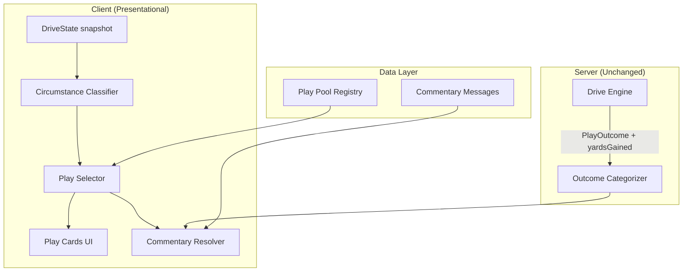

# Design Document: Playcaller Dynamic Playbook

## Overview

This design introduces a richer presentational layer for the Playcaller football game without modifying the drive engine or game mechanics. The changes affect three client-side subsystems and a thin server-side commentary path:

1. **Circumstance Classifier** — expanded from 3 buckets to 7, now accepting `yardLine` as a third input
2. **Play Pool & Selector** — replaces fixed 1:1 play-name mappings with weighted pools of `PlayDefinition` objects per slot/role/circumstance
3. **Commentary Resolver** — introduces a 3-tier weighted cascade (play-specific 60% → circumstance 30% → default 10%) with independent rolls per phase
4. **Outcome Categorizer** — expanded to 7 categories with corrected precedence order
5. **Play Art** — embedded directly in each `PlayDefinition` as a required `playArt: PlayArtData` field (no separate resolver or registry)

The drive engine (`packages/server/src/games/playcaller/drive/engine.ts`) remains byte-for-byte unchanged. All new modules are pure functions operating on read-only snapshots of `down`, `yardsToGo`, and `yardLine`.

## Architecture



### Data Flow

1. Server resolves a play using only the `PlaySlot` identifier → produces `PlayOutcome` + `yardsGained`
2. Client receives `DriveState` snapshot → derives `Circumstance` from `(down, yardsToGo, yardLine)`
3. Play Selector filters the Play Pool for the current circumstance + slot → weighted random pick → `PlayDefinition`
4. Play Card renders the `PlayArtData` from the selected `PlayDefinition` directly (no separate lookup)
5. Commentary Resolver runs 3 independent tier rolls (one per phase), cascading on empty tiers
6. Outcome Categorizer classifies `(PlayOutcome, yardsGained, yardsToGo, yardLine, down)` → `OutcomeCategory`

## Components and Interfaces

### 1. Circumstance Type (expanded)

```typescript
// packages/client/src/games/playcaller/play-names/types.ts
export type Circumstance =
  | "standard"
  | "short_yardage"
  | "medium_yardage"
  | "long_yardage"
  | "desperation"
  | "goal_line"
  | "must_convert"
```

### 2. Circumstance Classifier (rewritten)

```typescript
// packages/client/src/games/playcaller/play-names/classify.ts
export function classifyCircumstance(
  down: number,
  yardsToGo: number,
  yardLine: number
): Circumstance
```

**Priority rules** (evaluated top-to-bottom, first match wins):

| Priority | Condition | Result |
|----------|-----------|--------|
| 1 | `yardLine <= 5` | `goal_line` |
| 2 | `down === 4 && yardsToGo >= 7` | `desperation` |
| 3 | `down === 4 && yardsToGo >= 4` | `desperation` |
| 4 | `down === 4 && yardsToGo >= 1 && yardsToGo <= 3` | `must_convert` |
| 5 | `yardsToGo <= 2` | `short_yardage` |
| 6 | `yardsToGo >= 3 && yardsToGo <= 5` | `medium_yardage` |
| 7 | `yardsToGo >= 6 && yardsToGo <= 9` | `long_yardage` |
| 8 | otherwise | `standard` |

The function is pure — same inputs always produce the same output, no mutation, no side effects.

### 3. PlayDefinition & Play Pool

```typescript
// packages/client/src/games/playcaller/play-names/types.ts

export type PlaySlot = "run-safe" | "run-aggressive" | "pass-safe" | "pass-aggressive"

export interface PlayDefinition {
  /** Display name shown on play card (1–50 chars) */
  displayName: string
  /** Formation label (1–30 chars) */
  formation: string
  /** Which circumstances this play is valid for */
  circumstances: Circumstance[]
  /** Play art data rendered on the play card */
  playArt: PlayArtData
  /** Relative selection weight, > 0, default 1 */
  weight?: number
  /** Optional play-specific commentary (partial — any subset of phases) */
  messages?: Partial<PlayByPlayMessages>
}

/** Pool of play definitions indexed by slot */
export type PlayPool = Record<PlaySlot, PlayDefinition[]>

/** Complete registry: role → PlayPool */
export interface PlayPoolRegistry {
  offense: PlayPool
  defense: PlayPool
}
```

### 4. Play Selector

```typescript
// packages/client/src/games/playcaller/play-names/select.ts

export function selectPlay(
  pool: PlayDefinition[],
  circumstance: Circumstance,
  rng: () => number
): PlayDefinition
```

**Algorithm:**
1. Filter pool to entries where `circumstances` includes the current circumstance
2. If filtered list is empty, re-filter using `"standard"` (fallback). Log warning in dev mode.
3. Compute total weight = sum of `(entry.weight ?? 1)` for all valid entries
4. Roll `rng() * totalWeight`, iterate entries accumulating weight until threshold crossed
5. Return the selected `PlayDefinition`

### 5. Commentary Resolver

```typescript
// packages/client/src/games/playcaller/play-by-play/resolver.ts

export type CommentaryPhase = "preSnap" | "activePlay" | "outcome"

export interface CommentaryTiers {
  playSpecific: Partial<Record<CommentaryPhase, string[]>>
  circumstance: Partial<Record<CommentaryPhase, string[]>>
  default: Record<CommentaryPhase, string[]>
}

export function resolveCommentary(
  phase: CommentaryPhase,
  tiers: CommentaryTiers,
  outcomeCategory: OutcomeCategory | null,
  rng: () => number
): string
```

**Algorithm per phase:**
1. Roll tier: `r = rng()` → if `r < 0.6` select play-specific, else if `r < 0.9` select circumstance, else select default
2. Look up messages for the current phase (and outcomeCategory if phase is `"outcome"`)
3. If selected tier is empty for this phase, cascade: play-specific → circumstance → default
4. From the resolved tier's message array, pick uniformly: `messages[Math.floor(rng() * messages.length)]`

### 6. Outcome Categorizer (rewritten)

```typescript
// packages/client/src/games/playcaller/play-by-play/types.ts

export type OutcomeCategory =
  | "turnover"
  | "incomplete"
  | "negative"
  | "touchdown"
  | "turnover_on_downs"
  | "big_gain"
  | "first_down"
  | "small_gain"

export function categorizeOutcome(
  outcome: PlayOutcome,
  yardsGained: number,
  yardsToGo: number,
  yardLine: number,
  down: number
): OutcomeCategory
```

**Precedence (evaluated top-to-bottom, first match wins):**

| Priority | Condition | Category |
|----------|-----------|----------|
| 1 | `outcome === "interception" \|\| outcome === "fumble"` | `turnover` |
| 2 | `outcome === "incomplete_pass"` | `incomplete` |
| 3 | `yardsGained < 0` | `negative` |
| 4 | `yardsGained >= yardLine && (outcome === "success" \|\| outcome === "critical_success")` | `touchdown` |
| 5 | `down === 4 && yardsGained < yardsToGo && outcome !== "interception" && outcome !== "fumble"` | `turnover_on_downs` |
| 6 | `yardsGained >= 10` | `big_gain` |
| 7 | `yardsGained >= yardsToGo && yardsGained < 10` | `first_down` |
| 8 | otherwise (yardsGained >= 0 but < yardsToGo and < 10) | `small_gain` |

### 7. useCircumstance Hook (updated)

```typescript
// packages/client/src/games/playcaller/hooks/useCircumstance.ts
export function useCircumstance(driveState: DriveState | null): Circumstance {
  return useMemo(() => {
    if (!driveState) return "standard"
    return classifyCircumstance(driveState.down, driveState.yardsToGo, driveState.yardLine)
  }, [driveState?.down, driveState?.yardsToGo, driveState?.yardLine])
}
```

### 8. usePlayCards Hook (updated)

The hook now calls `selectPlay` per slot instead of direct map lookup, and passes an RNG seeded per render cycle. The selected `PlayDefinition`'s `playArt` field is included directly in the returned `PlayCardData` — no separate art resolution step:

```typescript
export function usePlayCards(
  circumstance: Circumstance,
  role: "offense" | "defense"
): PlayCardData[]
```

## Data Models

### PlayDefinition Schema

| Field | Type | Required | Constraints |
|-------|------|----------|-------------|
| `displayName` | `string` | yes | 1–50 characters |
| `formation` | `string` | yes | 1–30 characters |
| `circumstances` | `Circumstance[]` | yes | ≥ 1 valid circumstance value |
| `playArt` | `PlayArtData` | yes | ≥ 1 PlayerMarker, lineOfScrimmage 0–100 |
| `weight` | `number` | no | > 0, default 1, fractional allowed |
| `messages` | `Partial<PlayByPlayMessages>` | no | Any subset of 3 phases |

### Circumstance Commentary Registry

```typescript
type CircumstanceCommentary = Record<
  Circumstance,
  Record<CommentaryPhase, string[]>
>
```

Minimum 3 distinct messages per `(Circumstance, Phase)` combination = 7 × 3 × 3 = 63 minimum messages.

### Outcome Commentary (within tiers)

The `outcome` phase messages are keyed by `OutcomeCategory`:

```typescript
type OutcomeMessages = Record<OutcomeCategory, string[]>
```

### Coverage Matrix

| Dimension | Values | Count |
|-----------|--------|-------|
| PlaySlot | run-safe, run-aggressive, pass-safe, pass-aggressive | 4 |
| Role | offense, defense | 2 |
| Circumstance | standard, short_yardage, medium_yardage, long_yardage, desperation, goal_line, must_convert | 7 |
| **Total cells** | | **56** |

Each cell must have ≥ 1 `PlayDefinition`. The standard circumstance must have ≥ 1 per slot/role (8 minimum) to guarantee the fallback path always resolves.

## Correctness Properties

*A property is a characteristic or behavior that should hold true across all valid executions of a system — essentially, a formal statement about what the system should do. Properties serve as the bridge between human-readable specifications and machine-verifiable correctness guarantees.*

### Property 1: Circumstance Classifier Correctness

*For any* valid input tuple `(down ∈ {1..4}, yardsToGo ∈ {1..99}, yardLine ∈ {1..99})`, `classifyCircumstance(down, yardsToGo, yardLine)` SHALL return the unique Circumstance dictated by the priority rules: goal_line if yardLine ≤ 5; desperation if down = 4 and yardsToGo ≥ 4; must_convert if down = 4 and yardsToGo ∈ {1..3}; short_yardage if yardsToGo ∈ {1..2}; medium_yardage if yardsToGo ∈ {3..5}; long_yardage if yardsToGo ∈ {6..9}; standard otherwise.

**Validates: Requirements 1.1, 1.2, 1.3, 1.4, 1.5, 1.6, 1.7, 1.8, 1.9, 1.10**

### Property 2: PlayDefinition Validation

*For any* object claiming to be a PlayDefinition, the validation function SHALL accept it if and only if: displayName is a string of length 1–50, formation is a string of length 1–30, circumstances is a non-empty array containing only valid Circumstance values, and weight (if present) is a number > 0. Objects violating any constraint SHALL be rejected.

**Validates: Requirements 2.1, 2.2, 2.3, 2.4, 2.7**

### Property 3: Play Selector Always Returns a Valid Match

*For any* non-empty play pool containing at least one entry for the "standard" circumstance and *for any* valid Circumstance, calling `selectPlay(pool, circumstance, rng)` SHALL return exactly one PlayDefinition whose `circumstances` array includes either the requested circumstance or "standard" (when fallback is triggered).

**Validates: Requirements 3.1, 3.3, 3.4, 3.5**

### Property 4: Weighted Selection Distribution

*For any* pool of PlayDefinitions with known weights `[w1, w2, ..., wN]` valid for a given circumstance, over a sufficiently large number of selections, the frequency of selecting definition `i` SHALL converge to `wi / Σwj` (within statistical tolerance). Definitions with omitted weight SHALL participate as if weight = 1.

**Validates: Requirements 3.2, 3.7**

### Property 5: Play Pool Placement Constraints

*For any* PlayDefinition in the play pool registry: (a) "Prevent Defense" SHALL only exist in `(pass-safe, defense, {long_yardage, desperation})`; (b) "QB Sneak" SHALL only exist in `(run-safe, offense, {short_yardage, goal_line, must_convert})`; (c) "Screen Pass" SHALL not exist in `{desperation, must_convert}` and SHALL only be under pass-safe or pass-aggressive for offense; (d) "Hail Mary" SHALL only exist in `(pass-aggressive, offense, {desperation})`.

**Validates: Requirements 4.1, 4.2, 4.3, 4.4**

### Property 6: Commentary Cascade Always Resolves

*For any* commentary tier configuration where the default tier has at least one message per phase, and *for any* CommentaryPhase, calling `resolveCommentary(phase, tiers, outcomeCategory, rng)` SHALL always return a non-empty string. When a selected tier is empty for the requested phase, the resolver SHALL cascade downward (play-specific → circumstance → default) until a populated tier is found.

**Validates: Requirements 5.2, 5.3, 5.4, 5.7**

### Property 7: Commentary Tier Selection Distribution

*For any* tier configuration where all three tiers have messages for the requested phase, over many invocations the play-specific tier SHALL be selected approximately 60% of the time, circumstance approximately 30%, and default approximately 10%.

**Validates: Requirements 5.1**

### Property 8: Outcome Categorization Precedence

*For any* valid input `(outcome: PlayOutcome, yardsGained: number, yardsToGo: number, yardLine: number, down: number)`, the `categorizeOutcome` function SHALL return exactly one OutcomeCategory following strict precedence: turnover > incomplete > negative > touchdown > turnover_on_downs > big_gain > first_down > small_gain. Higher-priority conditions SHALL override lower-priority conditions when both match.

**Validates: Requirements 6.1, 6.2, 6.3, 6.4, 6.5, 6.6, 6.7, 6.8, 6.9**

### Property 9: Presentational Purity (No State Mutation)

*For any* DriveState snapshot, calling `classifyCircumstance`, `selectPlay`, or `resolveCommentary` SHALL not modify the DriveState object. Given the same inputs (including RNG seed), each function SHALL produce the same output (determinism for the classifier; same selection for a given RNG sequence for stochastic functions).

**Validates: Requirements 9.2, 9.3, 9.4**

### Property 10: Play Art Data Validity

*For any* PlayDefinition in the play pool registry, its `playArt` field SHALL contain at least one PlayerMarker and a `lineOfScrimmage` value between 0 and 100.

**Validates: Requirements 8.1, 8.4**

### Property 11: Minimum Coverage Guarantee

*For any* of the 56 combinations of PlaySlot (4) × role (2) × Circumstance (7), the play pool registry SHALL contain at least one PlayDefinition whose `circumstances` array includes that Circumstance and whose slot and role match.

**Validates: Requirements 10.1, 10.2**

## Error Handling

| Scenario | Handling Strategy |
|----------|-------------------|
| No PlayDefinitions match current circumstance | Fall back to `"standard"` entries for same slot/role. Log warning in dev mode. |
| PlayDefinition missing playArt | Reject at validation time with descriptive error naming the invalid definition |
| Invalid circumstance value in PlayDefinition | Reject at load time with descriptive error naming the invalid value |
| Weight ≤ 0 in PlayDefinition | Reject at validation time |
| Empty displayName or formation | Reject at validation time |
| Commentary cascade reaches bottom with no messages | Impossible by design — default tier is guaranteed populated. If violated, return empty string and log error. |
| classifyCircumstance receives out-of-range inputs | TypeScript types restrict to valid ranges. At runtime, clamp to bounds (down: 1–4, yardsToGo: 1–99, yardLine: 1–99) and log warning in dev. |

## Testing Strategy

### Property-Based Tests (fast-check + Vitest)

The feature's core logic consists of pure functions with well-defined input/output contracts — ideal for property-based testing. Each property from the Correctness Properties section will be implemented as a single property-based test using [fast-check](https://github.com/dubzzz/fast-check) with Vitest.

**Configuration:**
- Minimum 100 iterations per property test
- Each test tagged with: `Feature: playcaller-dynamic-playbook, Property {N}: {title}`
- Use `fc.assert(fc.property(...))` pattern
- Custom arbitraries for `Circumstance`, `PlaySlot`, `PlayDefinition`, `PlayOutcome`

**Property tests to implement:**

| Property | Module Under Test | Key Generators |
|----------|-------------------|----------------|
| 1: Classifier Correctness | `classify.ts` | `fc.integer({min:1,max:4})`, `fc.integer({min:1,max:99})` × 2 |
| 2: PlayDefinition Validation | `validate.ts` | `fc.string()`, `fc.array(fc.constantFrom(...))` |
| 3: Selector Returns Valid Match | `select.ts` | Custom `PlayDefinition[]` arbitrary + circumstance |
| 4: Weighted Distribution | `select.ts` | Pools with controlled weights, statistical assertion |
| 5: Pool Placement Constraints | Pool data files | Scan actual pool data against rules |
| 6: Cascade Always Resolves | `resolver.ts` | Tier configs with selectively empty arrays |
| 7: Tier Selection Distribution | `resolver.ts` | All-populated tiers, statistical assertion |
| 8: Outcome Precedence | `categorize.ts` | All `PlayOutcome` values × random yards/down/yardLine |
| 9: Presentational Purity | All presentational fns | Deep-freeze inputs, verify no throws |
| 10: Art Data Validity | Pool data files | Scan all PlayDefinitions, verify playArt has ≥1 marker and valid lineOfScrimmage |
| 11: Coverage Guarantee | Pool data files | Enumerate 56 cells, assert non-empty |

### Unit Tests (Vitest)

Example-based tests for specific scenarios and edge cases:

- Classifier boundary values (yardsToGo = 3 on 4th down, yardLine = 5 vs 6)
- Single-entry pool always selects that entry
- Fallback logging in dev mode (mock `console.warn`)
- Commentary outcome phase uses correct OutcomeCategory key
- PlayDefinition validation rejects missing playArt field
- usePlayCards hook produces 4 independent cards with playArt included
- useCircumstance hook now depends on yardLine

### Integration Tests

- Drive engine produces identical results regardless of PlayDefinition choice (run two drives with same seed, different display names)
- End-to-end render: DriveState → circumstance → play cards → art + commentary all chain correctly

