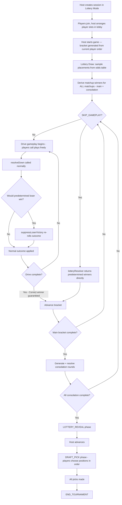

# Design Document: Playcaller Lottery Mode

## Overview

The Playcaller Lottery Mode transforms the Playcaller tournament into a fantasy football draft lottery system. All final placements are predetermined at game start by sampling from a weighted probability table. The bracket plays out with full drive gameplay for entertainment, but the outcome of each matchup is guaranteed via a suppression mechanism that re-rolls winning plays for the predetermined loser.

Key design decisions:
- **Lookup table approach** — placements are drawn from a probability table at game start rather than emerging from biased gameplay. This guarantees exact convergence to target odds over many sessions.
- **Suppression over weighting** — rather than tilting play success rates to make one side "likely" to win, we guarantee the outcome by intercepting any play that would make the loser win. This is simpler to reason about and produces 100% compliance.
- **Consolation bracket for unique placements** — rather than sharing tied placements, eliminated players play head-to-head placement games. This applies to ALL Playcaller modes (not just lottery), improving the base game.
- **Post-game draft pick selection** — since this is for a snake draft, players choose their actual draft position in lottery-winner order. The 1st-place lottery winner gets first choice, which is important because middle picks (4-6) in snake drafts are often less valuable than bookend picks (1-2 or 9-10).
- **Full player agency preserved** — players can call plays however they want in lottery mode. The suppression handler guarantees the correct outcome regardless of skill, so there's no need to force random play-calling.

---

## Architecture

### System Flow



### Module Structure

```
packages/server/src/games/playcaller/
├── lottery/
│   ├── index.ts                    # Barrel re-exports
│   ├── odds.ts                     # DEFAULT_LOTTERY_ODDS table + drawPlacements()
│   ├── deriveWinners.ts            # deriveMatchupWinners()
│   ├── suppressLoserVictory.ts     # suppressLoserVictory() pure function
│   └── lotteryDriveResolver.ts     # resolveLotteryDown() + createLotteryDriveResolver()
├── BracketEngine.ts                # Extended with consolation round support
├── PlaycallerPlugin.ts             # Extended with lottery winners state
├── roomHandlers.ts                 # Extended with lottery phase transitions
└── constants.ts                    # Unchanged
```

```
packages/shared/src/types.ts        # Extended: ProgressionMode, RoundPhase, LotteryState, DraftPickState
packages/server/src/room.ts         # Extended: lottery draw at game start, phase transitions
packages/client/src/games/playcaller/
├── LotteryRevealScreen.tsx         # New: odds table with highlighted results
└── DraftPickScreen.tsx             # New: draft position selection UI
```

---

## Consolation Bracket Design

### Problem

Currently `computePlacements` assigns shared placements to players eliminated in the same round. For a 10-player bracket:
- Round 0 (play-in): 2 losers share placement 9th
- Round 1 (quarterfinals): 4 losers share placement 5th
- Round 2 (semifinals): 2 losers share placement 3rd
- Round 3 (final): loser gets 2nd, winner gets 1st

This produces: 1st, 2nd, 3rd, 3rd, 5th, 5th, 5th, 5th, 9th, 9th — with ties.

### Solution

After the main bracket completes, generate consolation matchups for each tied group:
- Semi-final losers (2 players): 1 matchup → 3rd vs 4th
- Quarter-final losers (4 players): mini bracket (2 matchups + final) → 5th, 6th, 7th, 8th
- Play-in losers (2 players): 1 matchup → 9th vs 10th

### Data Model Extension

```typescript
export interface ConsolationRound {
  roundIndex: number
  matchups: Matchup[]
  resolved: boolean
  /** Which main bracket round's losers are playing */
  sourceRoundIndex: number
  /** Starting placement position for the winner of the top matchup in this group */
  placementStart: number
}

// Extension to Bracket interface:
export interface Bracket {
  // ... existing fields ...
  consolationRounds: ConsolationRound[]
  currentConsolationIndex: number
}
```

### Consolation Resolution Order

Consolation rounds are resolved from the best placement group to the worst:
1. 3rd/4th place game (semi-final losers)
2. 5th–8th place bracket (quarter-final losers)
3. 9th/10th place game (play-in losers)

This matches standard tournament convention (bronze medal match before 5th-place matches).

---

## Lottery Odds Table Design

### Format

A 10×10 matrix where `table[seedIndex][placementIndex]` = probability (0-1) of that seed finishing in that placement. Each row sums to 1.0 (every team must end up somewhere). Each column sums to 1.0 (every placement is filled by exactly one team).

### Seeding Order

Seed positions map directly to the session list order:
- **Seed 1** (row 0, best lottery odds) = position 1 in the session list = the last-place finisher from the previous season
- **Seed 2** (row 1) = position 2 in the session list = the second-to-last-place finisher
- ...and so on through...
- **Seed 10** (row 9, worst lottery odds) = position 10 in the session list = the best-performing player from the prior season

The lottery reveal screen displays players in this order (last-place team first as "Seed 1") to make it visually clear that the worst team has the most favorable odds.

### Draw Algorithm

Sequential weighted sampling without replacement:
1. For placement column 0 (1st place): draw which seed gets it using column 0 probabilities
2. Remove that seed from the pool
3. For placement column 1 (2nd place): normalize remaining seeds' column 1 probabilities, draw
4. Repeat through all placements

This ensures the joint distribution matches the marginal probabilities in the table.

### Default Table

```typescript
export const DEFAULT_LOTTERY_ODDS: number[][] = [
  // Seed 1 (worst record / highest session rank entering lottery)
  [0.189, 0.163, 0.154, 0.132, 0.125, 0.096, 0.071, 0.043, 0.022, 0.005],
  // Seed 2
  [0.164, 0.153, 0.148, 0.139, 0.123, 0.110, 0.077, 0.054, 0.027, 0.006],
  // Seed 3
  [0.143, 0.140, 0.131, 0.129, 0.131, 0.112, 0.096, 0.071, 0.039, 0.008],
  // Seed 4
  [0.133, 0.134, 0.127, 0.121, 0.121, 0.121, 0.098, 0.081, 0.049, 0.016],
  // Seed 5
  [0.100, 0.111, 0.122, 0.118, 0.120, 0.121, 0.121, 0.098, 0.069, 0.021],
  // Seed 6
  [0.092, 0.096, 0.091, 0.112, 0.110, 0.112, 0.128, 0.123, 0.095, 0.041],
  // Seed 7
  [0.068, 0.079, 0.084, 0.097, 0.098, 0.111, 0.132, 0.142, 0.128, 0.061],
  // Seed 8
  [0.051, 0.062, 0.069, 0.077, 0.078, 0.102, 0.120, 0.153, 0.180, 0.108],
  // Seed 9
  [0.042, 0.042, 0.047, 0.048, 0.058, 0.072, 0.100, 0.140, 0.225, 0.225],
  // Seed 10 (best record / lowest session rank entering lottery)
  [0.019, 0.022, 0.026, 0.028, 0.034, 0.043, 0.057, 0.096, 0.166, 0.509],
]
```

---

## Suppress Loser Victory Design

### Principle

The suppression function sits as a post-processing step after `resolveDown` computes an outcome. If the outcome would cause the predetermined loser to win the drive, it is re-rolled until a non-winning outcome is produced. Re-rolls generate completely fresh outcomes — any result is valid as long as it doesn't end the drive in the loser's favor.

### Cases

| Loser Role | Winning Outcome to Block | Re-roll Strategy |
|---|---|---|
| Offense | Touchdown (yardLine - yardsGained ≤ 0) | Re-roll fresh outcome until yardLine - newYards ≥ 1. Fallback: cap yards to yardLine - 1 |
| Defense | Interception | Re-roll fresh outcome. Any result is valid (gain, loss, incomplete) as long as it's not INT/fumble/TD-for-offense-if-offense-is-also-loser |
| Defense | Fumble | Re-roll fresh outcome. Same rules as interception case |
| Defense | Turnover on Downs (4th down, gain < yardsToGo) | Re-roll until gain ≥ yardsToGo. Edge case: if play max can't reach, force gain = yardsToGo |

### Key Insight

For defense-loser cases (INT/fumble), the re-roll is NOT restricted to specific failure outcomes. It generates a completely new play result — which may be a gain for the offense, an incomplete pass, a tackle for loss, or even a critical success. The only hard rule is: **the outcome cannot end the drive in the predetermined loser's favor**. This keeps things feeling organic since the re-rolled plays look natural.

### Integration Point

```typescript
// In lotteryDriveResolver.ts — wraps resolveDown
export function resolveLotteryDown(
  state: DriveState,
  offensivePlay: OffensivePlayId,
  defensivePlay: DefensivePlayId,
  rng: RngFunction,
  config: PlayConfig,
  matrix: PlayMatrix,
  predeterminedWinner: string
): { state: DriveState; result: PlayResult }
```

This does NOT modify `resolveDown` itself — the core engine remains pure and unaware of lottery mechanics. The wrapper intercepts the result and applies suppression if needed, then reconstructs the DriveState with corrected values.

---

## Phase Transition Design

### New Phases

```typescript
export type RoundPhase = 
  | "LOBBY" | "SPLASH" | "COIN_TOSS" | "PICKING" | "RESOLVING" | "RESULT" 
  | "END_GAME" | "END_TOURNAMENT"
  | "LOTTERY_REVEAL"   // NEW
  | "DRAFT_PICK"       // NEW
```

### Lottery Mode End-Game Flow

**With Draft Pick ENABLED:**
```
Main bracket final resolves
  → Consolation rounds play out
    → All placements finalized
      → Phase: LOTTERY_REVEAL (instant reveal, all results shown at once)
        → Host sends ADVANCE_LOTTERY_PHASE
          → Phase: DRAFT_PICK (players choose positions one-by-one, Big Wheel style)
            → All picks made (or timeout)
              → Phase: END_TOURNAMENT
```

**With Draft Pick DISABLED:**
```
Main bracket final resolves
  → Consolation rounds play out
    → All placements finalized
      → Phase: LOTTERY_REVEAL (animated reveal, 10th to 1st with staggered timing)
        → Host sends ADVANCE_LOTTERY_PHASE
          → Phase: END_TOURNAMENT (confetti, same as current finale)
```

### Draft Pick Toggle

The Draft Pick feature is a sub-option within Lottery mode, configured at session creation. It is stored in the room config (e.g., `draftPickEnabled: boolean`). This determines:
- Whether the lottery reveal uses animation (disabled = animated, enabled = instant)
- Whether the host button says "Finish" (disabled) or "Continue to Draft" (enabled)
- Whether `ADVANCE_LOTTERY_PHASE` transitions to `END_TOURNAMENT` or `DRAFT_PICK`

### State Broadcast

During `LOTTERY_REVEAL` and `DRAFT_PICK` phases, the STATE_SYNC includes:
- `lotteryState: { oddsTable, placements, matchupWinners }` — for rendering the reveal
- `draftPickState: { pickOrder, currentPickIndex, selections, availablePositions }` — for the draft UI (only during DRAFT_PICK phase)

---

## Draft Pick Selection Design

### Flow

1. System computes `pickOrder` = player IDs sorted by lottery placement ascending (1st lottery winner at index 0)
2. `currentPickIndex` starts at 0
3. Player at `pickOrder[currentPickIndex]` is "on the clock" with a 30-second timer
4. That player sends `DRAFT_PICK_SELECTION { position: N }` choosing their draft slot
5. Server validates, records, removes position from `availablePositions`, increments index
6. Broadcast updated state — all players see the selection via a slow reveal animation
7. Repeat until all players have picked
8. Transition to `END_TOURNAMENT`

### UI Design (Big Wheel Spectator Style)

The Draft Pick screen functions like the Big Wheel game: all players watch the same view, with one player "on the clock" making the selection while everyone else spectates.

**Layout:**
- Header: "Player X is on the clock" with countdown timer (30s)
- Draft board: vertical list of draft positions (Pick 1, Pick 2, ... Pick N)
  - Available positions: show a "SELECT" button (enabled only for the current picker)
  - Already-selected positions: show "Pick N — Player Name" with no button
- Selections history: running list of completed picks

**Interaction:**
- Current picker taps "SELECT" next to their desired position
- A slow reveal animation plays (position locks in, similar to Big Wheel spin reveal)
- All players see the reveal simultaneously
- After the reveal, control passes to the next player in lottery order

### Bot Behavior

Bots pick after a 2-4 second delay. Strategy: if their lottery placement number is available as a draft position, pick it. Otherwise pick the lowest available position.

### Timeout

If a player doesn't pick within 30 seconds, auto-assign the lowest available position number and advance.

---

## Backwards Compatibility

- **Consolation bracket**: applies to ALL Playcaller modes. Existing tests that don't exercise consolation continue to pass because consolation rounds are generated AFTER the main bracket completes (the existing `computePlacements` path returns shared placements when no consolation data exists).
- **Non-lottery modes**: completely unchanged behavior except for the addition of unique placements via consolation games.
- **Existing `resolveDown`**: untouched. The lottery wrapper is a separate function that calls it.
- **Existing `MatchResolver` interface**: untouched. The lottery resolver is just another implementation.
