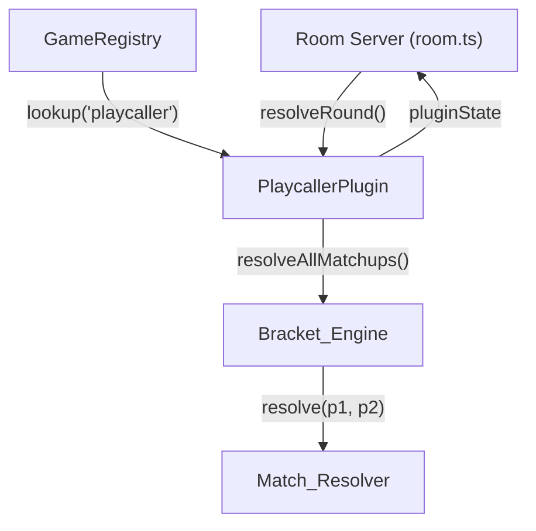
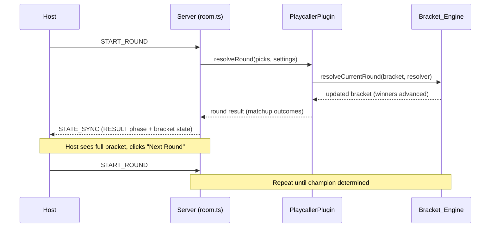
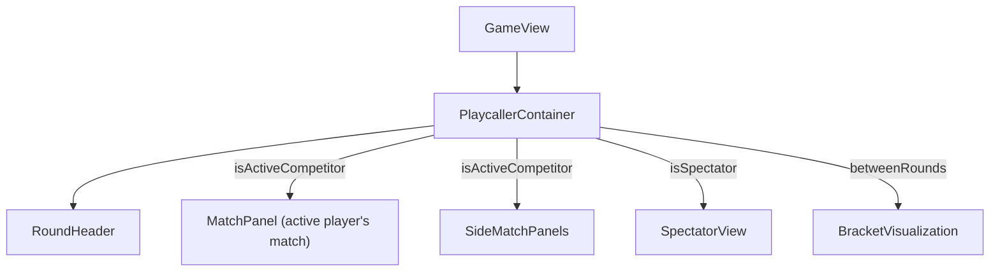

# Design Document: Playcaller Tournament

## Overview

Playcaller is a single-elimination bracket tournament game implemented as a GamePlugin. Phase 1 focuses entirely on the bracket structure — match outcomes are resolved by a pluggable Match_Resolver that selects winners at random. Phase 2 will replace the resolver with football play-calling mechanics without modifying the bracket engine.

The design separates concerns into three layers:
1. **Bracket_Engine** — pure bracket generation and progression logic (seeding, byes, matchup pairing, advancement)
2. **Match_Resolver** — pluggable strategy function (random in Phase 1, play-calling in Phase 2)
3. **Playcaller_Plugin** — GamePlugin adapter that maps bracket rounds to room rounds and integrates with the existing room server lifecycle

Key design decisions:
- **Bracket state lives in `pluginState`** — following the Big Wheel pattern where module-level state persists across rounds within a game instance
- **One bracket round = one room round** — each PICKING → RESOLVING → RESULT cycle resolves all matchups in a bracket round simultaneously
- **Host-gated advancement** — the host must explicitly advance between bracket rounds (similar to Big Wheel's turn control, but per-round rather than per-spin)
- **Scores awarded only at tournament end** — all placement points are assigned at once via the Score_Table when the bracket completes
- **Bracket_Engine is a pure module** — no side effects, fully testable with property-based tests

---

## Architecture

### High-Level Integration



### Game Lifecycle Flow

```mermaid
stateDiagram-v2
    [*] --> LOBBY: Host selects playcaller
    LOBBY --> PICKING: Host starts round (bracket round 1)
    PICKING --> RESOLVING: Pick window expires (3s)
    RESOLVING --> RESULT: All matchups resolved
    RESULT --> PICKING: Host advances (next bracket round)
    RESULT --> END_GAME: Final matchup resolved (champion determined)
    
    note right of PICKING: Phase 1: picks are unused\nRandom resolver fires immediately
    note right of RESULT: Full bracket shown between rounds\nHost must manually advance
```

### Bracket Round Mapping



---

## Components and Interfaces

### Server-Side Modules

#### `packages/server/src/games/playcaller/constants.ts`

```typescript
import type { SettingsSchema } from "@games-of-chance/shared"

export const PLAYCALLER = {
  /** Duration of the pick window (Phase 1: brief since picks are unused) */
  PICK_WINDOW_MS: 3_000,

  /** Default score table: placement position → points */
  DEFAULT_SCORE_TABLE: [250, 125, 75, 50, 35, 25, 15, 10, 5, 5] as const,

  /** Minimum players for a valid bracket */
  MIN_PLAYERS: 2,

  /** Maximum players (matches room limit) */
  MAX_PLAYERS: 10,

  /** Minimum score table entries */
  SCORE_TABLE_MIN_ENTRIES: 2,

  /** Maximum score table entries */
  SCORE_TABLE_MAX_ENTRIES: 10,
} as const

export const PLAYCALLER_SETTINGS_SCHEMA: SettingsSchema = [
  {
    key: "SCORE_TABLE",
    label: "Score Table (1st through 10th place points)",
    type: "number",
    defaultValue: 0,
    constraints: { min: 0, max: 1000 },
  },
]
```

#### `packages/server/src/games/playcaller/BracketEngine.ts`

The Bracket_Engine is a **pure functional module** — no side effects, no randomness embedded (randomness is injected via the resolver and tiebreaker functions).

```typescript
import type { MatchResolver, Bracket, BracketRound, Matchup } from "./types"

/**
 * Generates a seeded single-elimination bracket.
 * 
 * @param playerSeeds - Ordered array of player IDs by seed (index 0 = seed 1)
 * @param tiebreaker - Function to shuffle tied players (injected for testability)
 * @returns Complete bracket structure with all rounds pre-computed
 */
export function generateBracket(
  playerSeeds: string[],
  tiebreaker?: (tied: string[]) => string[]
): Bracket

/**
 * Resolves all matchups in the current (active) bracket round.
 * Advances winners to the next round. Advances bye players automatically.
 * 
 * @param bracket - Current bracket state
 * @param resolver - Match resolution function
 * @returns Updated bracket with current round resolved and winners placed
 */
export function resolveCurrentRound(
  bracket: Bracket,
  resolver: MatchResolver
): Bracket

/**
 * Computes the number of byes needed for a given player count.
 * Byes = nextPowerOf2(playerCount) - playerCount
 */
export function computeByeCount(playerCount: number): number

/**
 * Returns the next power of 2 >= n.
 */
export function nextPowerOfTwo(n: number): number

/**
 * Checks if the bracket is complete (champion determined).
 */
export function isComplete(bracket: Bracket): boolean

/**
 * Returns the final placements from a completed bracket.
 * Champion = 1st, runner-up = 2nd, semi-final losers = 3rd (tied), etc.
 */
export function computePlacements(bracket: Bracket): Map<string, number>
```

#### `packages/server/src/games/playcaller/MatchResolver.ts`

```typescript
import type { MatchResolver } from "./types"

/**
 * Phase 1 random resolver: selects a winner uniformly at random.
 */
export const randomResolver: MatchResolver = (playerA: string, playerB: string): string => {
  return Math.random() < 0.5 ? playerA : playerB
}
```

#### `packages/server/src/games/playcaller/PlaycallerPlugin.ts`

```typescript
import type { GamePlugin } from "../GamePlugin"
import type { PlaycallerPick, PlaycallerRoundResult } from "./types"
import { registry } from "../GameRegistry"
import { PLAYCALLER, PLAYCALLER_SETTINGS_SCHEMA } from "./constants"
import { generateBracket, resolveCurrentRound, isComplete, computePlacements } from "./BracketEngine"
import { randomResolver } from "./MatchResolver"

/** Module-level bracket state (persists across rounds within a game) */
let bracketState: Bracket | null = null

export function getPlaycallerState(): Bracket | null {
  return bracketState
}

export function setPlaycallerState(state: Bracket): void {
  bracketState = state
}

export function resetPlaycallerState(): void {
  bracketState = null
}

export const playcallerPlugin: GamePlugin<PlaycallerPick, PlaycallerRoundResult> = {
  gameType: "playcaller",
  settingsSchema: PLAYCALLER_SETTINGS_SCHEMA,
  pickWindowMs: PLAYCALLER.PICK_WINDOW_MS,

  validatePick(pick: unknown): pick is PlaycallerPick {
    // Phase 1: accept any pick (picks are unused)
    return true
  },

  resolveRound(picks, settings): PlaycallerRoundResult {
    if (!bracketState) {
      throw new Error("Playcaller bracket state not initialized")
    }
    // Resolve all matchups in the current bracket round
    bracketState = resolveCurrentRound(bracketState, randomResolver)
    
    const currentRoundIndex = bracketState.currentRoundIndex - 1 // just resolved
    const resolvedRound = bracketState.rounds[currentRoundIndex]
    
    return {
      bracketRound: currentRoundIndex,
      matchups: resolvedRound.matchups,
      isComplete: isComplete(bracketState),
    }
  },

  scoreRound(picks, result, players, settings): RoundScoreResult {
    // All scoring happens at tournament end — zero deltas during play
    if (!result.isComplete) {
      return { deltas: {} }
    }

    // Tournament complete — assign placement points
    const placements = computePlacements(bracketState!)
    const scoreTable = getScoreTable(settings)
    const deltas: Record<string, number> = {}
    
    for (const [playerId, placement] of placements) {
      const index = placement - 1 // 0-based index
      deltas[playerId] = index < scoreTable.length ? scoreTable[index] : 0
    }

    return { deltas }
  },

  computeGameLeaderboard(players, gameScores): GameLeaderboardEntry[] {
    // During play: rank active players above eliminated
    // After completion: rank by final placement
    // ...implementation
  },
}

registry.register(playcallerPlugin)
```

### Shared Types (additions to `packages/shared/src/types.ts`)

```typescript
// ── Playcaller Tournament ──────────────────────────────────────────────────

/** Playcaller pick — Phase 1: any value accepted (unused) */
export interface PlaycallerPick {
  type: "ready"  // placeholder for Phase 1
}

/** A single matchup in a bracket round */
export interface Matchup {
  /** Unique matchup identifier within the bracket */
  matchupId: string
  /** Seed 1 player (higher seed) */
  playerA: string
  /** Seed 2 player (lower seed) */
  playerB: string
  /** Winner (null if unresolved) */
  winner: string | null
}

/** A single round in the bracket */
export interface BracketRound {
  /** Round index (0 = first round) */
  roundIndex: number
  /** Matchups in this round */
  matchups: Matchup[]
  /** Players with byes this round (first round only) */
  byes: string[]
  /** Whether this round has been resolved */
  resolved: boolean
}

/** Complete bracket state */
export interface Bracket {
  /** All rounds in the bracket */
  rounds: BracketRound[]
  /** Index of the current active round */
  currentRoundIndex: number
  /** Total number of rounds */
  totalRounds: number
  /** Player seed assignments: playerId → seed number (1-based) */
  seeds: Record<string, number>
  /** Eliminated players and the round they were eliminated in */
  eliminated: Record<string, number>
}

/** Result of resolving a bracket round */
export interface PlaycallerRoundResult {
  /** Which bracket round was just resolved */
  bracketRound: number
  /** Resolved matchups with winners */
  matchups: Matchup[]
  /** Whether the tournament is complete (champion found) */
  isComplete: boolean
}

/** Playcaller game state broadcast to clients */
export interface PlaycallerGameState {
  /** Full bracket structure */
  bracket: Bracket
  /** Current spectators (eliminated + bye players) */
  spectators: string[]
  /** Active competitors in current round */
  activeCompetitors: string[]
}

/** Match resolver function signature */
export type MatchResolver = (playerA: string, playerB: string) => string
```

### Client Components

#### Component Architecture



#### `packages/client/src/games/playcaller/PlaycallerContainer.tsx`

Top-level container that determines which view to show based on player state.

```typescript
// Determines view mode based on:
// 1. Is the player an active competitor? → Show MatchPanel + SideMatchPanels
// 2. Is the player a spectator? → Show SpectatorView (all matches equally)
// 3. Are we between rounds (RESULT phase)? → Show BracketVisualization full-size
```

#### `packages/client/src/games/playcaller/BracketVisualization.tsx`

SVG/canvas bracket diagram showing all rounds, seeds, matchups, winners, and byes.
- Displays full bracket between rounds (RESULT phase)
- Collapsed/hidden during active play (PICKING/RESOLVING phases)
- Visual distinctions: eliminated (dimmed), active (highlighted), bye (marked with icon)

#### `packages/client/src/games/playcaller/MatchPanel.tsx`

Large center panel showing the active player's current matchup.
- Player names, seeds, and visual indicators
- Phase 1: shows "Resolving..." animation during RESOLVING
- Winner announcement during RESULT

#### `packages/client/src/games/playcaller/SideMatchPanels.tsx`

Compact scoreboard panels showing other active matchups.
- Rendered as smaller cards alongside the main MatchPanel
- Show player names and seeds, winner when resolved

#### `packages/client/src/games/playcaller/SpectatorView.tsx`

Equal-size display of all active matchups for eliminated/bye players.
- All matchups rendered at the same size
- No "focus" panel since spectator has no stake

#### `packages/client/src/games/playcaller/RoundHeader.tsx`

Shows current bracket round name (e.g., "Quarter-Finals", "Semi-Finals", "Final").

---

## Data Models

### Bracket State in `pluginState`

The bracket state is stored in the room's `pluginState` map under the key `"playcaller"`:

```typescript
// In room.ts LiveRoomState.pluginState:
{
  "playcaller": {
    rounds: [
      {
        roundIndex: 0,
        matchups: [
          { matchupId: "r0-m0", playerA: "p3", playerB: "p6", winner: "p3" },
          { matchupId: "r0-m1", playerA: "p4", playerB: "p5", winner: "p5" },
        ],
        byes: ["p1", "p2"],
        resolved: true,
      },
      {
        roundIndex: 1,
        matchups: [
          { matchupId: "r1-m0", playerA: "p1", playerB: "p3", winner: null },
          { matchupId: "r1-m1", playerA: "p2", playerB: "p5", winner: null },
        ],
        byes: [],
        resolved: false,
      },
      {
        roundIndex: 2,
        matchups: [
          { matchupId: "r2-m0", playerA: "", playerB: "", winner: null },
        ],
        byes: [],
        resolved: false,
      },
    ],
    currentRoundIndex: 1,
    totalRounds: 3,
    seeds: { "p1": 1, "p2": 2, "p3": 3, "p4": 4, "p5": 5, "p6": 6 },
    eliminated: { "p6": 0, "p4": 0 },
  }
}
```

### Seeding Algorithm

Given N players sorted by session leaderboard rank:

1. Assign seeds 1..N based on rank (ties broken by random shuffle)
2. Compute byes: `byeCount = nextPowerOf2(N) - N`
3. Award byes to seeds 1..byeCount (highest seeds)
4. Pair remaining players using standard bracket seeding:
   - Highest remaining vs lowest remaining
   - Second-highest vs second-lowest
   - Continue inward until all paired

**Example for 6 players:**
- Seeds: 1, 2, 3, 4, 5, 6
- Byes (2): seeds 1, 2 advance to round 2
- Round 1 matchups (among seeds 3-6): 3v6, 4v5
- Round 2: seed 1 vs winner(3v6), seed 2 vs winner(4v5)
- Round 3 (Final): winner vs winner

### Score Table Mapping

Final placement is derived from bracket depth:
- **1st place**: Tournament champion
- **2nd place**: Runner-up (lost in final)
- **3rd–4th place (tied)**: Lost in semi-finals
- **5th–8th place (tied)**: Lost in quarter-finals
- ...and so on

Players eliminated in the same round share the numerically lowest placement position:
- Two semi-final losers both get position 3's point value
- Four quarter-final losers all get position 5's point value

### Room Server Integration Points

1. **Game start** (in room.ts `handleStartRound` when phase is LOBBY):
   - Build session leaderboard → extract player rankings
   - Call `generateBracket(rankedPlayerIds)` 
   - Store result in `pluginState["playcaller"]`
   - Set `gameSettings.roundCount` to bracket's `totalRounds`

2. **Round resolution** (via `resolveRound`):
   - Plugin reads bracket from module state
   - Calls `resolveCurrentRound` with the random resolver
   - Returns `PlaycallerRoundResult` as the round result

3. **Host advance** (START_ROUND in RESULT phase):
   - Normal room.ts flow: advances to next round
   - Plugin's next `resolveRound` call processes the next bracket round

4. **Game end detection**:
   - When `resolveRound` returns `isComplete: true`
   - room.ts can detect this and auto-transition to END_GAME after displaying the final result

---


## Correctness Properties

*A property is a characteristic or behavior that should hold true across all valid executions of a system — essentially, a formal statement about what the system should do. Properties serve as the bridge between human-readable specifications and machine-verifiable correctness guarantees.*

### Property 1: Bracket structural validity

*For any* player count N between 2 and 10 inclusive, `generateBracket` SHALL produce a bracket where: the total number of rounds equals `ceil(log2(N))`, every player appears exactly once (either in a first-round matchup or in the byes list), and the final round contains exactly one matchup.

**Validates: Requirements 2.1, 2.6, 3.4, 10.1**

### Property 2: Seeding correctness

*For any* list of players with session scores, `generateBracket` SHALL assign seed 1 to the player with the highest score, seed 2 to the second-highest, and so on, with tied players receiving seeds within the correct tied range (never ordered alphabetically).

**Validates: Requirements 2.2, 2.5**

### Property 3: Bye assignment correctness

*For any* player count N that is not a power of 2, the bracket SHALL assign exactly `nextPowerOf2(N) - N` byes, all to the highest-seeded players (seeds 1 through byeCount), and byes SHALL appear only in the first round.

**Validates: Requirements 2.3, 5.3, 5.4, 10.3**

### Property 4: First-round pairing order

*For any* set of non-bye players in the first round, matchups SHALL pair the highest remaining seed against the lowest remaining seed, the second-highest against the second-lowest, and so on inward until all are paired.

**Validates: Requirements 2.4**

### Property 5: Winner advancement

*For any* bracket round resolved by a Match_Resolver, every winner returned by the resolver SHALL appear as a participant in the next round's matchups, and `currentRoundIndex` SHALL increment by exactly 1.

**Validates: Requirements 3.1, 3.2, 4.2**

### Property 6: Tournament completion

*For any* bracket where all rounds have been resolved (only one undefeated player remains), `isComplete` SHALL return true.

**Validates: Requirements 3.3**

### Property 7: Bye players bypass the resolver

*For any* bracket with byes, the Match_Resolver SHALL NOT be invoked for bye players, and all bye players SHALL appear as participants in the second round's matchups.

**Validates: Requirements 5.1**

### Property 8: Spectator/active player partition

*For any* bracket round, the set of spectators (eliminated players ∪ bye players for the current round) and the set of active competitors SHALL be disjoint, and their union SHALL equal the complete set of tournament players.

**Validates: Requirements 5.2, 7.1, 7.3**

### Property 9: Scoring correctness

*For any* completed bracket and valid Score_Table, each player SHALL receive points equal to the Score_Table entry at index `(placement - 1)`, where players eliminated in the same round share the numerically lowest placement position in their tied range. If placement exceeds the table length, points SHALL be 0.

**Validates: Requirements 6.1, 6.4, 6.6, 12.1, 12.2**

### Property 10: Zero deltas before final round

*For any* bracket round that is not the final round (tournament not yet complete), `scoreRound` SHALL return empty deltas (all zero or no entries).

**Validates: Requirements 6.5**

### Property 11: Score table validation

*For any* array provided as a Score_Table, validation SHALL accept it if and only if it contains between 2 and 10 entries, each entry is a non-negative integer, and entries are in non-increasing order.

**Validates: Requirements 6.3**

### Property 12: Resolver output invariant

*For any* two player IDs provided to the Match_Resolver, the returned value SHALL be exactly one of the two input IDs.

**Validates: Requirements 4.4**

### Property 13: In-progress leaderboard ordering

*For any* partially-resolved bracket, `computeGameLeaderboard` SHALL rank all active competitors above all eliminated players.

**Validates: Requirements 12.3**

---

## Error Handling

### Server-Side Errors

| Scenario | Error Code | Message |
|----------|-----------|---------|
| Bracket generation with < 2 players | `INVALID_PLAYER_COUNT` | "Playcaller requires at least 2 players" |
| Match_Resolver returns invalid ID | `RESOLUTION_FAILURE` | "Match resolver returned an invalid player ID" |
| START_ROUND when bracket is complete | `GAME_COMPLETE` | "Tournament is complete — end the game to see results" |
| resolveRound called without initialized bracket | `STATE_ERROR` | "Playcaller bracket state not initialized" |
| Invalid Score_Table in settings update | `INVALID_SETTINGS` | "Score table must contain 2-10 non-negative integers in descending order" |

### Edge Cases

- **Player disconnects during tournament**: The disconnected player is treated as eliminated from their current matchup. If they had a bye, they still advance (byes are pre-determined). The bot backfill system does NOT apply mid-bracket — once a bracket is generated, it plays out with the original players.
- **All players disconnect except one**: Remaining player wins all subsequent matchups by default (resolver returns the only valid player).
- **Exactly 2 players**: Single-round bracket with no byes. One matchup, one resolution, tournament complete.
- **Exactly 1 player remaining after disconnections**: If only one player is left, the bracket should signal completion immediately on the next round resolution.
- **Score_Table shorter than player count**: Players whose placement exceeds the table length receive 0 points (handled in scoring logic).
- **Tied session scores at bracket start**: Random tiebreaker ensures no deterministic bias (not alphabetical). The tiebreaker function is injected for testability.

### Client-Side Error Handling

- If `playcallerGameState` is null during an active playcaller game, show a loading spinner (state will arrive in next STATE_SYNC)
- If a player's matchup data is missing (race condition), fall back to spectator view
- If bracket data is malformed, display an error message and allow the host to end the game

---

## Testing Strategy

### Property-Based Tests (PBT)

Property-based testing is highly appropriate for this feature because the Bracket_Engine is a pure functional module with clear input/output behavior, the input space is large (2-10 players × random seedings × random resolutions), and universal invariants must hold across all configurations.

**Library**: `fast-check` (TypeScript, compatible with the existing Vitest test runner)

**Configuration**:
- Minimum 100 iterations per property test
- Each test references its design property in a tag comment
- Tag format: **Feature: playcaller-tournament, Property {N}: {title}**

**Generators needed**:
- `Arbitrary<string[]>` — random player ID arrays (2-10 entries, unique IDs)
- `Arbitrary<Record<string, number>>` — random session scores for seeding
- `Arbitrary<MatchResolver>` — deterministic resolvers (always-A, always-B, alternating) for testing bracket logic independent of randomness
- `Arbitrary<number[]>` — random Score_Table arrays (valid and invalid, for validation testing)

**Property tests to implement** (one per correctness property):
1. Bracket structural validity — player counts 2-10, verify structure
2. Seeding correctness — random scores, verify seed order matches rank
3. Bye assignment — non-power-of-2 counts, verify bye count and recipients
4. First-round pairing — verify highest-vs-lowest pattern
5. Winner advancement — resolve rounds, verify winners placed in next round
6. Tournament completion — fully resolve brackets, verify isComplete
7. Bye bypass — inject counting resolver, verify not called for bye players
8. Spectator/active partition — verify disjoint union equals all players
9. Scoring correctness — completed brackets with various tables, verify points
10. Zero deltas — non-final rounds return empty deltas
11. Score table validation — random arrays, verify accept/reject logic
12. Resolver output invariant — random ID pairs, verify return is one of inputs
13. In-progress leaderboard — active players ranked above eliminated

### Unit Tests (Example-Based)

- Plugin registers with gameType "playcaller" in GameRegistry
- validatePick returns true for any input (Phase 1)
- pickWindowMs is 3000
- Default Score_Table matches [250, 125, 75, 50, 35, 25, 15, 10, 5, 5]
- Bracket generation with exactly 2 players produces 1 round, 1 matchup, 0 byes
- Bracket generation with 8 players produces 3 rounds, 0 byes
- Bracket generation with 1 player throws error
- Bracket generation with 0 players throws error
- computePlacements for 4-player bracket returns correct positions (1st, 2nd, 3rd-tied, 3rd-tied)

### Integration Tests

- Full game lifecycle: lobby → bracket generation → resolve all rounds → END_GAME → session scores updated
- Host advance: verify RESULT phase persists until host sends START_ROUND
- STATE_SYNC includes PlaycallerGameState with bracket, spectators, and activeCompetitors
- Tournament mode integration: playcaller locks after completion, session leaderboard reflects placement points
- Multiple disconnections mid-tournament: bracket continues with remaining players

### Client Component Tests

- PlaycallerContainer renders MatchPanel for active competitor
- PlaycallerContainer renders SpectatorView for eliminated player
- BracketVisualization shows full bracket between rounds (RESULT phase)
- BracketVisualization is hidden during PICKING/RESOLVING
- Bye players shown with visual indicator in bracket diagram
- Eliminated players visually distinguished from active players
