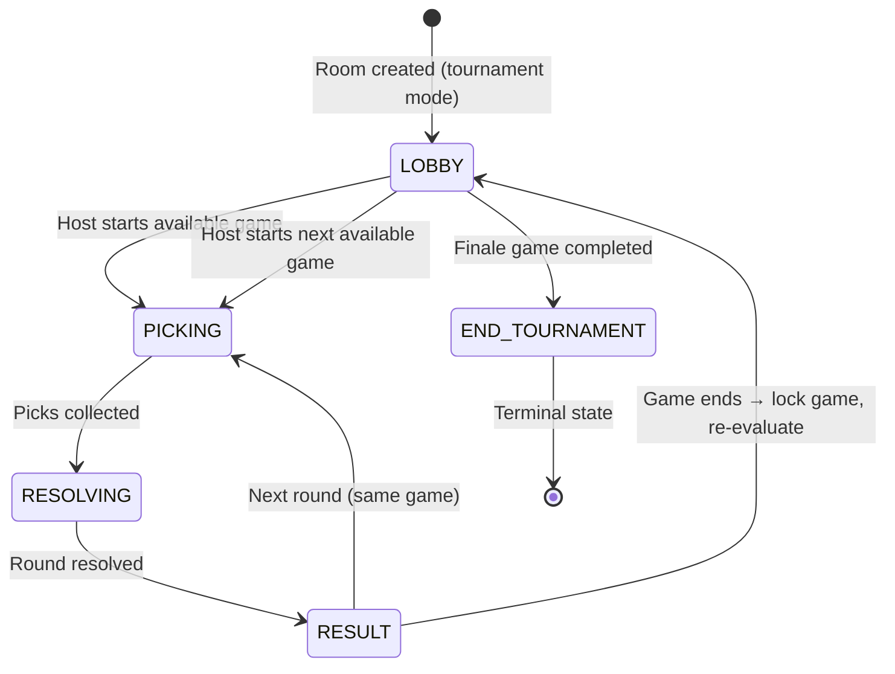
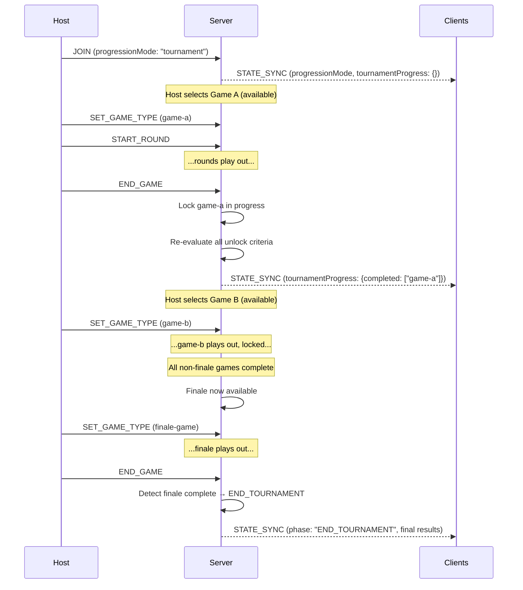
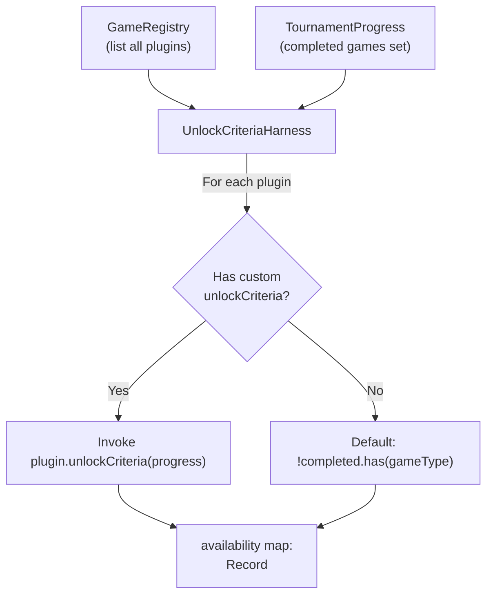

# Design Document: Tournament Mode

## Overview

Tournament Mode adds a structured progression system to the Games of Chance platform. It introduces a second room configuration toggle — "Progression Mode" — that is independent of the existing Scoring Mode toggle. When set to "Tournament", games are played once each in sequence, building toward a designated finale game that ends the session with a celebratory results screen.

The design is built around a **plugin-agnostic Unlock Criteria Harness** that integrates with the existing GameRegistry pattern. Each game plugin can optionally define custom unlock criteria; otherwise, a sensible default applies (available if not yet played). The system dynamically adapts to whatever plugins are registered — no hardcoding of game types in the tournament logic.

Key design decisions:
- **Progression Mode is orthogonal to Scoring Mode** — the two toggles compose freely (tournament + chips, tournament + grand-prix, endless + either)
- **Server-authoritative tournament progress** — the server maintains and broadcasts the canonical set of completed games; clients render from this
- **Finale gate pattern** — one designated game is gated behind all others, creating a natural climax
- **END_State as terminal** — after the finale, the lobby enters a non-recoverable celebration state

---

## Architecture

### High-Level Tournament Flow



### Progression Mode in Room Lifecycle



### Unlock Criteria Harness Architecture



---

## Components and Interfaces

### Shared Types (additions to `packages/shared/src/types.ts`)

```typescript
/** Progression mode — selected by host at room creation, orthogonal to ScoringMode */
export type ProgressionMode = "endless" | "tournament"

/** Status of a game tile in tournament mode */
export type TournamentTileStatus = "available" | "locked" | "unavailable"

/** Tournament progress record — tracks completed games in the current session */
export interface TournamentProgress {
  /** Set of gameType identifiers that have been completed and locked */
  completedGames: string[]
  /** Computed availability map for all registered games */
  availability: Record<string, TournamentTileStatus>
}
```

### RoomConfig Extension

```typescript
export interface RoomConfig {
  // ...existing fields...
  roomId: string
  gameType: GameType
  maxPlayers: number
  scoringMode: ScoringMode
  autoMode: boolean
  autoRoundIntervalMs: number
  placementPoints: number[]
  roomSize: number
  /** Progression mode — "endless" (default) or "tournament" */
  progressionMode: ProgressionMode
}
```

### RoomState Extension

```typescript
export interface RoomState {
  // ...existing fields...
  room: RoomConfig
  players: Player[]
  round: RoundState
  gameLeaderboard: GameLeaderboardEntry[]
  sessionLeaderboard: SessionLeaderboardEntry[]
  adjustmentLog: AdjustmentLogEntry[]
  gameSettings: GameSettings
  settingsLocked: boolean
  bigWheelGameState?: BigWheelGameState | null
  gameVotes?: Record<string, string[]>
  /** Tournament progress — present when progressionMode is "tournament" */
  tournamentProgress?: TournamentProgress | null
}
```

### RoundPhase Extension

```typescript
/** Add END_TOURNAMENT as a terminal phase */
export type RoundPhase = "LOBBY" | "PICKING" | "RESOLVING" | "RESULT" | "END_GAME" | "END_TOURNAMENT"
```

### GamePlugin Interface Extension

```typescript
export interface GamePlugin<TPick = unknown, TResult = unknown> {
  // ...existing fields...
  gameType: GameType
  settingsSchema?: SettingsSchema
  validatePick(pick: unknown): pick is TPick
  resolveRound(picks: Record<string, TPick>, settings: GameSettings): TResult
  scoreRound(picks: Record<string, TPick>, result: TResult, players: Player[], settings: GameSettings): RoundScoreResult
  computeGameLeaderboard(players: Player[], gameScores: Record<string, number>): GameLeaderboardEntry[]
  pickWindowMs: number

  /** Whether this game is the tournament finale (default: false) */
  isFinale?: boolean

  /**
   * Custom unlock criteria for tournament mode.
   * Receives the current tournament progress and returns whether this game is playable.
   * If not defined, defaults to: available when not in completedGames.
   */
  unlockCriteria?: (progress: TournamentProgress) => boolean
}
```

### Unlock Criteria Harness

```typescript
// packages/server/src/tournament/UnlockCriteriaHarness.ts

import { registry } from "../games/GameRegistry"
import type { TournamentProgress, TournamentTileStatus } from "@games-of-chance/shared"

/**
 * Evaluates the availability of all registered game plugins based on
 * tournament progress and each plugin's unlock criteria.
 */
export function evaluateAvailability(
  progress: TournamentProgress
): Record<string, TournamentTileStatus> {
  const availability: Record<string, TournamentTileStatus> = {}
  const allTypes = registry.list()

  for (const gameType of allTypes) {
    const plugin = registry.lookup(gameType)

    // Already completed → locked
    if (progress.completedGames.includes(gameType)) {
      availability[gameType] = "locked"
      continue
    }

    // Finale gate: unavailable until all non-finale games are complete
    if (plugin.isFinale) {
      const nonFinaleTypes = allTypes.filter(t => {
        const p = registry.lookup(t)
        return !p.isFinale
      })
      const allNonFinaleComplete = nonFinaleTypes.every(t =>
        progress.completedGames.includes(t)
      )
      availability[gameType] = allNonFinaleComplete ? "available" : "unavailable"
      continue
    }

    // Custom unlock criteria
    if (plugin.unlockCriteria) {
      availability[gameType] = plugin.unlockCriteria(progress) ? "available" : "unavailable"
      continue
    }

    // Default: available if not completed
    availability[gameType] = "available"
  }

  return availability
}
```

### LiveRoomState Extension (server-side)

```typescript
interface LiveRoomState {
  // ...existing fields...
  config: RoomConfig
  players: Record<string, Player>
  round: RoundState
  // ...scores, leaderboards, etc...

  /** Tournament progress — only tracked when progressionMode is "tournament" */
  tournamentProgress: TournamentProgress
}
```

### Client Messages (additions)

No new client message types needed. The existing `SET_GAME_TYPE` message is gated server-side to prevent selecting locked/unavailable games. The `progressionMode` is sent as part of the JOIN payload.

```typescript
// Extension to JOIN payload
| { type: "JOIN"; payload: { 
    name: string; 
    role: "host" | "player"; 
    clientId: string; 
    scoringMode?: ScoringMode; 
    roomSize?: number;
    progressionMode?: ProgressionMode  // new
  } }
```

---

## Data Models

### Tournament Progress State

The server maintains tournament progress as part of `LiveRoomState`:

```typescript
{
  tournamentProgress: {
    completedGames: ["coin-toss", "battle-bots"],  // locked games
    availability: {
      "coin-toss": "locked",
      "battle-bots": "locked",
      "big-wheel": "available",
      "finale-game": "unavailable"  // not all non-finale done yet
    }
  }
}
```

### State Transitions

**On room creation (tournament mode):**
```typescript
tournamentProgress = {
  completedGames: [],
  availability: evaluateAvailability({ completedGames: [] })
  // All non-finale games: "available", finale: "unavailable"
}
```

**On game end (tournament mode):**
```typescript
// 1. Add completed game to the set
tournamentProgress.completedGames.push(currentGameType)
// 2. Re-evaluate all availability
tournamentProgress.availability = evaluateAvailability(tournamentProgress)
// 3. Check if the completed game was the finale
if (plugin.isFinale) {
  round.phase = "END_TOURNAMENT"  // terminal state
}
```

**On endless mode:** `tournamentProgress` is null/undefined — no tracking, no restrictions.

### Server-Side Guards

The server enforces tournament rules at these points:

1. **SET_GAME_TYPE handler** — reject if the requested game is "locked" or "unavailable" in tournament mode
2. **START_ROUND handler** — reject if in END_TOURNAMENT phase
3. **END_GAME handler** — after normal end-game logic, if tournament mode: lock the game, re-evaluate, check for finale completion

---

## Correctness Properties

*A property is a characteristic or behavior that should hold true across all valid executions of a system — essentially, a formal statement about what the system should do. Properties serve as the bridge between human-readable specifications and machine-verifiable correctness guarantees.*

### Property 1: Endless mode imposes no restrictions

*For any* game plugin registered in the GameRegistry and *for any* tournament progress state (even one with completed games), when progressionMode is "endless", the game should be available for selection and play.

**Validates: Requirements 2.1, 2.2**

### Property 2: Endless mode has no terminal state

*For any* sequence of game completions in endless mode, the lobby phase should never transition to END_TOURNAMENT.

**Validates: Requirements 2.3**

### Property 3: Tournament game completion locks the game

*For any* game plugin that reaches END_GAME in tournament mode, the game's identifier should be added to the tournamentProgress.completedGames set, and its availability should be "locked".

**Validates: Requirements 3.1, 3.2**

### Property 4: Locked games are unselectable

*For any* game marked as "locked" in tournamentProgress.availability, attempting to SET_GAME_TYPE to that game should be rejected by the server.

**Validates: Requirements 3.3**

### Property 5: Unlock criteria harness applies custom or default rules

*For any* game plugin, if the plugin defines an `unlockCriteria` function, the harness should invoke it with the current progress and use its boolean return. If the plugin does not define one, the harness should return "available" if and only if the game is not in completedGames.

**Validates: Requirements 4.2, 4.5**

### Property 6: Finale availability equals all non-finale games complete

*For any* tournament progress state, a game marked `isFinale: true` should have availability "available" if and only if every non-finale game in the registry appears in completedGames.

**Validates: Requirements 5.2, 5.3**

### Property 7: Finale completion triggers END_TOURNAMENT

*For any* game marked `isFinale: true`, when that game's END_GAME event fires in tournament mode, the round phase should transition to "END_TOURNAMENT".

**Validates: Requirements 6.1**

### Property 8: END_TOURNAMENT is a terminal state

*For any* message received while the round phase is "END_TOURNAMENT", the phase should remain "END_TOURNAMENT" and no new game should be startable.

**Validates: Requirements 6.2, 6.5**

---

## Error Handling

### Server-Side Errors

| Scenario | Error Code | Message |
|----------|-----------|---------|
| SET_GAME_TYPE for locked game in tournament | `GAME_LOCKED` | "This game has already been played in the current tournament" |
| SET_GAME_TYPE for unavailable game in tournament | `GAME_UNAVAILABLE` | "This game's unlock criteria are not met" |
| START_ROUND in END_TOURNAMENT phase | `TOURNAMENT_ENDED` | "The tournament has concluded" |
| Any game-starting action in END_TOURNAMENT | `TOURNAMENT_ENDED` | "The tournament has concluded" |

### Client-Side Handling

- Locked tiles are visually disabled and show a lock icon — click handler is a no-op
- Unavailable tiles are dimmed with a "Not Yet" indicator — click handler is a no-op
- END_TOURNAMENT state renders the celebration view — no game selection UI is shown
- If server rejects a game selection (race condition), the client displays an error toast and refreshes tile states from the next STATE_SYNC

### Edge Cases

- **Player joins mid-tournament**: Receives full `tournamentProgress` in the initial STATE_SYNC and sees the correct tile states immediately
- **Host disconnects in tournament**: Normal host promotion logic applies; tournament progress is preserved in server state
- **Only one non-finale game registered**: That game must be completed before the finale unlocks (even if it's trivial)
- **No finale game registered**: Tournament mode works but has no terminal state — games lock after being played but there's no END_TOURNAMENT transition. The host can use the existing END_GAME flow.
- **All games completed but no finale**: Similar to above — all games lock, lobby remains active with no selectable games. Consider this an admin configuration issue.

---

## Testing Strategy

### Property-Based Tests (PBT)

Property-based testing is appropriate for this feature because the Unlock Criteria Harness is a pure function with clear input/output behavior, and the tournament state machine has universal invariants that should hold across all possible game registry configurations and progress states.

**Library**: `fast-check` (TypeScript, already compatible with the Vitest test runner)

**Configuration**:
- Minimum 100 iterations per property test
- Each test references its design property in a tag comment

**Generators needed**:
- `Arbitrary<TournamentProgress>` — random sets of completed games from a generated registry
- `Arbitrary<GamePlugin[]>` — random sets of plugins with varying `isFinale` and `unlockCriteria`
- `Arbitrary<ProgressionMode>` — "endless" | "tournament"

**Property tests to implement** (one per correctness property above):
1. Endless mode availability — all games available regardless of progress
2. Endless mode no terminal — phase never reaches END_TOURNAMENT
3. Locking on completion — completed game appears in locked set
4. Locked game rejection — SET_GAME_TYPE rejected for locked games
5. Custom vs default criteria — harness delegates correctly
6. Finale gate — finale available iff all non-finale complete
7. Finale triggers terminal — END_TOURNAMENT on finale completion
8. Terminal state invariant — no escape from END_TOURNAMENT

### Unit Tests (Example-Based)

- Room creation stores `progressionMode` in config
- Default progression mode is "endless"
- LandingPage renders the progression mode toggle
- GameTileGrid renders three distinct tile states in tournament mode
- END_TOURNAMENT phase renders celebration UI with leaderboard
- JOIN payload with `progressionMode` is accepted and stored

### Integration Tests

- Full tournament flow: create room → play each game → finale → END_TOURNAMENT
- Mixed mode: verify scoring mode and progression mode compose independently
- Multi-client: all clients see consistent tournament progress via STATE_SYNC
